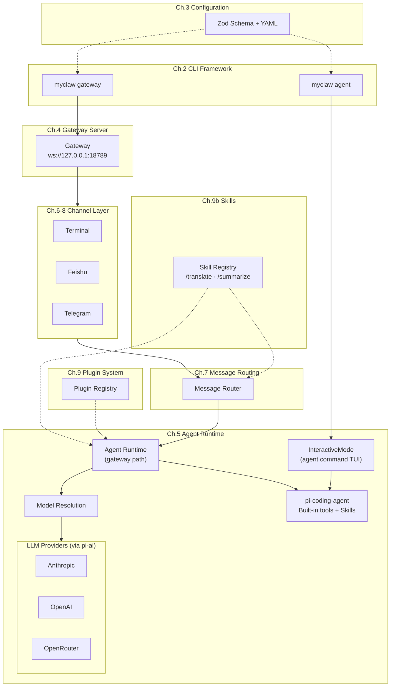
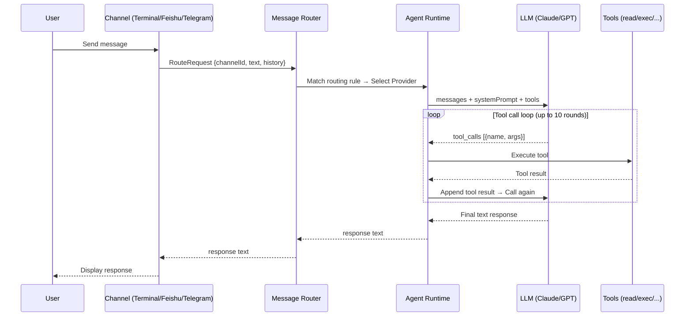

# Build Your Own OpenClaw

English | [中文](README.zh.md)

**Build a multi-channel AI assistant from scratch in ~2,600 lines of TypeScript.**

Ever wondered how AI assistants like [OpenClaw](https://github.com/anthropics/openclaw) connect to multiple platforms — Feishu, Telegram — all at once? How message routing, Agent tool-call loops, and channel abstractions actually work?

This tutorial answers those questions by building **MyClaw**, a minimal teaching implementation of OpenClaw. 12 chapters, each focusing on a core module, guiding you to build a working multi-channel AI assistant from the ground up.

### What You'll Learn

- **Channel abstraction** — How to design a unified interface so one codebase serves Terminal, Feishu, Telegram, and more
- **Agent runtime** — Complete implementation of LLM calls, Tool Use loops, and conversation history management
- **Message routing** — Rule-based dispatch of messages from different channels to different Agents/Providers
- **Configuration system** — Engineering practices with Zod Schema validation + YAML config
- **WebSocket gateway** — Real-time communication service with authentication and session management
- **Skills system** — Markdown-based prompt management with slash command invocation
- **Plugin architecture** — Practical application of the Inversion of Control (IoC) pattern

### Who This Is For

- Developers who want to deeply understand AI assistant / Agent architecture
- Intermediate developers learning TypeScript engineering practices
- Engineers building multi-channel messaging gateways for their own projects

## Features

- **Multi-channel** — Terminal + Feishu (Lark) + Telegram, with a unified abstraction for easy extension
- **Multiple LLMs** — Anthropic (Claude), OpenAI (GPT-4o), OpenRouter (free models available)
- **Coding Agent** — Built-in tool set from pi-coding-agent (read/write/edit/bash) with multi-round Tool Use
- **Skills system** — Define skills via SKILL.md, invoke with `/skill-name` slash commands
- **Message routing** — Rule engine for flexible channel-to-Agent mapping
- **WebSocket gateway** — Unified API control plane
- **Plugin system** — Extensible runtime plugins
- **Batteries included** — `onboard` setup wizard, `doctor` health diagnostics

---

## Tutorial Chapters

This tutorial has 12 chapters, each focusing on a core module. It's recommended to read them in order. Each chapter includes complete code and design analysis.

| Chapter | Topic | What You'll Learn | Key Files |
|---------|-------|-------------------|-----------|
| [01](docs/en/01-project-setup.md) | Project Setup | TypeScript + ESM project scaffolding | `package.json`, `tsconfig.json`, `myclaw.mjs` |
| [02](docs/en/02-cli-framework.md) | CLI Framework | Commander.js commands, dependency injection | `src/cli/program.ts`, `src/entry.ts` |
| [03](docs/en/03-configuration.md) | Configuration | Zod Schema validation, YAML config | `src/config/schema.ts`, `src/config/loader.ts` |
| [04](docs/en/04-gateway-server.md) | Gateway Server | WebSocket server, session management, auth | `src/gateway/server.ts`, `src/gateway/protocol.ts` |
| [05](docs/en/05-agent-runtime.md) | Agent Runtime | LLM abstraction, Agent Loop, InteractiveMode TUI | `src/agent/runtime.ts`, `src/agent/model.ts`, `src/cli/commands/agent.ts` |
| [06](docs/en/06-channels.md) | Channel Abstraction | Interface design, EventEmitter, polymorphism | `src/channels/transport.ts`, `src/channels/terminal.ts` |
| [07](docs/en/07-message-routing.md) | Message Routing | Layered matching, multi-Agent dispatch | `src/routing/router.ts` |
| [08](docs/en/08-feishu.md) | Feishu Channel | External platform integration, WebSocket | `src/channels/feishu.ts` |
| [08b](docs/en/08b-telegram.md) | Telegram Channel | grammY integration, Long Polling, message chunking | `src/channels/telegram.ts` |
| [09](docs/en/09-plugins.md) | Plugin System | Inversion of control, runtime extensions | `src/plugins/registry.ts` |
| [09b](docs/en/09b-skills.md) | Skills System | SKILL.md definition, slash commands, prompt management | `src/skills/loader.ts`, `src/skills/registry.ts` |
| [10](docs/en/10-final.md) | Putting It Together | End-to-end debugging, complete data flow | All |

## Architecture Overview



## Message Processing Flow



## Project Structure

```
build-your-own-openclaw/
├── myclaw.mjs                 # Entry point (version check + loader)
├── package.json               # Dependencies and scripts
├── tsconfig.json              # TypeScript configuration
├── skills/                    # Built-in Skills
│   ├── translate/SKILL.md     # Translation Skill
│   └── summarize/SKILL.md     # Summarization Skill
├── src/
│   ├── entry.ts               # Main entry
│   ├── cli/
│   │   ├── program.ts         # CLI program builder
│   │   ├── register.ts        # Command registration
│   │   └── commands/
│   │       ├── gateway.ts     # gateway command
│   │       ├── agent.ts       # agent command
│   │       ├── onboard.ts     # Setup wizard command
│   │       ├── doctor.ts      # Diagnostics command
│   │       └── message.ts     # Message command
│   ├── config/
│   │   ├── schema.ts          # Config Schema (Zod)
│   │   ├── loader.ts          # Config loader
│   │   └── index.ts           # Exports
│   ├── gateway/
│   │   ├── server.ts          # WebSocket gateway server
│   │   ├── protocol.ts        # Message protocol definitions
│   │   └── session.ts         # Session management
│   ├── agent/
│   │   ├── runtime.ts         # Agent runtime (gateway path)
│   │   └── model.ts           # Model resolution (auth, registry, model mapping)
│   ├── channels/
│   │   ├── transport.ts       # Channel abstract base class
│   │   ├── terminal.ts        # Terminal channel
│   │   ├── feishu.ts          # Feishu (Lark) channel
│   │   ├── telegram.ts        # Telegram channel
│   │   └── manager.ts         # Channel manager
│   ├── routing/
│   │   └── router.ts          # Message router
│   ├── skills/
│   │   ├── loader.ts          # Skill loader
│   │   └── registry.ts        # Skill registry
│   └── plugins/
│       └── registry.ts        # Plugin registry
└── docs/                      # Tutorial documentation
```

## Comparison with Full OpenClaw

| Feature | MyClaw (this tutorial) | Full OpenClaw |
|---------|----------------------|---------------|
| Code size | ~2,600 lines | ~921,000 lines |
| Channels | 3 (Terminal + Feishu + Telegram) | 23+ |
| LLM Providers | 3 (Anthropic + OpenAI + OpenRouter) | 10+ |
| Tools | pi-coding-agent built-in tool set | 50+ Skills, 40+ Extensions |
| Platforms | CLI only | CLI + macOS + iOS + Android |
| Protocol | Simple JSON | TypeBox Schema validation |
| Security | Basic token auth | DM pairing, role control, operation approval |
| Sessions | In-memory storage | Persistent + vector DB + RAG |

> This tutorial covers OpenClaw's core architectural patterns. After mastering these patterns, you can continue reading the OpenClaw source code or build your own AI assistant on top of this foundation.

## Quick Start

### Prerequisites

- **Node.js** >= 20
- At least one LLM API Key:
  - `OPENROUTER_API_KEY` (default, free models available)
  - `ANTHROPIC_API_KEY` (recommended, Claude)
  - `OPENAI_API_KEY` (GPT-4o)

### 1. Clone and Install

```bash
git clone https://github.com/anthropics/build-your-own-openclaw.git
cd build-your-own-openclaw
npm install
```

### 2. Configure

Run the interactive setup wizard to generate `~/.myclaw/myclaw.yaml`:

```bash
npx myclaw onboard
```

The wizard will ask about: LLM provider, API key, model name, gateway port, bot name, and whether to enable Feishu/Telegram channels.

### 3. Start Chatting

```bash
# Chat with AI directly in the terminal
npx myclaw agent
```

### 4. Start the Gateway (Optional)

Gateway mode starts the WebSocket server and activates all configured external channels (Feishu, Telegram, etc.):

```bash
npx myclaw gateway
```

### 5. Run Diagnostics

```bash
npx myclaw doctor
```

### Connect Feishu / Lark (Optional)

```bash
export FEISHU_APP_ID="your_app_id"
export FEISHU_APP_SECRET="your_app_secret"
npx myclaw gateway
```

> See [Chapter 8: Feishu Channel](docs/en/08-feishu.md) for the full Feishu Open Platform setup guide.

### Connect Telegram (Optional)

```bash
export TELEGRAM_BOT_TOKEN="your_bot_token"
npx myclaw gateway
```

> See [Chapter 8b: Telegram Channel](docs/en/08b-telegram.md) for how to create a bot via @BotFather and configure it.

## License

MIT
