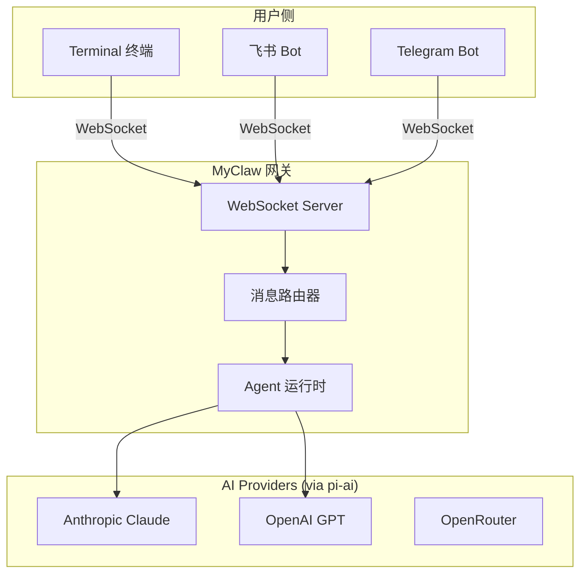
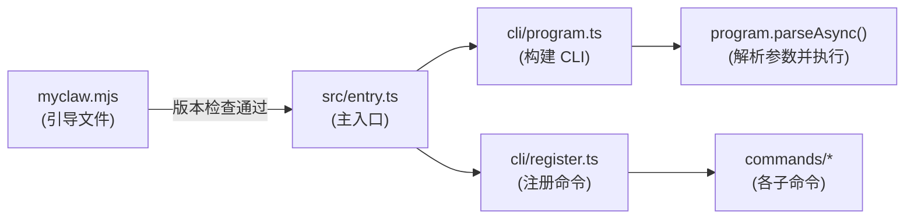
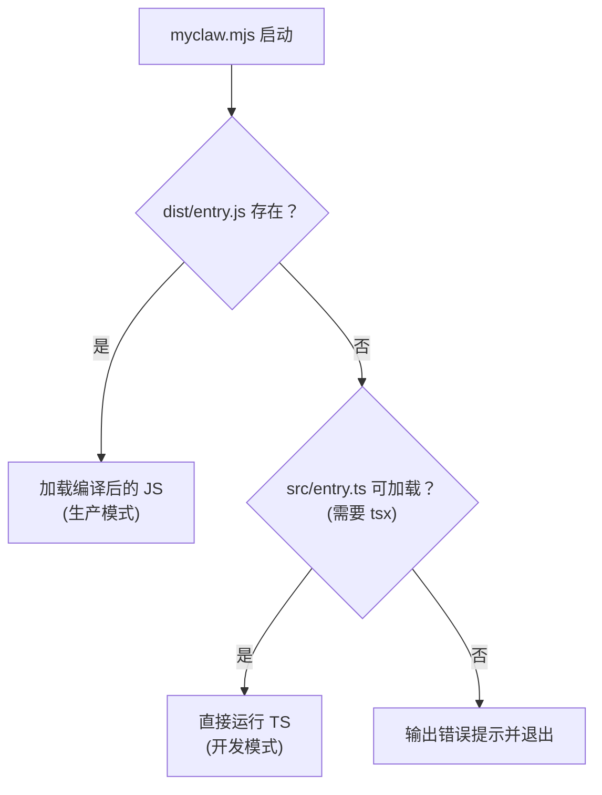
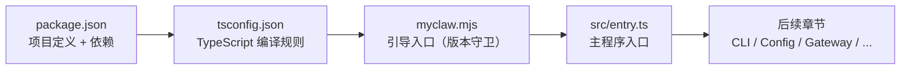

# 第一章：项目初始化

> 对应源文件：`package.json`, `tsconfig.json`, `myclaw.mjs`, `src/entry.ts`

## 我们要构建什么？

MyClaw 是一个教学项目，目标是带你从零构建一个类似 OpenClaw 的**AI 助手**。通过亲手实现它，你将深入理解以下核心架构模式：

- **AI Agent 核心** —— 如何设计一个具备工具调用、上下文管理和多轮对话能力的智能 Agent
- **AI Provider 抽象层** —— 如何统一对接 Anthropic Claude、OpenAI GPT 等不同 LLM
- **消息通道系统** —— 如何让 Terminal、飞书、Telegram 等不同渠道共享同一个 Agent 后端
- **WebSocket 网关** —— 如何用实时通信协调前后端
- **插件化架构** —— 如何通过工具（Tools）机制让 Agent 具备可扩展的能力

整个系统的架构可以用下图概括：



**核心理念**：用户通过不同通道发送消息，网关统一接收后路由到 Agent 运行时，Agent 选择合适的 LLM Provider 生成回复，再沿原路返回。这就是 OpenClaw 的基本工作流，MyClaw 将完整复刻这一模式。

## 项目结构

在动手之前，先来认识一下最终的项目目录结构：

```
build-your-own-openclaw/
├── myclaw.mjs            # 启动引导文件（Node.js 版本检查 + 入口委托）
├── package.json          # 项目元数据、依赖、脚本
├── tsconfig.json         # TypeScript 编译配置
└── src/                  # 所有 TypeScript 源代码
    ├── entry.ts          # 主入口：构建 CLI、注册命令、启动程序
    ├── cli/              # CLI 框架（Commander.js）
    │   ├── program.ts    # CLI 程序定义
    │   ├── register.ts   # 命令注册中心
    │   └── commands/     # 各子命令实现
    ├── config/           # 配置系统（读取 ~/.myclaw/myclaw.yaml）
    │   ├── schema.ts     # Zod schema 定义
    │   ├── loader.ts     # 配置文件加载器
    │   └── index.ts      # 统一导出
    ├── gateway/          # WebSocket 网关服务器
    │   ├── server.ts     # WS 服务器
    │   ├── session.ts    # 会话管理
    │   └── protocol.ts   # 通信协议定义
    ├── agent/            # Agent 运行时（AI 对话核心）
    │   ├── runtime.ts    # Agent 运行循环
    │   ├── tools.ts      # 工具调用系统
    │   └── providers/    # LLM Provider 抽象
    ├── channels/         # 消息通道（Terminal、飞书等）
    │   ├── transport.ts  # 通道抽象基类
    │   ├── manager.ts    # 通道管理器
    │   ├── terminal.ts   # 终端通道
    │   └── feishu.ts     # 飞书通道
    ├── routing/          # 消息路由
    └── plugins/          # 插件系统
```

下面的流程图展示了启动过程中各文件的调用关系：



**为什么要分 `myclaw.mjs` 和 `src/entry.ts` 两层？** 因为 `myclaw.mjs` 是一个纯 JavaScript 文件，它不需要编译就能运行。它的唯一职责是"守门"——确保运行环境满足要求后，再加载 TypeScript 编写的主程序。这是 OpenClaw 中被验证过的启动模式：**快速失败，友好提示**。

## 第一步：创建 package.json

`package.json` 是整个项目的"身份证"。我们逐段来看每个配置的作用。

创建项目目录并初始化：

```bash
mkdir build-your-own-myclaw
cd build-your-own-myclaw
```

然后创建 `package.json`，内容如下：

```json
{
  "name": "build-your-own-openclaw",
  "version": "1.0.0",
  "description": "Build Your Own OpenClaw - A step-by-step tutorial to build an AI assistant",
  "type": "module",
  "bin": {
    "myclaw": "./myclaw.mjs"
  },
  "scripts": {
    "build": "tsc",
    "dev": "tsx src/entry.ts",
    "start": "node dist/entry.js",
    "gateway": "tsx src/entry.ts gateway",
    "agent": "tsx src/entry.ts agent",
    "onboard": "tsx src/entry.ts onboard"
  },
  "engines": {
    "node": ">=20.0.0"
  }
}
```

我们来逐一解读这些字段的用途：

### `"type": "module"` —— 启用 ESM

这一行告诉 Node.js：这个项目中的 `.js` 和 `.mjs` 文件都使用 ESM（ECMAScript Modules）而不是 CommonJS。这意味着：

- 可以使用 `import/export` 语法代替 `require/module.exports`
- 可以使用 **top-level `await`**——这对我们的引导文件 `myclaw.mjs` 至关重要，因为它需要在顶层直接 `await import()`

### `"bin"` —— 注册可执行命令

```json
"bin": {
  "myclaw": "./myclaw.mjs"
}
```

这告诉 npm：当用户执行 `npx myclaw` 或全局安装后执行 `myclaw` 时，应该运行 `myclaw.mjs` 这个文件。这就是 CLI 工具的"前门"。

### `"scripts"` —— 开发脚本

| 脚本 | 命令 | 用途 |
|------|------|------|
| `build` | `tsc` | 将 TypeScript 编译为 JavaScript 到 `dist/` 目录 |
| `dev` | `tsx src/entry.ts` | 开发模式，tsx 会即时编译并运行 TypeScript，无需预编译 |
| `start` | `node dist/entry.js` | 生产模式，运行编译后的代码 |
| `gateway` | `tsx src/entry.ts gateway` | 快速启动网关服务器 |
| `agent` | `tsx src/entry.ts agent` | 快速启动 Agent 交互模式 |
| `onboard` | `tsx src/entry.ts onboard` | 运行引导向导，创建配置文件 |

**为什么 `dev` 用 `tsx` 而 `start` 用 `node`？** `tsx` 是一个开发工具，它可以直接运行 `.ts` 文件，省去了手动编译的步骤。但在生产环境，我们希望运行预编译的 `.js` 文件以获得更好的性能和更少的依赖。

### `"engines"` —— 版本约束

```json
"engines": {
  "node": ">=20.0.0"
}
```

声明项目要求 Node.js 20 或更高版本。注意：npm 默认并不强制这个约束（除非配置了 `engine-strict`），所以我们在 `myclaw.mjs` 中还会做一次运行时检查——**双重保险**。

## 第二步：安装依赖

现在安装项目所需的所有依赖：

```bash
# 运行时依赖
npm install @mariozechner/pi-ai @mariozechner/pi-agent-core @mariozechner/pi-coding-agent commander ws zod chalk yaml dotenv eventemitter3 readline @larksuiteoapi/node-sdk

# 开发依赖
npm install -D typescript tsx @types/node @types/ws
```

### 依赖总览

下表列出了每个依赖的角色，以及它在 MyClaw 中对应哪个模块：

| 依赖包 | 版本 | 类别 | 用途 | 对应模块 |
|--------|------|------|------|---------|
| `@mariozechner/pi-ai` | ^0.57.1 | AI | LLM 抽象层（Model、stream、provider 自动发现） | `agent/model.ts` |
| `@mariozechner/pi-agent-core` | ^0.57.1 | AI | Agent 状态机 + agent loop（消息管理、工具执行循环） | `agent/runtime.ts` |
| `@mariozechner/pi-coding-agent` | ^0.57.1 | AI | 编码 Agent 上层封装（内置工具、Skills、InteractiveMode TUI） | `cli/commands/agent.ts`, `agent/runtime.ts` |
| `commander` | ^13.1.0 | CLI | 命令行框架，解析参数和子命令 | `cli/program.ts` |
| `ws` | ^8.18.1 | 网络 | WebSocket 客户端和服务器库 | `gateway/server.ts` |
| `zod` | ^3.24.2 | 验证 | 运行时 schema 验证，校验配置和输入 | `config/schema.ts` |
| `chalk` | ^5.4.1 | UI | 终端彩色输出，让 CLI 输出更美观 | 各处 |
| `yaml` | ^2.7.0 | 配置 | 解析和序列化 YAML 配置文件 | `config/loader.ts` |
| `dotenv` | ^16.4.7 | 配置 | 从 `.env` 文件加载环境变量（API Key 等） | `config/loader.ts` |
| `eventemitter3` | ^5.0.1 | 架构 | 高性能事件发射器，用于模块间解耦通信 | `gateway/`, `channels/` |
| `readline` | ^1.3.0 | UI | 终端交互式输入（用于 Gateway 的 Terminal 通道） | `channels/terminal.ts` |
| `@larksuiteoapi/node-sdk` | ^1.59.0 | 通道 | 飞书开放平台 SDK | `channels/feishu.ts` |

开发依赖：

| 依赖包 | 版本 | 用途 |
|--------|------|------|
| `typescript` | ^5.8.2 | TypeScript 编译器 |
| `tsx` | ^4.19.3 | 直接运行 TypeScript 文件的开发工具（基于 esbuild） |
| `@types/node` | ^22.13.10 | Node.js API 的类型定义 |
| `@types/ws` | ^8.5.14 | ws 库的类型定义 |

## 第三步：配置 TypeScript —— tsconfig.json

TypeScript 配置决定了代码如何被编译。创建 `tsconfig.json`：

```json
{
  "compilerOptions": {
    "target": "ES2023",
    "module": "NodeNext",
    "moduleResolution": "NodeNext",
    "outDir": "./dist",
    "rootDir": "./src",
    "strict": true,
    "esModuleInterop": true,
    "skipLibCheck": true,
    "forceConsistentCasingInFileNames": true,
    "resolveJsonModule": true,
    "declaration": true,
    "declarationMap": true,
    "sourceMap": true
  },
  "include": ["src/**/*"],
  "exclude": ["node_modules", "dist"]
}
```

逐一解读每个选项：

### 编译目标与模块

| 选项 | 值 | 说明 |
|------|-----|------|
| `target` | `ES2023` | 输出代码使用 ES2023 语法。Node.js 20+ 完全支持，无需降级转换 |
| `module` | `NodeNext` | 输出 Node.js 原生 ESM 格式的模块 |
| `moduleResolution` | `NodeNext` | 使用 Node.js 的 ESM 模块解析算法 |

**关于 NodeNext 的一个重要细节**：使用 `NodeNext` 模块解析时，你在 TypeScript 源码中写 `import` 语句必须带 `.js` 扩展名，即使源文件是 `.ts`：

```typescript
// 正确 -- 虽然源文件是 program.ts，但 import 时要写 .js
import { buildProgram } from "./cli/program.js";

// 错误 -- NodeNext 下不允许省略扩展名或写 .ts
import { buildProgram } from "./cli/program";
import { buildProgram } from "./cli/program.ts";
```

这看起来违反直觉，但原因很简单：TypeScript 编译后输出的是 `.js` 文件，而 Node.js ESM 在运行时按照 import 路径精确查找文件，不会自动补全扩展名。所以 import 路径必须匹配最终运行时的文件结构。

### 输入输出目录

| 选项 | 值 | 说明 |
|------|-----|------|
| `rootDir` | `./src` | TypeScript 源文件的根目录 |
| `outDir` | `./dist` | 编译输出目录。`src/entry.ts` 编译后变为 `dist/entry.js` |

### 严格模式与辅助选项

| 选项 | 值 | 说明 |
|------|-----|------|
| `strict` | `true` | 启用所有严格类型检查。这是 TypeScript 的最佳实践 |
| `esModuleInterop` | `true` | 允许用 `import x from 'y'` 语法导入 CommonJS 模块 |
| `skipLibCheck` | `true` | 跳过 `.d.ts` 类型文件的检查，加快编译速度 |
| `forceConsistentCasingInFileNames` | `true` | 强制文件名大小写一致，避免跨平台问题 |
| `resolveJsonModule` | `true` | 允许直接 import JSON 文件 |

### 调试支持

| 选项 | 值 | 说明 |
|------|-----|------|
| `declaration` | `true` | 生成 `.d.ts` 类型声明文件 |
| `declarationMap` | `true` | 生成声明文件的 source map，方便 IDE 跳转到源码 |
| `sourceMap` | `true` | 生成 `.js.map` 文件，调试时可以映射回 TypeScript 源代码 |

## 第四步：创建启动引导文件 —— myclaw.mjs

`myclaw.mjs` 是整个 CLI 的"前门"。当用户在终端输入 `myclaw` 或 `npx myclaw` 时，就是这个文件被执行。

创建 `myclaw.mjs`：

```javascript
#!/usr/bin/env node

/**
 * MyClaw Bootstrap Entry
 *
 * This is the executable entry point for the myclaw CLI.
 * It performs version checks and then delegates to the main entry.
 */

const MIN_NODE_VERSION = 20;

const major = parseInt(process.versions.node.split(".")[0], 10);
if (major < MIN_NODE_VERSION) {
  console.error(
    `MyClaw requires Node.js v${MIN_NODE_VERSION}+. Current: ${process.versions.node}`
  );
  console.error("Please upgrade Node.js: https://nodejs.org/");
  process.exit(1);
}

// Suppress experimental warnings for cleaner output
process.env.NODE_NO_WARNINGS = "1";

// Delegate to the compiled entry point or use tsx for dev
try {
  await import("./dist/entry.js");
} catch {
  // Fallback: try tsx for development
  try {
    await import("./src/entry.ts");
  } catch (e) {
    console.error("Failed to start MyClaw. Run 'npm run build' first or use 'npm run dev'.");
    console.error(e);
    process.exit(1);
  }
}
```

这个文件虽然短小，但包含了好几个值得深入理解的设计决策。我们逐段分析。

### Shebang 行

```javascript
#!/usr/bin/env node
```

这一行告诉操作系统："用 `node` 来运行这个文件"。当你通过 `npm link` 全局安装后，可以直接在终端输入 `myclaw` 就像运行一个普通程序。`/usr/bin/env node` 而不是 `/usr/bin/node` 是一种可移植写法——它会在 `PATH` 中查找 `node`，兼容不同系统的安装路径。

### Node.js 版本守卫

```javascript
const MIN_NODE_VERSION = 20;

const major = parseInt(process.versions.node.split(".")[0], 10);
if (major < MIN_NODE_VERSION) {
  console.error(
    `MyClaw requires Node.js v${MIN_NODE_VERSION}+. Current: ${process.versions.node}`
  );
  console.error("Please upgrade Node.js: https://nodejs.org/");
  process.exit(1);
}
```

**为什么在这里检查而不是依赖 `package.json` 的 `engines` 字段？** 因为 `engines` 只在 `npm install` 时生效（而且默认只是警告），而这里的检查在**每次运行**时都会执行。设想一个用户安装了 MyClaw 后降级了 Node.js——没有这个守卫，他会看到一堆难以理解的语法错误；有了这个守卫，他会看到一条清晰的提示。

这就是 OpenClaw 的设计哲学：**在最早的时机、以最友好的方式失败。**

### 抑制实验性警告

```javascript
process.env.NODE_NO_WARNINGS = "1";
```

Node.js 对某些较新的 API（如部分 ESM 特性）会输出 `ExperimentalWarning`。这些警告对终端用户来说是噪音。通过设置环境变量，我们在实际代码运行之前就把它们关掉，保持 CLI 输出的干净。

### 双路径加载策略

```javascript
try {
  await import("./dist/entry.js");
} catch {
  try {
    await import("./src/entry.ts");
  } catch (e) {
    console.error("Failed to start MyClaw. Run 'npm run build' first or use 'npm run dev'.");
    console.error(e);
    process.exit(1);
  }
}
```

这段代码体现了一个巧妙的**开发/生产双模式加载**策略：



- **生产路径**：先尝试加载 `dist/entry.js`（通过 `npm run build` 编译生成），这是最快的方式
- **开发路径**：如果 `dist/` 不存在（还没编译过），就回退到直接加载 `src/entry.ts`。这需要 `tsx` 已安装（它在 devDependencies 中）
- **兜底提示**：如果两种方式都失败了，给出明确的修复建议

注意这里使用了 **top-level `await`**。`await import(...)` 直接写在模块顶层而不是 `async function` 内部——这是 ESM 的特性，也是我们在 `package.json` 中设置 `"type": "module"` 的原因之一。

### 为什么用 `.mjs` 而不是 `.ts`？

引导文件必须是纯 JavaScript（`.mjs`），因为：

1. 它在任何编译步骤之前运行——不能依赖 TypeScript 编译器
2. 它需要在连 `tsx` 都还没加载的时候就能执行
3. Node.js 可以直接运行 `.mjs` 文件，零依赖

## 第五步：创建主入口 —— src/entry.ts

引导文件会加载 `src/entry.ts`，这是真正的程序入口。创建 `src/` 目录和入口文件：

```bash
mkdir -p src
```

然后创建 `src/entry.ts`：

```typescript
/**
 * Chapter 1 - Entry Point
 *
 * The main entry point for OpenClaw. Builds the CLI program,
 * registers all commands, and parses the command line.
 */

import { buildProgram } from "./cli/program.js";
import { registerAllCommands } from "./cli/register.js";

async function main() {
  const program = buildProgram();
  registerAllCommands(program);
  await program.parseAsync(process.argv);
}

main().catch((err) => {
  console.error("Fatal error:", err.message);
  if (process.env.MYCLAW_DEBUG) {
    console.error(err.stack);
  }
  process.exit(1);
});
```

这个文件做了三件事：

1. **构建 CLI 程序** —— `buildProgram()` 创建 Commander.js 的 Program 实例（我们会在第二章实现）
2. **注册命令** —— `registerAllCommands()` 将所有子命令（`gateway`、`agent`、`doctor` 等）挂载到 CLI 上
3. **解析并执行** —— `program.parseAsync()` 解析命令行参数并执行对应的命令处理函数

注意错误处理中的 `MYCLAW_DEBUG` 环境变量：正常情况下只显示错误消息，设置 `MYCLAW_DEBUG=1` 后会打印完整堆栈，这对开发调试很有帮助。

## 验证搭建结果

完成以上步骤后，让我们验证一切工作正常。

### 1. 安装依赖

```bash
npm install
```

你应该看到 `node_modules/` 目录被创建，且没有错误输出。

### 2. 验证 TypeScript 编译

```bash
npx tsc --noEmit
```

如果 `src/` 目录还没有其他文件（`cli/program.ts` 等），这一步会报错——这是正常的，说明 TypeScript 编译器在工作。我们会在后续章节逐步创建这些文件。

### 3. 验证引导文件

```bash
node myclaw.mjs
```

如果看到类似 "Failed to start MyClaw" 的提示，说明引导文件的版本检查和加载逻辑都在正常工作——它正确地尝试了两条路径，然后给出了友好提示。

### 4. 验证开发模式（在完成第二章之后）

当 `src/cli/program.ts` 和 `src/cli/register.ts` 都创建好之后，你可以用开发模式运行：

```bash
npm run dev -- --help
```

这会通过 `tsx` 直接运行 TypeScript 源码，显示 MyClaw 的帮助信息。

## 本章小结

在这一章中，我们完成了 MyClaw 的项目骨架搭建：



我们学到了几个关键的架构模式：

- **引导文件与主入口分离** —— 用纯 JS 做环境检查，用 TS 写业务逻辑
- **双路径加载** —— 优先使用编译产物，回退到开发工具
- **快速失败** —— 在最早的时机检测环境问题并给出友好提示
- **配置路径约定** —— MyClaw 的用户配置存放在 `~/.myclaw/myclaw.yaml`（我们会在配置章节详细实现）

这些模式直接来源于 OpenClaw 的设计实践，在生产级 CLI 工具中被广泛采用。

---

**下一章**：[CLI 框架](./02-cli-framework.md) —— 用 Commander.js 构建命令行界面，实现 `myclaw gateway`、`myclaw agent`、`myclaw doctor` 等子命令
