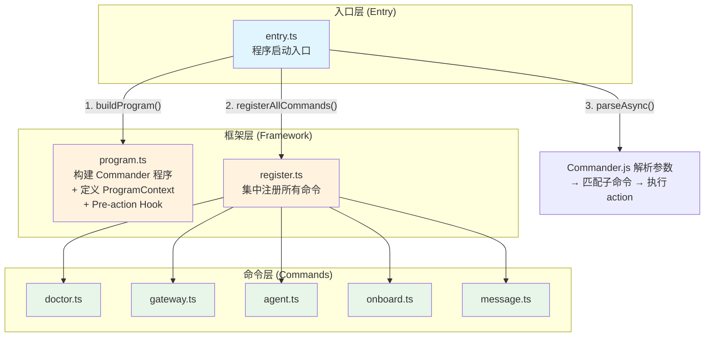
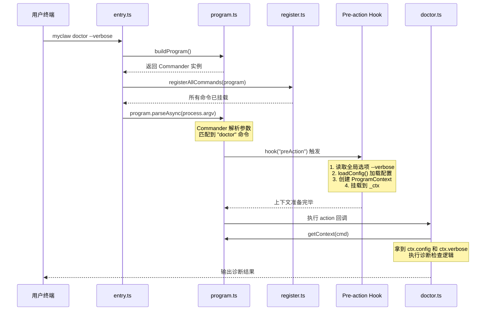
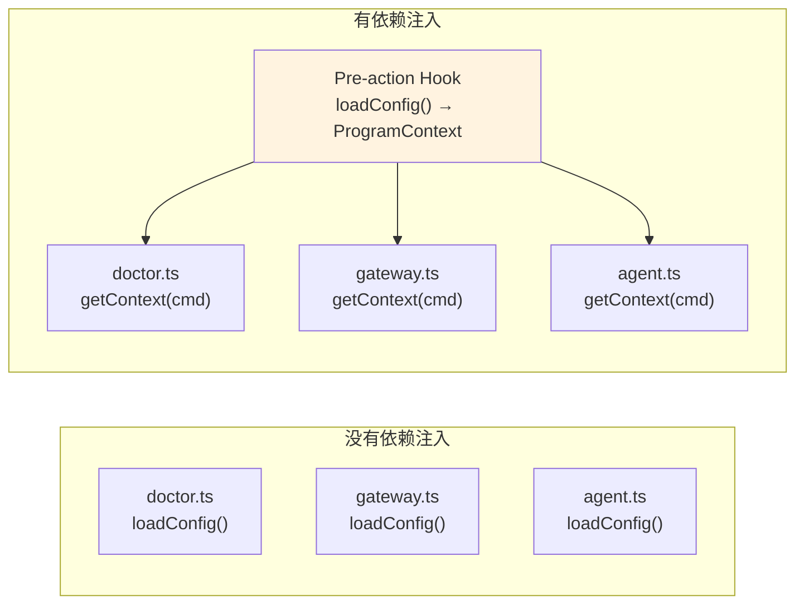

# 第三章：CLI 框架

> 对应源文件：`src/entry.ts`, `src/cli/program.ts`, `src/cli/register.ts`, `src/cli/commands/doctor.ts`

## 本章目标

在这一章中，我们将搭建 MyClaw 的 CLI（命令行界面）骨架。完成后，你将拥有一个能够解析参数、分发命令、并通过依赖注入共享上下文的完整命令行框架。

你将学会：

- 如何用 Commander.js 构建专业的 CLI 程序
- 什么是依赖注入（Dependency Injection），以及为什么它对 CLI 程序至关重要
- Pre-action Hook 模式如何简化配置加载
- 如何设计可扩展的命令注册系统
- 如何编写你的第一个命令 `doctor`

---

## CLI 架构概览

在动手写代码之前，先从整体理解 MyClaw CLI 的分层结构。我们把整个 CLI 分成三层：



**为什么要分三层？** 这种分层设计让每一层各司其职：入口层负责启动和错误处理，框架层负责程序定义和依赖注入，命令层负责具体业务逻辑。当你需要新增一个命令时，只需在命令层添加文件，然后在注册层多写一行——其他部分完全不用改。

---

## 命令调度流程

当用户在终端输入 `myclaw doctor --verbose` 时，MyClaw 内部发生了什么？让我们用一张流程图来展示：



这个流程的关键设计在于：**命令本身不需要关心配置是如何加载的。** `doctor` 命令只需要调用 `getContext(cmd)` 就能拿到已经准备好的配置对象。这就是依赖注入的力量。

---

## 第一步：主入口 `src/entry.ts`

主入口是整个 CLI 的起点。它的职责非常简单：启动程序，并处理未捕获的错误。

```typescript
// src/entry.ts

import { buildProgram } from "./cli/program.js";
import { registerAllCommands } from "./cli/register.js";

async function main() {
  const program = buildProgram();
  registerAllCommands(program);
  await program.parseAsync(process.argv);
}

main().catch((err) => {
  console.error("Fatal error:", err.message);
  if (process.env.MYCLAW_DEBUG) {
    console.error(err.stack);
  }
  process.exit(1);
});
```

**逐行解析：**

| 行 | 做了什么 | 为什么这么做 |
|---|---|---|
| `buildProgram()` | 创建 Commander 实例，定义名称、版本、全局选项、Pre-action Hook | 将"程序是什么样的"这个关注点集中在一个地方 |
| `registerAllCommands(program)` | 把所有子命令挂载到 Commander 实例上 | 将"有哪些命令"这个关注点集中在一个地方 |
| `program.parseAsync(process.argv)` | 解析命令行参数，匹配并执行对应的子命令 | Commander.js 的标准入口，`parseAsync` 支持异步 action |
| `.catch(...)` | 捕获所有未处理的异常，打印错误信息并退出 | 防止未捕获异常导致静默失败 |
| `MYCLAW_DEBUG` | 在调试模式下额外打印完整的错误堆栈 | 生产环境只显示简洁的错误消息，开发时可以看到完整堆栈便于排查 |

**设计思考：为什么 `main()` 是 async 的？**

Commander.js 的 `parseAsync()` 返回 Promise。如果你的子命令中有任何异步操作（比如读文件、网络请求），都需要用 `parseAsync` 而不是 `parse`，否则异步错误无法被捕获。MyClaw 的很多命令（如 gateway、agent）都涉及异步操作，所以我们从一开始就使用 `parseAsync`。

---

## 第二步：Program Builder `src/cli/program.ts`

这是 CLI 框架中最核心的文件。它做三件事：

1. **定义 `ProgramContext` 接口** —— 依赖注入的"契约"
2. **构建 Commander 实例** —— 包括全局选项和 Pre-action Hook
3. **提供 `getContext()` 辅助函数** —— 让子命令方便地获取上下文

### 2.1 ProgramContext：依赖注入容器

```typescript
// src/cli/program.ts

import { Command } from "commander";
import { loadConfig, type OpenClawConfig } from "../config/index.js";

/**
 * Program context - shared state passed to all commands.
 * This is OpenClaw's dependency injection mechanism.
 */
export interface ProgramContext {
  config: OpenClawConfig;
  verbose: boolean;
}
```

**什么是依赖注入？为什么 CLI 需要它？**

想象一下没有依赖注入的情况：每个子命令都需要自己调用 `loadConfig()` 来加载配置。这会导致：

- **重复代码**：每个命令文件都要写一遍配置加载逻辑
- **不一致**：某个命令可能忘了处理配置不存在的情况
- **难以测试**：你无法在测试中替换配置，只能依赖真实的文件系统

`ProgramContext` 解决了这些问题。它是一个"依赖注入容器"——在命令执行前，框架层统一把所有依赖（配置、选项）打包好，子命令直接使用即可。



上图清楚地展示了依赖注入的好处：配置加载逻辑只在一个地方出现（Pre-action Hook），所有命令通过统一的 `getContext()` 获取依赖。

### 2.2 buildProgram()：构建 Commander 实例

```typescript
export function buildProgram(): Command {
  const program = new Command();

  program
    .name("myclaw")
    .description("MyClaw - Your personal AI assistant")
    .version("1.0.0")
    .option("-v, --verbose", "Enable verbose logging", false);

  // Pre-action hook: load config and create context before any command runs
  program.hook("preAction", (thisCommand) => {
    const opts = thisCommand.opts();
    const config = loadConfig();
    // Attach context to the command for subcommands to access
    thisCommand.setOptionValue("_ctx", {
      config,
      verbose: opts.verbose ?? false,
    } satisfies ProgramContext);
  });

  return program;
}
```

**逐段解析：**

**程序元信息**

```typescript
program
  .name("myclaw")
  .description("MyClaw - Your personal AI assistant")
  .version("1.0.0")
  .option("-v, --verbose", "Enable verbose logging", false);
```

这些是 Commander.js 的基础 API：
- `.name("myclaw")`：设置程序名，影响 `--help` 输出中显示的名称
- `.version("1.0.0")`：自动添加 `-V, --version` 选项
- `.option("-v, --verbose", ...)`：定义全局选项，所有子命令都可以使用

当用户运行 `myclaw --help` 时，Commander.js 会自动根据这些信息生成帮助文档。

**Pre-action Hook（核心！）**

```typescript
program.hook("preAction", (thisCommand) => {
  const opts = thisCommand.opts();
  const config = loadConfig();
  thisCommand.setOptionValue("_ctx", {
    config,
    verbose: opts.verbose ?? false,
  } satisfies ProgramContext);
});
```

这是整个 CLI 框架最精妙的部分。Commander.js 的 `hook("preAction", ...)` 会在**任何子命令的 action 回调执行之前**被调用。我们利用这个时机：

1. **读取全局选项**：`thisCommand.opts()` 拿到 `--verbose` 等全局标志
2. **加载配置**：`loadConfig()` 从 `~/.myclaw/config.yaml` 读取并验证配置
3. **创建上下文**：把配置和选项打包成 `ProgramContext` 对象
4. **挂载到命令上**：`setOptionValue("_ctx", ...)` 把上下文藏在一个以 `_` 开头的内部选项里

**关于 `satisfies` 关键字**：这是 TypeScript 4.9 引入的特性。它不改变值的类型，但会在编译时检查这个对象是否符合 `ProgramContext` 接口。如果你漏掉了 `config` 或 `verbose` 字段，TypeScript 编译器会立即报错。这比 `as ProgramContext` 类型断言更安全，因为断言会跳过检查。

### 2.3 getContext()：子命令获取上下文的桥梁

```typescript
export function getContext(cmd: Command): ProgramContext {
  const root = cmd.parent ?? cmd;
  return root.opts()._ctx as ProgramContext;
}
```

这个辅助函数做了一件简单但重要的事：从 Commander 的命令树中取出之前挂载的 `_ctx` 上下文。

**为什么需要 `cmd.parent ?? cmd`？**

在 Commander.js 中，子命令的 `action` 回调接收到的 `cmd` 是子命令自身（比如 `doctor`），而 `_ctx` 是挂在根命令（`myclaw`）上的。所以我们需要通过 `cmd.parent` 向上找到根命令。`?? cmd` 是一个防御性设计——如果某个命令恰好就是根命令本身，也不会出错。

---

## 第三步：命令注册 `src/cli/register.ts`

```typescript
// src/cli/register.ts

import type { Command } from "commander";
import { registerGatewayCommand } from "./commands/gateway.js";
import { registerAgentCommand } from "./commands/agent.js";
import { registerOnboardCommand } from "./commands/onboard.js";
import { registerDoctorCommand } from "./commands/doctor.js";
import { registerMessageCommand } from "./commands/message.js";

export function registerAllCommands(program: Command): void {
  registerGatewayCommand(program);   // myclaw gateway
  registerAgentCommand(program);     // myclaw agent
  registerOnboardCommand(program);   // myclaw onboard
  registerDoctorCommand(program);    // myclaw doctor
  registerMessageCommand(program);   // myclaw message send
}
```

**设计思考：为什么要集中注册？**

你可能会想：为什么不在 `entry.ts` 里直接导入每个命令？答案是**关注点分离**。

- `entry.ts` 只关心"程序如何启动"
- `register.ts` 只关心"有哪些命令"
- 各个命令文件只关心"自己做什么"

这种分离的好处在实际开发中非常明显：当你需要新增一个命令时，只需要：
1. 在 `commands/` 下创建新文件
2. 在 `register.ts` 里加一行注册代码

不需要修改 `entry.ts` 或 `program.ts`。

**每个 `register*Command` 函数的签名约定**

注意所有命令注册函数都遵循统一的模式：

```typescript
function registerXxxCommand(program: Command): void
```

接收 Commander 实例，在其上挂载子命令，无返回值。这种统一的函数签名让 `registerAllCommands` 的实现非常简洁，也让新增命令变得机械化——这正是我们想要的。

---

## 第四步：Doctor 命令完整解读

`doctor` 是 MyClaw 中最适合作为教学示例的命令——它足够简单，但涵盖了编写命令所需的所有模式。让我们逐段分析。

### 4.1 文件结构与导入

```typescript
// src/cli/commands/doctor.ts

import type { Command } from "commander";
import fs from "node:fs";
import chalk from "chalk";
import { getContext } from "../program.js";
import { getConfigPath, getStateDir, resolveSecret } from "../../config/index.js";
```

每个导入都有明确的用途：

| 导入 | 来源 | 用途 |
|---|---|---|
| `Command` | `commander` | TypeScript 类型，用于函数参数声明 |
| `fs` | `node:fs` | 检查文件/目录是否存在 |
| `chalk` | `chalk` | 终端输出着色，让诊断结果一目了然 |
| `getContext` | `../program.js` | 获取依赖注入的 `ProgramContext` |
| `getConfigPath`, `getStateDir` | `../../config/index.js` | 获取 MyClaw 的配置路径和状态目录路径 |
| `resolveSecret` | `../../config/index.js` | 解析密钥（支持直接值或环境变量名） |

注意 `Command` 使用 `import type` 导入——这是 TypeScript 的最佳实践，表明这个导入仅用于类型检查，不会出现在编译后的 JavaScript 中。

### 4.2 命令注册

```typescript
export function registerDoctorCommand(program: Command): void {
  program
    .command("doctor")
    .description("Run diagnostics on your MyClaw installation")
    .action(async (_opts, cmd) => {
      // ... 命令逻辑
    });
}
```

Commander.js 的链式 API：

- `.command("doctor")`：在父命令下创建名为 `doctor` 的子命令
- `.description(...)`：设置子命令的描述，出现在 `myclaw --help` 中
- `.action(async (_opts, cmd) => {...})`：设置命令执行时的回调

**关于 action 回调的参数**：Commander.js 的 action 回调签名是 `(options, command)`。这里 `_opts` 以下划线开头表示我们不使用子命令自身的选项（doctor 命令没有定义额外选项），但 `cmd` 很重要——它是获取 `ProgramContext` 的钥匙。

### 4.3 获取上下文

```typescript
const ctx = getContext(cmd);
let allOk = true;

console.log(chalk.bold("\n🩺 MyClaw Doctor\n"));
```

第一步就是调用 `getContext(cmd)` 获取共享上下文。此时 Pre-action Hook 已经运行过了，`ctx.config` 包含了完整的配置对象，`ctx.verbose` 包含了是否开启详细日志。

`allOk` 变量用于追踪所有检查是否通过，最后输出总结信息。

### 4.4 诊断检查逻辑

Doctor 命令依次执行以下检查：

**检查 1：Node.js 版本**

```typescript
const nodeVersion = process.versions.node;
const major = parseInt(nodeVersion.split(".")[0], 10);
if (major >= 20) {
  console.log(chalk.green(`  ✓ Node.js ${nodeVersion}`));
} else {
  console.log(chalk.red(`  ✗ Node.js ${nodeVersion} (need >= 20)`));
  allOk = false;
}
```

MyClaw 需要 Node.js 20+（package.json 中 `engines` 字段也声明了这一点）。这里用 `process.versions.node` 获取运行时版本，解析主版本号进行比较。

**检查 2：状态目录**

```typescript
if (fs.existsSync(getStateDir())) {
  console.log(chalk.green(`  ✓ State dir: ${getStateDir()}`));
} else {
  console.log(chalk.yellow(`  ⚠ State dir missing: ${getStateDir()}`));
  console.log(chalk.dim(`    Run 'myclaw onboard' to create it`));
}
```

状态目录（默认 `~/.myclaw/`）存储配置文件和运行时数据。如果缺失，给出黄色警告（不算致命错误）并提示用户运行 `myclaw onboard` 来创建。

**检查 3：配置文件**

```typescript
if (fs.existsSync(getConfigPath())) {
  console.log(chalk.green(`  ✓ Config: ${getConfigPath()}`));
} else {
  console.log(chalk.yellow(`  ⚠ Config missing: ${getConfigPath()}`));
  console.log(chalk.dim(`    Run 'myclaw onboard' to create it`));
}
```

同样的模式，检查配置文件是否存在。

**检查 4：Provider（LLM 供应商）**

```typescript
for (const provider of ctx.config.providers) {
  const key = resolveSecret(provider.apiKey, provider.apiKeyEnv);
  if (key) {
    console.log(
      chalk.green(`  ✓ Provider '${provider.id}': ${provider.type}/${provider.model}`)
    );
  } else {
    console.log(chalk.red(`  ✗ Provider '${provider.id}': No API key found`));
    console.log(chalk.dim(`    Set ${provider.apiKeyEnv ?? "apiKey in config"}`));
    allOk = false;
  }
}
```

这是依赖注入发挥作用的地方——`ctx.config.providers` 已经是类型安全的数组，我们直接遍历即可。`resolveSecret()` 函数会尝试两种方式解析密钥：直接从配置中读取 `apiKey` 字段，或者从环境变量 `apiKeyEnv` 中读取。如果两者都没有，说明 Provider 配置不完整。

**检查 5：Channel（消息通道）**

```typescript
for (const channel of ctx.config.channels) {
  if (!channel.enabled) {
    console.log(chalk.dim(`  - Channel '${channel.id}': disabled`));
    continue;
  }
  if (channel.type === "terminal") {
    console.log(chalk.green(`  ✓ Channel '${channel.id}': terminal`));
  } else if (channel.type === "feishu") {
    const appId = resolveSecret(channel.appId, channel.appIdEnv);
    const appSecret = resolveSecret(channel.appSecret, channel.appSecretEnv);
    if (appId && appSecret) {
      console.log(chalk.green(`  ✓ Channel '${channel.id}': feishu`));
    } else {
      const missing = !appId ? "App ID" : "App Secret";
      console.log(chalk.red(`  ✗ Channel '${channel.id}': No ${missing}`));
      allOk = false;
    }
  }
}
```

Channel 检查更加复杂：先跳过被禁用的通道，然后根据通道类型做不同的检查。Terminal 通道不需要额外凭证，飞书通道则需要 App ID 和 App Secret。

### 4.5 输出总结

```typescript
console.log();
if (allOk) {
  console.log(chalk.green.bold("  All checks passed! ✓\n"));
} else {
  console.log(chalk.yellow.bold("  Some checks failed. See above for details.\n"));
}
```

最后根据 `allOk` 标志输出总结。注意 chalk 支持链式调用颜色和样式（`chalk.green.bold`）。

---

## 教学时刻：如何添加一个新命令

假设你想添加一个 `myclaw status` 命令来显示当前配置的摘要信息。以下是完整的步骤：

### 步骤 1：创建命令文件

在 `src/cli/commands/` 下创建 `status.ts`：

```typescript
// src/cli/commands/status.ts

import type { Command } from "commander";
import chalk from "chalk";
import { getContext } from "../program.js";

export function registerStatusCommand(program: Command): void {
  program
    .command("status")
    .description("Show current MyClaw configuration summary")
    .action(async (_opts, cmd) => {
      const ctx = getContext(cmd);   // 永远是第一步！

      console.log(chalk.bold("\nMyClaw Status\n"));
      console.log(`  Providers: ${ctx.config.providers.length}`);
      console.log(`  Channels:  ${ctx.config.channels.length}`);
      console.log(`  Verbose:   ${ctx.verbose}`);
    });
}
```

关键点：
- 导出函数命名遵循 `register<Name>Command` 约定
- 参数是 `program: Command`
- 在 action 中用 `getContext(cmd)` 获取上下文
- 不需要自己调用 `loadConfig()`——依赖注入已经帮你做好了

### 步骤 2：在注册中心注册

在 `src/cli/register.ts` 中添加导入和注册调用：

```typescript
import { registerStatusCommand } from "./commands/status.js";

export function registerAllCommands(program: Command): void {
  registerGatewayCommand(program);
  registerAgentCommand(program);
  registerOnboardCommand(program);
  registerDoctorCommand(program);
  registerMessageCommand(program);
  registerStatusCommand(program);    // ← 新增这一行
}
```

### 步骤 3：测试

```bash
npx tsx src/entry.ts --help       # 确认 status 出现在命令列表中
npx tsx src/entry.ts status       # 运行你的新命令
```

就这么简单！**你不需要修改 `entry.ts` 或 `program.ts`**。框架层的 Pre-action Hook 会自动为你的新命令加载配置、注入上下文。

---

## 完整命令列表

| 命令 | 功能 | 章节 |
|------|------|------|
| `myclaw doctor` | 诊断检查，验证安装和配置是否正确 | 本章 |
| `myclaw onboard` | 引导配置向导，交互式生成配置文件 | [第4章](./04-configuration.md) |
| `myclaw gateway` | 启动 WebSocket 网关服务 | [第5章](./05-gateway-server.md) |
| `myclaw agent` | 终端交互式 AI 聊天（InteractiveMode TUI：多行编辑器、Markdown 渲染、流式输出） | [第2章](./02-agent-runtime.md) |
| `myclaw message send` | 向指定通道发送消息 | [第7章](./07-message-routing.md) |

---

## 测试 CLI

在项目根目录下运行以下命令来验证 CLI 框架是否正常工作：

```bash
# 查看帮助信息 —— 确认程序名、版本、子命令列表都正确
npx tsx src/entry.ts --help

# 查看版本号
npx tsx src/entry.ts --version

# 运行 doctor 诊断
npx tsx src/entry.ts doctor

# 带 verbose 标志运行（测试全局选项是否生效）
npx tsx src/entry.ts --verbose doctor

# 使用调试模式查看完整错误堆栈
MYCLAW_DEBUG=1 npx tsx src/entry.ts doctor

# 查看子命令的帮助信息
npx tsx src/entry.ts doctor --help
npx tsx src/entry.ts gateway --help
```

如果 `doctor` 命令能正常输出诊断结果（即使某些检查未通过也没关系），说明整个 CLI 框架已经搭建成功。

---

## 本章小结

在这一章中，我们构建了 MyClaw 的 CLI 骨架。回顾一下关键的设计模式：

| 模式 | 在哪里使用 | 解决了什么问题 |
|---|---|---|
| **三步启动** | `entry.ts` | 清晰的启动流程：构建 → 注册 → 解析 |
| **依赖注入** | `ProgramContext` | 避免每个命令重复加载配置 |
| **Pre-action Hook** | `program.hook("preAction", ...)` | 在命令执行前统一准备上下文 |
| **集中注册** | `register.ts` | 新增命令时只改两个文件 |
| **统一函数签名** | `register*Command(program)` | 命令注册模式机械化、可预测 |

这些模式看似简单，但它们共同构成了一个可扩展、可测试的 CLI 架构。随着后续章节不断添加新命令，你会越来越感受到这种设计的价值。

---

**下一章**：[配置系统](./04-configuration.md) —— YAML 配置文件 + Zod Schema 验证，让配置既灵活又类型安全。
