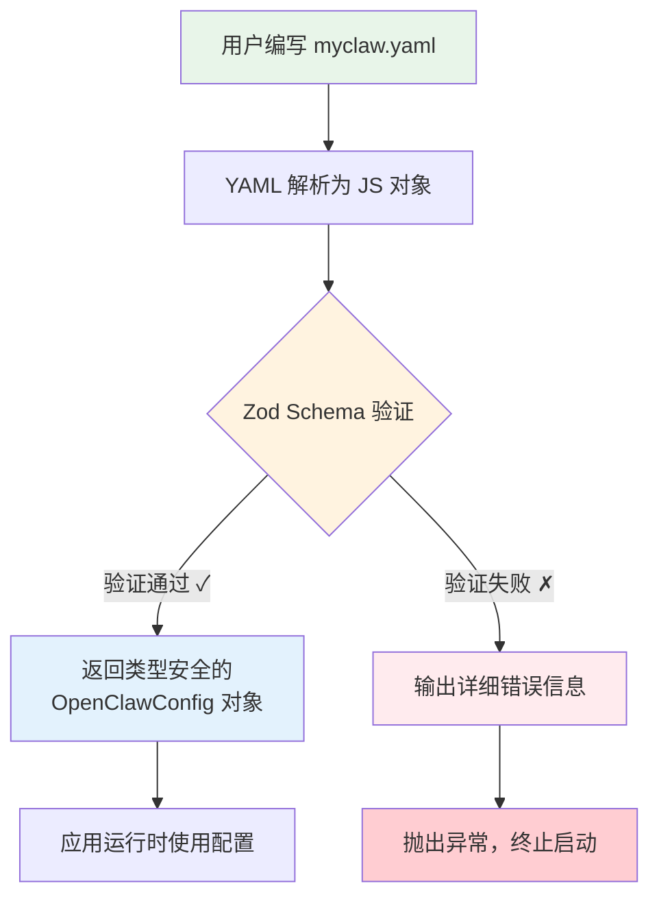
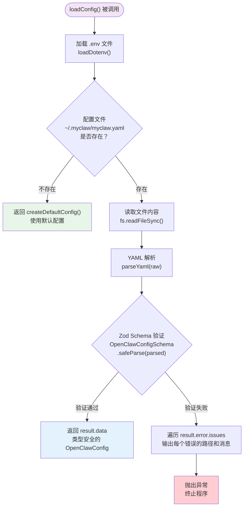

# 第三章：配置系统

> 对应源文件：`src/config/schema.ts`、`src/config/loader.ts`、`src/config/index.ts`、`src/cli/commands/onboard.ts`

## 3.1 概述

MyClaw 的配置系统是整个应用的"中枢神经"。它决定了：

- 使用哪个 LLM 提供商（Anthropic / OpenAI / OpenRouter）
- 开启哪些通道（终端 / 飞书 / Telegram）
- 消息如何路由到不同的 Agent
- 启用哪些插件

配置文件存储在 `~/.myclaw/myclaw.yaml`，采用 YAML 格式——人类可读、支持注释，非常适合手动编辑。

**配置系统的三大设计原则：**

1. **YAML 格式** —— 比 JSON 更适合人类阅读和编辑，支持注释
2. **Zod 运行时验证** —— 确保配置在运行时也是类型安全的，自动提供友好的错误提示
3. **Secret 解析** —— 敏感信息（API Key、Token）支持直接填写或环境变量引用，避免明文泄露

## 3.2 为什么使用 Zod 做运行时 Schema 验证？

在传统的 TypeScript 项目中，类型检查只在编译期生效。但配置文件是运行时加载的——用户手写的 YAML 完全可能包含拼写错误、类型错误、缺失字段等问题。TypeScript 的类型系统在这里无能为力。

这就是 [Zod](https://zod.dev/) 的用武之地。Zod 是一个 TypeScript-first 的 Schema 验证库，它能够：

- **运行时验证数据结构**：确保 YAML 解析后的对象符合预期
- **自动生成 TypeScript 类型**：通过 `z.infer<typeof Schema>` 实现"一处定义，两处使用"
- **提供友好的错误信息**：精确指出哪个字段有什么问题
- **设置默认值**：通过 `.default()` 让用户只需配置关心的部分

下面这张图展示了 Zod 验证在配置系统中的位置和作用：



**关键洞察**：Zod 让我们用一套代码同时解决了"运行时验证"和"编译期类型推导"两个问题。传统方案需要写两遍——一遍 interface，一遍 validation 函数——而 Zod 把它们统一了。

## 3.3 Provider Schema：LLM 提供商配置

`ProviderConfigSchema` 定义了 LLM 提供商的配置结构。MyClaw 支持三种提供商类型：Anthropic、OpenAI 和 OpenRouter。

```typescript
// src/config/schema.ts

export const ProviderConfigSchema = z.object({
  id: z.string().describe("Unique provider identifier"),
  type: z.enum(["anthropic", "openai", "openrouter"]).describe("LLM provider type"),
  apiKey: z.string().optional().describe("API key (or use env var)"),
  apiKeyEnv: z.string().optional().describe("Environment variable name for API key"),
  baseUrl: z.string().optional().describe("Custom API base URL (for OpenRouter, etc.)"),
  model: z.string().describe("Model name to use"),
  maxTokens: z.number().default(4096).describe("Max tokens per response"),
  temperature: z.number().default(0.7).describe("Sampling temperature"),
  systemPrompt: z.string().optional().describe("System prompt for the agent"),
});

export type ProviderConfig = z.infer<typeof ProviderConfigSchema>;
```

### 逐字段解析

| 字段 | 类型 | 必填 | 默认值 | 说明 |
|------|------|------|--------|------|
| `id` | `string` | 是 | - | 提供商唯一标识，在路由规则中引用。如 `"default"`、`"gpt"`、`"openrouter"` |
| `type` | `enum` | 是 | - | 三选一：`"anthropic"`、`"openai"`、`"openrouter"`。决定调用哪个 SDK |
| `apiKey` | `string` | 否 | - | 直接填写 API Key。**不推荐**——明文存储有安全风险 |
| `apiKeyEnv` | `string` | 否 | - | 环境变量名称，如 `"ANTHROPIC_API_KEY"`。**推荐方式** |
| `baseUrl` | `string` | 否 | - | 自定义 API 地址。OpenRouter 必填，也可用于代理服务器 |
| `model` | `string` | 是 | - | 模型名称，如 `"claude-sonnet-4-6"`、`"gpt-4o"`、`"stepfun/step-3.5-flash:free"` |
| `maxTokens` | `number` | 否 | `4096` | 单次响应最大 token 数。增大可获得更长回答，但也更费钱 |
| `temperature` | `number` | 否 | `0.7` | 采样温度。0 = 确定性输出，1 = 更有创造性 |
| `systemPrompt` | `string` | 否 | - | 自定义系统提示词，用于定制 Agent 的行为和人格 |

**设计要点**：`apiKey` 和 `apiKeyEnv` 都是可选的，形成了一种"二选一"的灵活模式。`resolveSecret()` 函数会优先使用直接值，其次尝试环境变量。这样既方便开发时快速测试，又满足生产环境的安全要求。

### 三种提供商的 YAML 示例

```yaml
providers:
  # Anthropic（Claude 系列）
  - id: claude
    type: anthropic
    apiKeyEnv: ANTHROPIC_API_KEY
    model: claude-sonnet-4-6
    maxTokens: 4096

  # OpenAI（GPT 系列）
  - id: gpt
    type: openai
    apiKeyEnv: OPENAI_API_KEY
    model: gpt-4o
    temperature: 0.5

  # OpenRouter（聚合平台，可使用各种免费/付费模型）
  - id: free-model
    type: openrouter
    apiKeyEnv: OPENROUTER_API_KEY
    baseUrl: https://openrouter.ai/api/v1
    model: stepfun/step-3.5-flash:free
```

## 3.4 Channel Schema：通道配置

`ChannelConfigSchema` 定义了消息通道的配置。通道是用户与 MyClaw 交互的入口——终端对话、飞书机器人、Telegram Bot 等。

```typescript
// src/config/schema.ts

export const ChannelConfigSchema = z.object({
  id: z.string().describe("Unique channel identifier"),
  type: z.enum(["terminal", "feishu", "telegram"]).describe("Channel type"),
  enabled: z.boolean().default(true).describe("Whether the channel is active"),
  // Feishu-specific
  appId: z.string().optional().describe("Feishu App ID"),
  appIdEnv: z.string().optional().describe("Env var for Feishu App ID"),
  appSecret: z.string().optional().describe("Feishu App Secret"),
  appSecretEnv: z.string().optional().describe("Env var for Feishu App Secret"),
  // Telegram-specific
  botToken: z.string().optional().describe("Telegram Bot Token"),
  botTokenEnv: z.string().optional().describe("Env var for Telegram Bot Token"),
  allowedChatIds: z.array(z.number()).optional().describe("Allowed Telegram chat IDs (whitelist)"),
  // Common
  greeting: z.string().optional().describe("Greeting message on connect"),
});

export type ChannelConfig = z.infer<typeof ChannelConfigSchema>;
```

### 逐字段解析

| 字段 | 类型 | 必填 | 默认值 | 说明 |
|------|------|------|--------|------|
| `id` | `string` | 是 | - | 通道唯一标识，在路由规则中引用。如 `"terminal"`、`"feishu"`、`"telegram"` |
| `type` | `enum` | 是 | - | 三选一：`"terminal"`（终端）、`"feishu"`（飞书）或 `"telegram"` |
| `enabled` | `boolean` | 否 | `true` | 是否启用此通道。设为 `false` 可临时禁用而不删除配置 |
| `appId` | `string` | 否 | - | 飞书应用 App ID（直接填写） |
| `appIdEnv` | `string` | 否 | - | 飞书应用 App ID 的环境变量名 |
| `appSecret` | `string` | 否 | - | 飞书应用 App Secret（直接填写） |
| `appSecretEnv` | `string` | 否 | - | 飞书应用 App Secret 的环境变量名 |
| `botToken` | `string` | 否 | - | Telegram Bot Token（直接填写） |
| `botTokenEnv` | `string` | 否 | - | Telegram Bot Token 的环境变量名 |
| `allowedChatIds` | `number[]` | 否 | - | Telegram 允许交互的 chatId 白名单 |
| `greeting` | `string` | 否 | - | 用户连接时的欢迎消息 |

**设计要点**：飞书通道有 4 个专属字段（`appId`/`appIdEnv`/`appSecret`/`appSecretEnv`），Telegram 通道有 3 个专属字段（`botToken`/`botTokenEnv`/`allowedChatIds`），都遵循与 Provider 相同的"直接值 vs 环境变量"模式。Terminal 通道不需要任何认证字段，只需 `id`、`type` 和可选的 `greeting`。

## 3.5 路由规则与插件配置

### RouteRuleSchema：路由规则

路由规则决定了来自不同通道的消息应该交给哪个 Provider 处理。

```typescript
// src/config/schema.ts

export const RouteRuleSchema = z.object({
  channel: z.string().describe("Channel ID pattern (* for all)"),
  agent: z.string().default("default").describe("Agent/provider ID to route to"),
});

export type RouteRule = z.infer<typeof RouteRuleSchema>;
```

| 字段 | 类型 | 必填 | 默认值 | 说明 |
|------|------|------|--------|------|
| `channel` | `string` | 是 | - | 通道 ID，或使用 `"*"` 作为通配符匹配所有通道 |
| `agent` | `string` | 否 | `"default"` | 目标 Provider 的 ID |

路由规则按**从上到下的顺序**匹配，第一条匹配的规则生效。通配符 `"*"` 通常放在最后作为兜底：

```yaml
routing:
  - channel: feishu        # 飞书消息 → 使用 GPT
    agent: gpt
  - channel: "*"           # 其他所有通道 → 使用默认 Provider
    agent: default
```

### PluginConfigSchema：插件配置

```typescript
// src/config/schema.ts

export const PluginConfigSchema = z.object({
  id: z.string().describe("Plugin identifier"),
  enabled: z.boolean().default(true),
  config: z.record(z.unknown()).optional().describe("Plugin-specific config"),
});

export type PluginConfig = z.infer<typeof PluginConfigSchema>;
```

| 字段 | 类型 | 必填 | 默认值 | 说明 |
|------|------|------|--------|------|
| `id` | `string` | 是 | - | 插件标识符 |
| `enabled` | `boolean` | 否 | `true` | 是否启用 |
| `config` | `Record<string, unknown>` | 否 | - | 插件自定义配置，使用 `z.record(z.unknown())` 实现"任意键值对"的灵活结构 |

**设计要点**：`z.record(z.unknown())` 是一个非常聪明的选择——它允许每个插件自由定义自己的配置格式，而不需要在核心 Schema 中穷举所有插件的字段。这是一种"开放式 Schema"的设计模式。

## 3.6 顶层 OpenClawConfigSchema

所有子 Schema 最终汇聚到顶层配置 Schema 中：

```typescript
// src/config/schema.ts

export const OpenClawConfigSchema = z.object({
  // 网关设置
  gateway: z
    .object({
      host: z.string().default("127.0.0.1"),
      port: z.number().default(18789),
      token: z.string().optional().describe("Gateway auth token"),
      tokenEnv: z.string().optional().describe("Env var for gateway token"),
    })
    .default({}),

  // LLM 提供商（至少一个）
  providers: z.array(ProviderConfigSchema).min(1).describe("At least one LLM provider"),

  // 默认提供商 ID
  defaultProvider: z.string().describe("ID of the default provider"),

  // 通道列表
  channels: z.array(ChannelConfigSchema).default([]).describe("Messaging channels"),

  // 路由规则
  routing: z.array(RouteRuleSchema).default([{ channel: "*", agent: "default" }]),

  // 插件列表
  plugins: z.array(PluginConfigSchema).default([]),

  // Agent 设置
  agent: z
    .object({
      name: z.string().default("MyClaw"),
      maxHistoryMessages: z.number().default(50),
      toolApproval: z.boolean().default(true).describe("Require approval for tool execution"),
    })
    .default({}),
});

export type OpenClawConfig = z.infer<typeof OpenClawConfigSchema>;
```

### Schema 结构总览

让我们用一张表来理解各个顶层字段：

| 字段 | 类型 | 必填 | 默认值 | 说明 |
|------|------|------|--------|------|
| `gateway` | `object` | 否 | `{ host: "127.0.0.1", port: 18789 }` | 网关服务器设置 |
| `providers` | `array` | 是 | - | LLM 提供商列表，**至少一个**（`.min(1)`） |
| `defaultProvider` | `string` | 是 | - | 默认 Provider 的 ID |
| `channels` | `array` | 否 | `[]` | 通道列表 |
| `routing` | `array` | 否 | `[{ channel: "*", agent: "default" }]` | 路由规则，默认所有通道指向 `default` |
| `plugins` | `array` | 否 | `[]` | 插件列表 |
| `agent` | `object` | 否 | `{ name: "MyClaw", maxHistoryMessages: 50, toolApproval: true }` | Agent 行为设置 |

**两个必填字段的意义**：`providers` 和 `defaultProvider` 是仅有的两个必填字段。没有 LLM 提供商，MyClaw 就无法工作——这是最基本的要求。其他所有字段都有合理的默认值，确保最小配置也能正常运行。

## 3.7 默认配置：createDefaultConfig()

当配置文件不存在时，MyClaw 会使用默认配置。`createDefaultConfig()` 函数返回一个开箱即用的配置对象：

```typescript
// src/config/schema.ts

export function createDefaultConfig(): OpenClawConfig {
  return {
    gateway: {
      host: "127.0.0.1",
      port: 18789,
    },
    providers: [
      {
        id: "default",
        type: "openrouter",
        apiKeyEnv: "OPENROUTER_API_KEY",
        model: "stepfun/step-3.5-flash:free",
        maxTokens: 4096,
        temperature: 0.7,
      },
    ],
    defaultProvider: "default",
    channels: [
      {
        id: "terminal",
        type: "terminal",
        enabled: true,
        greeting: "Hello! I'm MyClaw, your AI assistant. Type /help for commands.",
      },
    ],
    routing: [{ channel: "*", agent: "default" }],
    plugins: [],
    agent: {
      name: "MyClaw",
      maxHistoryMessages: 50,
      toolApproval: true,
    },
  };
}
```

**默认配置的设计决策**：

- **默认使用 OpenRouter**：OpenRouter 提供免费模型（`stepfun/step-3.5-flash:free`），降低了上手门槛——用户不需要付费 API Key 就能体验
- **只开启终端通道**：最简单、最不需要额外配置的通道
- **通配符路由**：`channel: "*"` 将所有消息路由到默认 Provider
- **工具审批开启**：`toolApproval: true`，安全第一

## 3.8 配置加载器：loader.ts 详解

配置加载器是 `schema.ts` 和实际文件系统之间的桥梁。它负责读取 YAML 文件、调用 Zod 验证、写入配置、解析 Secret。

### 配置加载流程



### 路径常量与环境变量覆盖

```typescript
// src/config/loader.ts

const STATE_DIR =
  process.env.MYCLAW_STATE_DIR || path.join(os.homedir(), ".myclaw");
const CONFIG_PATH =
  process.env.MYCLAW_CONFIG_PATH || path.join(STATE_DIR, "myclaw.yaml");
```

MyClaw 支持两个环境变量来覆盖默认路径：

| 环境变量 | 默认值 | 说明 |
|---------|--------|------|
| `MYCLAW_STATE_DIR` | `~/.myclaw/` | 状态目录，存放配置文件和其他持久化数据 |
| `MYCLAW_CONFIG_PATH` | `~/.myclaw/myclaw.yaml` | 配置文件路径，可以指向任意位置 |

**使用场景**：

```bash
# 场景 1：多环境配置
MYCLAW_CONFIG_PATH=~/.myclaw/production.yaml myclaw agent

# 场景 2：测试时使用临时目录
MYCLAW_STATE_DIR=/tmp/myclaw-test myclaw agent

# 场景 3：团队共享配置
MYCLAW_CONFIG_PATH=/shared/team-config.yaml myclaw gateway
```

**优先级逻辑**：环境变量 > 默认值。如果设置了 `MYCLAW_CONFIG_PATH`，会直接使用该路径，忽略 `MYCLAW_STATE_DIR` 的影响。

### loadConfig() 函数详解

```typescript
// src/config/loader.ts

export function loadConfig(): OpenClawConfig {
  // 第 1 步：加载 .env 文件
  // 如果项目根目录存在 .env 文件，将其中的变量注入 process.env
  // 这样 apiKeyEnv 引用的环境变量就能被正确解析
  loadDotenv();

  // 第 2 步：检查配置文件是否存在
  // 不存在则返回默认配置——确保首次运行也能正常工作
  if (!fs.existsSync(CONFIG_PATH)) {
    return createDefaultConfig();
  }

  // 第 3 步：读取并解析 YAML
  const raw = fs.readFileSync(CONFIG_PATH, "utf-8");
  const parsed = parseYaml(raw);

  // 第 4 步：Zod 验证
  // safeParse 不会抛异常，而是返回 { success, data, error }
  const result = OpenClawConfigSchema.safeParse(parsed);
  if (!result.success) {
    // 遍历所有验证错误，逐条输出
    console.error("Configuration validation errors:");
    for (const issue of result.error.issues) {
      // issue.path 是数组，如 ["providers", 0, "model"]
      // join(".") 后变成 "providers.0.model"，非常直观
      console.error(`  - ${issue.path.join(".")}: ${issue.message}`);
    }
    throw new Error("Invalid configuration. Please fix the errors above.");
  }

  // 第 5 步：返回经过验证的配置对象
  // result.data 的类型就是 OpenClawConfig，完全类型安全
  return result.data;
}
```

**为什么使用 `safeParse` 而不是 `parse`？** `parse` 在验证失败时会直接抛出 `ZodError`，而 `safeParse` 返回一个结果对象。使用 `safeParse` 让我们能够自定义错误输出格式——逐条打印每个验证问题，而不是一次性抛出一大段错误堆栈。这对用户来说友好得多。

### writeConfig() 函数详解

```typescript
// src/config/loader.ts

export function writeConfig(config: OpenClawConfig): void {
  ensureStateDir();  // 确保 ~/.myclaw/ 目录存在
  const yaml = stringifyYaml(config, { indent: 2 });  // 对象 → YAML 字符串
  fs.writeFileSync(CONFIG_PATH, yaml, "utf-8");        // 写入磁盘
}
```

这个函数在 `onboard` 命令中被调用，将用户通过交互式向导生成的配置写入磁盘。`ensureStateDir()` 使用 `mkdirSync` 的 `recursive: true` 选项，确保即使 `~/.myclaw/` 不存在也能正确创建。

### resolveSecret() 函数详解

```typescript
// src/config/loader.ts

export function resolveSecret(
  value?: string,    // 直接值：apiKey: "sk-ant-..."
  envVar?: string    // 环境变量名：apiKeyEnv: "ANTHROPIC_API_KEY"
): string | undefined {
  if (value) return value;           // 优先使用直接值
  if (envVar) return process.env[envVar];  // 其次查找环境变量
  return undefined;                  // 都没有则返回 undefined
}
```

**调用示例**：

```typescript
// 在 Provider 初始化时使用
const apiKey = resolveSecret(provider.apiKey, provider.apiKeyEnv);
if (!apiKey) {
  throw new Error(`No API key for provider ${provider.id}`);
}
```

这个函数虽然简单，但它是 MyClaw 安全模式的核心——它让用户可以在开发时直接写 API Key（方便），在生产环境中使用环境变量（安全），而调用方不需要关心具体用了哪种方式。

### loadConfigSnapshot()

```typescript
// src/config/loader.ts

export function loadConfigSnapshot(): Readonly<OpenClawConfig> {
  return Object.freeze(loadConfig());
}
```

`Object.freeze()` 冻结对象，使其不可修改。适用于需要"读取一次、到处使用"的场景，防止运行时意外修改配置。

## 3.9 统一导出：index.ts

```typescript
// src/config/index.ts

export { OpenClawConfigSchema, createDefaultConfig } from "./schema.js";
export type { OpenClawConfig, ProviderConfig, ChannelConfig } from "./schema.js";
export {
  loadConfig,
  writeConfig,
  getStateDir,
  getConfigPath,
  resolveSecret,
  ensureStateDir,
  loadConfigSnapshot,
} from "./loader.js";
```

这是 TypeScript 项目中常见的"barrel export"模式——把模块内部的多个文件统一通过 `index.ts` 对外暴露。外部代码只需 `import { loadConfig } from "../../config/index.js"` 即可。

## 3.10 Onboard 引导向导

`onboard` 命令提供了一个交互式的初始化向导，引导用户一步步生成配置文件。这是新用户首次使用 MyClaw 时最推荐的入口。

### 向导流程详解

```typescript
// src/cli/commands/onboard.ts

export function registerOnboardCommand(program: Command): void {
  program
    .command("onboard")
    .description("Interactive setup wizard for MyClaw")
    .action(async () => {
      // 创建 readline 接口用于交互式问答
      const rl = readline.createInterface({
        input: process.stdin,
        output: process.stdout,
      });

      console.log(chalk.bold.cyan("\n🦀 Welcome to MyClaw Setup!\n"));

      // 从默认配置开始，逐步覆盖用户的选择
      const config = createDefaultConfig();

      // 第 1 步：选择 LLM 提供商
      // 默认是 anthropic（因为 createDefaultConfig 里是 openrouter，
      // 但向导提供了 anthropic/openai 两个选项）
      const providerType = await ask(
        rl,
        `LLM Provider (anthropic/openai) [anthropic]: `
      );
      if (providerType === "openai") {
        config.providers[0].type = "openai";
        config.providers[0].apiKeyEnv = "OPENAI_API_KEY";
        config.providers[0].model = "gpt-4o";
      }

      // 第 2 步：API Key
      // 先检查环境变量是否已存在——如果已设置，就不需要用户再输入
      const apiKeyEnvName = config.providers[0].apiKeyEnv!;
      const existingKey = process.env[apiKeyEnvName];
      if (existingKey) {
        console.log(chalk.green(`✓ Found ${apiKeyEnvName} in environment`));
      } else {
        // 环境变量不存在，要求用户直接输入 API Key
        const apiKey = await ask(rl, `Enter your API key: `);
        if (apiKey) {
          config.providers[0].apiKey = apiKey;
          config.providers[0].apiKeyEnv = undefined; // 清除环境变量引用
        }
      }

      // 第 3 步：模型选择（提供默认值，回车即可跳过）
      const model = await ask(rl, `Model [${config.providers[0].model}]: `);
      if (model) config.providers[0].model = model;

      // 第 4 步：网关端口
      const port = await ask(rl, `Gateway port [18789]: `);
      if (port) config.gateway.port = parseInt(port, 10);

      // 第 5 步：Bot 名称
      const name = await ask(rl, `Bot name [MyClaw]: `);
      if (name) config.agent.name = name;

      // 第 6 步：飞书通道（可选）
      const useFeishu = await ask(rl, `Enable Feishu channel? (y/N): `);
      if (useFeishu.toLowerCase() === "y") {
        const appId = await ask(rl, `Feishu App ID: `);
        const appSecret = await ask(rl, `Feishu App Secret: `);
        config.channels.push({
          id: "feishu",
          type: "feishu",
          enabled: true,
          appId: appId || undefined,
          appIdEnv: appId ? undefined : "FEISHU_APP_ID",
          appSecret: appSecret || undefined,
          appSecretEnv: appSecret ? undefined : "FEISHU_APP_SECRET",
        });
      }

      // 写入配置文件
      ensureStateDir();
      writeConfig(config);

      console.log(chalk.green(`\n✓ Configuration saved to ${getConfigPath()}`));
      console.log(`\nNext steps:`);
      console.log(`  myclaw agent    - Start chatting`);
      console.log(`  myclaw gateway  - Start the gateway server`);
      console.log(`  myclaw doctor   - Run diagnostics\n`);

      rl.close();
    });
}
```

### 向导运行示例

```bash
$ npx tsx src/entry.ts onboard

🦀 Welcome to MyClaw Setup!

Let's configure your personal AI assistant.

LLM Provider (anthropic/openai) [anthropic]: anthropic
✓ Found ANTHROPIC_API_KEY in environment
Model [claude-sonnet-4-6]:
Gateway port [18789]:
Bot name [MyClaw]: 小爪
Enable Feishu channel? (y/N): y
Feishu App ID: cli_xxxxx
Feishu App Secret: xxxxxxxxxxxxx

✓ Configuration saved to /Users/you/.myclaw/myclaw.yaml

Next steps:
  myclaw agent    - Start chatting
  myclaw gateway  - Start the gateway server
  myclaw doctor   - Run diagnostics
```

**向导设计的巧妙之处**：

1. **渐进式覆盖**：从 `createDefaultConfig()` 开始，只覆盖用户输入了值的字段。按回车跳过 = 使用默认值
2. **环境变量自动检测**：检查到环境变量已存在时自动跳过输入，减少用户操作
3. **智能 Secret 处理**：如果用户直接输入了 API Key，就清除 `apiKeyEnv` 引用，避免冲突
4. **飞书通道延迟配置**：只有用户明确选择 `y` 才添加飞书配置，保持最小配置原则

## 3.11 完整示例 myclaw.yaml（带注释）

```yaml
# ~/.myclaw/myclaw.yaml
# MyClaw 完整配置示例

# ============================================================
# 网关设置
# Gateway 是 MyClaw 的 WebSocket 控制面，通道通过它连接到 Agent
# ============================================================
gateway:
  host: 127.0.0.1           # 监听地址，默认只接受本地连接
  port: 18789               # 监听端口
  # token: "your-secret"    # 可选：网关认证 Token（直接填写）
  # tokenEnv: MYCLAW_TOKEN  # 可选：通过环境变量提供 Token

# ============================================================
# LLM 提供商列表
# 至少需要一个提供商，可以配置多个用于不同场景
# ============================================================
providers:
  # 主力模型：Anthropic Claude
  - id: default              # 唯一标识，被路由规则引用
    type: anthropic           # 提供商类型
    apiKeyEnv: ANTHROPIC_API_KEY  # 通过环境变量提供 API Key（推荐）
    model: claude-sonnet-4-6   # 模型名称
    maxTokens: 4096           # 单次回复最大 token 数
    temperature: 0.7          # 采样温度（0=确定性，1=创造性）
    systemPrompt: "你是一个有帮助的 AI 助手。" # 可选：自定义系统提示词

  # 备选模型：OpenAI GPT
  - id: gpt
    type: openai
    apiKeyEnv: OPENAI_API_KEY
    model: gpt-4o
    temperature: 0.5

  # 免费模型：OpenRouter
  - id: free
    type: openrouter
    apiKeyEnv: OPENROUTER_API_KEY
    baseUrl: https://openrouter.ai/api/v1  # OpenRouter 需要自定义 baseUrl
    model: stepfun/step-3.5-flash:free

# ============================================================
# 默认提供商
# 当路由规则没有匹配到特定 Provider 时使用
# ============================================================
defaultProvider: default      # 对应上面 providers 中某个 id

# ============================================================
# 通道列表
# 通道是用户与 MyClaw 交互的入口
# ============================================================
channels:
  # 终端通道：最基本的交互方式
  - id: terminal
    type: terminal
    enabled: true
    greeting: "你好！我是 MyClaw，你的 AI 助手。输入 /help 查看命令。"

  # 飞书通道：企业协作场景
  - id: feishu
    type: feishu
    enabled: true
    appIdEnv: FEISHU_APP_ID          # 飞书应用 App ID
    appSecretEnv: FEISHU_APP_SECRET  # 飞书应用 App Secret

# ============================================================
# 路由规则
# 从上到下匹配，第一条命中的规则生效
# ============================================================
routing:
  - channel: feishu          # 飞书消息 → GPT 模型
    agent: gpt
  - channel: "*"             # 其他所有通道 → 默认 Provider（Claude）
    agent: default

# ============================================================
# 插件列表
# ============================================================
plugins:
  - id: memory               # 记忆插件
    enabled: true
    config:
      maxEntries: 1000       # 插件自定义配置
  - id: web-search           # 网络搜索插件
    enabled: false            # 暂时禁用

# ============================================================
# Agent 行为设置
# ============================================================
agent:
  name: MyClaw               # Bot 显示名称
  maxHistoryMessages: 50     # 上下文窗口保留的最大消息数
  toolApproval: true         # 执行工具前是否需要用户确认
```

## 3.12 如何自定义配置

### 最小配置

如果只想快速体验，只需要必填字段即可：

```yaml
# 最小可用配置
providers:
  - id: default
    type: openrouter
    apiKeyEnv: OPENROUTER_API_KEY
    model: stepfun/step-3.5-flash:free

defaultProvider: default
```

所有其他字段都会使用 Zod Schema 中定义的默认值自动填充。

### 多提供商 + 智能路由

```yaml
providers:
  - id: claude
    type: anthropic
    apiKeyEnv: ANTHROPIC_API_KEY
    model: claude-sonnet-4-6

  - id: gpt
    type: openai
    apiKeyEnv: OPENAI_API_KEY
    model: gpt-4o

defaultProvider: claude

routing:
  - channel: feishu     # 飞书用 GPT（更快）
    agent: gpt
  - channel: "*"        # 终端用 Claude（更强）
    agent: claude
```

### 使用环境变量切换配置

```bash
# 开发环境：使用免费模型
MYCLAW_CONFIG_PATH=~/.myclaw/dev.yaml myclaw agent

# 生产环境：使用付费模型
MYCLAW_CONFIG_PATH=~/.myclaw/prod.yaml myclaw gateway

# 测试环境：临时状态目录
MYCLAW_STATE_DIR=/tmp/myclaw-test myclaw agent
```

### 安全最佳实践

1. **永远不要在 YAML 中明文写 API Key**——使用 `apiKeyEnv` 引用环境变量
2. **将 `.env` 加入 `.gitignore`**——防止意外提交
3. **配置文件权限**——`chmod 600 ~/.myclaw/myclaw.yaml` 限制只有当前用户可读
4. **使用 `tokenEnv` 保护网关**——设置网关认证 Token 防止未授权访问

---

**下一章**：[网关服务器](./04-gateway-server.md) —— WebSocket 控制面
