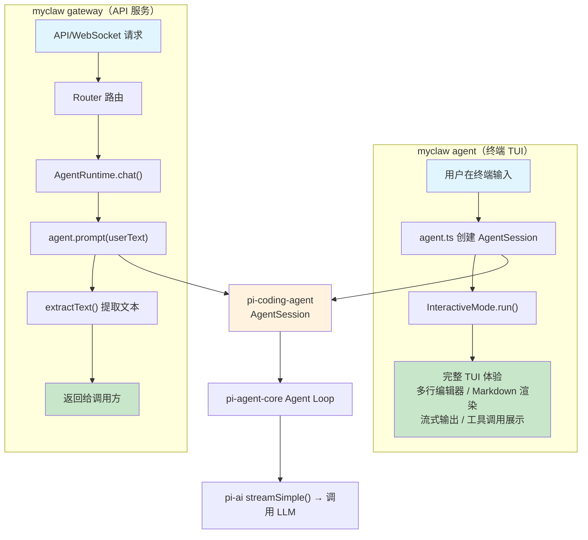

# 第五章：Agent 运行时 -- MyClaw 的"大脑"

> 对应源文件：`src/agent/runtime.ts`, `src/agent/model.ts`, `src/cli/commands/agent.ts`

## 概述

如果把 MyClaw 比作一个人，那么 Agent Runtime 就是它的**大脑**。它是整个系统中最核心的模块，负责协调 LLM（大语言模型）与工具之间的交互循环。

MyClaw 的 Agent 内核依赖 [pi-mono](https://github.com/mariozechner/pi-mono) 生态的三个核心包：

- **`@mariozechner/pi-ai`** — LLM 抽象层（Model、stream、provider 自动发现）
- **`@mariozechner/pi-agent-core`** — Agent 状态机 + agent loop（Agent 类、消息管理、工具执行循环）
- **`@mariozechner/pi-coding-agent`** — 编码 Agent 上层封装（内置工具、Skills 加载、session 管理、**InteractiveMode 终端 TUI**）

MyClaw 只保留自己的特色模块（channels、routing、gateway、CLI），agent 内核由 pi-mono 提供。

本章我们将理解以下核心机制：

1. **Model 解析**：如何将 MyClaw 配置映射到 pi-ai 的 Model 对象
2. **Agent Session**：如何创建和使用 pi-coding-agent 的会话
3. **两条路径**：`agent` 命令使用 InteractiveMode TUI，`gateway` 命令使用 AgentRuntime + Router
4. **系统提示词构建**：告诉 LLM "你是谁、你能做什么"

---

## 5.1 架构总览

MyClaw 有**两条路径**连接到 pi-mono 的 Agent Session：



**关键区别**：
- **`myclaw agent`**：直接使用 `InteractiveMode`（pi-coding-agent 内置的终端 TUI），不经过 Router / TerminalChannel。InteractiveMode 接管整个终端交互，提供多行编辑器、Markdown 渲染、流式输出、工具调用可折叠展示等功能。
- **`myclaw gateway`**：使用 `AgentRuntime`（薄封装层），通过 Router 将 API 请求转发给 agent，提取纯文本返回。

### 为什么用 pi-mono？

| 能力 | pi-mono 提供的方案 |
|------|-------------------|
| Provider 抽象 | pi-ai 自动发现，支持 10+ 提供商 |
| Agent Loop | pi-agent-core 状态机，健壮的工具执行循环 |
| 工具系统 | pi-coding-agent 内置工具集（read/write/edit/bash） |
| 终端交互 | InteractiveMode 完整 TUI（多行编辑器、Markdown、流式输出） |
| 模型目录 | pi-ai 内置模型目录 + 自动发现 |

MyClaw 只需 ~100 行薄封装代码，即可获得完整的 agent 能力。

---

## 5.2 Model 解析（`src/agent/model.ts`）

MyClaw 的配置使用 `ProviderConfig`（类型、API Key、模型名），需要映射到 pi-ai 的 `Model<Api>` 对象：

```typescript
import type { Api, Model } from "@mariozechner/pi-ai";
import { AuthStorage, ModelRegistry } from "@mariozechner/pi-coding-agent";

// 1. 创建 AuthStorage：将 MyClaw 配置中的 API Key 注入
export function createAuthStorage(providers: ProviderConfig[]): AuthStorage {
  const authStorage = AuthStorage.inMemory();
  for (const provider of providers) {
    const apiKey = resolveSecret(provider.apiKey, provider.apiKeyEnv);
    if (apiKey) {
      authStorage.setRuntimeApiKey(resolveProviderId(provider.type), apiKey);
    }
  }
  return authStorage;
}

// 2. 创建 ModelRegistry：用于模型查找
export function createModelRegistry(authStorage: AuthStorage): ModelRegistry {
  return new ModelRegistry(authStorage);
}

// 3. 解析 Model：先查目录，后手动构建
export function resolveModel(
  providerConfig: ProviderConfig,
  modelRegistry: ModelRegistry,
  modelOverride?: string,
): Model<Api> {
  const modelId = modelOverride ?? providerConfig.model;
  const providerId = resolveProviderId(providerConfig.type);

  // 尝试从 pi-ai 内置目录查找
  const registered = modelRegistry.find(providerId, modelId);
  if (registered) {
    return { ...registered, baseUrl: providerConfig.baseUrl ?? registered.baseUrl };
  }

  // 回退：手动构建 Model 对象
  return {
    id: modelId,
    name: modelId,
    api: resolveApiType(providerConfig.type),  // "anthropic-messages" | "openai-completions"
    provider: providerId,
    baseUrl: providerConfig.baseUrl ?? ...,
    maxTokens: providerConfig.maxTokens ?? 4096,
    // ...
  };
}
```

**关键点**：

- **`AuthStorage.inMemory()`**：在内存中存储 API Key，不写磁盘
- **`setRuntimeApiKey()`**：注入 API Key，这样 pi-coding-agent 的 agent loop 在调用 LLM 时能自动获取
- **`ModelRegistry`**：pi-ai 内置了主流模型的参数（context window、cost 等），用 `find()` 查找

---

## 5.3 Agent 命令（`src/cli/commands/agent.ts`）— InteractiveMode

`myclaw agent` 命令直接使用 pi-coding-agent 的 `InteractiveMode`，获得完整的终端 TUI 体验。

### 初始化流程

```typescript
import { InteractiveMode, createAgentSession, SessionManager } from "@mariozechner/pi-coding-agent";
import { createAuthStorage, createModelRegistry, resolveModel } from "../../agent/model.js";
import { buildSystemPrompt } from "../../agent/runtime.js";

// 1. 从 MyClaw 配置解析 auth + model
const authStorage = createAuthStorage(config.providers);
const modelRegistry = createModelRegistry(authStorage);
const model = resolveModel(providerConfig, modelRegistry, opts.model);

// 2. 创建 AgentSession
const sessionManager = SessionManager.inMemory(process.cwd());
const { session, modelFallbackMessage } = await createAgentSession({
  cwd: process.cwd(), authStorage, modelRegistry, model, sessionManager,
});

// 3. 设置 MyClaw 自定义 system prompt
session.agent.setSystemPrompt(buildSystemPrompt(config, providerConfig));

// 4. 启动 InteractiveMode — 接管整个终端
const mode = new InteractiveMode(session, { modelFallbackMessage });
await mode.run();
```

**关键点**：

- **不经过 Router / TerminalChannel**：InteractiveMode 直接与 AgentSession 通信
- **InteractiveMode 自动处理 Skills**：通过内置 resourceLoader 自动扫描 `skills/` 目录，无需手动加载
- **`buildSystemPrompt` 从 runtime.ts 导出**：agent.ts 和 gateway 路径共享同一个系统提示词构建函数

### InteractiveMode 提供的功能

| 功能 | 说明 |
|------|------|
| 多行编辑器 | Emacs 快捷键、undo/redo、kill ring、自动补全 |
| Markdown 渲染 | 语法高亮、表格、代码块 |
| 流式输出 | Token-by-token 实时显示 |
| 工具调用展示 | 可折叠，bash/edit/write 专用渲染器 |
| Session 管理 | 内置 session 切换、导出 |
| 加载动画 | 等待 LLM 响应时的视觉反馈 |

---

## 5.4 Agent Runtime（`src/agent/runtime.ts`）— Gateway 路径

`AgentRuntime` 是 **gateway 命令**的桥梁，将 API 请求转化为 agent 调用并提取纯文本返回。

### 初始化流程

```typescript
export async function createAgentRuntime(config, options?): Promise<AgentRuntime> {
  // 1. 设置认证
  const authStorage = createAuthStorage(config.providers);
  const modelRegistry = createModelRegistry(authStorage);

  // 2. 解析模型
  const model = resolveModel(providerConfig, modelRegistry, options?.modelOverride);

  // 3. 创建 pi-coding-agent Session
  const sessionManager = SessionManager.inMemory(process.cwd());
  const { session } = await createAgentSession({
    cwd: process.cwd(),
    authStorage,
    modelRegistry,
    model,
    sessionManager,
  });

  // 4. 设置系统提示词
  session.agent.setSystemPrompt(buildSystemPrompt(config, providerConfig, skillsPrompt));

  // 5. 返回 AgentRuntime 接口
  return { chat, chatWithSkill };
}
```

### chat() 方法

```typescript
async chat(request): Promise<string> {
  // 只取最新的用户消息（agent 自己维护历史）
  const lastMsg = request.messages[request.messages.length - 1];
  return promptAndExtract(session.agent, lastMsg.content);
}
```

**核心设计**：pi-agent-core 的 Agent 内部维护完整的对话历史。MyClaw 不需要在每次调用时注入全部历史，只需传入最新的用户消息。Agent 会自动把它追加到内部状态，然后运行 agent loop。

### promptAndExtract()

```typescript
async function promptAndExtract(agent, userText): Promise<string> {
  const beforeCount = agent.state.messages.length;

  // prompt() 做三件事：
  // 1. 将 userText 追加到 agent 内部消息历史
  // 2. 调用 LLM（通过 streamSimple）
  // 3. 如果 LLM 返回工具调用，自动执行工具并继续循环
  await agent.prompt(userText);
  await agent.waitForIdle();

  // 只提取 prompt 之后新增的 assistant 消息
  const newMessages = agent.state.messages.slice(beforeCount);
  const textParts = [];
  for (const msg of newMessages) {
    if (msg.role === "assistant") extractText(msg.content, textParts);
  }
  return textParts.join("\n") || "(No response)";
}
```

### 消息内容格式

pi-agent-core 的消息内容是**块数组**，而不是纯字符串：

```typescript
// 用户消息
{ role: "user", content: [{ type: "text", text: "你好" }] }

// 助手消息（可能包含思考过程）
{ role: "assistant", content: [
  { type: "thinking", thinking: "用户说了你好，我应该..." },
  { type: "text", text: "你好！有什么可以帮你的？" }
]}
```

`extractText()` 只提取 `type: "text"` 的块，跳过 `thinking`、`tool_use` 等：

```typescript
function extractText(content, out) {
  if (!Array.isArray(content)) return;
  for (const block of content) {
    if (block.type === "text" && block.text?.trim()) {
      out.push(block.text);
    }
  }
}
```

---

## 5.5 系统提示词

系统提示词很简洁，因为工具文档由 pi-coding-agent 自动管理。

`buildSystemPrompt` 从 `runtime.ts` 导出，供 `agent.ts`（InteractiveMode 路径）和 `createAgentRuntime`（gateway 路径）共同使用：

```typescript
export function buildSystemPrompt(config, providerConfig, skillsPrompt?) {
  const parts = [
    `You are a personal assistant running inside MyClaw.`,
    ``,
    `## Guidelines`,
    `- Read files before editing them`,
    `- Prefer editing over writing when modifying existing files`,
    `- Always respond in the user's language`,
  ];

  // 追加 provider 自定义提示词
  if (providerConfig.systemPrompt) {
    parts.push("", providerConfig.systemPrompt);
  }

  // 追加 Skills 列表（XML 格式，由 pi-coding-agent 生成）
  if (skillsPrompt) {
    parts.push("", skillsPrompt);
  }

  return parts.join("\n");
}
```

注意：不再需要手动列出工具说明（`read`、`write`、`edit` 等），因为 pi-coding-agent 的 `createAgentSession` 会自动将内置工具的 schema 传给 LLM。

---

## 5.6 工具系统

MyClaw 不自己定义工具。pi-coding-agent 的 `createAgentSession` 默认包含以下内置工具：

| 工具名称 | 功能描述 |
|---------|---------|
| `read` | 读取文件内容 |
| `write` | 创建或覆盖文件 |
| `edit` | 精确字符串替换编辑 |
| `bash` | 执行 Shell 命令 |

这些工具由 pi-coding-agent 实现和维护，包括安全检查、超时控制等。

### 如何添加自定义工具？

可以通过 `createAgentSession` 的 `customTools` 参数添加：

```typescript
const { session } = await createAgentSession({
  // ...
  customTools: [{
    name: "word_count",
    description: "Count words in a file",
    // ...
  }],
});
```

---

## 5.7 Provider 支持

pi-ai 通过 `Model<Api>` 类型统一了不同提供商的差异：

| Api 类型 | 对应提供商 |
|---------|---------|
| `anthropic-messages` | Anthropic (Claude) |
| `openai-completions` | OpenAI, OpenRouter |
| `google-generative-ai` | Google (Gemini) |
| `bedrock-converse-stream` | AWS Bedrock |

MyClaw 只需在 `resolveModel()` 中正确设置 `api` 字段，pi-ai 的 `streamSimple()` 会自动处理不同 API 的格式差异。

---

## 小结

本章我们深入了解了 Agent Runtime：

- **双路径架构**：`myclaw agent` 使用 InteractiveMode 获得完整 TUI 体验，`myclaw gateway` 使用 AgentRuntime 提供 API 服务
- **InteractiveMode**：pi-coding-agent 内置的终端 TUI，提供多行编辑器、Markdown 渲染、流式输出、工具调用展示
- **pi-mono 集成**：通过 `createAgentSession` 一行代码获得完整的 agent loop + 工具系统 + LLM 流式调用
- **Model 解析**：`resolveModel()` 将 MyClaw 配置映射到 pi-ai 的 `Model<Api>`
- **薄封装层**：MyClaw 只需 ~100 行代码桥接 pi-mono 和自己的 channels/routing 系统
- **共享 buildSystemPrompt**：agent 和 gateway 两条路径共用同一个系统提示词构建函数

理解了 Agent Runtime，你就理解了 AI 编程助手的核心原理。下一章我们将看到如何让 MyClaw 连接到不同的消息平台。

---

**下一章**：[通道抽象](./06-channels.md) —— 让 MyClaw 连接任何消息平台
