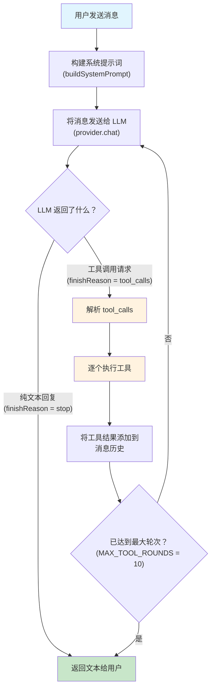
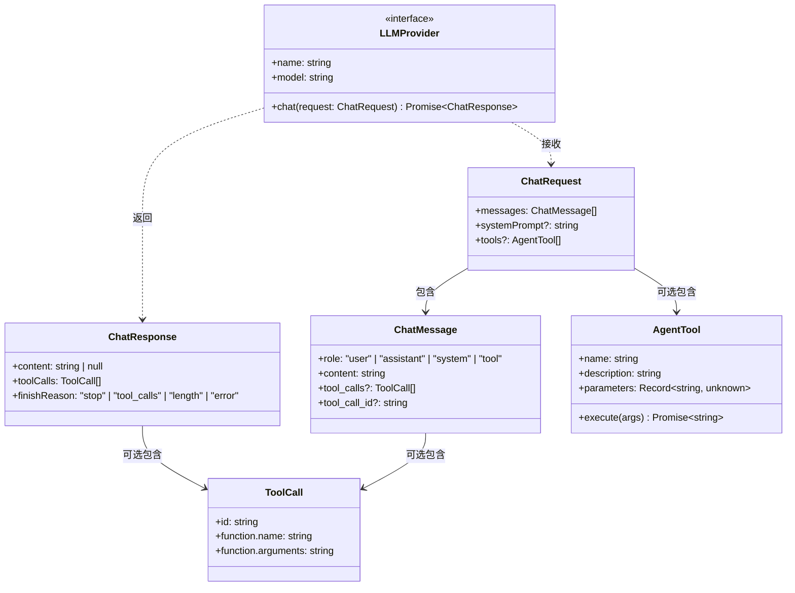
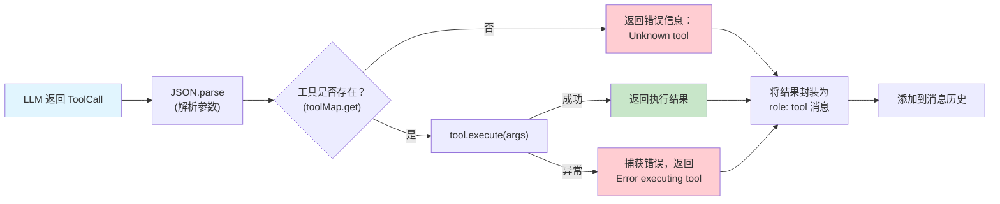
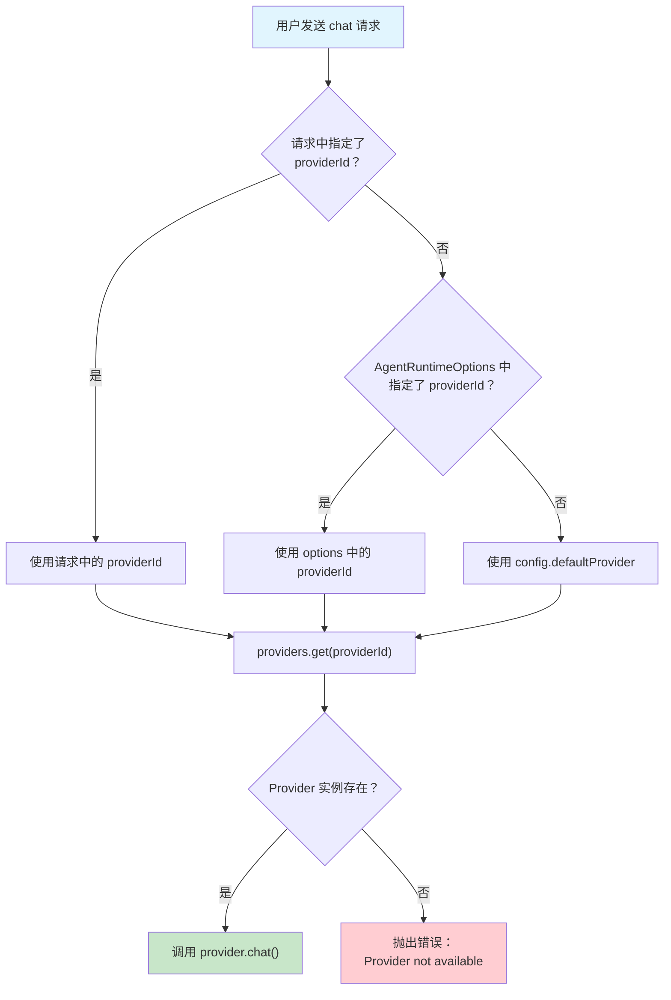

# 第五章：Agent 运行时 -- MyClaw 的"大脑"

> 对应源文件：`src/agent/runtime.ts`, `src/agent/providers/types.ts`, `src/agent/providers/anthropic.ts`, `src/agent/providers/openai.ts`, `src/agent/tools.ts`

## 概述

如果把 MyClaw 比作一个人，那么 Agent Runtime 就是它的**大脑**。它是整个系统中最核心的模块，负责协调 LLM（大语言模型）与工具之间的交互循环。

一个 AI 编程助手的核心工作流程可以简化为：**接收用户消息 -> 调用 LLM -> 执行工具 -> 返回结果**。但真正的实现远比这复杂——LLM 可能需要连续多次调用工具才能完成一个任务，不同的 LLM 提供商有不同的 API 格式，工具执行需要考虑安全性……这一切都由 Agent Runtime 统筹管理。

本章我们将深入剖析 MyClaw 的运行时架构，理解以下核心机制：

1. **Agent Loop（代理循环）**：LLM 与工具之间的迭代交互
2. **Provider 抽象层**：统一不同 LLM 提供商的接口差异
3. **工具系统**：让 AI 能够读写文件、执行命令、搜索代码
4. **系统提示词构建**：告诉 LLM "你是谁、你能做什么"

---

## 5.1 Agent Loop：MyClaw 的心跳

Agent Loop 是 MyClaw 的核心运行机制。与简单的"问一次答一次"不同，MyClaw 采用**循环式交互**——LLM 可以在一次对话中多次调用工具，直到收集到足够的信息后才给出最终回答。

### 整体流程图



### 这个循环为什么重要？

想象用户说："帮我把 src/index.ts 里的 foo 函数改名为 bar"。MyClaw 需要：

1. **第一轮**：LLM 决定先读取文件 -> 调用 `read` 工具 -> 获取文件内容
2. **第二轮**：LLM 看到文件内容，决定进行编辑 -> 调用 `edit` 工具 -> 完成替换
3. **第三轮**：LLM 生成文本回复："已将 foo 函数改名为 bar"

没有 Agent Loop，LLM 只能"想"但不能"做"。Agent Loop 赋予了 LLM **行动能力**。

### 代码实现

让我们逐行解读 `src/agent/runtime.ts` 中 Agent Loop 的核心逻辑：

```typescript
const MAX_TOOL_ROUNDS = 10; // 防止无限循环的安全阀

// chat 方法是 Agent Loop 的入口
async chat(request): Promise<string> {
  // 1. 解析使用哪个 Provider
  const providerId = request.providerId ?? options?.providerId ?? config.defaultProvider;
  const provider = providers.get(providerId);
  if (!provider) {
    throw new Error(
      `Provider '${providerId}' not available. ` +
      `Check your API key and config. Available: ${Array.from(providers.keys()).join(", ")}`
    );
  }

  // 2. 构建系统提示词
  const systemPrompt = buildSystemPrompt(config);

  // 3. 初始化消息历史（拷贝一份，避免污染原始数据）
  const messages: ChatMessage[] = [...request.messages];
  let textParts: string[] = [];

  // 4. Agent Loop 开始！最多循环 MAX_TOOL_ROUNDS 轮
  for (let round = 0; round < MAX_TOOL_ROUNDS; round++) {
    // 向 LLM 发送请求
    const response = await provider.chat({
      messages,
      systemPrompt,
      tools: tools.length > 0 ? tools : undefined,
    });

    // 收集文本内容
    if (response.content) {
      textParts.push(response.content);
    }

    // 没有工具调用 → 循环结束，返回文本
    if (response.toolCalls.length === 0 || response.finishReason !== "tool_calls") {
      break;
    }

    // 有工具调用！将 assistant 的回复（含 tool_calls）加入历史
    messages.push({
      role: "assistant",
      content: response.content ?? "",
      tool_calls: response.toolCalls,
    });

    // 重置文本收集器（工具执行后 LLM 会给出新的回复）
    textParts = [];

    // 逐个执行工具调用（使用 executeToolCall 辅助函数）
    for (const tc of response.toolCalls) {
      const result = await executeToolCall(tc, toolMap);
      messages.push({ role: "tool", content: result, tool_call_id: tc.id });
    }
  }

  return textParts.join("\n") || "(No response)";
}
```

**关键设计要点：**

- **`MAX_TOOL_ROUNDS = 10`**：这是一个安全阀。如果 LLM 陷入工具调用的死循环（比如反复读取同一个文件），10 轮后会强制停止。
- **消息历史的构建**：每次工具调用后，assistant 的回复和工具结果都会追加到 `messages` 数组中，这样 LLM 在下一轮能看到完整的上下文。
- **`textParts` 的重置**：当 LLM 返回工具调用时，之前的文本会被丢弃，因为下一轮 LLM 会基于工具结果给出新的回复。

---

## 5.2 Provider 抽象层

MyClaw 需要支持多个 LLM 提供商（Anthropic、OpenAI、OpenRouter 等），但每家的 API 格式各不相同。Provider 抽象层的作用就是**屏蔽差异，统一接口**。

### 类型定义总览



### 核心接口详解

以下是 `src/agent/providers/types.ts` 中定义的完整类型系统：

```typescript
// 对话消息 —— 注意 role 不仅有 user/assistant/system，还有 "tool"
export interface ChatMessage {
  role: "user" | "assistant" | "system" | "tool";
  content: string;
  tool_calls?: ToolCall[];   // assistant 消息可以携带工具调用
  tool_call_id?: string;     // tool 消息需要关联到具体的调用
}
```

`ChatMessage` 中 `role: "tool"` 是 Agent Loop 的关键。当 LLM 请求调用工具后，工具的执行结果以 `tool` 角色消息的形式反馈给 LLM，并通过 `tool_call_id` 与对应的调用请求关联。

```typescript
// 工具调用描述
export interface ToolCall {
  id: string;               // 唯一标识符，用于关联请求和结果
  function: {
    name: string;           // 工具名称，如 "read"、"exec"
    arguments: string;      // JSON 字符串形式的参数
  };
}
```

```typescript
// LLM 的结构化响应
export interface ChatResponse {
  content: string | null;           // 文本回复（可能为 null）
  toolCalls: ToolCall[];            // 工具调用列表（可能为空）
  finishReason: "stop" | "tool_calls" | "length" | "error";
}
```

`ChatResponse` 的设计很巧妙——它同时包含文本和工具调用。LLM 可以在返回工具调用的同时附带一段文本说明（比如"让我先读取这个文件"），也可以纯粹返回文本或纯粹返回工具调用。

```typescript
// 所有 Provider 必须实现的接口
export interface LLMProvider {
  chat(request: ChatRequest): Promise<ChatResponse>;
  readonly name: string;   // "anthropic" | "openai" | "openrouter"
  readonly model: string;  // 如 "claude-sonnet-4-20250514"、"gpt-4o"
}
```

```typescript
// 工具定义
export interface AgentTool {
  name: string;
  description: string;
  parameters: Record<string, unknown>;  // JSON Schema 格式的参数定义
  execute: (args: Record<string, unknown>) => Promise<string>;
}
```

`AgentTool` 将**描述**（给 LLM 看的）和**实现**（实际执行逻辑）封装在一起。`parameters` 使用 JSON Schema 格式，这样 LLM 就知道该传什么参数。

---

## 5.3 Anthropic Provider 实现（Claude）

Anthropic 是 Claude 系列模型的提供商。它的 API 有一些独特之处，让我们来看 `src/agent/providers/anthropic.ts` 的实现。

```typescript
import Anthropic from "@anthropic-ai/sdk";

export function createAnthropicProvider(
  apiKey: string,
  model: string,
  maxTokens: number,
  temperature: number
): LLMProvider {
  const client = new Anthropic({ apiKey });

  return {
    name: "anthropic",
    model,

    async chat(request: ChatRequest): Promise<ChatResponse> {
      // Anthropic API 不接受 system 角色的消息，需要过滤掉
      const messages = request.messages
        .filter((m) => m.role !== "system")
        .map((m) => ({
          role: m.role as "user" | "assistant",
          content: m.content,
        }));

      // Anthropic 要求对话必须以 user 消息开头
      if (messages.length === 0 || messages[0].role !== "user") {
        throw new Error("Conversation must start with a user message");
      }

      // 将 AgentTool 转换为 Anthropic 的工具格式
      const tools: Anthropic.Tool[] = (request.tools ?? []).map(t => ({
        name: t.name,
        description: t.description,
        input_schema: (Object.keys(t.parameters).length > 0
          ? t.parameters
          : { type: "object", properties: {} }) as Anthropic.Tool.InputSchema,
      }));

      // 发送请求 —— 注意 system 是独立参数，不是消息
      const response = await client.messages.create({
        model,
        max_tokens: maxTokens,
        temperature,
        system: request.systemPrompt,   // ★ Anthropic 特有：system 是顶层参数
        messages,
        ...(tools.length > 0 ? { tools } : {}),
      });

      // 解析响应 —— Anthropic 返回 content blocks 数组
      const textBlocks = response.content.filter((b) => b.type === "text");
      const toolBlocks = response.content.filter((b) => b.type === "tool_use");

      // 将 Anthropic 的 tool_use block 转换为统一的 ToolCall 格式
      const toolCalls: ToolCall[] = toolBlocks.map((b) => ({
        id: (b as { id: string }).id,
        function: {
          name: (b as { name: string }).name,
          arguments: JSON.stringify((b as { input: unknown }).input),
        },
      }));

      return {
        content: textBlocks.map((b) => (b as { text: string }).text).join("\n") || null,
        toolCalls,
        finishReason: toolCalls.length > 0 ? "tool_calls"
          : response.stop_reason === "max_tokens" ? "length"
          : "stop",
      };
    },
  };
}
```

### Anthropic API 的三个独特之处

1. **系统提示词是独立参数**：`client.messages.create({ system: "..." })` 而不是放在消息数组里。这是 Anthropic API 与 OpenAI API 最显著的区别。

2. **响应是 Content Blocks 数组**：Anthropic 不直接返回字符串，而是返回一个 `content` 数组，每个元素可能是 `text` 类型或 `tool_use` 类型。这种设计允许 LLM 在一次响应中混合文本和工具调用。

3. **工具参数使用 `input_schema`**：对应 OpenAI 的 `parameters` 字段。格式同样是 JSON Schema，但字段名不同。

---

## 5.4 OpenAI Provider 实现

OpenAI Provider 的代码（`src/agent/providers/openai.ts`）更复杂一些，因为它同时承担了**标准 OpenAI** 和 **OpenRouter** 两种场景的支持。

### 标准 OpenAI 模式

```typescript
export function createOpenAIProvider(
  apiKey: string,
  model: string,
  maxTokens: number,
  temperature: number,
  baseURL?: string        // 可选的自定义 API 地址
): LLMProvider {
  const isOpenRouter = baseURL?.includes("openrouter");

  // 标准 OpenAI 路径：使用官方 SDK
  if (!isOpenRouter) {
    const client = new OpenAI({
      apiKey, baseURL, timeout: 60_000, maxRetries: 2,
    });

    return {
      name: "openai",
      model,
      async chat(request: ChatRequest): Promise<ChatResponse> {
        const messages = toMessages(request);
        const tools = toOpenAITools(request.tools);
        const response = await client.chat.completions.create({
          model, max_tokens: maxTokens, temperature,
          messages: messages as OpenAI.ChatCompletionMessageParam[],
          ...(tools.length > 0 ? { tools } : {}),
        });
        return parseOpenAIResponse(response);
      },
    };
  }
  // ... OpenRouter 路径见下文
}
```

### 消息格式转换

OpenAI 与 Anthropic 对系统提示词的处理方式不同：

```typescript
function toMessages(request: ChatRequest): unknown[] {
  const messages: unknown[] = [];

  // ★ OpenAI 特有：system prompt 作为 role: "system" 的消息
  if (request.systemPrompt) {
    messages.push({ role: "system", content: request.systemPrompt });
  }

  for (const msg of request.messages) {
    if (msg.role === "system") continue;  // 避免重复
    if (msg.role === "tool" && msg.tool_call_id) {
      // 工具结果消息
      messages.push({ role: "tool", content: msg.content, tool_call_id: msg.tool_call_id });
    } else if (msg.role === "assistant" && msg.tool_calls?.length) {
      // 包含工具调用的 assistant 消息
      messages.push({
        role: "assistant",
        content: msg.content || null,
        tool_calls: msg.tool_calls.map(tc => ({
          id: tc.id,
          type: "function" as const,
          function: { name: tc.function.name, arguments: tc.function.arguments },
        })),
      });
    } else {
      messages.push({ role: msg.role as "user" | "assistant", content: msg.content });
    }
  }
  return messages;
}
```

### 工具格式转换

```typescript
function toOpenAITools(tools?: AgentTool[]): OpenAI.ChatCompletionTool[] {
  if (!tools || tools.length === 0) return [];
  return tools.map(tool => ({
    type: "function" as const,     // OpenAI 的工具类型固定为 "function"
    function: {
      name: tool.name,
      description: tool.description,
      parameters: Object.keys(tool.parameters).length > 0
        ? tool.parameters
        : { type: "object", properties: {} },  // 空参数时提供默认 schema
    },
  }));
}
```

### Anthropic vs OpenAI：关键差异对比

| 特性 | Anthropic (Claude) | OpenAI (GPT) |
|------|-------------------|---------------|
| 系统提示词 | 独立的 `system` 参数 | `role: "system"` 消息 |
| 响应格式 | Content Blocks 数组 | `choices[0].message` |
| 工具调用格式 | `type: "tool_use"` block | `tool_calls` 数组 |
| 工具参数字段名 | `input_schema` | `parameters` |
| 工具参数传递 | 直接是对象（`input`） | JSON 字符串（`arguments`） |
| 对话起始要求 | 必须以 user 消息开头 | 无此限制 |

Provider 抽象层的价值就在于：上层代码（Agent Loop）完全不需要关心这些差异，只需统一使用 `ChatRequest` 和 `ChatResponse`。

---

## 5.5 OpenRouter 支持

OpenRouter 是一个 LLM 聚合平台，通过一个 API 端点访问数百个模型。MyClaw 通过 OpenAI Provider 来支持 OpenRouter，因为 OpenRouter 的 API 格式兼容 OpenAI。

### 为什么不直接用 OpenAI SDK？

OpenRouter 虽然兼容 OpenAI 格式，但在某些细节上有差异（如响应中可能包含 `reasoning` 字段），而且 OpenAI SDK 的某些校验可能与 OpenRouter 的响应不兼容。因此 MyClaw 为 OpenRouter 使用**原生 fetch**：

```typescript
// runtime.ts 中的 Provider 创建逻辑
case "openai":
case "openrouter":
  return createOpenAIProvider(
    apiKey, model, config.maxTokens, config.temperature,
    config.baseUrl ?? (config.type === "openrouter" ? "https://openrouter.ai/api/v1" : undefined)
  );
```

```typescript
// openai.ts 中的 OpenRouter 路径
return {
  name: "openrouter",
  model,
  async chat(request: ChatRequest): Promise<ChatResponse> {
    const messages = toMessages(request);
    const tools = toOpenAITools(request.tools);
    const url = `${baseURL}/chat/completions`;

    // 内置重试机制：最多 3 次
    for (let attempt = 0; attempt < 3; attempt++) {
      try {
        const response = await fetch(url, {
          method: "POST",
          headers: {
            "Content-Type": "application/json",
            "Authorization": `Bearer ${apiKey}`,
          },
          body: JSON.stringify({ model, max_tokens: maxTokens, temperature, messages, ...}),
          signal: AbortSignal.timeout(60_000),  // 60 秒超时
        });

        if (!response.ok) {
          const text = await response.text();
          throw new Error(`HTTP ${response.status}: ${text}`);
        }

        const data = await response.json();
        return parseOpenRouterResponse(data);
      } catch (err) {
        if (attempt < 2) {
          await new Promise(r => setTimeout(r, (attempt + 1) * 1000));
          continue;  // 指数退避重试
        }
      }
    }
    throw new Error(`LLM API error: ...`);
  },
};
```

### OpenRouter 响应解析

OpenRouter 的响应中可能包含 `reasoning` 字段（某些模型如 DeepSeek 会返回推理过程），MyClaw 对此做了兼容处理：

```typescript
function parseOpenRouterResponse(data: OpenRouterResponse): ChatResponse {
  const choice = data.choices?.[0];
  const msg = choice?.message;
  const toolCalls = (msg?.tool_calls ?? []).map(tc => ({
    id: tc.id,
    function: { name: tc.function.name, arguments: tc.function.arguments },
  }));

  // ★ 兼容 reasoning 字段：如果 content 为空，则使用 reasoning
  const content = msg?.content ?? msg?.reasoning ?? null;

  return { content, toolCalls, finishReason: ... };
}
```

---

## 5.6 系统提示词构建

系统提示词（System Prompt）告诉 LLM "你是谁，你能做什么"。MyClaw 的系统提示词在 `buildSystemPrompt` 函数中动态构建：

```typescript
function buildSystemPrompt(config: OpenClawConfig): string {
  const parts = [
    `You are a personal assistant running inside MyClaw.`,
    ``,
    `## Tooling`,
    `Tool names are case-sensitive. Call tools exactly as listed.`,
    `- read: Read file contents (supports offset/limit for partial reads)`,
    `- write: Create or overwrite files (parent directories are created automatically)`,
    `- edit: Make precise edits to files (old_string → new_string, must be unique match)`,
    `- exec: Execute shell commands`,
    `- grep: Search file contents with regex patterns`,
    `- find: Find files by glob pattern`,
    `- ls: List directory contents`,
    ``,
    `## Guidelines`,
    `- Read files before editing them`,
    `- Prefer editing over writing when modifying existing files`,
    `- Always respond in the user's language`,
  ];

  // 追加用户自定义的 Provider 级别提示词
  const defaultProvider = config.providers.find((p) => p.id === config.defaultProvider);
  if (defaultProvider?.systemPrompt) {
    parts.push("", defaultProvider.systemPrompt);
  }

  return parts.join("\n");
}
```

### 系统提示词的结构

系统提示词由三个部分组成：

1. **身份声明**：`"You are a personal assistant running inside MyClaw."` —— 让 LLM 知道自己的角色。

2. **工具文档**：列出所有可用工具及其简要说明。注意这里特别强调了 `Tool names are case-sensitive`，因为 LLM 有时会把工具名大小写搞混。

3. **行为准则**：比如"先读再改"、"优先使用 edit 而非 write"、"用用户的语言回复"。这些准则帮助 LLM 更安全、更高效地使用工具。

> **教学笔记**：系统提示词的质量直接影响 Agent 的行为质量。在实际项目中，系统提示词往往是经过大量实验和迭代才打磨出来的。MyClaw 的提示词虽然简洁，但每一条都有其存在的理由。

---

## 5.7 内置工具一览

MyClaw 内置了 7 个工具，涵盖了 AI 编程助手最核心的能力。这些工具定义在 `src/agent/tools.ts` 中。

### 工具清单

| 工具名称 | 功能描述 | 核心参数 | 使用场景 |
|---------|---------|---------|---------|
| `read` | 读取文件内容，支持分页读取 | `file_path`（必填）, `offset`, `limit` | 查看代码、配置文件 |
| `write` | 创建或覆盖文件，自动创建目录 | `file_path`, `content`（均必填） | 创建新文件 |
| `edit` | 精确字符串替换编辑 | `file_path`, `old_string`, `new_string`（均必填） | 修改现有代码 |
| `exec` | 执行 Shell 命令 | `command`（必填）, `cwd`, `timeout` | 运行构建、测试、Git 等 |
| `grep` | 正则搜索文件内容 | `pattern`（必填）, `path`, `include` | 搜索代码模式 |
| `find` | 按 glob 模式查找文件 | `pattern`（必填）, `path` | 定位文件位置 |
| `ls` | 列出目录内容（含文件大小） | `path` | 浏览项目结构 |

### 工具执行周期



### 重点工具解析

#### `read` 工具 —— 文件读取

```typescript
{
  name: "read",
  description: "Read file contents. Returns lines with line numbers. ...",
  parameters: {
    type: "object",
    properties: {
      file_path: { type: "string", description: "Absolute or relative path ..." },
      offset: { type: "number", description: "Line number to start reading from (1-based)" },
      limit: { type: "number", description: "Maximum number of lines to read" },
    },
    required: ["file_path"],
  },
  execute: async (args) => {
    // 1. 验证文件存在且不是目录
    if (!fs.existsSync(filePath)) return `Error: File '${filePath}' not found`;
    if (stat.isDirectory()) return `Error: '${filePath}' is a directory, not a file`;

    // 2. 读取并切片
    const lines = content.split("\n");
    const sliced = lines.slice(startIdx, endIdx);

    // 3. 添加行号（便于 LLM 精确定位代码）
    const numbered = sliced.map(
      (line, i) => `${String(startIdx + i + 1).padStart(6)}\t${line}`
    );
    return numbered.join("\n");
  },
}
```

`read` 工具的输出带有行号，这不是随意的设计——行号让 LLM 能准确引用代码位置，为后续的 `edit` 操作提供精确定位。

#### `edit` 工具 —— 精确编辑

```typescript
execute: async (args) => {
  const content = fs.readFileSync(filePath, "utf-8");

  // 关键：old_string 必须在文件中恰好出现一次
  const count = content.split(oldStr).length - 1;
  if (count === 0) return `Error: old_string not found in '${filePath}'`;
  if (count > 1) return `Error: old_string found ${count} times. Must be unique.`;

  // 唯一匹配，安全替换
  const updated = content.replace(oldStr, newStr);
  fs.writeFileSync(filePath, updated, "utf-8");
  return `File edited: ${filePath}`;
},
```

为什么要求**唯一匹配**？因为如果 `old_string` 出现多次，LLM 可能意外修改了错误的位置。这是一个**安全设计**——宁可报错让 LLM 提供更精确的上下文，也不冒险做模糊替换。

#### `exec` 工具 —— Shell 命令执行

```typescript
execute: async (args) => {
  const command = args.command as string;
  const timeout = (args.timeout as number) || 30_000;  // 默认 30 秒超时
  try {
    const output = execSync(command, {
      cwd,
      encoding: "utf-8",
      timeout,
      maxBuffer: 1024 * 1024,  // 最大 1MB 输出
      stdio: ["pipe", "pipe", "pipe"],
    });
    return output.trim() || "(command completed with no output)";
  } catch (err) {
    return `Exit code ${error.status ?? 1}\n${stderr || error.message}`;
  }
},
```

---

## 5.8 工具执行的安全考量

将 Shell 命令执行能力交给 LLM 是一个需要谨慎对待的决定。MyClaw 采取了以下安全措施：

### 当前的安全机制

1. **超时限制**：`exec` 工具默认 30 秒超时，防止命令无限执行。
2. **输出大小限制**：`maxBuffer: 1024 * 1024`（1MB），防止内存溢出。
3. **Agent Loop 轮次上限**：`MAX_TOOL_ROUNDS = 10`，防止无限工具调用循环。
4. **`edit` 唯一性约束**：防止模糊替换导致的意外修改。
5. **`grep`/`find` 结果截断**：搜索结果超过 200 条时截断，避免上下文窗口溢出。
6. **`ls` 跳过隐藏文件**：`item.name.startsWith(".")` 的文件不会显示，避免泄露敏感配置。

### 生产环境中需要考虑的增强

在真实的 AI 编程工具中，还需要考虑：

- **命令白名单/黑名单**：禁止执行 `rm -rf /` 等破坏性命令
- **文件路径沙箱**：限制工具只能访问项目目录内的文件
- **用户确认机制**：对高危操作（如删除文件、执行 Shell 命令）要求用户确认
- **敏感信息过滤**：避免将 API Key、密码等信息传递给 LLM

> **教学笔记**：MyClaw 作为教学项目，安全机制相对简单。完整版的 Claude Code 等工具有更完善的权限系统和沙箱机制。在构建自己的 Agent 时，安全性应该是首要考虑因素。

---

## 5.9 如何添加一个新工具

得益于 `AgentTool` 接口的统一设计，添加新工具非常简单。以下是完整步骤：

### 步骤 1：在 `tools.ts` 中定义工具

在 `getBuiltinTools()` 返回的数组中添加一个新的工具对象：

```typescript
{
  name: "word_count",
  description: "Count words, lines, and characters in a file",
  parameters: {
    type: "object",
    properties: {
      file_path: {
        type: "string",
        description: "Path to the file to analyze",
      },
    },
    required: ["file_path"],
  },
  execute: async (args) => {
    const filePath = args.file_path as string;
    if (!fs.existsSync(filePath)) {
      return `Error: File '${filePath}' not found`;
    }
    const content = fs.readFileSync(filePath, "utf-8");
    const lines = content.split("\n").length;
    const words = content.split(/\s+/).filter(Boolean).length;
    const chars = content.length;
    return JSON.stringify({ lines, words, characters: chars }, null, 2);
  },
},
```

### 步骤 2：更新系统提示词

在 `buildSystemPrompt` 的工具列表中添加新工具的描述：

```typescript
`- word_count: Count words, lines, and characters in a file`,
```

### 步骤 3：就这样！

不需要修改 Agent Loop、Provider 或其他任何代码。新工具会自动被：
- `getBuiltinTools()` 返回并注册到 `toolMap`
- 通过 `tools` 参数传递给 LLM API
- 在 Agent Loop 中被识别和执行

### 动态注册工具

除了内置工具，MyClaw 还支持运行时动态注册：

```typescript
const runtime = createAgentRuntime(config);

// 在运行时添加自定义工具
runtime.registerTool({
  name: "custom_tool",
  description: "A custom tool added at runtime",
  parameters: { type: "object", properties: {} },
  execute: async () => "custom result",
});
```

`registerTool` 方法会将工具添加到 `tools` 数组并重建 `toolMap` 索引。

---

## 5.10 Provider 解析流程

当用户发送消息时，MyClaw 需要决定使用哪个 LLM Provider。以下是完整的解析流程：



### Provider 初始化流程

在 `createAgentRuntime` 初始化时，会遍历配置中的所有 Provider 并尝试创建实例：

```typescript
function createProvider(config: ProviderConfig, modelOverride?: string): LLMProvider | null {
  // 1. 解析 API Key（支持直接值或环境变量）
  const apiKey = resolveSecret(config.apiKey, config.apiKeyEnv);
  if (!apiKey) {
    console.warn(`[agent] No API key for provider '${config.id}', skipping`);
    return null;  // 没有 Key 就跳过，不报错
  }

  const model = modelOverride ?? config.model;

  // 2. 根据类型创建对应的 Provider
  switch (config.type) {
    case "anthropic":
      return createAnthropicProvider(apiKey, model, config.maxTokens, config.temperature);
    case "openai":
    case "openrouter":
      // OpenRouter 复用 OpenAI Provider，只是 baseURL 不同
      return createOpenAIProvider(
        apiKey, model, config.maxTokens, config.temperature,
        config.baseUrl ?? (config.type === "openrouter" ? "https://openrouter.ai/api/v1" : undefined)
      );
    default:
      console.warn(`[agent] Unknown provider type: ${config.type}`);
      return null;
  }
}
```

**关键设计决策：**
- **优雅降级**：没有 API Key 的 Provider 会被静默跳过（`return null`），而不是导致整个程序崩溃。这样用户只需配置自己实际使用的 Provider。
- **模型覆盖**：`modelOverride` 参数允许在命令行临时切换模型，无需修改配置文件。
- **OpenRouter 复用**：OpenRouter 本质上是 OpenAI 兼容的 API，所以复用 `createOpenAIProvider`，只需传入不同的 `baseURL`。

---

## 小结

本章我们深入剖析了 MyClaw 的 Agent Runtime，这是整个系统的核心引擎：

- **Agent Loop** 实现了 LLM 与工具之间的迭代交互，让 AI 不仅能"思考"还能"行动"
- **Provider 抽象层** 通过统一的 `LLMProvider` 接口屏蔽了 Anthropic、OpenAI、OpenRouter 之间的 API 差异
- **工具系统** 提供了 7 个内置工具（read, write, edit, exec, grep, find, ls），覆盖了 AI 编程助手的核心能力
- **系统提示词** 精心设计了 LLM 的角色定义和行为准则
- **安全机制** 通过超时、大小限制、唯一性约束等手段保护用户系统

理解了 Agent Runtime，你就理解了 AI 编程助手的核心原理。下一章我们将看到如何让 MyClaw 连接到不同的消息平台。

---

**下一章**：[通道抽象](./06-channels.md) —— 让 MyClaw 连接任何消息平台
