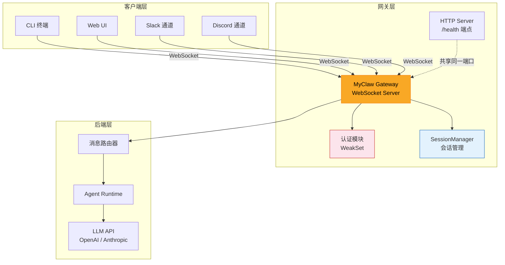
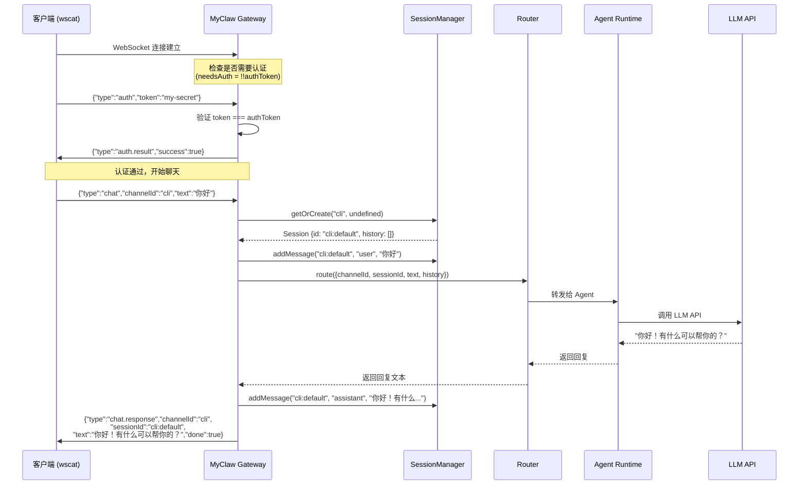
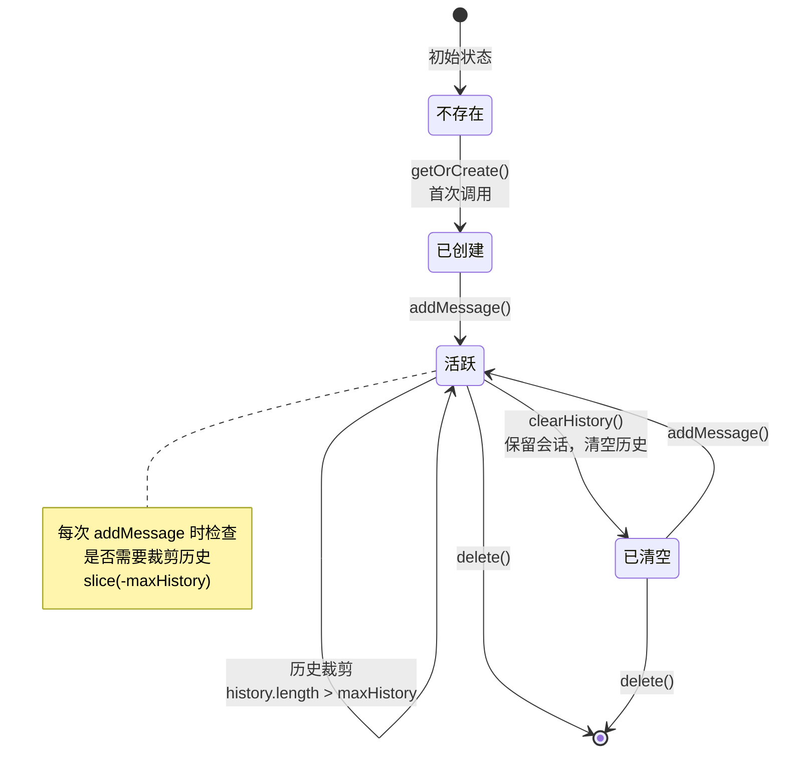
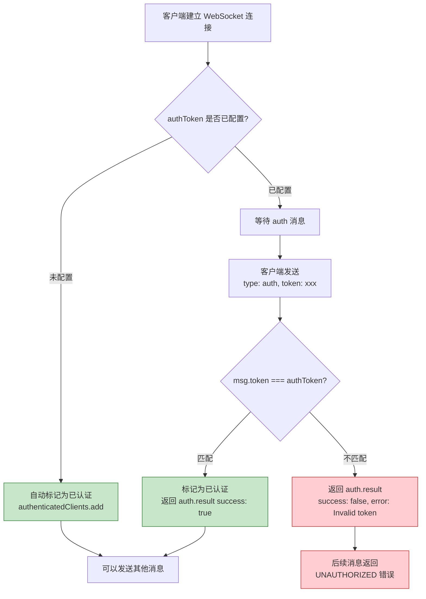

# 第五章：网关服务器

> 对应源文件：`src/gateway/server.ts`, `src/gateway/protocol.ts`, `src/gateway/session.ts`

## 网关是什么？为什么需要 WebSocket？

网关是 MyClaw 的**控制面（Control Plane）**。它是整个系统的交通枢纽 —— 所有的通道（Slack、Discord、CLI 等）都不会直接调用 LLM API，而是通过网关进行统一的消息路由、会话管理和认证控制。

为什么选择 WebSocket 而不是普通的 HTTP REST？原因有三：

1. **双向通信**：LLM 的回复可能需要流式推送（`chat.stream`），HTTP 做不到服务端主动推送
2. **持久连接**：通道一旦连接就保持在线，不需要每次请求都重新建立 TCP 连接
3. **低延迟**：省去了 HTTP 请求头的重复开销，消息体直接就是 JSON

下面这张架构图展示了网关在整个系统中的位置：



**关键设计思想**：网关把"如何连接外部世界"（通道层）和"如何思考回答"（Agent 层）完全解耦。你可以随时增加新的通道类型，而不需要修改 Agent 的任何代码。

---

## 消息协议详解

MyClaw 的所有通信都基于 JSON 消息，通过 `type` 字段区分消息种类。协议定义在 `src/gateway/protocol.ts` 中。

### 入站消息（客户端 → 网关）

| 类型 | `type` 值 | 关键字段 | 用途 |
|------|-----------|----------|------|
| 认证 | `"auth"` | `token: string` | 客户端身份验证 |
| 聊天 | `"chat"` | `channelId`, `text`, `sessionId?`, `metadata?` | 发送用户消息给 Agent |
| 通道发送 | `"channel.send"` | `channelId`, `text` | 通过网关向指定通道发送消息 |
| 心跳 | `"ping"` | （无） | 检测连接是否存活 |
| 状态查询 | `"status"` | （无） | 获取网关运行状态 |
| 工具结果 | `"tool.result"` | `toolCallId`, `result`, `approved` | 返回工具调用的执行结果 |

### 出站消息（网关 → 客户端）

| 类型 | `type` 值 | 关键字段 | 用途 |
|------|-----------|----------|------|
| 认证结果 | `"auth.result"` | `success`, `error?` | 告知认证是否通过 |
| 聊天回复 | `"chat.response"` | `channelId`, `sessionId`, `text`, `done` | 完整的 Agent 回复 |
| 流式回复 | `"chat.stream"` | `channelId`, `sessionId`, `delta` | 流式传输的部分回复 |
| 心跳响应 | `"pong"` | （无） | 对 ping 的回应 |
| 状态响应 | `"status.response"` | `channels[]`, `sessions`, `uptime` | 网关运行状态详情 |
| 错误 | `"error"` | `code`, `message` | 错误信息 |
| 工具调用 | `"tool.call"` | `toolCallId`, `name`, `args`, `requiresApproval` | Agent 请求调用工具 |

让我们来看看具体的接口定义，仔细阅读每一个字段：

```typescript
// src/gateway/protocol.ts

// --- 入站消息 ---

export interface AuthMessage {
  type: "auth";
  token: string;              // 网关认证令牌
}

export interface ChatMessage {
  type: "chat";
  channelId: string;           // 消息来源通道的唯一标识
  sessionId?: string;          // 可选的会话 ID，不传则使用默认会话
  text: string;                // 用户输入的文本
  metadata?: Record<string, unknown>;  // 可扩展的元数据
}

export interface ChannelSendMessage {
  type: "channel.send";
  channelId: string;           // 目标通道
  text: string;                // 要发送的文本
}

export interface PingMessage {
  type: "ping";                // 心跳检测，无需额外字段
}

export interface StatusRequest {
  type: "status";              // 请求网关状态
}

export interface ToolResultMessage {
  type: "tool.result";
  toolCallId: string;          // 对应 tool.call 的 ID
  result: string;              // 工具执行结果
  approved: boolean;           // 用户是否批准执行
}

// --- 出站消息 ---

export interface AuthResultMessage {
  type: "auth.result";
  success: boolean;            // 认证是否成功
  error?: string;              // 失败时的错误信息
}

export interface ChatResponseMessage {
  type: "chat.response";
  channelId: string;
  sessionId: string;           // 使用的会话 ID（包括自动生成的）
  text: string;                // Agent 的完整回复
  done: boolean;               // 是否是最终回复
}

export interface ChatStreamMessage {
  type: "chat.stream";
  channelId: string;
  sessionId: string;
  delta: string;               // 增量文本片段
}

export interface ErrorMessage {
  type: "error";
  code: string;                // 错误码，如 "PARSE_ERROR"、"UNAUTHORIZED"
  message: string;             // 人类可读的错误描述
}

// --- 联合类型 ---

export type GatewayMessage =
  | AuthMessage | ChatMessage | ChannelSendMessage
  | PingMessage | StatusRequest | ToolResultMessage;

export type GatewayResponse =
  | AuthResultMessage | ChatResponseMessage | ChatStreamMessage
  | PongMessage | StatusResponse | ErrorMessage | ToolCallMessage;
```

**为什么使用联合类型？** TypeScript 的联合类型（Union Types）配合 `type` 判别字段，让编译器能够在 `switch` 语句中自动推断具体类型。这就是所谓的"可辨识联合"（Discriminated Union），是 TypeScript 中处理多种消息类型的最佳实践。

### 典型交互：认证 + 聊天的完整流程

下面的时序图展示了一个客户端从连接到获得 AI 回复的完整过程：



---

## 会话管理：SessionManager 类

`SessionManager` 是网关的记忆中枢。它管理着每个通道中每个对话的历史记录，让 Agent 能够"记住"之前的对话内容。

### Session 数据结构

先看 `Session` 接口（定义在 `protocol.ts` 中）：

```typescript
export interface Session {
  id: string;                  // 唯一标识，格式为 "channelId:sessionId" 或 "channelId:default"
  channelId: string;           // 所属通道
  createdAt: number;           // 创建时间戳
  lastActiveAt: number;        // 最后活跃时间戳
  history: Array<{             // 对话历史
    role: "user" | "assistant";
    content: string;
  }>;
}
```

### SessionManager 完整实现

```typescript
// src/gateway/session.ts

export class SessionManager {
  private sessions = new Map<string, Session>();  // 所有会话的存储
  private maxHistory: number;                     // 历史消息上限

  constructor(maxHistory: number = 50) {
    this.maxHistory = maxHistory;
  }
```

**`sessions` 为什么用 `Map` 而不是普通对象？** `Map` 在频繁增删键值对的场景下性能更好，而且它的 `.size` 属性是 O(1) 的，不需要 `Object.keys().length`。

#### 获取或创建会话：getOrCreate

```typescript
  getOrCreate(channelId: string, sessionId?: string): Session {
    const id = sessionId ?? `${channelId}:default`;
    //        ^^^^^^^^^^^^^^^^^^^^^^^^^^^^^^^^
    //        如果客户端没有传 sessionId，就用 "channelId:default" 作为默认
    //        这意味着同一通道的消息默认共享一个会话

    let session = this.sessions.get(id);
    if (!session) {
      session = {
        id,
        channelId,
        createdAt: Date.now(),
        lastActiveAt: Date.now(),
        history: [],
      };
      this.sessions.set(id, session);
    }

    session.lastActiveAt = Date.now();  // 每次访问都更新活跃时间
    return session;
  }
```

这里有一个重要的设计细节：`sessionId` 是可选参数。如果客户端不传，系统会自动创建一个以 `channelId:default` 为 ID 的默认会话。这意味着：

- 简单的 CLI 客户端不需要关心会话 ID，同一通道的所有消息会自动归入同一个对话
- 高级客户端（比如支持多标签页的 Web UI）可以通过传递不同的 `sessionId` 来维护多个独立对话

#### 添加消息与历史裁剪：addMessage

```typescript
  addMessage(sessionId: string, role: "user" | "assistant", content: string): void {
    const session = this.sessions.get(sessionId);
    if (!session) return;       // 防御性编程：会话不存在就静默返回

    session.history.push({ role, content });

    // 关键：历史裁剪
    if (session.history.length > this.maxHistory) {
      session.history = session.history.slice(-this.maxHistory);
      //                                     ^^^^^^^^^^^^^^^^
      //  slice(-N) 保留最后 N 条消息，丢弃最早的消息
      //  这防止历史无限增长导致 token 超限或内存溢出
    }
  }
```

**为什么要裁剪历史？** LLM API 对上下文长度有限制（比如 128k tokens），而且越长的历史意味着越高的 API 费用。`maxHistory` 通常设置为 50 条消息（配置文件中 `agent.maxHistoryMessages`），保留足够的上下文又不会过度消耗资源。

#### 其他辅助方法

```typescript
  getAll(): Session[] {
    return Array.from(this.sessions.values());  // 返回所有活跃会话
  }

  get size(): number {
    return this.sessions.size;                  // getter 语法，用 sessions.size 访问
  }

  clearHistory(sessionId: string): void {
    const session = this.sessions.get(sessionId);
    if (session) {
      session.history = [];                     // 清空历史但保留会话本身
    }
  }

  delete(sessionId: string): void {
    this.sessions.delete(sessionId);            // 彻底删除会话
  }
}
```

### 会话生命周期图



---

## 网关服务器启动流程

`startGatewayServer` 是整个网关的入口函数，定义在 `src/gateway/server.ts` 中。它按照严格的顺序初始化各个子系统。让我们逐步拆解：

### 第一步：接收配置参数

```typescript
export interface GatewayOptions {
  config: OpenClawConfig;    // 完整的 MyClaw 配置对象
  host: string;              // 监听地址，如 "127.0.0.1"
  port: number;              // 监听端口，如 18789
  verbose: boolean;          // 是否输出调试日志
}

export async function startGatewayServer(opts: GatewayOptions): Promise<void> {
  const { config, host, port, verbose } = opts;
  const startTime = Date.now();   // 记录启动时间，用于计算 uptime
```

### 第二步：初始化三大子系统

```typescript
  // 1. 会话管理器 —— 管理对话历史
  const sessions = new SessionManager(config.agent.maxHistoryMessages);

  // 2. Agent 运行时 —— 负责调用 LLM API
  const agent = createAgentRuntime(config);

  // 3. 消息路由器 —— 根据配置规则决定消息如何处理
  const router = createRouter(config, agent);
```

这三个对象的关系是：消息进来后，通过 `sessions` 管理上下文，然后交给 `router`，`router` 内部调用 `agent` 来生成回复。

### 第三步：创建 HTTP 服务器（健康检查）

```typescript
  const httpServer = http.createServer((req, res) => {
    if (req.url === "/health") {
      res.writeHead(200, { "Content-Type": "application/json" });
      res.end(JSON.stringify({ status: "ok", uptime: Date.now() - startTime }));
      return;
    }
    res.writeHead(404);
    res.end();
  });
```

这个 HTTP 服务器非常简单，只有一个端点 `/health`。它的存在是为了让运维工具（如 Kubernetes、负载均衡器）能够检测网关是否正常运行。对于其他所有 HTTP 请求，一律返回 404。

### 第四步：创建 WebSocket 服务器

```typescript
  const wss = new WebSocketServer({ server: httpServer });
```

注意这里的关键技巧：WebSocket 服务器**复用了** HTTP 服务器的端口。`{ server: httpServer }` 参数告诉 `ws` 库：在 HTTP 服务器收到 WebSocket 升级请求时接管连接。这样，一个端口同时服务 HTTP 和 WebSocket 两种协议。

### 第五步：配置认证

```typescript
  const authToken = resolveSecret(config.gateway.token, config.gateway.tokenEnv);
  const authenticatedClients = new WeakSet<WebSocket>();
```

`resolveSecret` 函数会从配置文件的明文值或环境变量中解析出认证令牌。如果两者都没设置，`authToken` 为 `undefined`，此时网关不需要认证。

**为什么用 `WeakSet` 而不是 `Set`？** `WeakSet` 对元素持弱引用。当一个 WebSocket 连接断开并被垃圾回收时，它会自动从 `WeakSet` 中消失，不需要手动清理。这是防止内存泄漏的巧妙设计。

### 第六步：处理 WebSocket 连接

```typescript
  const clients = new Set<WebSocket>();   // 用于跟踪连接数

  wss.on("connection", (ws) => {
    clients.add(ws);
    const needsAuth = !!authToken;

    if (!needsAuth) {
      authenticatedClients.add(ws);       // 无需认证时，自动标记为已认证
    }

    // ... 消息处理逻辑（下一节详述）

    ws.on("close", () => {
      clients.delete(ws);
    });

    ws.on("error", (err) => {
      console.error(chalk.red(`[gateway] WebSocket error: ${err.message}`));
    });
  });
```

### 第七步：启动通道管理器

```typescript
  const channelManager = createChannelManager(config);
  await channelManager.startAll(router);
```

通道管理器会根据配置启动所有已启用的通道（Slack、Discord 等），并将它们连接到路由器。

### 第八步：开始监听

```typescript
  return new Promise((resolve) => {
    httpServer.listen(port, host, () => {
      console.log(chalk.bold.cyan(`\n🦀 MyClaw Gateway`));
      console.log(chalk.dim(`   WebSocket: ws://${host}:${port}`));
      console.log(chalk.dim(`   Health:    http://${host}:${port}/health`));
      console.log(chalk.dim(`   Auth:      ${authToken ? "enabled" : "disabled"}`));
      console.log(chalk.dim(`   Channels:  ${config.channels.filter((c) => c.enabled).length} active`));
      console.log(chalk.dim(`   Provider:  ${config.defaultProvider}\n`));
    });
  });
```

启动完成后，你会在终端看到 "MyClaw Gateway" 横幅和所有配置信息。函数返回一个永远不 resolve 的 Promise，让进程保持运行。

---

## 认证机制

MyClaw 网关采用**基于令牌的简单认证**。整个认证流程如下：



核心代码：

```typescript
// 认证处理
if (msg.type === "auth") {
  if (msg.token === authToken) {
    authenticatedClients.add(ws);
    send(ws, { type: "auth.result", success: true });
  } else {
    send(ws, { type: "auth.result", success: false, error: "Invalid token" });
  }
  return;   // auth 消息处理完毕，不走后续的 switch
}

// 所有非 auth 消息都必须先通过认证
if (needsAuth && !authenticatedClients.has(ws)) {
  send(ws, { type: "error", code: "UNAUTHORIZED", message: "Authenticate first" });
  return;
}
```

注意 `return` 语句的位置 —— `auth` 消息在处理完后直接返回，不会进入后面的 `switch`。而认证检查在 `switch` 之前，形成了一道"门卫"：未认证的客户端无法执行任何操作。

---

## 消息路由

通过认证后的消息，会进入一个 `switch` 语句进行路由。每种消息类型都有对应的处理逻辑：

### ping：心跳检测

```typescript
case "ping":
  send(ws, { type: "pong" });
  break;
```

最简单的消息类型。客户端定期发送 `ping`，网关回复 `pong`。用于检测连接是否存活。

### status：状态查询

```typescript
case "status": {
  const channelManager = createChannelManager(config);
  send(ws, {
    type: "status.response",
    channels: channelManager.getStatus(),   // 各通道连接状态
    sessions: sessions.size,                // 当前活跃会话数
    uptime: Date.now() - startTime,         // 运行时长（毫秒）
  });
  break;
}
```

返回网关的运行状态，包括每个通道是否连接、会话数量和运行时长。这对于监控和调试非常有用。

### chat：核心聊天流程

这是网关最核心的处理逻辑，值得逐行分析：

```typescript
case "chat": {
  // 1. 获取或创建会话
  const session = sessions.getOrCreate(msg.channelId, msg.sessionId);

  // 2. 将用户消息添加到会话历史
  sessions.addMessage(session.id, "user", msg.text);

  try {
    // 3. 将消息路由给 Agent
    const response = await router.route({
      channelId: msg.channelId,
      sessionId: session.id,
      text: msg.text,
      history: session.history.slice(0, -1),
      //       ^^^^^^^^^^^^^^^^^^^^^^^^^
      //       为什么是 slice(0, -1)？因为我们刚刚把 user 消息 push 进了 history，
      //       但 router 接收的 history 应该是"之前的"对话记录，
      //       当前消息已经通过 text 字段单独传递了。
    });

    // 4. 将 Agent 回复添加到会话历史
    sessions.addMessage(session.id, "assistant", response);

    // 5. 回复客户端
    send(ws, {
      type: "chat.response",
      channelId: msg.channelId,
      sessionId: session.id,
      text: response,
      done: true,
    });
  } catch (err) {
    // 6. 错误处理
    const error = err as Error;
    send(ws, {
      type: "error",
      code: "AGENT_ERROR",
      message: error.message,
    });
  }
  break;
}
```

`slice(0, -1)` 这个细节经常让初学者困惑。图解如下：

```
addMessage 之前的 history:  [msg1, msg2, msg3]
addMessage("user", "你好") 之后:  [msg1, msg2, msg3, "你好"]
传给 router 的 history:    [msg1, msg2, msg3]  ← slice(0, -1) 去掉最后一条
传给 router 的 text:       "你好"               ← 单独传递
```

### channel.send：通道转发

```typescript
case "channel.send": {
  if (verbose) {
    console.log(chalk.dim(`[gateway] Send to channel '${msg.channelId}': ${msg.text}`));
  }
  break;
}
```

用于通过网关向指定的通道发送消息。目前的教学版只做了日志记录，完整版中会调用通道管理器的发送接口。

### default：未知消息类型

```typescript
default:
  send(ws, {
    type: "error",
    code: "UNKNOWN_TYPE",
    message: `Unknown message type: ${(msg as { type: string }).type}`,
  });
```

对于协议中未定义的消息类型，返回明确的错误信息。注意这里需要 `as { type: string }` 类型断言，因为 TypeScript 的穷尽性检查（exhaustiveness check）认为 `default` 分支中的 `msg` 类型是 `never`。

---

## 健康检查端点

网关提供了一个简单的 HTTP GET 端点 `/health`：

```bash
$ curl http://127.0.0.1:18789/health
{"status":"ok","uptime":123456}
```

响应字段：
- `status`：固定为 `"ok"`，表示网关进程正常运行
- `uptime`：网关已运行的毫秒数

这个端点的用途：
- **容器编排**：Kubernetes 的 `livenessProbe` 可以定期访问此端点
- **负载均衡**：Nginx/HAProxy 可以根据此端点判断后端是否可用
- **运维监控**：Prometheus 等工具可以采集 uptime 数据

它之所以是 HTTP 而不是 WebSocket，是因为所有监控基础设施都原生支持 HTTP 健康检查。

---

## 发送工具函数

网关通过一个简洁的 `send` 函数来发送消息：

```typescript
function send(ws: WebSocket, msg: GatewayResponse): void {
  if (ws.readyState === WebSocket.OPEN) {
    ws.send(JSON.stringify(msg));
  }
}
```

**为什么要检查 `readyState`？** WebSocket 连接可能在异步操作（如等待 LLM 回复）过程中断开。如果不检查就直接 `ws.send()`，会抛出异常。`readyState === WebSocket.OPEN` 确保只在连接活跃时发送数据，是 WebSocket 编程的标准防御性模式。

---

## 错误处理模式

MyClaw 网关在多个层级捕获和处理错误：

### 1. JSON 解析错误

```typescript
try {
  msg = JSON.parse(data.toString());
} catch {
  send(ws, { type: "error", code: "PARSE_ERROR", message: "Invalid JSON" });
  return;
}
```

客户端发送了非法 JSON（比如拼写错误或传了二进制数据），网关返回 `PARSE_ERROR` 而不是崩溃。

### 2. 认证错误

```typescript
// token 不匹配
send(ws, { type: "auth.result", success: false, error: "Invalid token" });

// 未认证就发送消息
send(ws, { type: "error", code: "UNAUTHORIZED", message: "Authenticate first" });
```

### 3. Agent 调用错误

```typescript
try {
  const response = await router.route({ ... });
  // ...
} catch (err) {
  const error = err as Error;
  send(ws, { type: "error", code: "AGENT_ERROR", message: error.message });
}
```

LLM API 可能因为网络问题、API Key 无效、配额用尽等原因失败。网关将错误消息转发给客户端，而不是让整个进程崩溃。

### 4. WebSocket 连接错误

```typescript
ws.on("error", (err) => {
  console.error(chalk.red(`[gateway] WebSocket error: ${err.message}`));
});
```

连接层面的错误（网络中断、协议违规等）被记录到服务端日志。

### 5. 未知消息类型

```typescript
default:
  send(ws, { type: "error", code: "UNKNOWN_TYPE", message: `Unknown message type: ...` });
```

### 错误码汇总

| 错误码 | 含义 | 触发场景 |
|--------|------|----------|
| `PARSE_ERROR` | JSON 解析失败 | 客户端发送了非法 JSON |
| `UNAUTHORIZED` | 未认证 | 未发送 auth 消息或 token 错误后尝试操作 |
| `AGENT_ERROR` | Agent 调用失败 | LLM API 错误、网络超时等 |
| `UNKNOWN_TYPE` | 未知消息类型 | 客户端发送了协议中未定义的 type |

---

## 动手试一试：用 wscat 测试网关

`wscat` 是一个命令行 WebSocket 客户端，非常适合手动测试网关。

### 安装 wscat

```bash
npm install -g wscat
```

### 启动网关

```bash
npx tsx src/entry.ts gateway --verbose
```

你应该看到类似这样的输出：

```
🦀 MyClaw Gateway
   WebSocket: ws://127.0.0.1:18789
   Health:    http://127.0.0.1:18789/health
   Auth:      enabled
   Channels:  2 active
   Provider:  openai

[gateway] Waiting for connections...
```

### 测试健康检查

在另一个终端窗口中：

```bash
$ curl http://127.0.0.1:18789/health
{"status":"ok","uptime":5432}
```

### 连接 WebSocket 并测试

```bash
$ wscat -c ws://127.0.0.1:18789
Connected (press CTRL+C to quit)
```

#### 测试 1：心跳检测

```
> {"type":"ping"}
< {"type":"pong"}
```

#### 测试 2：未认证就聊天（应该被拒绝）

```
> {"type":"chat","channelId":"test","text":"hello"}
< {"type":"error","code":"UNAUTHORIZED","message":"Authenticate first"}
```

#### 测试 3：认证

```
> {"type":"auth","token":"your-token-here"}
< {"type":"auth.result","success":true}
```

如果 token 错误：

```
> {"type":"auth","token":"wrong-token"}
< {"type":"auth.result","success":false,"error":"Invalid token"}
```

#### 测试 4：发送聊天消息

```
> {"type":"chat","channelId":"test","text":"你好，介绍一下你自己"}
< {"type":"chat.response","channelId":"test","sessionId":"test:default","text":"你好！我是一个 AI 助手...","done":true}
```

#### 测试 5：多轮对话（会话保持）

```
> {"type":"chat","channelId":"test","text":"我叫小明"}
< {"type":"chat.response","channelId":"test","sessionId":"test:default","text":"你好小明！很高兴认识你...","done":true}

> {"type":"chat","channelId":"test","text":"你还记得我的名字吗？"}
< {"type":"chat.response","channelId":"test","sessionId":"test:default","text":"当然记得，你叫小明！...","done":true}
```

因为两次请求使用了相同的 `channelId` 且没有指定 `sessionId`，它们共享 `test:default` 会话，Agent 能够"记住"之前的对话。

#### 测试 6：查询网关状态

```
> {"type":"status"}
< {"type":"status.response","channels":[{"id":"cli","type":"cli","connected":true}],"sessions":1,"uptime":30000}
```

#### 测试 7：发送非法 JSON

```
> not json at all
< {"type":"error","code":"PARSE_ERROR","message":"Invalid JSON"}
```

#### 测试 8：发送未知消息类型

```
> {"type":"unknown_command"}
< {"type":"error","code":"UNKNOWN_TYPE","message":"Unknown message type: unknown_command"}
```

---

## 小结

本章我们深入学习了 MyClaw 网关服务器的三个核心模块：

| 模块 | 文件 | 职责 |
|------|------|------|
| 消息协议 | `src/gateway/protocol.ts` | 定义所有消息类型的 TypeScript 接口 |
| 会话管理 | `src/gateway/session.ts` | 管理对话历史，自动裁剪过长记录 |
| 网关服务器 | `src/gateway/server.ts` | 启动 HTTP/WebSocket 服务器，认证、路由消息 |

关键知识点回顾：

- **WebSocket vs HTTP**：WebSocket 提供双向持久连接，适合实时通信场景
- **可辨识联合**：用 `type` 字段区分消息类型，让 TypeScript 编译器帮你做类型检查
- **WeakSet 防泄漏**：用 `WeakSet` 跟踪已认证客户端，连接断开后自动清理
- **历史裁剪**：`slice(-maxHistory)` 保留最近的 N 条消息，控制上下文长度和成本
- **端口复用**：HTTP 和 WebSocket 共享同一端口，简化部署配置
- **防御性发送**：检查 `readyState` 后再发送，避免向已断开的连接写数据

---

**下一章**：[通道抽象](./06-channels.md) —— 让 MyClaw 连接任何消息平台
