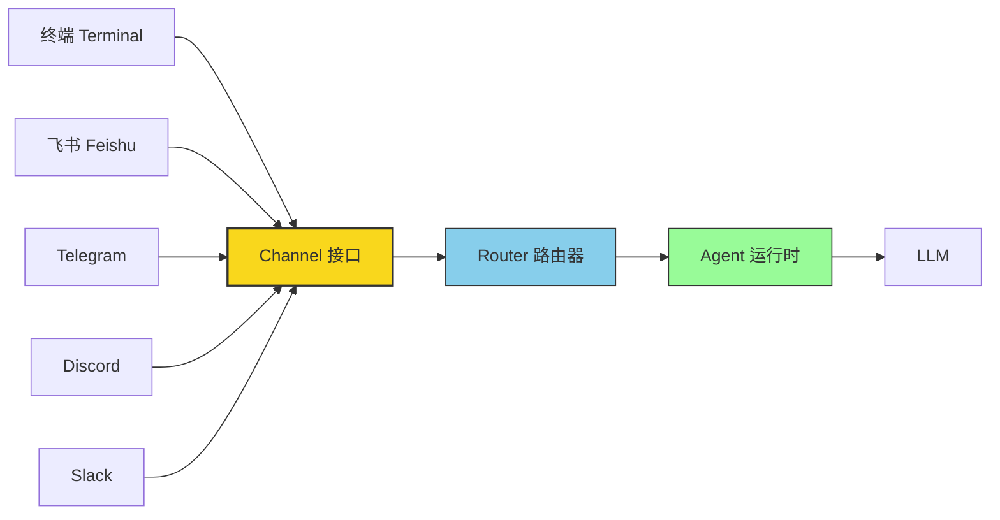
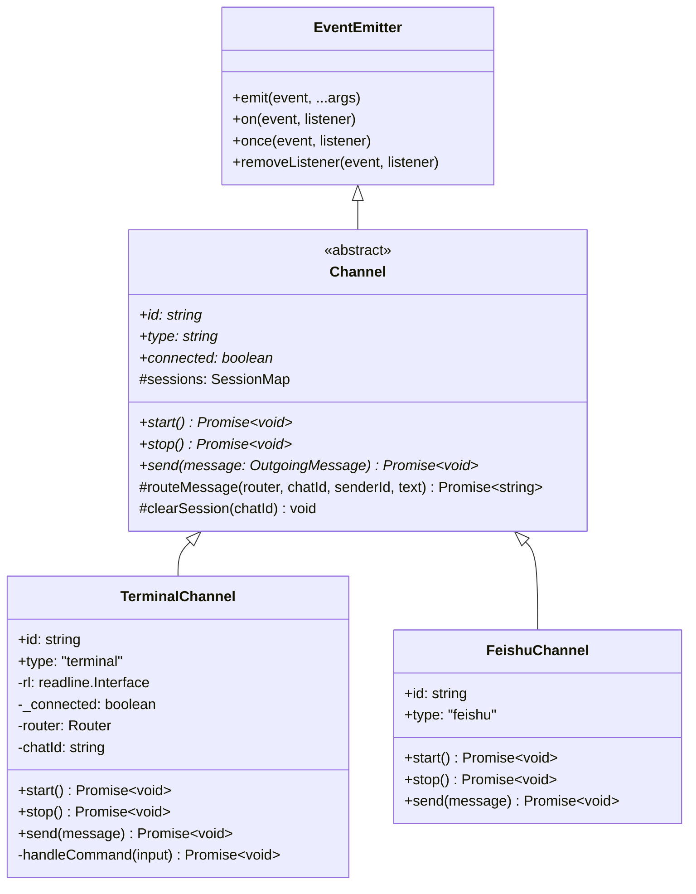
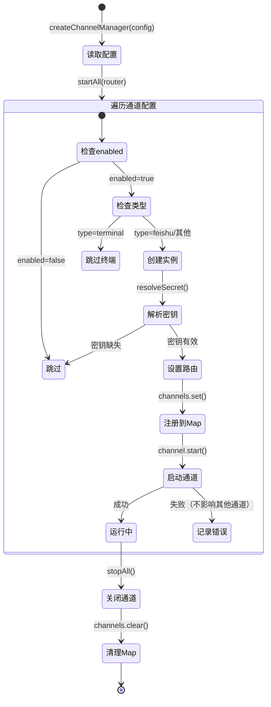

# 第六章：通道抽象（Channel Abstraction）

在前面的章节中，我们搭建了 CLI 框架、配置系统、网关服务器和 Agent 运行时。现在我们面临一个关键的架构问题：**如何让同一个 AI Agent 同时服务于终端、飞书、Telegram、Discord、Slack 等完全不同的消息平台？**

如果为每个平台单独编写一套消息处理逻辑，代码很快就会变成一团乱麻。我们需要一种优雅的方式，让 Agent 完全不关心消息来自哪里——这就是**通道抽象**要解决的问题。

## 为什么需要通道抽象？

想象一下没有通道抽象的世界：你的 Agent 代码里充满了 `if (platform === 'telegram') { ... } else if (platform === 'feishu') { ... }` 这样的分支判断。每新增一个平台，所有相关代码都要修改。这显然违反了开闭原则（Open-Closed Principle）。

通道抽象的核心思想是：**在多样的消息平台和统一的 Agent 之间插入一个标准化的中间层。**



不管用户是从终端输入、从飞书发消息，还是通过 Telegram Bot 对话，对 Agent 来说都是同一件事——收到一条 `IncomingMessage`，返回一条 `OutgoingMessage`。平台差异（协议、认证、消息格式）全部封装在各自的 Channel 实现中。

## 关键文件

| 文件 | 作用 |
| --- | --- |
| `src/channels/transport.ts` | 定义 Channel 抽象类和消息接口——整个通道系统的"契约" |
| `src/channels/terminal.ts` | 终端通道实现——基于 readline 的交互式聊天 |
| `src/channels/manager.ts` | 通道管理器——编排多个通道的生命周期 |

让我们逐一深入学习。

---

## 消息接口：IncomingMessage 与 OutgoingMessage

通道抽象的第一步是定义统一的消息格式。无论消息来自哪个平台，进入系统后都被"翻译"成相同的数据结构。

```typescript
// src/channels/transport.ts

/**
 * 传入消息 —— 从通道接收到的用户消息
 */
export interface IncomingMessage {
  channelId: string;                     // 通道标识符，如 "terminal"、"feishu"
  sessionId: string;                     // 会话 ID，用于维持对话上下文
  senderId: string;                      // 发送者标识
  text: string;                          // 消息文本
  timestamp: number;                     // 时间戳
  metadata?: Record<string, unknown>;    // 可扩展的元数据
}

/**
 * 传出消息 —— 要发送回通道的回复
 */
export interface OutgoingMessage {
  channelId: string;
  sessionId: string;
  text: string;
  metadata?: Record<string, unknown>;
}
```

仔细观察这两个接口的区别：

- **`IncomingMessage`** 多了 `senderId` 和 `timestamp`——因为系统需要知道"是谁在什么时候发了这条消息"。
- **`OutgoingMessage`** 更简洁——系统只需要知道"把什么内容发到哪个通道的哪个会话"。

`metadata` 字段的类型是 `Record<string, unknown>`，这是一个重要的设计决策。不同平台有不同的特有信息（比如 Telegram 的 chat_id、飞书的 open_id），通过 `metadata` 可以携带这些平台特定的数据，而不需要修改核心接口。这就是**可扩展设计**的典范。

---

## Channel 抽象类

有了统一的消息格式，接下来就是通道本身的抽象。`Channel` 是一个抽象类，继承自 Node.js 的 `EventEmitter`：

```typescript
// src/channels/transport.ts

/**
 * 通道事件定义
 */
export interface ChannelEvents {
  message: (msg: IncomingMessage) => void;    // 收到用户消息
  connected: () => void;                       // 通道连接成功
  disconnected: (reason?: string) => void;     // 通道断开连接
  error: (error: Error) => void;               // 发生错误
}

/**
 * Channel 抽象类 —— 每个消息平台都要实现它
 */
export abstract class Channel extends EventEmitter {
  abstract readonly id: string;           // 通道唯一标识
  abstract readonly type: string;         // 通道类型（terminal / feishu / ...）
  abstract readonly connected: boolean;   // 是否已连接

  /** 共享会话存储：chatId → 对话历史 */
  protected sessions: SessionMap = new Map();

  /** 启动通道（连接、认证等） */
  abstract start(): Promise<void>;

  /** 停止通道 */
  abstract stop(): Promise<void>;

  /** 发送消息到通道 */
  abstract send(message: OutgoingMessage): Promise<void>;

  /** 通用路由逻辑：构建 RouteRequest、管理历史、调用 router */
  protected routeMessage(
    router: Router,
    chatId: string,
    senderId: string,
    text: string
  ): Promise<string>;

  /** 清除指定 chatId 的会话历史 */
  protected clearSession(chatId: string): void;
}
```

我们用 Mermaid 类图来直观地展示这个继承体系：



### 为什么继承 EventEmitter？

这是一个值得深入理解的设计选择。通道本质上是一个**异步的、事件驱动的组件**——用户随时可能发消息，连接随时可能断开。使用事件模型（而非回调或轮询），让通道可以：

1. **解耦通知与处理**：通道只负责 `emit` 事件，谁来处理、怎么处理，通道不关心。
2. **支持多个监听者**：多个模块可以同时监听同一个事件（比如日志模块和路由模块都监听 `message` 事件）。
3. **自然地表达状态变化**：`connected`、`disconnected`、`error` 这些事件天然适合用 EventEmitter 表达。

### ChannelEvents 接口

`ChannelEvents` 接口定义了通道可以发出的四种事件：

| 事件 | 触发时机 | 回调参数 |
| --- | --- | --- |
| `message` | 收到用户消息时 | `IncomingMessage` 对象 |
| `connected` | 通道成功启动/连接时 | 无 |
| `disconnected` | 通道断开连接时 | 可选的原因字符串 |
| `error` | 发生错误时 | `Error` 对象 |

虽然 TypeScript 的 `EventEmitter` 默认不会强制类型检查事件名和参数，但定义 `ChannelEvents` 接口起到了**文档化**和**约定俗成**的作用——所有 Channel 实现都应该发出这些事件，监听者也知道该期望什么参数。

### 三个核心方法

Channel 抽象类只要求实现三个方法，简洁到了极致：

- **`start()`**：启动通道。对终端来说是开始监听 stdin 输入；对飞书来说是启动 Webhook 服务器并完成 OAuth 认证。返回 `Promise<void>`，因为启动过程通常是异步的。
- **`stop()`**：优雅地关闭通道，释放所有资源（关闭连接、清理定时器等）。
- **`send(message)`**：向通道发送一条消息。对终端来说是 `console.log`；对飞书来说是调用发送消息 API。

这种"最小接口"的设计哲学非常重要——接口越小，实现新通道的门槛就越低。

---

## 终端通道：完整实现剖析

`TerminalChannel` 是 MyClaw 中最简单也是最直观的通道实现。它基于 Node.js 的 `readline` 模块，在终端中提供交互式聊天体验。让我们逐段分析它的完整代码。

### 类定义与构造函数

```typescript
// src/channels/terminal.ts

export class TerminalChannel extends Channel {
  readonly id: string;
  readonly type = "terminal";
  private rl: readline.Interface | null = null;
  private _connected = false;
  private router: Router;
  private config: ChannelConfig;
  private agentName: string;
  private chatId = "terminal";

  constructor(config: ChannelConfig, router: Router, agentName: string) {
    super();
    this.id = config.id;
    this.config = config;
    this.router = router;
    this.agentName = agentName;
  }

  get connected(): boolean {
    return this._connected;
  }
```

几个要点：

1. **`type = "terminal"` 是字面量类型**——这不是普通的字符串，而是 TypeScript 的字面量类型，确保 type 只能是 `"terminal"`。
2. **`rl` 初始化为 `null`**——readline 接口在 `start()` 时才创建，这遵循了"延迟初始化"的原则。
3. **`_connected` 用 private 前缀**——通过 getter 暴露只读的 `connected` 属性，外部只能查询不能修改。
4. **`chatId = "terminal"`**——终端场景下只有一个用户，所以使用固定的 chatId。会话历史通过基类的 `sessions` Map 以此 chatId 为键来存储。

### 启动流程：start() 方法

`start()` 是整个终端通道的核心，它建立了一个完整的交互循环：

```typescript
async start(): Promise<void> {
    // 第一步：创建 readline 接口
    this.rl = readline.createInterface({
      input: process.stdin,
      output: process.stdout,
    });

    // 第二步：标记连接状态并发出事件
    this._connected = true;
    this.emit("connected");

    // 第三步：打印问候语
    if (this.config.greeting) {
      console.log(chalk.cyan(`\n${this.agentName}: ${this.config.greeting}\n`));
    }

    // 第四步：主输入循环（见下方详解）
    const prompt = () => {
      this.rl?.question(chalk.green("You: "), async (input) => {
        // ... 处理用户输入
        prompt(); // 递归调用，形成循环
      });
    };

    prompt();

    // 第五步：优雅处理 Ctrl+C
    this.rl.on("close", () => {
      console.log(chalk.dim("\nGoodbye! 👋\n"));
      this._connected = false;
      this.emit("disconnected", "user closed");
      process.exit(0);
    });
  }
```

这里有一个巧妙的模式值得学习——**递归式输入循环**。`prompt()` 函数在处理完一条输入后，再次调用自己，形成一个永不停歇的对话循环。这比 `while(true)` 更适合 Node.js 的异步模型，因为 `readline.question()` 本身就是异步的。

### 消息处理流程

当用户输入一条普通消息（非命令）时，处理流程如下：

```typescript
// 1. 显示 Agent 名称前缀（不换行，等待回复内容）
process.stdout.write(chalk.cyan(`\n${this.agentName}: `));

// 2. 调用基类的 routeMessage，自动管理历史和路由
const response = await this.routeMessage(this.router, this.chatId, "terminal", text);
console.log(response + "\n");
```

基类的 `routeMessage` 方法封装了路由请求的构造、对话历史的管理（记录用户消息和 Agent 回复）以及事件的触发。子类不再需要手动构建 `RouteRequest` 或维护 `history` 数组——这些通用逻辑全部由基类统一处理。

### stop() 和 send() 方法

```typescript
async stop(): Promise<void> {
    this.rl?.close();
    this._connected = false;
    this.emit("disconnected", "stopped");
  }

  async send(message: OutgoingMessage): Promise<void> {
    console.log(chalk.cyan(`${this.agentName}: ${message.text}`));
  }
```

`stop()` 关闭 readline 接口、更新状态、发出断开事件——典型的资源清理三步曲。

`send()` 对终端来说非常简单——直接打印到控制台。但对于其他通道（比如飞书），这里可能是一次 HTTP API 调用。

---

## 内置命令系统

终端通道内置了五个斜杠命令，提供了实用的调试和控制能力：

```typescript
private async handleCommand(input: string): Promise<void> {
    const [cmd, ...args] = input.split(" ");

    switch (cmd) {
      case "/help":
        console.log(chalk.dim("\nAvailable commands:"));
        console.log(chalk.dim("  /help    - Show this help"));
        console.log(chalk.dim("  /clear   - Clear conversation history"));
        console.log(chalk.dim("  /history - Show conversation history"));
        console.log(chalk.dim("  /status  - Show status"));
        console.log(chalk.dim("  /quit    - Exit\n"));
        break;

      case "/clear":
        this.clearSession(this.chatId);
        console.log(chalk.dim("\nConversation history cleared.\n"));
        break;

      case "/history":
        const history = this.sessions.get(this.chatId) ?? [];
        if (history.length === 0) {
          console.log(chalk.dim("\nNo history yet.\n"));
        } else {
          console.log(chalk.dim("\nConversation history:"));
          for (const msg of history) {
            const prefix = msg.role === "user" ? "You" : this.agentName;
            const color = msg.role === "user" ? chalk.green : chalk.cyan;
            const truncated =
              msg.content.length > 100
                ? msg.content.slice(0, 100) + "..."
                : msg.content;
            console.log(color(`  ${prefix}: ${truncated}`));
          }
          console.log();
        }
        break;

      case "/status":
        console.log(chalk.dim(`\n  Channel: ${this.id} (${this.type})`));
        console.log(chalk.dim(`  Session: ${this.chatId}`));
        console.log(chalk.dim(`  History: ${(this.sessions.get(this.chatId) ?? []).length} messages\n`));
        break;

      case "/quit":
      case "/exit":
        await this.stop();
        process.exit(0);
        break;

      default:
        console.log(chalk.yellow(`\nUnknown command: ${cmd}. Type /help for available commands.\n`));
    }
  }
```

| 命令 | 功能 | 技术细节 |
| --- | --- | --- |
| `/help` | 显示所有可用命令 | 纯文本输出，使用 `chalk.dim` 降低视觉权重 |
| `/clear` | 清空对话历史 | 调用 `this.clearSession(this.chatId)` 清除当前会话，开始全新对话 |
| `/history` | 查看对话历史 | 通过 `this.sessions.get(this.chatId)` 获取历史，每条消息截断到 100 字符，用颜色区分 user/assistant |
| `/status` | 显示通道状态 | 输出通道 ID、类型、chatId、历史消息数 |
| `/quit` / `/exit` | 退出程序 | 先调用 `stop()` 清理资源，再 `process.exit(0)` |

命令解析的实现也值得学习：`const [cmd, ...args] = input.split(" ")` 使用了解构赋值和剩余参数，一行代码就完成了命令名和参数的分离。虽然当前内置命令都不需要参数，但 `args` 的存在为未来扩展留了口子。

### 工厂函数

终端通道还提供了一个工厂函数，简化创建过程：

```typescript
export function createTerminalChannel(
  config: OpenClawConfig,
  router: Router
): TerminalChannel {
  const channelConfig = config.channels.find(
    (c) => c.type === "terminal" && c.enabled
  ) ?? {
    id: "terminal",
    type: "terminal" as const,
    enabled: true,
    greeting: `Hello! I'm ${config.agent.name}. How can I help you?`,
  };

  return new TerminalChannel(channelConfig, router, config.agent.name);
}
```

这里用了 `??`（空值合并运算符）提供默认配置——即使用户没有在配置文件中定义终端通道，系统也能正常工作。`as const` 断言确保 `type` 的类型是字面量 `"terminal"` 而非宽泛的 `string`。

---

## 通道管理器（ChannelManager）

在实际运行时，系统可能同时启用多个通道（比如终端 + 飞书）。`ChannelManager` 负责统一管理这些通道的生命周期。

### 接口定义

```typescript
// src/channels/manager.ts

export interface ChannelManager {
  startAll(router: Router): Promise<void>;
  stopAll(): Promise<void>;
  getChannel(id: string): Channel | undefined;
  getStatus(): Array<{ id: string; type: string; connected: boolean }>;
}
```

四个方法，职责清晰：

- `startAll()`：启动所有已配置的通道
- `stopAll()`：关闭所有通道
- `getChannel()`：按 ID 查找特定通道
- `getStatus()`：获取所有通道的运行状态

### 生命周期

用 Mermaid 图展示 ChannelManager 管理通道的完整生命周期：



### 实现详解

```typescript
export function createChannelManager(config: OpenClawConfig): ChannelManager {
  const channels = new Map<string, Channel>();

  return {
    async startAll(router: Router): Promise<void> {
      for (const channelConfig of config.channels) {
        // 跳过未启用的通道
        if (!channelConfig.enabled) continue;
        // 终端通道由 agent 命令单独处理，不在这里管理
        if (channelConfig.type === "terminal") continue;

        try {
          switch (channelConfig.type) {
            case "feishu": {
              // 解析飞书应用凭证
              const appId = resolveSecret(
                channelConfig.appId,
                channelConfig.appIdEnv
              );
              const appSecret = resolveSecret(
                channelConfig.appSecret,
                channelConfig.appSecretEnv
              );
              if (!appId || !appSecret) {
                console.warn(
                  chalk.yellow(
                    `[channels] Skipping '${channelConfig.id}': missing App ID or App Secret`
                  )
                );
                continue;
              }
              // 创建飞书通道实例
              const feishu = new FeishuChannel(channelConfig, appId, appSecret);
              feishu.setRouter(router);
              channels.set(channelConfig.id, feishu);
              await feishu.start();
              break;
            }
            default:
              console.warn(
                chalk.yellow(
                  `[channels] Unknown channel type: ${channelConfig.type}`
                )
              );
          }
        } catch (err) {
          // 关键：单个通道启动失败不影响其他通道
          console.error(
            chalk.red(
              `[channels] Failed to start '${channelConfig.id}': ${(err as Error).message}`
            )
          );
        }
      }
    },

    async stopAll(): Promise<void> {
      for (const [id, channel] of channels) {
        try {
          await channel.stop();
        } catch (err) {
          // 同样：单个通道关闭失败不影响其他通道
          console.error(
            chalk.red(
              `[channels] Error stopping '${id}': ${(err as Error).message}`
            )
          );
        }
      }
      channels.clear();
    },

    getChannel(id: string): Channel | undefined {
      return channels.get(id);
    },

    getStatus(): Array<{ id: string; type: string; connected: boolean }> {
      return Array.from(channels.values()).map((ch) => ({
        id: ch.id,
        type: ch.type,
        connected: ch.connected,
      }));
    },
  };
}
```

这段代码有几个值得关注的设计细节：

**1. 闭包模式代替 class**

`createChannelManager` 返回一个对象字面量，`channels` Map 通过闭包被私有化。这比用 class + private 字段更简洁，也是 JavaScript/TypeScript 中常见的模块模式。

**2. 终端通道的特殊处理**

注意 `if (channelConfig.type === "terminal") continue;` 这一行——终端通道不由 ChannelManager 管理，而是由 `agent` CLI 命令直接创建。这是因为终端通道需要独占 stdin/stdout，它的生命周期和 CLI 进程绑定。

**3. resolveSecret 的安全设计**

通道凭证（如飞书的 appId、appSecret）通过 `resolveSecret()` 解析。这个函数支持直接值和环境变量两种方式，避免了在配置文件中硬编码敏感信息。

**4. 容错的 try/catch**

每个通道的启动和关闭都包裹在独立的 try/catch 中——飞书通道启动失败不会影响其他通道。这种"隔离故障"的设计在多组件系统中至关重要。

---

## 设计原则总结

MyClaw 的通道抽象体现了几个重要的软件设计原则：

### 1. 面向接口编程

路由器和 Agent 只依赖 `Channel` 抽象类和 `IncomingMessage` / `OutgoingMessage` 接口，完全不知道消息来自哪个平台。新增平台只需要新增一个 Channel 实现，无需修改任何已有代码。

### 2. 事件驱动架构

继承 `EventEmitter` 让通道可以异步通知系统各种状态变化（连接、断开、错误、消息）。事件模型天然适合处理 I/O 密集的消息通信场景，也让系统各组件之间保持松耦合。

### 3. 容错设计

ChannelManager 的实现体现了"让它崩"的哲学——单个通道的故障被完全隔离，不会扩散到其他通道。每个通道的 `start()` 和 `stop()` 都有独立的错误处理。

### 4. 最小接口原则

Channel 抽象类只有 3 个属性和 3 个方法——这是有意为之的。接口越小，实现新通道的成本就越低，也越不容易出错。如果某个平台需要额外的能力（比如发送图片），可以通过 `metadata` 字段或子类扩展来实现。

---

## 教学实践：如何实现一个新通道

假设我们要为 MyClaw 添加一个 Discord 通道，以下是具体步骤：

### 第一步：创建通道文件

在 `src/channels/` 目录下创建 `discord.ts`。

### 第二步：继承 Channel 抽象类

```typescript
// src/channels/discord.ts
import { Channel, type OutgoingMessage } from "./transport.js";

export class DiscordChannel extends Channel {
  readonly id: string;
  readonly type = "discord";
  private _connected = false;

  constructor(id: string, private token: string) {
    super();
    this.id = id;
  }

  get connected(): boolean {
    return this._connected;
  }

  async start(): Promise<void> {
    // 1. 用 token 连接到 Discord Gateway
    // 2. 监听消息事件
    // 3. 收到消息时，构造 IncomingMessage 并 emit("message", msg)
    this._connected = true;
    this.emit("connected");
  }

  async stop(): Promise<void> {
    // 断开 Discord 连接，清理资源
    this._connected = false;
    this.emit("disconnected", "stopped");
  }

  async send(message: OutgoingMessage): Promise<void> {
    // 调用 Discord API 发送消息
    // 从 message.metadata 中获取 Discord 特定的信息（如 channel_id）
  }
}
```

### 第三步：在 ChannelManager 中注册

在 `manager.ts` 的 `startAll()` 方法的 switch 语句中添加 `"discord"` 分支：

```typescript
case "discord": {
  const token = resolveSecret(channelConfig.botToken, channelConfig.botTokenEnv);
  if (!token) {
    console.warn(`[channels] Skipping '${channelConfig.id}': no bot token`);
    continue;
  }
  const discord = new DiscordChannel(channelConfig.id, token);
  discord.setRouter(router);
  channels.set(channelConfig.id, discord);
  await discord.start();
  break;
}
```

### 第四步：在配置文件中启用

```yaml
channels:
  - id: my-discord
    type: discord
    enabled: true
    botTokenEnv: DISCORD_BOT_TOKEN
```

就这么简单。因为 Channel 的接口足够精简，一个新通道的核心实现通常只需要几十行代码——剩下的只是平台 SDK 的调用。路由器、Agent、消息处理等所有上游模块完全不需要修改。

---

## 下一步

现在我们有了统一的通道抽象，消息可以从任何平台进入系统。但消息进来之后，如何决定把它交给哪个 Agent/Provider 处理？下一章我们将学习**消息路由**——MyClaw 的调度中枢。

[下一章: 消息路由 >>](07-message-routing.md)
