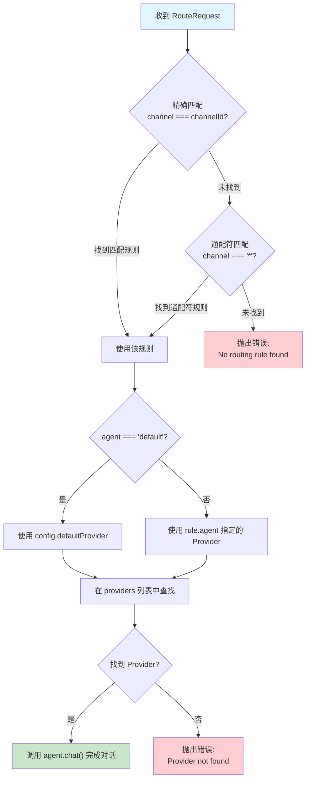
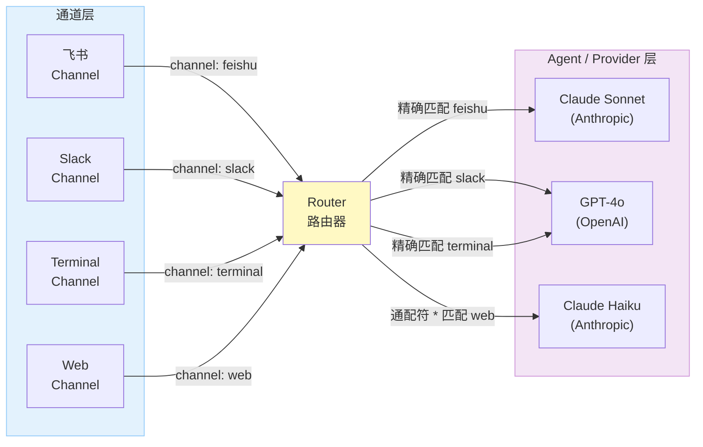
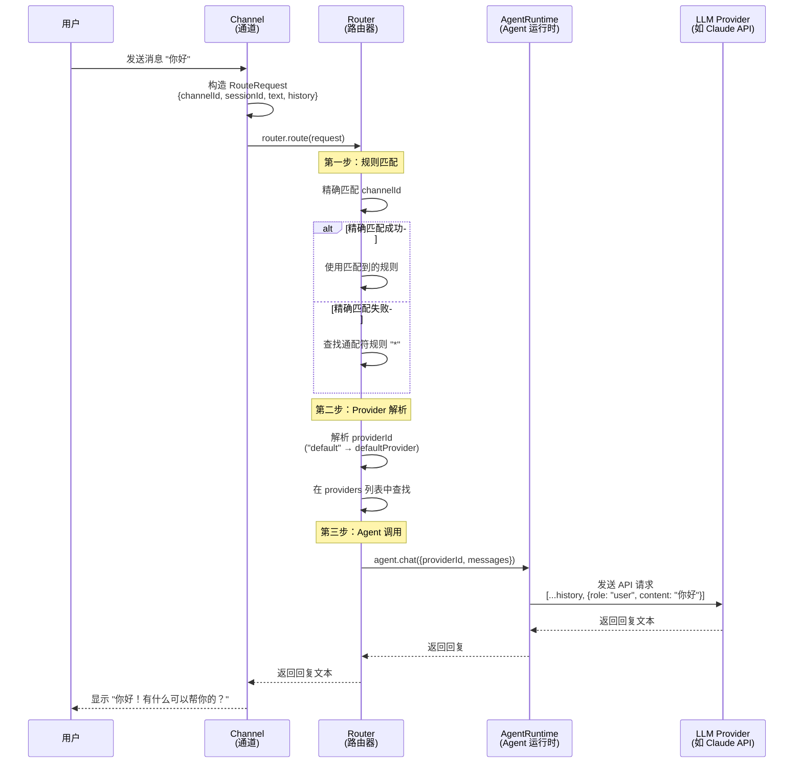

# Chapter 7: 消息路由

上一章我们建立了通道抽象，让不同消息平台能统一接入系统。但当一条消息进来后，系统怎么知道该把它交给哪个 AI Provider 处理呢？这就是**消息路由（Message Routing）**要解决的问题。

你可以把路由器想象成一个"交通指挥员"——它站在所有通道和所有 Agent 之间，根据预定义的规则，决定每条消息的去向。

## 路由决策流程

在深入代码之前，先看一下路由器收到一条消息后的决策过程：



这个流程图展示了 MyClaw 路由的核心逻辑——**分层匹配（Hierarchical Matching）**策略。它按优先级依次尝试三个层级：

| 优先级 | 匹配方式 | 说明 |
| --- | --- | --- |
| 1 | 精确匹配 | `channel === "feishu"` 这样的一对一匹配 |
| 2 | 通配符匹配 | `channel === "*"` 作为兜底规则 |
| 3 | 报错 | 两者都没命中，说明配置有缺漏 |

这种设计让你可以灵活配置：比如飞书用 Claude，终端用 GPT-4，其余通道用默认 Provider。

## 关键文件

| 文件 | 作用 |
| --- | --- |
| `src/routing/router.ts` | 路由器实现，包含路由请求接口、路由器接口和匹配逻辑 |

## RouteRequest 接口：路由的输入

每条需要路由的消息都被封装成一个 `RouteRequest`，它携带了路由决策所需的全部信息：

```typescript
// src/routing/router.ts

export interface RouteRequest {
  channelId: string;    // 消息来自哪个通道
  sessionId: string;    // 会话 ID
  text: string;         // 用户发送的文本
  history: Array<{ role: "user" | "assistant"; content: string }>;  // 对话历史
}
```

为什么需要这四个字段？让我们逐一理解：

- **`channelId`** —— 这是路由决策的**核心依据**。路由器根据它来查找匹配的路由规则。例如 `"feishu"` 或 `"terminal"`。
- **`sessionId`** —— 用于区分不同的对话会话。同一个通道上可能有多个用户在同时对话，`sessionId` 确保它们不会混淆。
- **`text`** —— 用户的当前输入，最终会被拼接到消息列表末尾发送给 LLM。
- **`history`** —— 之前的对话记录。LLM 需要它来理解上下文，才能给出连贯的回复。

> **设计思考**：为什么 `RouteRequest` 不直接携带 Provider 信息？因为"决定用哪个 Provider"正是路由器的职责。调用方只需要说"这条消息来自 feishu"，路由器自己会查表决定路由到哪里。这就是**关注点分离**的体现。

## Router 接口：路由器的契约

```typescript
// src/routing/router.ts

export interface Router {
  route(request: RouteRequest): Promise<string>;
}
```

`Router` 接口极其简洁——只有一个 `route()` 方法。它接收一个 `RouteRequest`，返回一个 `Promise<string>`（AI 的回复文本）。

这个接口的简洁性是刻意为之的：

- **对调用方而言**：你只需要调用 `router.route(request)`，不用关心内部用了哪个 Provider、怎么匹配的规则、怎么调用的 LLM。
- **对实现方而言**：只要满足这个签名，你可以自由实现任何路由策略——基于通道、基于内容、基于负载，甚至随机路由。

## 路由器实现详解

`createRouter()` 是一个工厂函数，接收配置和 Agent Runtime，返回一个 `Router` 实例。让我们完整地阅读它的实现，然后逐步拆解：

```typescript
// src/routing/router.ts

export function createRouter(
  config: OpenClawConfig,
  agent: AgentRuntime
): Router {
  // 从配置中读取路由规则
  const rules = config.routing;

  return {
    async route(request: RouteRequest): Promise<string> {
      // 分层匹配：先精确匹配，再通配符匹配
      const rule =
        rules.find((r) => r.channel === request.channelId) ??
        rules.find((r) => r.channel === "*");

      if (!rule) {
        throw new Error(
          `No routing rule found for channel '${request.channelId}'`
        );
      }

      // 确定 Provider
      const providerId = rule.agent === "default"
        ? config.defaultProvider
        : rule.agent;

      const provider = config.providers.find((p) => p.id === providerId);
      if (!provider) {
        throw new Error(`Provider '${providerId}' not found in config`);
      }

      // 调用 Agent 进行对话
      return agent.chat({
        providerId: provider.id,
        messages: [
          ...request.history,
          { role: "user", content: request.text },
        ],
      });
    },
  };
}
```

这段代码虽然不长，但每一部分都有明确的职责。接下来我们按"三步路由"来拆解。

## 三步路由：从规则匹配到 LLM 调用

整个路由过程可以清晰地分为三步：**规则匹配 → Provider 解析 → Agent 调用**。

### 第一步：规则匹配（Rule Matching）

```typescript
const rule =
  rules.find((r) => r.channel === request.channelId) ??   // 精确匹配
  rules.find((r) => r.channel === "*");                    // 通配符匹配
```

这里使用了 JavaScript 的 `??`（空值合并运算符）实现了两层查找：

1. **第一轮 `find()`**：遍历 `rules` 数组，查找 `channel` 字段与 `request.channelId` 完全相等的规则。如果找到了，就直接用它。
2. **第二轮 `find()`**：只有当第一轮返回 `undefined` 时才执行。这次查找 `channel === "*"` 的通配符规则，作为兜底。
3. **都没找到**：`rule` 为 `undefined`，接下来的 `if (!rule)` 会抛出描述性错误。

> **教学要点**：`??` 和 `||` 的区别在于，`??` 只在左侧为 `null` 或 `undefined` 时才取右侧值。这里用 `??` 比 `||` 更精确，因为 `find()` 返回的是 `undefined`（而不是 `false` 或空字符串）。

### 第二步：Provider 解析（Provider Resolution）

```typescript
const providerId = rule.agent === "default"
  ? config.defaultProvider    // "default" 映射到配置中的 defaultProvider
  : rule.agent;               // 否则直接使用指定的 provider ID

const provider = config.providers.find((p) => p.id === providerId);
if (!provider) {
  throw new Error(`Provider '${providerId}' not found in config`);
}
```

路由规则中的 `agent` 字段支持两种写法：

| 写法 | 含义 | 示例 |
| --- | --- | --- |
| `"default"` | 使用配置文件中 `defaultProvider` 指定的 Provider | 方便统一管理 |
| 具体 ID | 直接指定某个 Provider | `"anthropic"`、`"openai"` |

解析出 `providerId` 后，还要在 `config.providers` 列表中查找对应的 Provider 配置。如果找不到，说明配置文件有错误，立即报错。这种"快速失败"的策略能帮你尽早发现配置问题。

### 第三步：Agent 调用（Agent Invocation）

```typescript
return agent.chat({
  providerId: provider.id,
  messages: [
    ...request.history,                      // 对话历史
    { role: "user", content: request.text }, // 当前用户输入
  ],
});
```

这一步将对话历史和当前消息拼接成完整的消息列表，通过 Agent Runtime 发送给指定的 LLM Provider。

注意消息列表的构造方式：`...request.history` 展开了之前的对话记录，然后追加当前用户输入。这样 LLM 能看到完整的对话上下文，给出连贯的回复。

## 路由规则配置

路由规则在配置文件 `myclaw.yaml` 中定义。下面通过几个常见模式来展示配置方法。

### 模式一：所有通道使用同一个 Agent

最简单的配置——一条通配符规则搞定一切：

```yaml
# myclaw.yaml
defaultProvider: "default"

providers:
  - id: "default"
    type: "anthropic"
    apiKeyEnv: "ANTHROPIC_API_KEY"
    model: "claude-sonnet-4-6"

routing:
  - channel: "*"
    agent: "default"
```

所有通道的消息都路由到同一个 Anthropic Provider。适合刚开始搭建系统、只有一个 LLM 的场景。

### 模式二：不同通道使用不同 Agent

为不同通道指定不同的 LLM Provider：

```yaml
# myclaw.yaml
providers:
  - id: "claude"
    type: "anthropic"
    apiKeyEnv: "ANTHROPIC_API_KEY"
    model: "claude-sonnet-4-6"
  - id: "gpt"
    type: "openai"
    apiKeyEnv: "OPENAI_API_KEY"
    model: "gpt-4o"

defaultProvider: "claude"

routing:
  - channel: "feishu"
    agent: "claude"       # 飞书用 Claude
  - channel: "terminal"
    agent: "gpt"          # 终端用 GPT-4o
  - channel: "*"
    agent: "default"      # 其余用默认（Claude）
```

匹配顺序的示意：

| 消息来源 | 匹配规则 | 使用的 Provider |
| --- | --- | --- |
| 飞书 | `channel: "feishu"` (精确匹配) | Claude |
| Terminal | `channel: "terminal"` (精确匹配) | GPT-4o |
| 其他通道 | `channel: "*"` (通配符匹配) | Claude (default) |

### 模式三：A/B 测试

你可以利用路由规则做 A/B 测试，比较不同模型的表现：

```yaml
# myclaw.yaml
providers:
  - id: "claude-sonnet"
    type: "anthropic"
    apiKeyEnv: "ANTHROPIC_API_KEY"
    model: "claude-sonnet-4-6"
  - id: "claude-haiku"
    type: "anthropic"
    apiKeyEnv: "ANTHROPIC_API_KEY"
    model: "claude-haiku-4"

routing:
  - channel: "test-channel-a"
    agent: "claude-sonnet"
  - channel: "test-channel-b"
    agent: "claude-haiku"
```

通过把测试用户分配到不同的通道，可以对比 Sonnet 和 Haiku 在同样任务上的表现。

## 多 Agent 路由模式

当系统规模扩大，你可能会有多个通道和多个 Provider 同时运行。下面的图展示了一个典型的多 Agent 路由拓扑：



对应的配置如下：

```yaml
# myclaw.yaml
providers:
  - id: "claude-sonnet"
    type: "anthropic"
    apiKeyEnv: "ANTHROPIC_API_KEY"
    model: "claude-sonnet-4-6"
  - id: "gpt-4o"
    type: "openai"
    apiKeyEnv: "OPENAI_API_KEY"
    model: "gpt-4o"
  - id: "claude-haiku"
    type: "anthropic"
    apiKeyEnv: "ANTHROPIC_API_KEY"
    model: "claude-haiku-4"

defaultProvider: "claude-haiku"

routing:
  - channel: "feishu"
    agent: "claude-sonnet"   # 重要对话用最强模型
  - channel: "slack"
    agent: "gpt-4o"          # Slack 用 GPT-4o
  - channel: "terminal"
    agent: "gpt-4o"          # 终端也用 GPT-4o
  - channel: "*"
    agent: "default"         # 其余用 Haiku（快速、低成本）
```

这个模式展示了路由器的真正威力：**同一套系统可以根据场景灵活选择不同的 LLM**。重要客户通道用最强模型，内部测试用快速便宜的模型，全靠配置文件驱动，无需改代码。

## 完整消息流

把路由器放回整体架构中，一条消息从用户输入到最终回复的完整旅程如下：



让我们用一个具体例子走一遍这个流程：

1. **用户在终端输入** `"你好"`
2. **TerminalChannel 收到输入**，构造 `RouteRequest`：
   ```typescript
   {
     channelId: "terminal",
     sessionId: "terminal:terminal",
     text: "你好",
     history: []  // 首次对话，历史为空
   }
   ```
3. **Router 开始匹配**：
   - 精确匹配 `channel === "terminal"` —— 假设找到了规则 `{ channel: "terminal", agent: "gpt" }`
   - 如果没找到精确匹配，退而查找 `channel === "*"` 的通配符规则
4. **解析 Provider**：
   - `rule.agent` 是 `"gpt"`（不是 `"default"`），直接使用
   - 在 `config.providers` 中找到 `id === "gpt"` 的 Provider 配置
5. **调用 Agent**：
   - 将 `history`（空数组）和 `{ role: "user", content: "你好" }` 拼接
   - 通过 `agent.chat()` 发送给 OpenAI GPT-4o
6. **返回回复**：LLM 的回复沿原路返回，最终显示在终端

## 如何扩展路由

当前的路由实现是一个精简但完整的版本，基于通道 ID 的分层匹配。在实际生产系统中，你可能需要更高级的路由策略。这里提供几个扩展方向供思考。

### 基于内容的路由

根据消息内容决定路由。例如，包含代码的消息路由到擅长编程的模型：

```typescript
// 概念示例（非当前实现）
async route(request: RouteRequest): Promise<string> {
  // 检测消息内容
  const hasCode = /```[\s\S]*```/.test(request.text)
    || request.text.includes("function ")
    || request.text.includes("def ");

  // 根据内容选择不同 Provider
  const providerId = hasCode ? "coding-model" : "general-model";

  return agent.chat({
    providerId,
    messages: [...request.history, { role: "user", content: request.text }],
  });
}
```

### 负载均衡

当有多个相同类型的 Provider 实例时，在它们之间分配请求：

```typescript
// 概念示例（非当前实现）
const providers = ["claude-1", "claude-2", "claude-3"];
let index = 0;

async route(request: RouteRequest): Promise<string> {
  // 简单的轮询（Round-Robin）策略
  const providerId = providers[index % providers.length];
  index++;

  return agent.chat({
    providerId,
    messages: [...request.history, { role: "user", content: request.text }],
  });
}
```

### 故障转移

当一个 Provider 不可用时，自动切换到备用 Provider：

```typescript
// 概念示例（非当前实现）
const primaryProvider = "claude-sonnet";
const fallbackProvider = "gpt-4o";

async route(request: RouteRequest): Promise<string> {
  const messages = [
    ...request.history,
    { role: "user", content: request.text },
  ];

  try {
    // 先尝试主 Provider
    return await agent.chat({ providerId: primaryProvider, messages });
  } catch (error) {
    console.warn(`Primary provider failed, falling back: ${error}`);
    // 主 Provider 失败，切换到备用
    return agent.chat({ providerId: fallbackProvider, messages });
  }
}
```

这些扩展方向都**不需要修改 `Router` 接口**——它们只是 `route()` 方法内部逻辑的变化。这就是好的接口设计的价值：**消费者代码不需要因为实现变化而改动**。

## 本章小结

消息路由是连接"通道"和"Agent"的桥梁。在本章中，我们学习了：

- **RouteRequest** 封装了路由决策所需的全部信息（channelId、sessionId、text、history）
- **Router 接口** 只暴露一个 `route()` 方法，保持简洁
- **分层匹配** 策略（精确 → 通配符 → 报错）既灵活又可预测
- **三步路由** 流程：规则匹配 → Provider 解析 → Agent 调用
- 通过 `myclaw.yaml` 配置文件就能灵活控制路由，无需改代码
- 扩展路由策略（内容路由、负载均衡、故障转移）只需修改 `route()` 内部逻辑

## 下一步

有了路由器，我们已经能把消息从通道正确地送到 Agent。下一章我们将实现一个真正的外部消息通道——**飞书通道**，让我们的 AI Agent 可以通过飞书机器人与用户对话。

[下一章: 飞书通道 >>](08-feishu.md)
