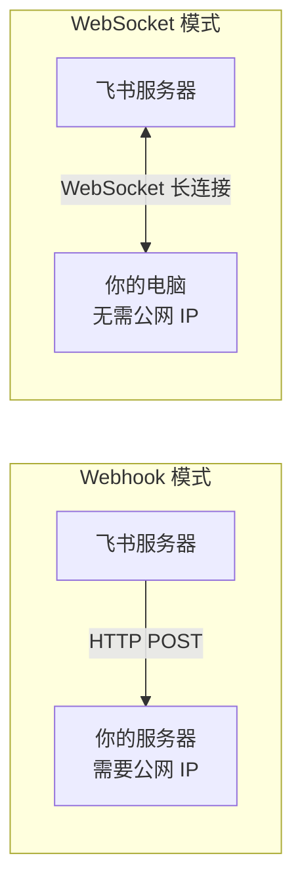
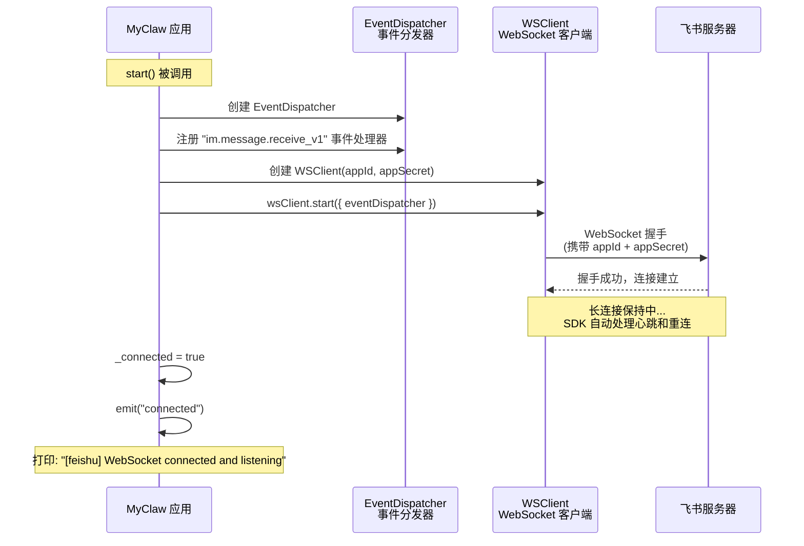
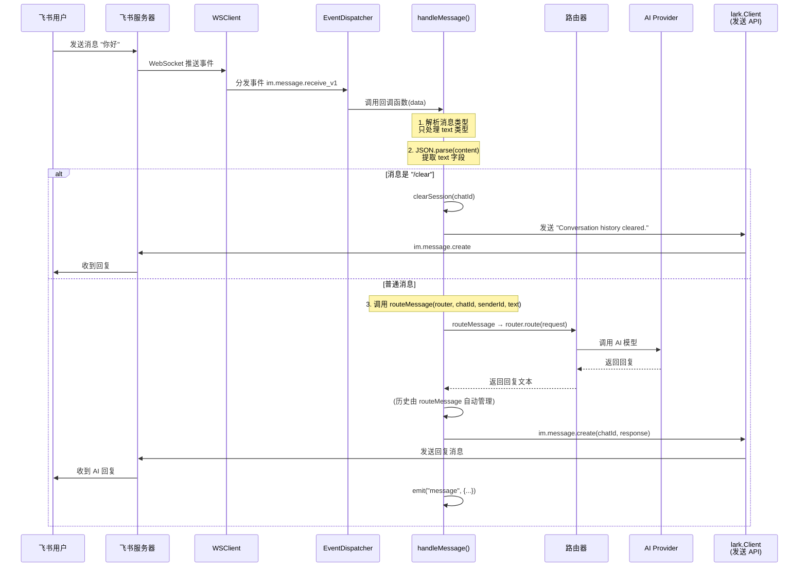

# 第八章：飞书通道 (Feishu Channel)

在前面的章节中，我们实现了终端通道，那是一个纯本地的交互方式：在命令行里输入文字，AI 直接回复。虽然方便调试，但在实际工作中，我们更希望 AI 能出现在团队协作工具里。

本章，我们将实现 **飞书通道** -- 让 MyClaw 变成一个飞书机器人，团队成员可以直接在飞书中与 AI 对话。

## 飞书通道概览

### WebSocket vs Webhook：两种接收消息的方式

在接入飞书（或任何即时通讯平台）时，通常有两种方式接收消息：



| 对比项 | Webhook 模式 | WebSocket 模式 |
| --- | --- | --- |
| 方向 | 飞书主动 POST 到你的服务器 | 你的程序主动连接飞书 |
| 公网要求 | 需要公网 IP 或域名 | 不需要，本地即可运行 |
| 配置复杂度 | 需配置 HTTPS、域名、防火墙 | 只需 App ID + App Secret |
| 适用场景 | 生产环境、大规模部署 | 开发调试、小规模部署 |
| NAT/防火墙 | 需要端口映射或内网穿透 | 自动穿透，无需任何网络配置 |

**MyClaw 选择 WebSocket 模式**，因为：

1. **零网络配置** -- 不需要买域名、配 HTTPS、开端口，在你的笔记本上就能跑起来
2. **开发友好** -- 代码只需要几行就能建立连接
3. **SDK 支持好** -- 飞书官方 `@larksuiteoapi/node-sdk` 完美封装了 WebSocket 模式

> **教学提示**：WebSocket 是一种全双工通信协议。和 HTTP "请求-响应" 模式不同，WebSocket 连接建立后，双方可以随时互发消息。飞书通过 WebSocket 把新消息"推送"给你的程序，就像实时聊天一样。

## FeishuChannel 类设计

飞书通道和终端通道一样，继承自 `Channel` 抽象类。下面是它的类结构：

```mermaid
classDiagram
    class Channel {
        <<abstract>>
        +id: string
        +type: string
        +connected: boolean
        +setRouter(router: Router): void
        +start(): Promise~void~
        +stop(): Promise~void~
        +send(message: OutgoingMessage): Promise~void~
        +emit(event, data)
    }

    class FeishuChannel {
        +id: string
        +type: "feishu"
        -client: lark.Client
        -wsClient: lark.WSClient | null
        -_connected: boolean
        -router: Router | null
        -config: ChannelConfig
        -appId: string
        -appSecret: string
        +constructor(config, appId, appSecret)
        +get connected(): boolean
        +setRouter(router: Router): void
        +start(): Promise~void~
        +stop(): Promise~void~
        +send(message: OutgoingMessage): Promise~void~
        -handleMessage(data, router): Promise~void~
    }

    Channel <|-- FeishuChannel

    class "lark.Client" as LarkClient {
        +im.message.create()
        主动调用飞书 API
    }

    class "lark.WSClient" as WSClient {
        +start(options)
        WebSocket 长连接
    }

    FeishuChannel --> LarkClient : 发送消息
    FeishuChannel --> WSClient : 接收消息
```

**两个 lark 客户端各司其职：**

| 客户端 | 职责 | 什么时候用 |
| --- | --- | --- |
| `lark.Client` | 主动调用飞书 API（如发送消息） | 回复用户、发送 /clear 确认 |
| `lark.WSClient` | 建立 WebSocket 连接，接收事件推送 | 监听用户发来的新消息 |

让我们逐步拆解这个类的实现。

### 构造函数：初始化连接凭证

```typescript
// src/channels/feishu.ts

export class FeishuChannel extends Channel {
  readonly id: string;
  readonly type = "feishu";
  private client: lark.Client;
  private wsClient: lark.WSClient | null = null;
  private _connected = false;
  private router: Router | null = null;
  private config: ChannelConfig;
  private appId: string;
  private appSecret: string;

  constructor(config: ChannelConfig, appId: string, appSecret: string) {
    super();
    this.id = config.id;
    this.config = config;
    this.appId = appId;
    this.appSecret = appSecret;
    this.client = new lark.Client({
      appId,
      appSecret,
      appType: lark.AppType.SelfBuild,  // 企业自建应用
    });
  }
}
```

构造函数做了两件事：

1. **保存配置** -- `id`、`config`、凭证信息
2. **创建 `lark.Client`** -- 这是用于主动调用飞书 API 的客户端（比如发消息给用户）

会话存储（`sessions` Map）已由基类 `Channel` 统一管理，子类不再需要单独维护。

> **注意**：`lark.WSClient` 在构造函数中并没有创建，而是在 `start()` 时才创建。这是一个好的设计模式 -- 把"初始化配置"和"建立连接"分开。

## WSClient + EventDispatcher 架构

飞书 SDK 采用 **WSClient + EventDispatcher** 的架构来接收和分发消息。下面是连接建立的完整流程：



对应的代码如下：

```typescript
async start(): Promise<void> {
  if (!this.router) {
    throw new Error("Router must be set before starting Feishu channel");
  }

  const router = this.router;

  // 第一步：创建事件分发器并注册消息处理函数
  const eventDispatcher = new lark.EventDispatcher({}).register({
    "im.message.receive_v1": async (data: any) => {
      try {
        await this.handleMessage(data, router);
      } catch (err) {
        console.error(
          chalk.red(
            `[feishu] Error processing message: ${(err as Error).message}`
          )
        );
      }
    },
  });

  console.log(chalk.dim(`[feishu] Starting WebSocket client...`));

  // 第二步：创建 WebSocket 客户端
  this.wsClient = new lark.WSClient({
    appId: this.appId,
    appSecret: this.appSecret,
    loggerLevel: lark.LoggerLevel.warn,
  });

  // 第三步：启动连接，传入事件分发器
  await this.wsClient.start({ eventDispatcher });

  this._connected = true;
  this.emit("connected");
  console.log(chalk.green(`[feishu] WebSocket connected and listening`));
}
```

**三个关键步骤的作用：**

| 步骤 | 对象 | 作用 |
| --- | --- | --- |
| 1 | `EventDispatcher` | 定义"收到消息后做什么" -- 注册 `im.message.receive_v1` 事件的回调函数 |
| 2 | `WSClient` | 定义"怎么连接飞书" -- 使用 appId/appSecret 认证 |
| 3 | `wsClient.start()` | 把两者组装起来：WebSocket 收到事件后，交给 EventDispatcher 分发 |

> **教学提示**：`im.message.receive_v1` 是飞书的事件类型名称。`im` 表示即时通讯模块，`message.receive` 表示接收消息事件，`v1` 是版本号。飞书还有其他事件类型（如 `im.message.read_v1` 消息已读），但 MyClaw 目前只需要监听新消息。

## 消息处理流程

当用户在飞书中发送一条消息后，完整的处理流程如下：



### handleMessage 方法详解

```typescript
private async handleMessage(data: any, router: Router): Promise<void> {
  const message = data.message;
  if (!message) return;

  // ---- 第一步：过滤非文本消息 ----
  const msgType = message.message_type;
  if (msgType !== "text") return;

  const chatId = message.chat_id as string;
  const senderId = (data.sender?.sender_id?.open_id as string) ?? "unknown";

  // ---- 第二步：解析消息内容 ----
  // 飞书的 message.content 是 JSON 字符串，格式如：'{"text":"你好"}'
  let text: string;
  try {
    const content = JSON.parse(message.content);
    text = content.text;
  } catch {
    return;  // JSON 解析失败，忽略此消息
  }

  if (!text) return;

  // ---- 第三步：构造 sessionId（由 routeMessage 内部使用） ----
  // routeMessage 会自动构造 sessionId 并管理对话历史

  // ---- 第四步：处理 /clear 命令 ----
  if (text.trim() === "/clear") {
    this.clearSession(chatId);
    await this.client.im.message.create({
      params: { receive_id_type: "chat_id" },
      data: {
        receive_id: chatId,
        msg_type: "text",
        content: JSON.stringify({ text: "Conversation history cleared." }),
      },
    });
    return;
  }

  // ---- 第五步：调用基类 routeMessage 处理 AI 对话 ----
  try {
    const response = await this.routeMessage(router, chatId, senderId, text);

    // ---- 第六步：回复消息 ----
    await this.client.im.message.create({
      params: { receive_id_type: "chat_id" },
      data: {
        receive_id: chatId,
        msg_type: "text",
        content: JSON.stringify({ text: response }),
      },
    });
  } catch (err) {
    // 出错时给用户一个友好提示
    console.error(
      chalk.red(
        `[feishu] Error processing message: ${(err as Error).message}`
      )
    );
    await this.client.im.message.create({
      params: { receive_id_type: "chat_id" },
      data: {
        receive_id: chatId,
        msg_type: "text",
        content: JSON.stringify({
          text: "Sorry, I encountered an error. Please try again.",
        }),
      },
    });
  }
}
```

### 飞书消息格式的关键细节

飞书的消息格式和我们直觉上想象的不太一样。`message.content` 不是普通字符串，而是一个 **JSON 字符串**：

```
用户发送: "你好"

message.content 的值: '{"text":"你好"}'   ← 注意这是字符串，不是对象
```

所以我们需要 `JSON.parse(message.content).text` 才能拿到实际文本。同样，回复消息时也要 `JSON.stringify({ text: response })`。

## /clear 命令实现

飞书通道支持 `/clear` 命令，用于清空当前聊天的对话历史：

```typescript
if (text.trim() === "/clear") {
  this.clearSession(chatId);
  await this.client.im.message.create({
    params: { receive_id_type: "chat_id" },
    data: {
      receive_id: chatId,
      msg_type: "text",
      content: JSON.stringify({ text: "Conversation history cleared." }),
    },
  });
  return;  // 直接返回，不进入 AI 处理流程
}
```

实现非常简洁：调用基类的 `clearSession` 方法清除当前 `chatId` 的会话记录，然后回复一条确认消息。下次该聊天发消息时，`routeMessage` 会自动创建一个新的空历史。

> **为什么需要 /clear？** AI 的上下文窗口有限。当对话很长时，早期的内容可能被截断或影响回复质量。`/clear` 让用户可以"重新开始"一段对话。

## 基于 chat_id 的会话管理

飞书通道的一大特点是支持 **多用户并发会话**。每个飞书聊天（单聊或群聊）都有一个唯一的 `chat_id`，MyClaw 通过基类 `Channel` 的 `sessions` Map 以 `chat_id` 为键来隔离不同聊天的对话历史：

```typescript
// 基类 Channel 中定义
protected sessions: SessionMap = new Map();
// SessionMap = Map<string, Array<{ role: "user" | "assistant"; content: string }>>
```

工作原理：

```
聊天 A (chat_id: oc_aaa)          聊天 B (chat_id: oc_bbb)
┌─────────────────────┐           ┌─────────────────────┐
│ user: "什么是 TypeScript?"│      │ user: "今天天气怎么样?"  │
│ assistant: "TypeScript  │      │ assistant: "我无法获取  │
│   是一种..."           │        │   实时天气..."         │
│ user: "它和 JS 什么区别?"│       │                       │
│ assistant: "主要区别..."│        │                       │
└─────────────────────┘           └─────────────────────┘
             ↑                                ↑
    sessions.get("oc_aaa")         sessions.get("oc_bbb")
```

每个聊天的对话历史完全独立，不会互相干扰。这意味着：

- 用户 A 和机器人的对话不会影响用户 B
- 群聊中的对话也有自己独立的上下文
- `/clear` 只清除当前聊天的历史，不影响其他聊天

### sessionId 的构造

`routeMessage` 方法内部会自动构造 `sessionId`，格式为 `${this.id}:${chatId}`，例如 `"my-feishu:oc_5ad11d72b830411d"`。这确保了即使多个飞书通道实例同时运行，会话也不会冲突。

## 发送消息（send 方法）

```typescript
async send(message: OutgoingMessage): Promise<void> {
  // 从 sessionId 中提取 chat_id
  // sessionId 格式: "channelId:chatId"
  const chatId = message.sessionId.split(":")[1];
  if (!chatId) {
    console.error(`[feishu] Invalid session ID: ${message.sessionId}`);
    return;
  }

  await this.client.im.message.create({
    params: { receive_id_type: "chat_id" },
    data: {
      receive_id: chatId,
      msg_type: "text",
      content: JSON.stringify({ text: message.text }),
    },
  });
}
```

`send` 方法是 `Channel` 抽象类要求实现的接口。它从 `sessionId` 中解析出 `chat_id`，然后调用飞书 API 发送消息。

## Channel Manager 集成

在 `src/channels/manager.ts` 中，`createChannelManager` 函数负责根据配置创建和启动所有通道。飞书通道的创建逻辑如下：

```typescript
// src/channels/manager.ts（节选）

switch (channelConfig.type) {
  case "feishu": {
    // 1. 解析凭证（支持直接配置或环境变量）
    const appId = resolveSecret(
      channelConfig.appId,
      channelConfig.appIdEnv
    );
    const appSecret = resolveSecret(
      channelConfig.appSecret,
      channelConfig.appSecretEnv
    );

    // 2. 检查凭证是否存在
    if (!appId || !appSecret) {
      console.warn(
        chalk.yellow(
          `[channels] Skipping '${channelConfig.id}': missing App ID or App Secret`
        )
      );
      continue;
    }

    // 3. 创建通道实例 → 设置路由器 → 启动
    const feishu = new FeishuChannel(channelConfig, appId, appSecret);
    feishu.setRouter(router);
    channels.set(channelConfig.id, feishu);
    await feishu.start();
    break;
  }
  // ...
}
```

**`resolveSecret` 的妙用：** 它支持两种方式提供凭证：

- **直接写值**：`appId: "cli_xxx"` -- 简单但不安全
- **环境变量**：`appIdEnv: "FEISHU_APP_ID"` -- 推荐方式，凭证不会出现在配置文件中

**注意一个细节：** 终端通道 (`terminal`) 在 Channel Manager 中被跳过了：

```typescript
if (channelConfig.type === "terminal") continue; // Terminal is handled separately
```

这是因为终端通道需要独占 stdin/stdout，和 Gateway 的生命周期管理方式不同，所以单独处理。

## 飞书机器人完整配置指南

下面是从零开始创建飞书机器人并连接到 MyClaw 的详细步骤。

### 第一步：创建飞书应用

1. 打开浏览器，访问 [飞书开放平台](https://open.feishu.cn/app)
2. 如果没有登录，先用你的飞书账号登录
3. 你会看到「我的应用」页面，点击右上角的 **「创建企业自建应用」** 按钮
4. 在弹出的对话框中填写：
   - **应用名称**：填写一个有意义的名字，如 `MyClaw AI 助手`
   - **应用描述**：简单描述用途，如 `基于 MyClaw 框架的 AI 对话机器人`
   - **应用图标**：可以上传一个图标，也可以先跳过
5. 点击 **「确定创建」**
6. 创建成功后，你会进入应用的管理后台

> **提示**：你需要有飞书企业管理员权限，或者在一个开发测试用的飞书团队中操作。个人版飞书也可以创建应用。

### 第二步：获取 App ID 和 App Secret

1. 在应用管理后台，点击左侧菜单的 **「凭证与基础信息」**
2. 在页面中你会看到：
   - **App ID**：以 `cli_` 开头的一串字符，如 `cli_a1b2c3d4e5f6g7h8`
   - **App Secret**：一串较长的字符串，点击「查看」按钮可以显示
3. **记录下这两个值**，后面配置 MyClaw 时需要用到

> **安全提示**：App Secret 是敏感信息，不要提交到 git 仓库或分享给他人。后面我们会用环境变量来管理它。

### 第三步：添加应用能力 -- 机器人

1. 在左侧菜单中，点击 **「添加应用能力」**
2. 在应用能力列表中，找到 **「机器人」** 卡片
3. 点击 **「添加」**
4. 添加成功后，左侧菜单会多出「机器人」相关选项

> **为什么需要添加机器人能力？** 飞书应用可以有多种能力（网页应用、小程序、机器人等）。我们需要"机器人"能力，这样应用才能在聊天中收发消息。

### 第四步：启用 WebSocket 模式（长连接）

1. 在左侧菜单中，点击 **「开发配置」** 下的 **「事件与回调」**
2. 在页面中找到 **「事件配置方式」** 区域
3. 点击 **「编辑」** 按钮
4. 选择 **「使用长连接接收事件」**（而不是"将事件发送至开发者服务器"）
5. 点击 **「保存」**

> **这一步非常关键！** 如果你选错了配置方式，后面的 WebSocket 连接将无法建立。"长连接"就是 WebSocket 模式。选择后飞书会通过 WebSocket 向你的程序推送事件，无需公网 IP。

### 第五步：添加事件订阅

1. 仍然在 **「事件与回调」** 页面
2. 找到 **「事件订阅」** 区域，点击 **「添加事件」**
3. 搜索并添加以下事件：
   - **接收消息 `im.message.receive_v1`** -- 当有人给机器人发消息时触发

> **提示**：添加事件后可能需要同步添加对应的权限，页面会有提示，按照提示操作即可。

### 第六步：添加权限

1. 在左侧菜单中，点击 **「权限管理」**
2. 搜索并开通以下权限：
   - **`im:message`** -- 获取与发送单聊、群聊消息
   - **`im:message:send_as_bot`** -- 以应用的身份发送消息（如果前面的权限不够，可能还需要这个）
3. 勾选对应权限，点击 **「批量开通」**

> **权限说明**：`im:message` 是核心权限，允许机器人读取收到的消息并发送回复。没有这个权限，机器人虽然能收到事件但无法回复。

### 第七步：创建版本并发布

1. 在左侧菜单中，点击 **「版本管理与发布」**
2. 点击 **「创建版本」**
3. 填写版本号（如 `1.0.0`）和更新说明
4. 点击 **「保存」**，然后点击 **「申请发布」**
5. 如果你是企业管理员，可以直接审批通过
6. 如果不是，需要等待管理员审批

> **重要**：必须发布应用后，机器人才能在飞书中被找到和使用。开发阶段可以先在「版本管理」中开启「调试模式」来测试。

### 第八步：设置环境变量

在你的终端中设置飞书凭证：

```bash
# macOS / Linux
export FEISHU_APP_ID="cli_xxxxxxxxxxxxxxxxx"
export FEISHU_APP_SECRET="xxxxxxxxxxxxxxxxxxxxxxxxxxxxxxxxx"

# 验证环境变量是否设置成功
echo $FEISHU_APP_ID
echo $FEISHU_APP_SECRET
```

如果你想让环境变量持久化，可以添加到 shell 配置文件中：

```bash
# 添加到 ~/.zshrc 或 ~/.bashrc
echo 'export FEISHU_APP_ID="cli_xxxxxxxxxxxxxxxxx"' >> ~/.zshrc
echo 'export FEISHU_APP_SECRET="xxxxxxxxxxxxxxxxxxxxxxxxxxxxxxxxx"' >> ~/.zshrc
source ~/.zshrc
```

> **更安全的做法**：使用 `.env` 文件 + `dotenv` 库加载环境变量。将 `.env` 添加到 `.gitignore` 防止泄露。

### 第九步：配置 myclaw.yaml

在项目的 `myclaw.yaml` 配置文件中添加飞书通道：

```yaml
channels:
  # 终端通道（开发调试用）
  - id: "terminal"
    type: "terminal"
    enabled: true
    greeting: "MyClaw AI assistant"

  # 飞书通道
  - id: "my-feishu"
    type: "feishu"
    enabled: true
    appIdEnv: "FEISHU_APP_ID"         # 从环境变量读取 App ID
    appSecretEnv: "FEISHU_APP_SECRET"  # 从环境变量读取 App Secret
    greeting: "MyClaw AI assistant"
```

配置说明：

| 字段 | 说明 | 必填 |
| --- | --- | --- |
| `id` | 通道的唯一标识符，可以自定义 | 是 |
| `type` | 必须是 `"feishu"` | 是 |
| `enabled` | 是否启用此通道 | 否（默认 true） |
| `appIdEnv` | 存放 App ID 的环境变量名 | 是（或用 `appId`） |
| `appSecretEnv` | 存放 App Secret 的环境变量名 | 是（或用 `appSecret`） |
| `greeting` | 问候语（目前飞书通道未使用，保留字段） | 否 |

> **两种配置凭证的方式**：
> - `appIdEnv` / `appSecretEnv`：指定环境变量名，运行时从环境变量读取（推荐）
> - `appId` / `appSecret`：直接写在配置文件里（不推荐，有泄露风险）

### 第十步：启动 Gateway 并测试

```bash
npx tsx src/entry.ts gateway
```

启动成功后，你应该看到类似以下输出：

```
[feishu] Starting WebSocket client...
[feishu] WebSocket connected and listening
```

**测试方法：**

1. 打开飞书客户端（桌面版或手机版）
2. 在搜索栏中搜索你创建的机器人名称（如 `MyClaw AI 助手`）
3. 点击进入对话
4. 发送一条消息，如 `你好`
5. 如果一切正常，你应该很快收到 AI 的回复
6. 尝试发送 `/clear`，应该收到 `Conversation history cleared.` 的确认

## 与终端通道的对比

| 特性 | 终端通道 (Terminal) | 飞书通道 (Feishu) |
| --- | --- | --- |
| **用户界面** | 命令行 readline | 飞书 App（桌面/手机） |
| **多用户支持** | 单用户 | 多用户（通过 chat_id 隔离） |
| **连接方式** | 本地 stdin/stdout | WebSocket 长连接到飞书服务器 |
| **网络要求** | 无 | 需要能访问飞书服务器 |
| **认证方式** | 无需认证 | App ID + App Secret |
| **支持的命令** | /help, /clear, /history, /status | /clear |
| **消息格式** | 纯文本 | JSON 包装的文本 |
| **部署方式** | 仅本地 | 本地即可（WebSocket 无需公网 IP） |
| **适用场景** | 开发调试 | 团队协作、生产环境 |
| **在 Manager 中的处理** | 跳过，单独处理 | 由 Channel Manager 统一管理 |
| **会话存储** | 单一历史数组（基类 sessions） | Map\<chat_id, history\>（基类 sessions） |
| **错误处理** | 打印到控制台 | 打印控制台 + 回复用户错误提示 |

## 常见问题排查

### 问题 1：启动时报 "missing App ID or App Secret"

```
[channels] Skipping 'my-feishu': missing App ID or App Secret
```

**原因**：环境变量没有正确设置。

**解决方法**：
1. 确认环境变量名和 `myclaw.yaml` 中的 `appIdEnv` / `appSecretEnv` 一致
2. 运行 `echo $FEISHU_APP_ID` 确认变量有值
3. 如果用的是新终端窗口，记得重新 `export` 或 `source` 配置文件

### 问题 2：WebSocket 连接失败

```
[feishu] Error processing message: ...
```

**可能原因及解决方法**：
- **App ID 或 App Secret 错误**：仔细核对凭证，注意不要复制到多余的空格
- **应用未发布**：回到飞书开放平台，确认应用已经发布或开启了调试模式
- **未启用长连接模式**：检查「事件与回调」中是否选择了「使用长连接接收事件」
- **网络问题**：确认你的电脑可以访问 `open.feishu.cn`

### 问题 3：机器人收不到消息

**可能原因及解决方法**：
- **未添加 `im.message.receive_v1` 事件订阅**：在「事件与回调」中添加
- **未开通 `im:message` 权限**：在「权限管理」中开通
- **应用版本未发布**：需要创建版本并发布后权限才生效
- **机器人未添加到聊天**：确保你是直接和机器人对话（单聊），或者在群聊中已将机器人添加为成员

### 问题 4：机器人能收到消息但不回复

**可能原因及解决方法**：
- **缺少发送消息权限**：确认已开通 `im:message` 或 `im:message:send_as_bot` 权限
- **路由配置错误**：检查 `myclaw.yaml` 中的路由规则，确保飞书通道能匹配到一个 agent
- **AI Provider 报错**：查看终端输出的错误日志，可能是 API key 过期或额度用尽

### 问题 5：JSON 解析错误

如果看到 JSON 相关的错误，通常是因为收到了非文本消息（如图片、文件、表情）。MyClaw 目前只处理文本消息，其他类型会被自动忽略：

```typescript
if (msgType !== "text") return;  // 非文本消息直接跳过
```

这不是一个 bug，而是有意为之的设计。如果你需要处理其他消息类型，可以在 `handleMessage` 中添加更多分支。

### 问题 6："Router must be set before starting Feishu channel"

**原因**：代码在调用 `start()` 之前没有调用 `setRouter()`。

**解决方法**：这通常是内部逻辑问题。检查 `manager.ts` 中是否在 `feishu.start()` 之前调用了 `feishu.setRouter(router)`。正常情况下 Channel Manager 会自动处理这个顺序。

## 下一步

我们已经有了终端和飞书两个通道。下一章我们将实现另一个热门平台——**Telegram 通道**。

[下一章: Telegram 通道 >>](08b-telegram.md)
