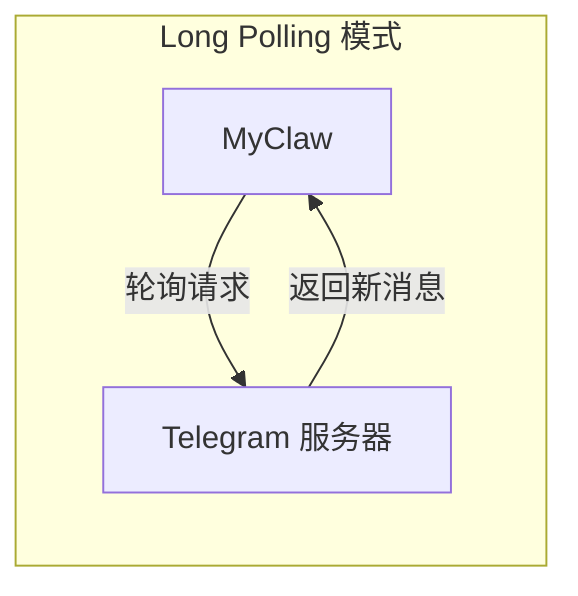

# Chapter 8b: Telegram 通道 (Telegram Channel)

在上一章中，我们实现了飞书通道，让 MyClaw 可以在飞书中与用户对话。本章我们将实现另一个热门平台的集成——**Telegram 通道**，使用 [grammY](https://grammy.dev/) 库让 MyClaw 变成一个 Telegram Bot。

## Telegram Bot 概览

### grammY：现代 Telegram Bot 框架

[grammY](https://grammy.dev/) 是一个现代化的 TypeScript Telegram Bot 框架，相比官方的 `node-telegram-bot-api`，它提供了更好的类型支持和更简洁的 API。



grammY 默认使用 **Long Polling** 模式——你的程序主动向 Telegram 服务器轮询新消息。与飞书的 WebSocket 模式类似，Long Polling 也不需要公网 IP，在本地即可运行。

| 对比项 | Webhook 模式 | Long Polling 模式 |
| --- | --- | --- |
| 方向 | Telegram 主动 POST 到你的服务器 | 你的程序主动轮询 Telegram |
| 公网要求 | 需要 HTTPS 公网地址 | 不需要，本地即可运行 |
| 延迟 | 更低（实时推送） | 略高（轮询间隔） |
| 适用场景 | 生产环境、大规模部署 | 开发调试、小规模部署 |

**MyClaw 选择 Long Polling 模式**，因为零配置即可运行，非常适合教学和个人使用。

## TelegramChannel 类设计

Telegram 通道继承自 `Channel` 抽象类，结构与飞书通道保持一致：

```mermaid
classDiagram
    class Channel {
        <<abstract>>
        +id: string
        +type: string
        +connected: boolean
        +setRouter(router: Router): void
        +start(): Promise~void~
        +stop(): Promise~void~
        +send(message: OutgoingMessage): Promise~void~
        +emit(event, data)
    }

    class TelegramChannel {
        +id: string
        +type: "telegram"
        -bot: Bot
        -_connected: boolean
        -router: Router | null
        -config: ChannelConfig
        -allowedChatIds: Set~number~ | null
        +constructor(config, botToken)
        +get connected(): boolean
        +setRouter(router: Router): void
        +start(): Promise~void~
        +stop(): Promise~void~
        +send(message: OutgoingMessage): Promise~void~
        -isChatAllowed(chatId): boolean
        -handleMessage(...): Promise~void~
    }

    Channel <|-- TelegramChannel

    class "grammy.Bot" as Bot {
        +command(cmd, handler)
        +on(filter, handler)
        +start(options)
        +stop()
        +api.sendMessage()
    }

    TelegramChannel --> Bot : 收发消息
```

与飞书通道的对比：

| 特性 | 飞书通道 | Telegram 通道 |
| --- | --- | --- |
| 库 | `@larksuiteoapi/node-sdk` | `grammy` |
| 连接方式 | WebSocket 长连接 | Long Polling |
| 凭证 | App ID + App Secret | Bot Token |
| 访问控制 | 无（飞书应用本身有权限管理） | `allowedChatIds` 白名单 |
| 消息分块 | 无（飞书消息长度限制较大） | 4096 字符自动分块 |

## 完整实现

### 构造函数

```typescript
// src/channels/telegram.ts

export class TelegramChannel extends Channel {
  readonly id: string;
  readonly type = "telegram";
  private bot: Bot;
  private _connected = false;
  private router: Router | null = null;
  private config: ChannelConfig;
  private allowedChatIds: Set<number> | null;

  constructor(config: ChannelConfig, botToken: string) {
    super();
    this.id = config.id;
    this.config = config;
    this.allowedChatIds = config.allowedChatIds
      ? new Set(config.allowedChatIds)
      : null;
    this.bot = new Bot(botToken);
  }
}
```

与飞书通道相比，Telegram 通道的构造函数有两个不同：

1. **只需要一个 `botToken`**——Telegram Bot 的认证比飞书简单，只需要一个 Token
2. **`allowedChatIds` 白名单**——可选的安全措施，限制哪些聊天可以与 Bot 交互

### start() 方法

```typescript
async start(): Promise<void> {
  if (!this.router) {
    throw new Error("Router must be set before starting Telegram channel");
  }

  const router = this.router;

  // /start 命令 —— Telegram Bot 的标准欢迎命令
  this.bot.command("start", async (ctx) => {
    const chatId = ctx.chat.id;
    if (!this.isChatAllowed(chatId)) return;
    const greeting =
      this.config.greeting ?? "Hello! I'm MyClaw, your AI assistant.";
    await ctx.reply(greeting);
  });

  // /clear 命令 —— 清空对话历史
  this.bot.command("clear", async (ctx) => {
    const chatId = ctx.chat.id;
    if (!this.isChatAllowed(chatId)) return;
    this.clearSession(String(chatId));
    await ctx.reply("Conversation history cleared.");
  });

  // 处理文本消息
  this.bot.on("message:text", async (ctx) => {
    const chatId = ctx.chat.id;
    if (!this.isChatAllowed(chatId)) return;
    if (ctx.message.text.startsWith("/")) return; // 跳过命令

    try {
      await this.handleMessage(
        String(chatId),
        ctx.from?.id ? String(ctx.from.id) : "unknown",
        ctx.message.text,
        router,
        async (text: string) => { await ctx.reply(text); }
      );
    } catch (err) {
      console.error(
        chalk.red(
          `[telegram] Error processing message: ${(err as Error).message}`
        )
      );
      await ctx.reply("Sorry, I encountered an error. Please try again.");
    }
  });

  console.log(chalk.dim(`[telegram] Starting bot...`));

  // 启动 Long Polling（非阻塞）
  this.bot.start({
    onStart: () => {
      this._connected = true;
      this.emit("connected");
      console.log(chalk.green(`[telegram] Bot started and listening`));
    },
  });
}
```

grammY 的 API 比飞书 SDK 更直观：

| grammY API | 作用 | 飞书 SDK 对应 |
| --- | --- | --- |
| `bot.command("start", handler)` | 注册 `/start` 命令 | 在 `handleMessage` 中手动判断 |
| `bot.on("message:text", handler)` | 监听文本消息 | `EventDispatcher.register("im.message.receive_v1")` |
| `ctx.reply(text)` | 回复消息 | `client.im.message.create(...)` |
| `bot.start()` | 开始轮询 | `wsClient.start({ eventDispatcher })` |

> **教学提示**：`bot.start()` 是非阻塞的——它在后台启动 Long Polling 循环，不会阻塞 Node.js 事件循环。`onStart` 回调在第一次轮询成功后触发。

### allowedChatIds 白名单

```typescript
private isChatAllowed(chatId: number): boolean {
  if (!this.allowedChatIds) return true;  // 未配置白名单 = 允许所有
  return this.allowedChatIds.has(chatId);
}
```

Telegram Bot 默认是公开的——任何人都可以找到并与它对话。`allowedChatIds` 提供了一层简单的访问控制：

- **未配置**（默认）：所有聊天都可以交互
- **已配置**：只有列表中的 `chatId` 才能交互，其他消息被静默忽略

> **如何获取 chatId？** 先不配置白名单运行 Bot，给 Bot 发一条消息，然后在 MyClaw 日志中查看 chatId。或者使用 Telegram 的 [@userinfobot](https://t.me/userinfobot) 获取你的用户 ID。

### 消息处理

```typescript
private async handleMessage(
  chatId: string,
  senderId: string,
  text: string,
  router: Router,
  reply: (text: string) => Promise<void>
): Promise<void> {
  const response = await this.routeMessage(router, chatId, senderId, text);

  // 分块发送（Telegram 单条消息限制 4096 字符）
  const chunks = splitMessage(response, MAX_MESSAGE_LENGTH);
  for (const chunk of chunks) {
    await reply(chunk);
  }
}
```

处理逻辑非常简洁：调用基类的 `routeMessage` 完成路由请求构造、对话历史管理和事件触发，然后将回复按 Telegram 的字符限制进行**消息分块**发送。

### 消息分块（4096 字符限制）

Telegram 单条消息最多 4096 个字符。当 AI 回复较长时，我们需要自动拆分：

```typescript
const MAX_MESSAGE_LENGTH = 4096;

function splitMessage(text: string, maxLength: number): string[] {
  if (text.length <= maxLength) return [text];
  const chunks: string[] = [];
  let remaining = text;
  while (remaining.length > 0) {
    chunks.push(remaining.slice(0, maxLength));
    remaining = remaining.slice(maxLength);
  }
  return chunks;
}
```

```
AI 回复 (8000 字符)
┌──────────────────────┐
│     前 4096 字符      │ → 第一条消息
├──────────────────────┤
│     后 3904 字符      │ → 第二条消息
└──────────────────────┘
```

### send() 和 stop() 方法

```typescript
async send(message: OutgoingMessage): Promise<void> {
  const chatId = message.sessionId.split(":")[1];
  if (!chatId) {
    console.error(`[telegram] Invalid session ID: ${message.sessionId}`);
    return;
  }

  const chunks = splitMessage(message.text, MAX_MESSAGE_LENGTH);
  for (const chunk of chunks) {
    await this.bot.api.sendMessage(Number(chatId), chunk);
  }
}

async stop(): Promise<void> {
  this.bot.stop();
  this._connected = false;
  this.emit("disconnected", "stopped");
}
```

`send()` 方法也使用了分块逻辑，确保通过外部调用发送的消息也能正确处理长文本。

## Channel Manager 集成

在 `src/channels/manager.ts` 中，Telegram 通道的注册方式与飞书一致：

```typescript
case "telegram": {
  const botToken = resolveSecret(
    channelConfig.botToken,
    channelConfig.botTokenEnv
  );
  if (!botToken) {
    console.warn(
      chalk.yellow(
        `[channels] Skipping '${channelConfig.id}': missing Bot Token`
      )
    );
    continue;
  }
  const telegram = new TelegramChannel(channelConfig, botToken);
  telegram.setRouter(router);
  channels.set(channelConfig.id, telegram);
  await telegram.start();
  break;
}
```

只需要一个 `botToken`，比飞书的两个凭证更简洁。

## Telegram Bot 完整配置指南

### 第一步：创建 Telegram Bot

1. 在 Telegram 中搜索 **@BotFather**（Telegram 官方的 Bot 管理工具）
2. 发送 `/newbot` 命令
3. 按提示输入 Bot 的**显示名称**（如 `MyClaw AI Assistant`）
4. 输入 Bot 的**用户名**（必须以 `bot` 结尾，如 `myclaw_ai_bot`）
5. BotFather 会返回一个 **Bot Token**，格式类似：
   ```
   123456789:ABCdefGHIjklMNOpqrsTUVwxyz
   ```
6. **记录下这个 Token**，后面配置 MyClaw 时需要用到

> **安全提示**：Bot Token 就像密码，拥有 Token 的人可以完全控制你的 Bot。不要泄露或提交到 git 仓库。

### 第二步：设置环境变量

```bash
# macOS / Linux
export TELEGRAM_BOT_TOKEN="123456789:ABCdefGHIjklMNOpqrsTUVwxyz"

# 验证
echo $TELEGRAM_BOT_TOKEN
```

如果你想让环境变量持久化：

```bash
echo 'export TELEGRAM_BOT_TOKEN="your_token_here"' >> ~/.zshrc
source ~/.zshrc
```

### 第三步：配置 myclaw.yaml

```yaml
channels:
  # 终端通道
  - id: "terminal"
    type: "terminal"
    enabled: true
    greeting: "MyClaw AI assistant"

  # Telegram 通道
  - id: "my-telegram"
    type: "telegram"
    enabled: true
    botTokenEnv: "TELEGRAM_BOT_TOKEN"
    greeting: "Hello! I'm MyClaw, your AI assistant."
    # allowedChatIds: [123456789]  # 可选：限制特定聊天
```

配置说明：

| 字段 | 说明 | 必填 |
| --- | --- | --- |
| `id` | 通道唯一标识符 | 是 |
| `type` | 必须是 `"telegram"` | 是 |
| `enabled` | 是否启用 | 否（默认 true） |
| `botTokenEnv` | 存放 Bot Token 的环境变量名 | 是（或用 `botToken`） |
| `greeting` | `/start` 命令的欢迎语 | 否 |
| `allowedChatIds` | 允许交互的 chatId 列表 | 否（默认允许所有） |

> **两种配置凭证的方式**：
> - `botTokenEnv`：指定环境变量名（推荐）
> - `botToken`：直接写在配置文件里（不推荐）

### 第四步：启动 Gateway 并测试

```bash
npx tsx src/entry.ts gateway
```

启动成功后，你应该看到：

```
[telegram] Starting bot...
[telegram] Bot started and listening
```

**测试方法：**

1. 在 Telegram 中搜索你创建的 Bot 用户名
2. 点击 **Start** 按钮（或发送 `/start`），应收到欢迎消息
3. 发送一条消息（如 `Hello`），等待 AI 回复
4. 发送 `/clear`，应收到 `Conversation history cleared.` 的确认

## 与飞书通道的对比

| 特性 | 飞书通道 (Feishu) | Telegram 通道 |
| --- | --- | --- |
| **SDK** | `@larksuiteoapi/node-sdk` | `grammy` |
| **连接方式** | WebSocket 长连接 | Long Polling |
| **凭证** | App ID + App Secret（2 个） | Bot Token（1 个） |
| **创建流程** | 飞书开放平台（多步骤） | @BotFather（对话式，1 分钟完成） |
| **消息格式** | JSON 包装（需 parse/stringify） | 纯文本（grammY 自动处理） |
| **访问控制** | 飞书应用权限管理 | `allowedChatIds` 白名单 |
| **消息长度限制** | 较大 | 4096 字符（自动分块） |
| **支持的命令** | `/clear` | `/start`, `/clear` |
| **适用场景** | 企业团队协作 | 个人使用、公开 Bot |

## 常见问题排查

### 问题 1：启动时报 "missing Bot Token"

```
[channels] Skipping 'my-telegram': missing Bot Token
```

**原因**：环境变量没有正确设置。

**解决方法**：
1. 确认环境变量名和 `myclaw.yaml` 中的 `botTokenEnv` 一致
2. 运行 `echo $TELEGRAM_BOT_TOKEN` 确认变量有值
3. 如果用的是新终端窗口，记得重新 `export` 或 `source` 配置文件

### 问题 2：Bot 不响应消息

**可能原因**：
- **Token 无效**：回到 @BotFather 检查 Token 是否正确
- **有其他程序在使用同一个 Token**：Telegram 只允许一个客户端使用同一个 Bot Token 进行 Long Polling。停止其他使用该 Token 的程序
- **`allowedChatIds` 配置了但没包含你的 chatId**：暂时移除白名单配置测试

### 问题 3：消息被截断

**原因**：AI 回复超过 4096 字符。

**解决方法**：MyClaw 会自动将长消息分块发送。如果你看到消息被截断而非分块，请检查是否使用了最新的代码。

### 问题 4：网络连接问题

**原因**：你的网络无法访问 Telegram API 服务器（`api.telegram.org`）。

**解决方法**：
- 确认你的网络可以访问 Telegram
- 如果在中国大陆，可能需要配置代理
- 检查防火墙设置

### 问题 5："Router must be set before starting Telegram channel"

**原因**：代码在调用 `start()` 之前没有调用 `setRouter()`。

**解决方法**：这通常是内部逻辑问题。正常情况下 Channel Manager 会自动处理这个顺序。

## 下一步

现在 MyClaw 已经支持三个通道：终端、飞书和 Telegram。接下来我们将学习 MyClaw 的**插件系统**——如何通过插件扩展 Agent 的能力。

[下一章: 插件系统 >>](09-plugins.md)
