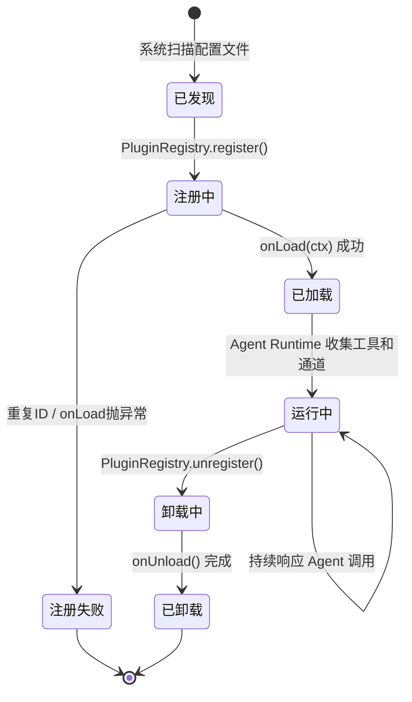
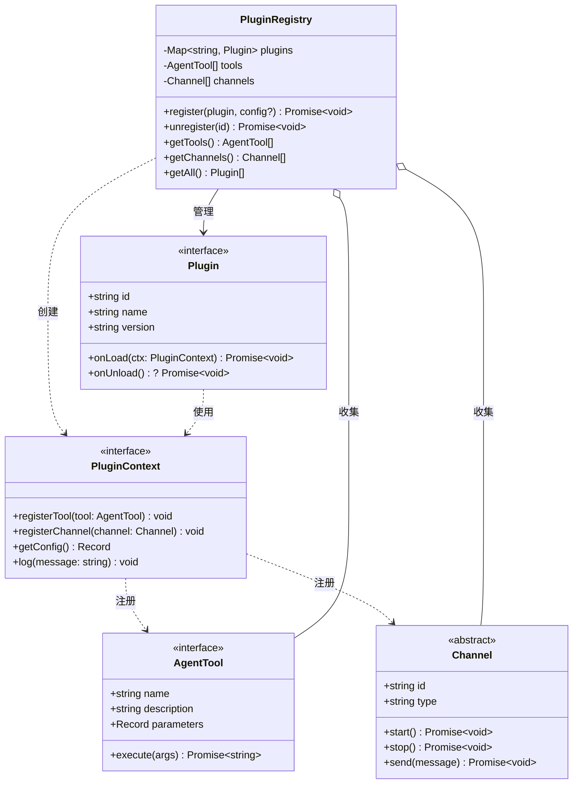
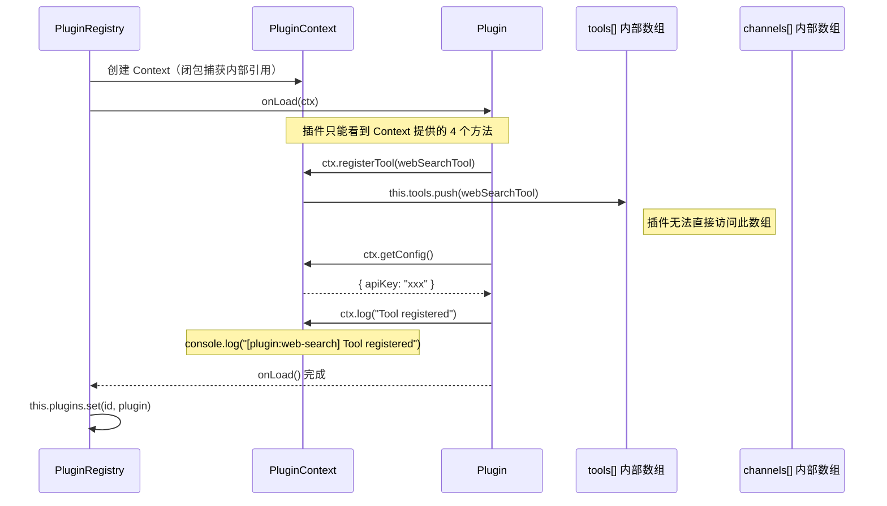
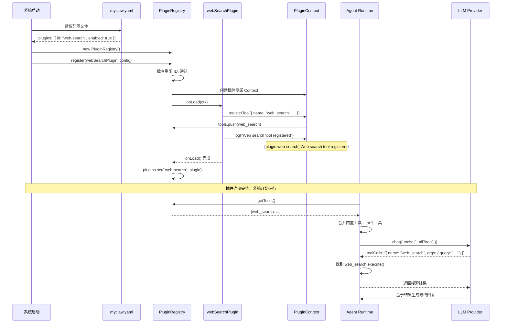

# Chapter 9: 插件系统

到目前为止，我们的 MyClaw Agent 能力是固定的——只有内置的工具和通道。但真正强大的 AI 系统需要**可扩展性**。如果每次想增加一个功能都要修改核心代码，系统很快就会变成一团乱麻。本章我们将实现 MyClaw 的插件系统，让开发者可以**在不修改核心代码的前提下**扩展系统能力。

这是软件工程中一个经典的设计问题，也是理解"开闭原则"（Open-Closed Principle）的绝佳案例——**对扩展开放，对修改关闭**。

## 为什么需要插件系统？

想象一下没有插件系统的情况：

```
想添加天气查询功能？ → 修改 Agent Runtime 代码
想接入 Slack 通道？   → 修改通道管理代码
想加入数据库查询？    → 又要改核心代码...
```

每次扩展都要改核心代码，带来的问题是：

1. **耦合度高**：所有功能代码混在一起，牵一发动全身
2. **协作困难**：多个开发者同时修改核心代码，冲突不断
3. **测试成本高**：改了核心代码，所有功能都要重新测试
4. **不可控的膨胀**：核心模块越来越大，最终无法维护

有了插件系统，一切变得优雅：

```
想添加天气查询功能？ → 写一个天气插件，注册到系统
想接入 Slack 通道？   → 写一个 Slack 插件，注册到系统
想加入数据库查询？    → 写一个 DB 插件，注册到系统
```

核心代码完全不用改。新功能作为独立插件存在，可以单独开发、测试、启用或禁用。

## 插件生命周期总览

在深入代码之前，先从宏观视角理解插件从"被发现"到"投入工作"再到"被卸载"的完整生命周期：



关键的生命周期阶段：

| 阶段 | 触发者 | 插件做什么 |
| --- | --- | --- |
| **已发现** | 系统读取 `myclaw.yaml` | 插件还只是一个配置项 |
| **注册中** | `PluginRegistry.register()` | 系统创建 PluginContext 并调用 `onLoad()` |
| **已加载** | `onLoad()` 返回 | 插件已注册了自己的工具/通道 |
| **运行中** | Agent Runtime | 插件注册的工具被 LLM 调用 |
| **卸载中** | `PluginRegistry.unregister()` | 系统调用 `onUnload()`，插件释放资源 |

## 关键文件

| 文件 | 作用 |
| --- | --- |
| `src/plugins/registry.ts` | 插件接口定义（`Plugin`、`PluginContext`）和注册表实现（`PluginRegistry`），以及示例插件 |
| `src/agent/providers/types.ts` | `AgentTool` 接口定义——插件注册工具时的数据结构 |
| `src/channels/transport.ts` | `Channel` 抽象类——插件注册通道时的数据结构 |

## 插件接口设计

MyClaw 的插件系统由三个核心抽象组成：`Plugin`（插件本身）、`PluginContext`（系统提供给插件的能力接口）、`PluginRegistry`（管理所有插件的注册表）。它们之间的关系如下：



这张类图揭示了一个重要的设计决策：**Plugin 和 PluginRegistry 之间没有直接引用**。插件不知道 Registry 的存在，它只认识 PluginContext。这就是控制反转的精髓。

## Plugin 接口

每个插件必须实现 `Plugin` 接口：

```typescript
// src/plugins/registry.ts

export interface Plugin {
  /** 唯一标识符 */
  id: string;
  /** 可读名称 */
  name: string;
  /** 版本号 */
  version: string;
  /** 插件加载时调用 */
  onLoad(ctx: PluginContext): Promise<void>;
  /** 插件卸载时调用（可选） */
  onUnload?(): Promise<void>;
}
```

逐个字段解读：

- **`id`** —— 全局唯一的标识符，如 `"web-search"`、`"weather"`。Registry 用它来防止重复注册，也用它在日志中标识插件。
- **`name`** —— 给人看的名称，如 `"Web Search"`。用于日志显示和调试。
- **`version`** —— 语义化版本号，如 `"1.0.0"`。方便排查问题（"是不是插件版本太旧了？"）。
- **`onLoad(ctx)`** —— **核心方法**。系统加载插件时调用它，插件在这里通过 `ctx` 注册自己的工具、通道等能力。这是一个 async 方法，因为插件可能需要做初始化工作（建立连接、加载资源等）。
- **`onUnload()`** —— 可选的清理方法。卸载时释放资源、关闭连接等。标记为可选（`?`），因为不是所有插件都需要清理。

## PluginContext：控制反转的体现

`PluginContext` 是整个插件系统中最精妙的设计。我们先看接口定义：

```typescript
export interface PluginContext {
  /** 注册一个工具供 Agent 使用 */
  registerTool(tool: AgentTool): void;
  /** 注册一个新的消息通道 */
  registerChannel(channel: Channel): void;
  /** 获取插件专属配置 */
  getConfig(): Record<string, unknown>;
  /** 带插件前缀的日志输出 */
  log(message: string): void;
}
```

### 什么是控制反转？

传统的思维方式是：

> 插件主动去找系统，把自己的能力塞进去。

```typescript
// 反面教材：没有控制反转
class MyPlugin {
  install(registry: PluginRegistry) {
    registry.tools.push(myTool);        // 直接操作内部数组！
    registry.channels.push(myChannel);  // 直接操作内部数组！
  }
}
```

这样的问题很严重——插件直接操作 Registry 的内部数据结构，可以随意增删改查，没有任何约束。

控制反转的思维方式恰好相反：

> 系统主动提供一组受控的方法给插件，插件只能通过这些方法来扩展系统。

```typescript
// 正面教材：控制反转
const myPlugin: Plugin = {
  async onLoad(ctx: PluginContext) {
    ctx.registerTool(myTool);     // 只能通过 ctx 提供的方法
    ctx.registerChannel(myChannel); // 系统控制注册过程
  },
};
```

区别在于**控制权的归属**。插件不再"控制"注册过程，系统才是控制者。系统可以在注册时做任何想做的事：验证工具名称是否冲突、记录审计日志、限制注册数量等等。

下面的交互图展示了 PluginContext 如何在系统和插件之间建立受控的交互边界：



注意 Plugin 和 `tools[]` 数组之间没有直接的箭头——所有交互都必须经过 PluginContext 这个"中间人"。这就是控制反转的可视化表达。

### 为什么用闭包实现 Context？

在 `PluginRegistry.register()` 中，Context 不是一个独立的类，而是一个字面量对象，其方法通过闭包捕获了 Registry 的内部状态：

```typescript
const ctx: PluginContext = {
  registerTool: (tool) => {
    this.tools.push(tool);  // 闭包捕获了 this.tools
  },
  registerChannel: (channel) => {
    this.channels.push(channel);  // 闭包捕获了 this.channels
  },
  getConfig: () => config ?? {},  // 闭包捕获了 config 参数
  log: (message) => {
    console.log(`[plugin:${plugin.id}] ${message}`);  // 闭包捕获了 plugin.id
  },
};
```

这种闭包设计带来几个好处：

1. **每个插件的 Context 都是独立的**：插件 A 的 `log()` 输出 `[plugin:a]`，插件 B 的 `log()` 输出 `[plugin:b]`
2. **插件拿不到 Registry 的引用**：它只有四个函数，没有任何途径访问 `this.plugins` Map 或其他插件的数据
3. **系统可以随时增加控制逻辑**：比如在 `registerTool` 中增加名称去重检查，插件代码完全不需要改

## PluginRegistry 实现详解

`PluginRegistry` 是插件的管理中心。让我们逐段分析它的完整实现：

```typescript
export class PluginRegistry {
  private plugins = new Map<string, Plugin>();
  private tools: AgentTool[] = [];
  private channels: Channel[] = [];
```

三个私有字段：
- `plugins` —— 用 Map 存储已注册的插件，key 是插件 ID，支持 O(1) 的查重和查找
- `tools` —— 所有插件注册的工具的汇总列表
- `channels` —— 所有插件注册的通道的汇总列表

### register() 方法

```typescript
async register(plugin: Plugin, config?: Record<string, unknown>): Promise<void> {
    // 第一步：防止重复注册
    if (this.plugins.has(plugin.id)) {
      throw new Error(`Plugin '${plugin.id}' is already registered`);
    }

    // 第二步：构造插件专属的上下文
    const ctx: PluginContext = {
      registerTool: (tool) => {
        this.tools.push(tool);
      },
      registerChannel: (channel) => {
        this.channels.push(channel);
      },
      getConfig: () => config ?? {},
      log: (message) => {
        console.log(`[plugin:${plugin.id}] ${message}`);
      },
    };

    // 第三步：调用插件的 onLoad，让插件注册自己的能力
    await plugin.onLoad(ctx);

    // 第四步：记录到已注册列表
    this.plugins.set(plugin.id, plugin);
  }
```

执行流程分为四步：

**第一步：查重。** 通过 `Map.has()` 检查是否已有同 ID 的插件。如果有，立即抛出错误。这防止了插件被意外加载两次——如果允许重复注册，同一个工具会出现两次，LLM 会困惑。

**第二步：创建 Context。** 为这个插件量身定制一个 `PluginContext`。注意四个方法都是箭头函数，通过闭包捕获了 `this`（Registry 实例）和 `plugin`（当前插件）。

**第三步：调用 onLoad。** 这是 `await` 的——插件的初始化可能是异步的（比如需要建立数据库连接）。在 `onLoad` 中，插件会调用 `ctx.registerTool()` 等方法，工具和通道就会被推入 Registry 的数组中。

**第四步：记录插件。** 只有 `onLoad` 成功完成后，插件才会被记录到 `plugins` Map 中。如果 `onLoad` 抛了异常，插件就不会被记录——但注意，此时工具可能已经被 push 进了数组。在生产代码中，我们应该做回滚处理。这是一个简化的教学实现。

### unregister() 方法

```typescript
async unregister(id: string): Promise<void> {
    const plugin = this.plugins.get(id);
    if (plugin?.onUnload) {
      await plugin.onUnload();
    }
    this.plugins.delete(id);
  }
```

卸载逻辑简洁明了：
1. 用 ID 查找插件
2. 如果插件实现了 `onUnload`（记住它是可选的），就调用它
3. 从 Map 中删除

> **思考题**：当前的 `unregister()` 没有从 `tools[]` 和 `channels[]` 中移除该插件注册的工具和通道。在一个生产级实现中，你会怎么处理这个问题？（提示：可以在 `registerTool` 时记录工具属于哪个插件。）

### 查询方法

```typescript
getTools(): AgentTool[] {
    return this.tools;
  }

  getChannels(): Channel[] {
    return this.channels;
  }

  getAll(): Plugin[] {
    return Array.from(this.plugins.values());
  }
```

三个 getter 分别用于：
- `getTools()` —— Agent Runtime 用它收集所有可用工具
- `getChannels()` —— 系统用它收集所有可用通道
- `getAll()` —— 用于调试或管理界面，列出所有已注册的插件

## 插件注册流程

下面的序列图展示了从系统启动到插件开始工作的完整流程：



这个流程清楚地展示了插件系统的两个阶段：

1. **注册阶段**（系统启动时）：插件通过 Context 注册自己的能力
2. **运行阶段**（用户交互时）：Agent Runtime 收集所有工具，LLM 可以调用任何已注册的工具

## 示例插件详解：Web Search

项目中自带了一个完整的示例插件——模拟网页搜索功能。让我们逐行分析它：

```typescript
export const webSearchPlugin: Plugin = {
  id: "web-search",
  name: "Web Search",
  version: "1.0.0",
```

插件的元数据部分。`id: "web-search"` 是注册时的唯一标识。

```typescript
  async onLoad(ctx: PluginContext): Promise<void> {
    ctx.registerTool({
      name: "web_search",
      description: "Search the web for information (demo - returns mock results)",
      parameters: {
        type: "object",
        properties: {
          query: { type: "string", description: "Search query" },
        },
        required: ["query"],
      },
```

`onLoad` 是插件的入口点。它调用 `ctx.registerTool()` 注册一个名为 `web_search` 的工具。

工具定义遵循 JSON Schema 格式：
- `name` —— LLM 看到的工具名称，LLM 通过这个名称来"调用"工具
- `description` —— LLM 根据描述判断什么时候应该使用这个工具
- `parameters` —— JSON Schema 格式的参数描述，告诉 LLM 应该传什么参数

```typescript
      execute: async (args) => {
        const query = args.query as string;
        // 实际实现中，这里会调用真实的搜索 API
        return JSON.stringify({
          query,
          results: [
            {
              title: `Search result for: ${query}`,
              snippet: "This is a demo search result. In a full MyClaw setup, this would use a real search API.",
              url: "https://example.com",
            },
          ],
        });
      },
    });
```

`execute` 是工具的实际执行逻辑。当 LLM 决定调用 `web_search` 时，Agent Runtime 会调用这个函数：

1. 从 `args` 中取出 `query` 参数
2. 执行搜索逻辑（这里是模拟数据）
3. 返回 JSON 字符串结果

> **注意**：`execute` 返回的是字符串，不是对象。这是因为 LLM 接收的工具结果是文本格式的。

```typescript
    ctx.log("Web search tool registered");
  },
};
```

最后用 `ctx.log()` 输出一条日志，会被格式化为 `[plugin:web-search] Web search tool registered`。

## 如何编写自己的插件

理解了设计和示例后，让我们一步步编写一个全新的插件。以"天气查询插件"为例，这是一个常见的实际需求。

### 第一步：定义插件骨架

```typescript
import type { Plugin } from "../plugins/registry.js";

export const weatherPlugin: Plugin = {
  id: "weather",
  name: "Weather Plugin",
  version: "1.0.0",

  async onLoad(ctx) {
    // 我们将在这里注册工具
  },
};
```

先搭好骨架。`id` 全局唯一，`onLoad` 是我们注册能力的地方。

### 第二步：读取配置

天气查询需要 API Key。通过 `ctx.getConfig()` 获取：

```typescript
async onLoad(ctx) {
    const config = ctx.getConfig();
    const apiKey = config.apiKey as string;

    if (!apiKey) {
      ctx.log("WARNING: No API key configured, weather tool will not work");
      return;  // 没有 API Key 就不注册工具
    }

    ctx.log(`Initializing with API key: ${apiKey.slice(0, 4)}****`);
```

> **教学要点**：注意我们在日志中只显示了 API Key 的前四位。永远不要在日志中输出完整的密钥！

### 第三步：注册工具

```typescript
    ctx.registerTool({
      name: "get_weather",
      description: "Get current weather for a city. Returns temperature, conditions, and humidity.",
      parameters: {
        type: "object",
        properties: {
          city: {
            type: "string",
            description: "City name, e.g. 'Beijing', 'Tokyo', 'New York'",
          },
        },
        required: ["city"],
      },
      execute: async (args) => {
        const city = args.city as string;

        try {
          const response = await fetch(
            `https://api.weather.example.com/v1/current?q=${encodeURIComponent(city)}&key=${apiKey}`
          );

          if (!response.ok) {
            return JSON.stringify({ error: `Weather API returned ${response.status}` });
          }

          const data = await response.json();
          return JSON.stringify({
            city,
            temperature: data.temp,
            conditions: data.conditions,
            humidity: data.humidity,
          });
        } catch (error) {
          return JSON.stringify({ error: `Failed to fetch weather: ${error}` });
        }
      },
    });

    ctx.log("Weather tool registered");
  },
```

几个值得注意的实现细节：

1. **`description` 要写得具体**——LLM 根据描述决定什么时候用这个工具。写"Get weather"太模糊，写"Get current weather for a city. Returns temperature, conditions, and humidity."更好
2. **参数的 `description` 也很重要**——给出具体示例，帮助 LLM 理解应该传什么格式的值
3. **错误处理要返回 JSON，不要抛异常**——工具的 `execute` 应该始终返回一个字符串结果。即使出错了，也返回一个包含 `error` 字段的 JSON，让 LLM 知道发生了什么
4. **URL 编码**——用 `encodeURIComponent()` 编码城市名，防止特殊字符导致请求失败

### 第四步：（可选）实现 onUnload

如果插件持有需要释放的资源（数据库连接、WebSocket 连接等），实现 `onUnload`：

```typescript
export const weatherPlugin: Plugin = {
  id: "weather",
  name: "Weather Plugin",
  version: "1.0.0",

  async onLoad(ctx) {
    // ... 上面的代码
  },

  async onUnload() {
    // 清理资源（如果有的话）
    console.log("Weather plugin unloaded");
  },
};
```

### 完整的天气插件代码

把上面的步骤合在一起：

```typescript
import type { Plugin } from "../plugins/registry.js";

export const weatherPlugin: Plugin = {
  id: "weather",
  name: "Weather Plugin",
  version: "1.0.0",

  async onLoad(ctx) {
    const config = ctx.getConfig();
    const apiKey = config.apiKey as string;

    if (!apiKey) {
      ctx.log("WARNING: No API key configured, weather tool will not work");
      return;
    }

    ctx.log(`Initializing with API key: ${apiKey.slice(0, 4)}****`);

    ctx.registerTool({
      name: "get_weather",
      description: "Get current weather for a city. Returns temperature, conditions, and humidity.",
      parameters: {
        type: "object",
        properties: {
          city: {
            type: "string",
            description: "City name, e.g. 'Beijing', 'Tokyo', 'New York'",
          },
        },
        required: ["city"],
      },
      execute: async (args) => {
        const city = args.city as string;
        try {
          const response = await fetch(
            `https://api.weather.example.com/v1/current?q=${encodeURIComponent(city)}&key=${apiKey}`
          );
          if (!response.ok) {
            return JSON.stringify({ error: `Weather API returned ${response.status}` });
          }
          const data = await response.json();
          return JSON.stringify({
            city,
            temperature: data.temp,
            conditions: data.conditions,
            humidity: data.humidity,
          });
        } catch (error) {
          return JSON.stringify({ error: `Failed to fetch weather: ${error}` });
        }
      },
    });

    ctx.log("Weather tool registered");
  },

  async onUnload() {
    console.log("Weather plugin unloaded");
  },
};
```

## 与 Agent Runtime 的集成

插件注册的工具不会自己跑起来——它们需要被 Agent Runtime 收集并传递给 LLM。整个集成过程是这样的：

```typescript
// Agent Runtime 启动时的伪代码
const registry = new PluginRegistry();

// 1. 加载所有配置中启用的插件
for (const pluginConfig of config.plugins) {
  if (pluginConfig.enabled) {
    await registry.register(pluginMap[pluginConfig.id], pluginConfig.config);
  }
}

// 2. 合并内置工具和插件工具
const allTools = [
  ...getBuiltinTools(),     // 内置工具（如 execute_code）
  ...registry.getTools(),   // 插件注册的工具（如 web_search, get_weather）
];

// 3. 合并内置通道和插件通道
const allChannels = [
  ...getBuiltinChannels(),    // 内置通道（如 Terminal）
  ...registry.getChannels(),  // 插件注册的通道（如 Slack, Discord）
];

// 4. 传递给 LLM Provider
const response = await llmProvider.chat({
  messages: conversationHistory,
  tools: allTools,
});
```

从 LLM 的视角来看，它完全不知道一个工具是内置的还是来自插件——它们都是一样的 `AgentTool` 接口。这就是抽象的力量。

## 在 myclaw.yaml 中配置插件

插件通过配置文件来启用和配置：

```yaml
# myclaw.yaml

plugins:
  # Web 搜索插件（内置示例）
  - id: "web-search"
    enabled: true

  # 天气查询插件
  - id: "weather"
    enabled: true
    config:
      apiKey: "your-weather-api-key-here"

  # 可以轻松禁用插件
  - id: "some-experimental-plugin"
    enabled: false
    config:
      debug: true
```

配置结构很直观：

| 字段 | 说明 |
| --- | --- |
| `id` | 对应 `Plugin.id`，用于匹配插件实例 |
| `enabled` | 是否启用。设为 `false` 可以保留配置但不加载插件 |
| `config` | 传递给 `ctx.getConfig()` 的键值对。每个插件的配置项不同 |

这种设计让运维人员可以在不改代码的情况下控制插件行为——改个配置文件就能启用新插件或调整参数。

## 与完整版 OpenClaw 插件生态的比较

我们的 MyClaw 实现了插件系统的核心框架。完整的 OpenClaw 在此基础上构建了庞大的插件生态：

| 类别 | 完整版规模 | 示例 |
| --- | --- | --- |
| 技能（Skills） | 50+ | 代码生成、翻译、摘要、数学计算 |
| 扩展（Extensions） | 40+ | 搜索引擎、数据库查询、API 调用 |
| 通道插件 | 10+ | Discord、Slack、WhatsApp、Line |
| 存储插件 | 5+ | SQLite、PostgreSQL、Redis |

以下是 MyClaw 与完整版 OpenClaw 的功能对比：

| 特性 | MyClaw（教学版） | OpenClaw（完整版） |
| --- | --- | --- |
| 插件注册/卸载 | 支持 | 支持 |
| 工具注册 | 支持 | 支持 |
| 通道注册 | 支持 | 支持 |
| 插件配置 | 基础 key-value | 带 Schema 验证的类型化配置 |
| 热加载/卸载 | 不支持 | 支持（运行时动态添加和移除） |
| 依赖管理 | 不支持 | 支持（插件之间声明依赖关系） |
| 生命周期钩子 | `onLoad` / `onUnload` | `onInit` / `onLoad` / `onBeforeMessage` / `onAfterMessage` / `onUnload` / `onError` |
| 沙箱隔离 | 不支持 | 支持（插件运行在受限环境中） |
| 权限系统 | 不支持 | 支持（控制插件可以访问哪些系统能力） |
| 插件市场 | 不支持 | 支持（在线浏览、安装插件） |

虽然我们的版本简化了很多，但核心的设计模式是一致的。理解了 MyClaw 的插件系统，你就掌握了 OpenClaw 插件架构的精髓。

## 设计模式总结

本章涉及了两个重要的设计模式，值得单独总结。

### 模式一：控制反转（Inversion of Control）

**传统方式**：调用者（插件）控制一切，直接操作被调用者（Registry）的内部状态。

**控制反转**：被调用者（Registry）提供一个受控的接口（Context），调用者（插件）只能通过这个接口来交互。

```
传统方式:     Plugin ---直接操作---> Registry 内部数据
控制反转:     Plugin ---受控请求---> PluginContext ---内部操作---> Registry 内部数据
```

在 MyClaw 中的体现：
- `PluginRegistry` 创建 `PluginContext`，决定暴露哪些能力
- `Plugin` 通过 `PluginContext` 注册工具/通道，无法直接访问 Registry 内部
- Registry 可以在 Context 方法中加入任意控制逻辑（验证、日志、限流等）

这个模式的价值在于**边界清晰**。插件开发者只需要了解 `PluginContext` 的四个方法，不需要了解系统内部实现。系统维护者可以自由重构内部实现，只要 Context 接口不变，所有插件都不受影响。

### 模式二：注册表模式（Registry Pattern）

`PluginRegistry` 是注册表模式的经典实现：

- **集中管理**：所有插件、工具、通道都在一个地方统一管理
- **唯一性保证**：通过 ID 防止重复注册
- **统一查询**：提供 `getTools()`、`getChannels()`、`getAll()` 等方法供其他模块查询
- **生命周期管理**：`register()` 和 `unregister()` 管理插件的创建和销毁

注册表模式的一个关键优势是**解耦**。Agent Runtime 不需要知道工具是怎么来的（是内置的还是插件注册的），它只需要调用 `registry.getTools()` 就能拿到所有可用工具。同样，插件不需要知道自己注册的工具最终会被谁使用。

```
插件 A ──注册──> PluginRegistry <──查询── Agent Runtime
插件 B ──注册──>                <──查询── 管理界面
插件 C ──注册──>                <──查询── 调试工具
```

生产者（插件）和消费者（Runtime/界面/调试工具）完全解耦，只通过 Registry 这个中间人交互。

## 下一步

我们已经完成了所有核心模块的实现。下一章——也是最后一章——我们将把所有的组件整合在一起，运行完整的系统，并讨论未来的扩展方向。

[下一章: 整合与运行 >>](10-final.md)
