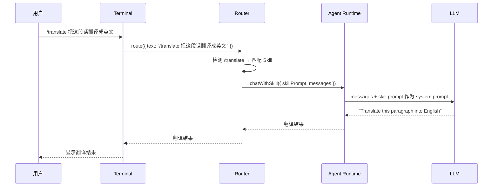

# Chapter 9b: Skills 系统

在前面的章节中，我们实现了插件系统来扩展 Agent 的能力。但插件系统主要面向**开发者**——你需要写 TypeScript 代码来创建插件。有没有一种更轻量的方式，让**普通用户**也能自定义 Agent 的行为？

答案是 **Skills**——一个基于 Markdown 文件的 prompt 管理系统。用户只需要写一个 `SKILL.md` 文件，就能定义一个新的"技能"，通过 `/skill-name` 斜杠命令随时调用。

## Skills vs 插件

| | Skills | 插件 |
|--|--------|------|
| 定义方式 | Markdown 文件 (YAML + prompt) | TypeScript 代码 |
| 使用门槛 | 低，只需会写 prompt | 高，需要编程 |
| 能力范围 | 替换 system prompt | 注册工具、通道等 |
| 调用方式 | `/skill-name` 斜杠命令 | 自动集成到运行时 |
| 适用场景 | 翻译、总结、代码审查等 | 天气API、数据库查询等 |

简单来说：**Skills 是给用户的，插件是给开发者的**。

## SKILL.md 格式

每个 Skill 是一个目录，包含一个 `SKILL.md` 文件。文件由两部分组成：

1. **YAML frontmatter** — 元数据（名称、描述、是否可由用户调用）
2. **Markdown body** — Skill 的 prompt 内容

```markdown
---
name: translate
description: Translate text to a target language
emoji: 🌐
user-invocable: true
---

You are a professional translator. Your task is to translate
the user's text accurately and naturally.

## Rules

- If the user specifies a target language, use that language.
- If no target language is specified, translate to English
  if the input is non-English, or to Chinese if English.
- Preserve the original tone, style, and formatting.

Respond with only the translated text.
```

关键字段说明：

- `name` — Skill 名称，也是斜杠命令名（`/translate`）
- `description` — 简短描述，在 `/skills` 列表中显示
- `emoji`（可选）— 显示用的图标
- `user-invocable` — 是否允许用户通过 `/name` 调用

## Skills 加载目录

Skills 从两个目录加载，优先级从高到低：

1. **`<workspace>/skills/`** — 项目级，跟随项目走
2. **`~/.myclaw/skills/`** — 用户级，全局可用

如果两个目录都有同名 Skill，项目级的会覆盖用户级的。

```
my-project/
├── skills/
│   └── translate/
│       └── SKILL.md     ← 项目级 Skill
└── ...

~/.myclaw/
├── skills/
│   └── summarize/
│       └── SKILL.md     ← 用户级 Skill
└── myclaw.yaml
```

## 实现解析

### Skill 接口与加载器

首先定义 `Skill` 接口和 SKILL.md 解析函数：

```typescript
// src/skills/loader.ts

export interface Skill {
  name: string;
  description: string;
  emoji?: string;
  userInvocable: boolean;
  prompt: string;
}
```

`parseSkillFile` 函数解析 SKILL.md 的 YAML frontmatter 和 body：

```typescript
export function parseSkillFile(content: string): Skill {
  // 用正则匹配 --- 分隔的 frontmatter
  const match = content.match(/^---\r?\n([\s\S]*?)\r?\n---\r?\n([\s\S]*)$/);
  if (!match) {
    throw new Error("Invalid SKILL.md: missing YAML frontmatter");
  }

  const [, frontmatterRaw, body] = match;
  const frontmatter = parseYaml(frontmatterRaw);

  return {
    name: frontmatter.name,
    description: frontmatter.description,
    emoji: typeof frontmatter.emoji === "string" ? frontmatter.emoji : undefined,
    userInvocable: frontmatter["user-invocable"] === true,
    prompt: body.trim(),
  };
}
```

`loadSkills` 函数从多个目录加载 Skills，同名取高优先级：

```typescript
export function loadSkills(dirs: string[]): Skill[] {
  const seen = new Set<string>();
  const result: Skill[] = [];

  for (const dir of dirs) {
    const skills = loadSkillsFromDir(dir);
    for (const skill of skills) {
      if (!seen.has(skill.name)) {
        seen.add(skill.name);
        result.push(skill);
      }
    }
  }

  return result;
}
```

### Skill 注册表

`SkillRegistry` 管理所有已加载的 Skills，并提供查询和系统 prompt 生成功能：

```typescript
// src/skills/registry.ts

export class SkillRegistry {
  private skills = new Map<string, Skill>();

  register(skill: Skill): void {
    this.skills.set(skill.name, skill);
  }

  get(name: string): Skill | undefined {
    return this.skills.get(name);
  }

  listUserInvocable(): Skill[] {
    return this.getAll().filter((s) => s.userInvocable);
  }

  // 生成注入 system prompt 的 Skills 列表
  buildSystemPromptSection(): string {
    const invocable = this.listUserInvocable();
    if (invocable.length === 0) return "";

    const lines = [
      "",
      "## Available Skills",
      "Users can invoke skills with slash commands:",
    ];
    for (const skill of invocable) {
      const prefix = skill.emoji ? `${skill.emoji} ` : "";
      lines.push(`- /${skill.name}: ${prefix}${skill.description}`);
    }
    return lines.join("\n");
  }
}
```

### Agent Runtime 变更

`AgentRuntime` 新增 `chatWithSkill` 方法，用 Skill 的 prompt 替代默认 system prompt：

```typescript
// src/agent/runtime.ts 新增

export interface AgentRuntime {
  chat(request: { providerId?: string; messages: ChatMessage[] }): Promise<string>;
  chatWithSkill(request: {
    providerId?: string;
    messages: ChatMessage[];
    skillPrompt: string;
  }): Promise<string>;
  registerTool(tool: AgentTool): void;
}
```

核心思路：`chatWithSkill` 和 `chat` 共享同一个 agent loop（工具调用循环），唯一的区别是 system prompt 的来源不同。

### Router 拦截 /skill 命令

Router 检测以 `/` 开头的消息，匹配到 Skill 后调用 `chatWithSkill`：

```typescript
// src/routing/router.ts

async route(request: RouteRequest): Promise<string> {
  // 检测 /skill-name 命令
  if (skillRegistry && request.text.startsWith("/")) {
    const match = request.text.match(/^\/(\S+)\s*([\s\S]*)$/);
    if (match) {
      const [, skillName, rest] = match;
      const skill = skillRegistry.get(skillName);
      if (skill && skill.userInvocable) {
        return agent.chatWithSkill({
          providerId,
          skillPrompt: skill.prompt,
          messages: [...request.history, { role: "user", content: rest.trim() || request.text }],
        });
      }
    }
  }

  // 未匹配 → 原有路由流程
  // ...
}
```

### Terminal 的 /skills 命令

Terminal 通道新增 `/skills` 内置命令，列出所有可用的 Skills：

```typescript
case "/skills": {
  const skills = this.skillRegistry.listUserInvocable();
  if (skills.length === 0) {
    console.log(chalk.dim("\nNo user-invocable skills available.\n"));
  } else {
    console.log(chalk.dim("\nAvailable skills:"));
    for (const skill of skills) {
      const prefix = skill.emoji ? `${skill.emoji} ` : "";
      console.log(chalk.dim(`  /${skill.name} - ${prefix}${skill.description}`));
    }
    console.log();
  }
  return true;
}
```

## 数据流

当用户输入 `/translate Hello world` 时，数据流如下：



关键区别：普通消息走 `agent.chat()`（使用默认 system prompt），Skill 调用走 `agent.chatWithSkill()`（使用 Skill 的 prompt）。

## 启动时加载

在 `agent` 和 `gateway` 命令中，启动时自动扫描 Skills 目录：

```typescript
// src/cli/commands/agent.ts

const skillDirs = [
  path.join(process.cwd(), "skills"),          // 项目级
  path.join(os.homedir(), ".myclaw", "skills"), // 用户级
];
const skills = loadSkills(skillDirs);
const skillRegistry = createSkillRegistry(skills);

// 传给 runtime 和 router
const agent = createAgentRuntime(ctx.config, { skillRegistry });
const router = createRouter(ctx.config, agent, { skillRegistry });
const terminal = createTerminalChannel(ctx.config, router, skillRegistry);
```

## 验证

```bash
# 启动 agent
npx myclaw agent

# 查看可用 Skills
/skills
# 输出:
# Available skills:
#   /translate - 🌐 Translate text to a target language
#   /summarize - 📝 Summarize text concisely

# 调用翻译 Skill
/translate Hello, how are you today?
```

## 创建自定义 Skill

想要创建自己的 Skill？只需要三步：

1. 在 `skills/` 目录下创建一个新目录
2. 在其中创建 `SKILL.md` 文件
3. 重启 agent

例如，创建一个代码审查 Skill：

```bash
mkdir -p skills/code-review
```

```markdown
<!-- skills/code-review/SKILL.md -->
---
name: code-review
description: Review code and suggest improvements
emoji: 🔍
user-invocable: true
---

You are an experienced code reviewer. Analyze the provided code and give
constructive feedback focusing on:

1. **Bugs and potential issues**
2. **Performance concerns**
3. **Code readability and maintainability**
4. **Best practices and design patterns**

Be specific, reference line numbers when possible, and suggest concrete improvements.
```

重启后即可使用 `/code-review` 命令。

## 小结

本章实现了 MyClaw 的 Skills 系统，关键设计要点：

1. **SKILL.md 格式** — YAML frontmatter + Markdown body，简单直观
2. **多级加载** — 项目级优先于用户级，支持覆盖
3. **SkillRegistry** — 统一管理，提供查询和 system prompt 注入
4. **Router 拦截** — `/skill-name` 命令自动路由到 Skill 处理
5. **复用 agent loop** — Skill 调用和普通聊天共享工具调用循环

Skills 是连接"开发者能力"和"用户需求"的桥梁——用户不需要写代码，只需要写 prompt 就能自定义 Agent 的行为。
