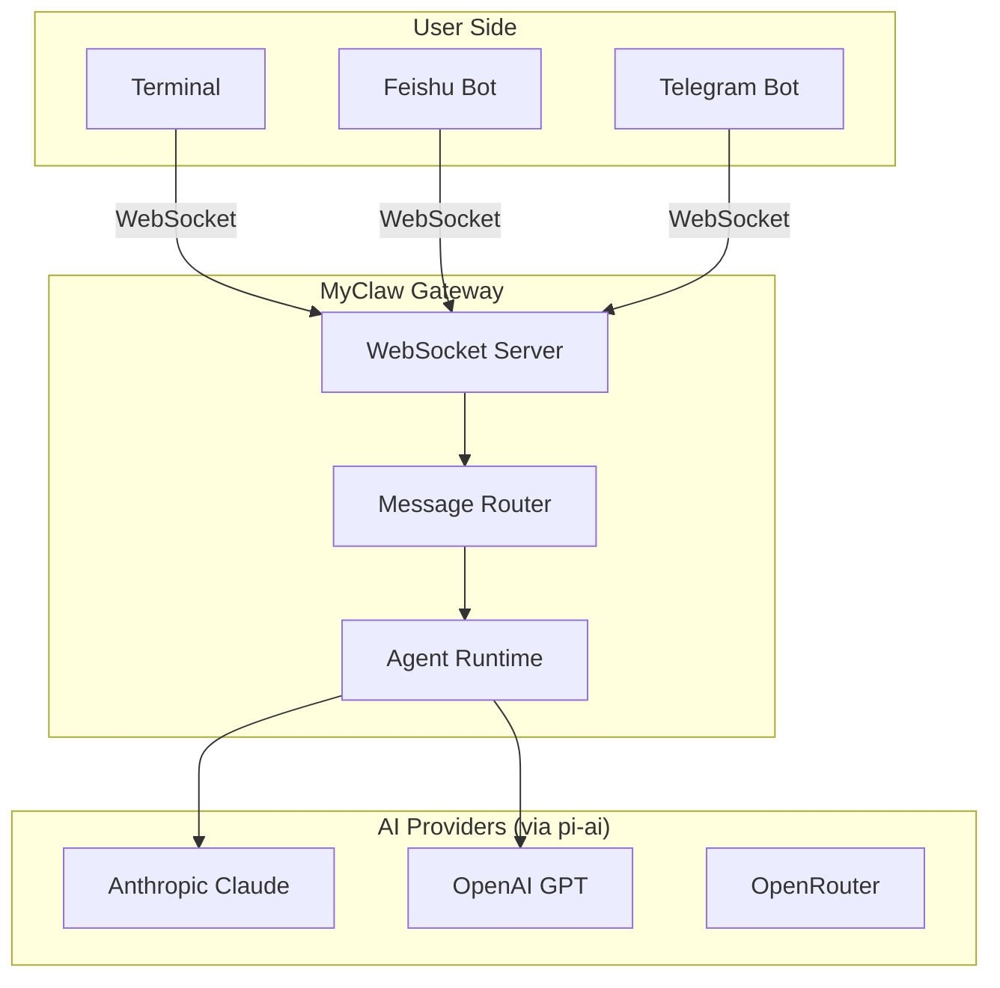
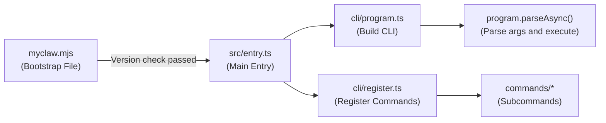
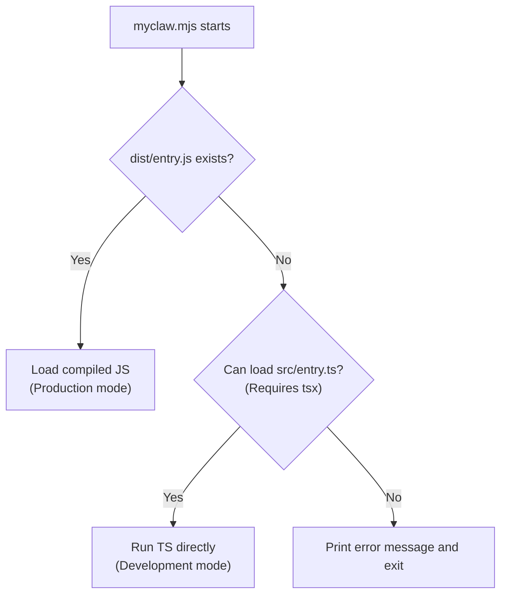
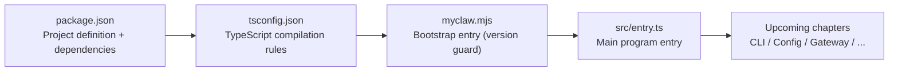

# Chapter 1: Project Setup

> Corresponding source files: `package.json`, `tsconfig.json`, `myclaw.mjs`, `src/entry.ts`

## What Are We Building?

MyClaw is an educational project that guides you through building an **AI assistant** similar to OpenClaw from scratch. By implementing it yourself, you'll gain a deep understanding of the following core architectural patterns:

- **AI Agent Core** -- How to design an intelligent Agent with tool calling, context management, and multi-turn conversation capabilities
- **AI Provider Abstraction Layer** -- How to create a unified interface for different LLMs like Anthropic Claude, OpenAI GPT, and more
- **Message Channel System** -- How to let different channels such as Terminal, Feishu, and Telegram share the same Agent backend
- **WebSocket Gateway** -- How to use real-time communication to coordinate the frontend and backend
- **Plugin Architecture** -- How to make the Agent extensible through a Tools mechanism

The overall system architecture can be summarized in the diagram below:



**Core concept**: Users send messages through different channels, the gateway receives them uniformly and routes them to the Agent runtime, the Agent selects the appropriate LLM Provider to generate a response, and then sends it back along the same path. This is the basic workflow of OpenClaw, and MyClaw will fully replicate this pattern.

## Project Structure

Before we dive in, let's take a look at the final project directory structure:

```
build-your-own-openclaw/
├── myclaw.mjs            # Bootstrap file (Node.js version check + entry delegation)
├── package.json          # Project metadata, dependencies, scripts
├── tsconfig.json         # TypeScript compilation configuration
└── src/                  # All TypeScript source code
    ├── entry.ts          # Main entry: build CLI, register commands, start the program
    ├── cli/              # CLI framework (Commander.js)
    │   ├── program.ts    # CLI program definition
    │   ├── register.ts   # Command registration center
    │   └── commands/     # Individual subcommand implementations
    ├── config/           # Configuration system (reads ~/.myclaw/myclaw.yaml)
    │   ├── schema.ts     # Zod schema definitions
    │   ├── loader.ts     # Configuration file loader
    │   └── index.ts      # Unified exports
    ├── gateway/          # WebSocket gateway server
    │   ├── server.ts     # WS server
    │   ├── session.ts    # Session management
    │   └── protocol.ts   # Communication protocol definitions
    ├── agent/            # Agent runtime (core AI conversation logic)
    │   ├── runtime.ts    # Agent run loop
    │   ├── tools.ts      # Tool invocation system
    │   └── providers/    # LLM Provider abstraction
    ├── channels/         # Message channels (Terminal, Feishu, etc.)
    │   ├── transport.ts  # Channel abstract base class
    │   ├── manager.ts    # Channel manager
    │   ├── terminal.ts   # Terminal channel
    │   └── feishu.ts     # Feishu channel
    ├── routing/          # Message routing
    └── plugins/          # Plugin system
```

The following flowchart shows the call relationships between files during the startup process:



**Why split into `myclaw.mjs` and `src/entry.ts`?** Because `myclaw.mjs` is a pure JavaScript file that can run without any compilation. Its sole responsibility is to act as a "gatekeeper" -- ensuring the runtime environment meets requirements before loading the main program written in TypeScript. This is a battle-tested startup pattern from OpenClaw: **fail fast, fail friendly**.

## Step 1: Create package.json

`package.json` is the "identity card" of the entire project. Let's go through each configuration section and understand its purpose.

Create the project directory and initialize:

```bash
mkdir build-your-own-myclaw
cd build-your-own-myclaw
```

Then create `package.json` with the following content:

```json
{
  "name": "build-your-own-openclaw",
  "version": "1.0.0",
  "description": "Build Your Own OpenClaw - A step-by-step tutorial to build an AI assistant",
  "type": "module",
  "bin": {
    "myclaw": "./myclaw.mjs"
  },
  "scripts": {
    "build": "tsc",
    "dev": "tsx src/entry.ts",
    "start": "node dist/entry.js",
    "gateway": "tsx src/entry.ts gateway",
    "agent": "tsx src/entry.ts agent",
    "onboard": "tsx src/entry.ts onboard"
  },
  "engines": {
    "node": ">=20.0.0"
  }
}
```

Let's go through each field and its purpose:

### `"type": "module"` -- Enabling ESM

This line tells Node.js: all `.js` and `.mjs` files in this project use ESM (ECMAScript Modules) instead of CommonJS. This means:

- You can use `import/export` syntax instead of `require/module.exports`
- You can use **top-level `await`** -- this is essential for our bootstrap file `myclaw.mjs`, which needs to `await import()` directly at the top level

### `"bin"` -- Registering the Executable Command

```json
"bin": {
  "myclaw": "./myclaw.mjs"
}
```

This tells npm: when a user runs `npx myclaw` or executes `myclaw` after a global install, it should run the `myclaw.mjs` file. This is the "front door" of the CLI tool.

### `"scripts"` -- Development Scripts

| Script | Command | Purpose |
|--------|---------|---------|
| `build` | `tsc` | Compiles TypeScript to JavaScript in the `dist/` directory |
| `dev` | `tsx src/entry.ts` | Development mode; tsx compiles and runs TypeScript on the fly, no pre-compilation needed |
| `start` | `node dist/entry.js` | Production mode; runs the pre-compiled code |
| `gateway` | `tsx src/entry.ts gateway` | Quickly starts the gateway server |
| `agent` | `tsx src/entry.ts agent` | Quickly starts Agent interactive mode |
| `onboard` | `tsx src/entry.ts onboard` | Runs the onboarding wizard to create a configuration file |

**Why does `dev` use `tsx` while `start` uses `node`?** `tsx` is a development tool that can run `.ts` files directly, skipping the manual compilation step. But in production, we want to run pre-compiled `.js` files for better performance and fewer dependencies.

### `"engines"` -- Version Constraints

```json
"engines": {
  "node": ">=20.0.0"
}
```

This declares that the project requires Node.js 20 or higher. Note: npm doesn't enforce this constraint by default (unless `engine-strict` is configured), so we also perform a runtime check in `myclaw.mjs` -- **double insurance**.

## Step 2: Install Dependencies

Now let's install all the dependencies the project needs:

```bash
# Runtime dependencies
npm install @mariozechner/pi-ai @mariozechner/pi-agent-core @mariozechner/pi-coding-agent commander ws zod chalk yaml dotenv eventemitter3 readline @larksuiteoapi/node-sdk

# Development dependencies
npm install -D typescript tsx @types/node @types/ws
```

### Dependency Overview

The following table lists each dependency's role and which MyClaw module it corresponds to:

| Package | Version | Category | Purpose | Corresponding Module |
|---------|---------|----------|---------|---------------------|
| `@mariozechner/pi-ai` | ^0.57.1 | AI | LLM abstraction layer (Model, stream, provider auto-discovery) | `agent/model.ts` |
| `@mariozechner/pi-agent-core` | ^0.57.1 | AI | Agent state machine + agent loop (message management, tool execution cycle) | `agent/runtime.ts` |
| `@mariozechner/pi-coding-agent` | ^0.57.1 | AI | Coding agent wrapper (built-in tools, Skills, InteractiveMode TUI) | `cli/commands/agent.ts`, `agent/runtime.ts` |
| `commander` | ^13.1.0 | CLI | Command-line framework for parsing arguments and subcommands | `cli/program.ts` |
| `ws` | ^8.18.1 | Network | WebSocket client and server library | `gateway/server.ts` |
| `zod` | ^3.24.2 | Validation | Runtime schema validation for configuration and input | `config/schema.ts` |
| `chalk` | ^5.4.1 | UI | Colorful terminal output for a better CLI experience | Used throughout |
| `yaml` | ^2.7.0 | Config | Parsing and serializing YAML configuration files | `config/loader.ts` |
| `dotenv` | ^16.4.7 | Config | Loads environment variables from `.env` files (API keys, etc.) | `config/loader.ts` |
| `eventemitter3` | ^5.0.1 | Architecture | High-performance event emitter for decoupled inter-module communication | `gateway/`, `channels/` |
| `readline` | ^1.3.0 | UI | Interactive terminal input (for Gateway's Terminal channel) | `channels/terminal.ts` |
| `@larksuiteoapi/node-sdk` | ^1.59.0 | Channel | Feishu Open Platform SDK | `channels/feishu.ts` |

Development dependencies:

| Package | Version | Purpose |
|---------|---------|---------|
| `typescript` | ^5.8.2 | TypeScript compiler |
| `tsx` | ^4.19.3 | Development tool for running TypeScript files directly (powered by esbuild) |
| `@types/node` | ^22.13.10 | Type definitions for Node.js APIs |
| `@types/ws` | ^8.5.14 | Type definitions for the ws library |

## Step 3: Configure TypeScript -- tsconfig.json

The TypeScript configuration determines how the code is compiled. Create `tsconfig.json`:

```json
{
  "compilerOptions": {
    "target": "ES2023",
    "module": "NodeNext",
    "moduleResolution": "NodeNext",
    "outDir": "./dist",
    "rootDir": "./src",
    "strict": true,
    "esModuleInterop": true,
    "skipLibCheck": true,
    "forceConsistentCasingInFileNames": true,
    "resolveJsonModule": true,
    "declaration": true,
    "declarationMap": true,
    "sourceMap": true
  },
  "include": ["src/**/*"],
  "exclude": ["node_modules", "dist"]
}
```

Let's go through each option:

### Compilation Target and Modules

| Option | Value | Description |
|--------|-------|-------------|
| `target` | `ES2023` | Output code uses ES2023 syntax. Fully supported by Node.js 20+, no need for downlevel transformations |
| `module` | `NodeNext` | Outputs modules in Node.js native ESM format |
| `moduleResolution` | `NodeNext` | Uses Node.js's ESM module resolution algorithm |

**An important detail about NodeNext**: When using `NodeNext` module resolution, your `import` statements in TypeScript source code must include the `.js` extension, even though the source file is `.ts`:

```typescript
// Correct -- even though the source file is program.ts, you must write .js in the import
import { buildProgram } from "./cli/program.js";

// Wrong -- NodeNext does not allow omitting the extension or using .ts
import { buildProgram } from "./cli/program";
import { buildProgram } from "./cli/program.ts";
```

This seems counterintuitive, but the reason is simple: TypeScript compiles to `.js` files, and Node.js ESM looks up files by the exact import path at runtime without auto-completing extensions. So the import path must match the final runtime file structure.

### Input and Output Directories

| Option | Value | Description |
|--------|-------|-------------|
| `rootDir` | `./src` | Root directory for TypeScript source files |
| `outDir` | `./dist` | Compilation output directory. `src/entry.ts` compiles to `dist/entry.js` |

### Strict Mode and Auxiliary Options

| Option | Value | Description |
|--------|-------|-------------|
| `strict` | `true` | Enables all strict type checking. This is a TypeScript best practice |
| `esModuleInterop` | `true` | Allows using `import x from 'y'` syntax to import CommonJS modules |
| `skipLibCheck` | `true` | Skips type checking of `.d.ts` files to speed up compilation |
| `forceConsistentCasingInFileNames` | `true` | Enforces consistent filename casing to avoid cross-platform issues |
| `resolveJsonModule` | `true` | Allows directly importing JSON files |

### Debugging Support

| Option | Value | Description |
|--------|-------|-------------|
| `declaration` | `true` | Generates `.d.ts` type declaration files |
| `declarationMap` | `true` | Generates source maps for declaration files, enabling IDE navigation to source code |
| `sourceMap` | `true` | Generates `.js.map` files, allowing debugging to map back to TypeScript source code |

## Step 4: Create the Bootstrap File -- myclaw.mjs

`myclaw.mjs` is the "front door" of the entire CLI. When a user types `myclaw` or `npx myclaw` in the terminal, this is the file that gets executed.

Create `myclaw.mjs`:

```javascript
#!/usr/bin/env node

/**
 * MyClaw Bootstrap Entry
 *
 * This is the executable entry point for the myclaw CLI.
 * It performs version checks and then delegates to the main entry.
 */

const MIN_NODE_VERSION = 20;

const major = parseInt(process.versions.node.split(".")[0], 10);
if (major < MIN_NODE_VERSION) {
  console.error(
    `MyClaw requires Node.js v${MIN_NODE_VERSION}+. Current: ${process.versions.node}`
  );
  console.error("Please upgrade Node.js: https://nodejs.org/");
  process.exit(1);
}

// Suppress experimental warnings for cleaner output
process.env.NODE_NO_WARNINGS = "1";

// Delegate to the compiled entry point or use tsx for dev
try {
  await import("./dist/entry.js");
} catch {
  // Fallback: try tsx for development
  try {
    await import("./src/entry.ts");
  } catch (e) {
    console.error("Failed to start MyClaw. Run 'npm run build' first or use 'npm run dev'.");
    console.error(e);
    process.exit(1);
  }
}
```

Although this file is short, it contains several design decisions worth exploring in depth. Let's analyze it section by section.

### The Shebang Line

```javascript
#!/usr/bin/env node
```

This line tells the operating system: "use `node` to run this file." After you globally install the project via `npm link`, you can simply type `myclaw` in the terminal just like running any regular program. Using `/usr/bin/env node` instead of `/usr/bin/node` is a portable approach -- it searches for `node` in your `PATH`, making it compatible with different system installation paths.

### Node.js Version Guard

```javascript
const MIN_NODE_VERSION = 20;

const major = parseInt(process.versions.node.split(".")[0], 10);
if (major < MIN_NODE_VERSION) {
  console.error(
    `MyClaw requires Node.js v${MIN_NODE_VERSION}+. Current: ${process.versions.node}`
  );
  console.error("Please upgrade Node.js: https://nodejs.org/");
  process.exit(1);
}
```

**Why check here instead of relying on the `engines` field in `package.json`?** Because `engines` only takes effect during `npm install` (and it's just a warning by default), whereas this check runs **every time** the program starts. Imagine a user who installed MyClaw and then downgraded Node.js -- without this guard, they'd see a bunch of incomprehensible syntax errors; with this guard, they get a clear, helpful message.

This is OpenClaw's design philosophy: **Fail at the earliest possible moment, in the friendliest possible way.**

### Suppressing Experimental Warnings

```javascript
process.env.NODE_NO_WARNINGS = "1";
```

Node.js outputs `ExperimentalWarning` messages for certain newer APIs (such as some ESM features). These warnings are just noise to end users. By setting this environment variable before the actual code runs, we keep the CLI output clean.

### Dual-Path Loading Strategy

```javascript
try {
  await import("./dist/entry.js");
} catch {
  try {
    await import("./src/entry.ts");
  } catch (e) {
    console.error("Failed to start MyClaw. Run 'npm run build' first or use 'npm run dev'.");
    console.error(e);
    process.exit(1);
  }
}
```

This code demonstrates a clever **dev/production dual-mode loading** strategy:



- **Production path**: First tries to load `dist/entry.js` (generated by `npm run build`), which is the fastest approach
- **Development path**: If `dist/` doesn't exist (hasn't been compiled yet), falls back to loading `src/entry.ts` directly. This requires `tsx` to be installed (it's in devDependencies)
- **Fallback message**: If both approaches fail, provides clear instructions for fixing the issue

Notice the use of **top-level `await`** here. `await import(...)` is written directly at the module's top level rather than inside an `async function` -- this is an ESM feature and one of the reasons we set `"type": "module"` in `package.json`.

### Why `.mjs` Instead of `.ts`?

The bootstrap file must be pure JavaScript (`.mjs`) because:

1. It runs before any compilation step -- it cannot depend on the TypeScript compiler
2. It needs to execute before even `tsx` has been loaded
3. Node.js can run `.mjs` files directly with zero dependencies

## Step 5: Create the Main Entry -- src/entry.ts

The bootstrap file loads `src/entry.ts`, which is the actual program entry point. Create the `src/` directory and the entry file:

```bash
mkdir -p src
```

Then create `src/entry.ts`:

```typescript
/**
 * Chapter 1 - Entry Point
 *
 * The main entry point for OpenClaw. Builds the CLI program,
 * registers all commands, and parses the command line.
 */

import { buildProgram } from "./cli/program.js";
import { registerAllCommands } from "./cli/register.js";

async function main() {
  const program = buildProgram();
  registerAllCommands(program);
  await program.parseAsync(process.argv);
}

main().catch((err) => {
  console.error("Fatal error:", err.message);
  if (process.env.MYCLAW_DEBUG) {
    console.error(err.stack);
  }
  process.exit(1);
});
```

This file does three things:

1. **Builds the CLI program** -- `buildProgram()` creates a Commander.js Program instance (we'll implement this in Chapter 2)
2. **Registers commands** -- `registerAllCommands()` mounts all subcommands (`gateway`, `agent`, `doctor`, etc.) onto the CLI
3. **Parses and executes** -- `program.parseAsync()` parses command-line arguments and runs the corresponding command handler

Notice the `MYCLAW_DEBUG` environment variable in the error handler: normally only the error message is shown, but setting `MYCLAW_DEBUG=1` prints the full stack trace, which is very helpful for debugging during development.

## Verifying the Setup

After completing the steps above, let's verify that everything is working correctly.

### 1. Install Dependencies

```bash
npm install
```

You should see the `node_modules/` directory created with no error output.

### 2. Verify TypeScript Compilation

```bash
npx tsc --noEmit
```

If the `src/` directory doesn't have the other files yet (`cli/program.ts`, etc.), this step will produce errors -- that's expected and shows that the TypeScript compiler is working. We'll create these files in subsequent chapters.

### 3. Verify the Bootstrap File

```bash
node myclaw.mjs
```

If you see a message like "Failed to start MyClaw," that means the bootstrap file's version check and loading logic are working correctly -- it properly tried both paths and then gave a friendly message.

### 4. Verify Development Mode (After Completing Chapter 2)

Once `src/cli/program.ts` and `src/cli/register.ts` are created, you can run in development mode:

```bash
npm run dev -- --help
```

This will run the TypeScript source code directly via `tsx` and display MyClaw's help information.

## Chapter Summary

In this chapter, we completed the project skeleton for MyClaw:



We learned several key architectural patterns:

- **Separating the bootstrap file from the main entry** -- Use pure JS for environment checks, use TS for business logic
- **Dual-path loading** -- Prioritize compiled output, fall back to development tools
- **Fail fast** -- Detect environment issues at the earliest opportunity and provide friendly messages
- **Configuration path conventions** -- MyClaw's user configuration is stored at `~/.myclaw/myclaw.yaml` (we'll implement this in detail in the configuration chapter)

These patterns come directly from OpenClaw's design practices and are widely adopted in production-grade CLI tools.

---

**Next chapter**: [CLI Framework](./03-cli-framework.md) -- Build the command-line interface with Commander.js, implementing subcommands like `myclaw gateway`, `myclaw agent`, `myclaw doctor`, and more
