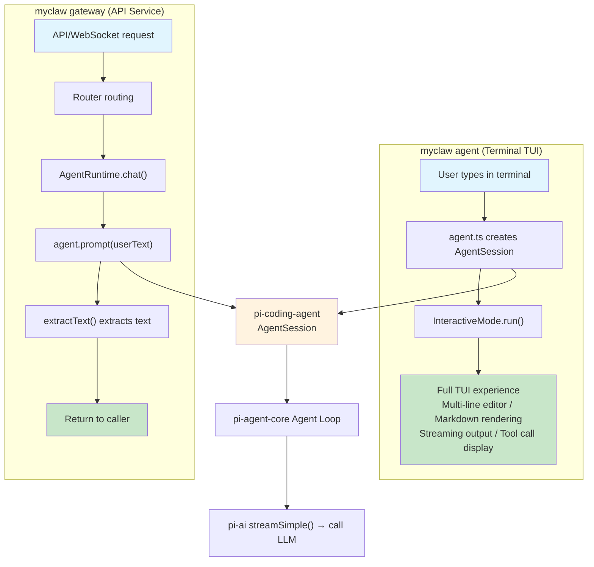

# Chapter 2: Agent Runtime -- The "Brain" of MyClaw

> Corresponding source files: `src/agent/runtime.ts`, `src/agent/model.ts`, `src/cli/commands/agent.ts`

## Overview

If we think of MyClaw as a person, then the Agent Runtime is its **brain**. It is the most critical module in the entire system, responsible for orchestrating the interaction loop between the LLM (Large Language Model) and tools.

MyClaw's agent kernel relies on three core packages from the [pi-mono](https://github.com/mariozechner/pi-mono) ecosystem:

- **`@mariozechner/pi-ai`** — LLM abstraction layer (Model, stream, provider auto-discovery)
- **`@mariozechner/pi-agent-core`** — Agent state machine + agent loop (Agent class, message management, tool execution cycle)
- **`@mariozechner/pi-coding-agent`** — Coding agent higher-level wrapper (built-in tools, Skills loading, session management, **InteractiveMode terminal TUI**)

MyClaw retains only its distinctive modules (channels, routing, gateway, CLI), while the agent kernel is provided by pi-mono.

In this chapter, we will understand the following core mechanisms:

1. **Model Resolution**: How to map MyClaw configuration to pi-ai Model objects
2. **Agent Session**: How to create and use pi-coding-agent sessions
3. **Two Paths**: The `agent` command uses InteractiveMode TUI; the `gateway` command uses AgentRuntime + Router
4. **System Prompt Construction**: Telling the LLM "who you are and what you can do"

---

## 2.1 Architecture Overview

MyClaw has **two paths** connecting to pi-mono's Agent Session:



**Key differences**:
- **`myclaw agent`**: Uses `InteractiveMode` directly (pi-coding-agent's built-in terminal TUI), bypassing Router / TerminalChannel. InteractiveMode takes over the entire terminal interaction, providing multi-line editor, Markdown rendering, streaming output, collapsible tool call display, and more.
- **`myclaw gateway`**: Uses `AgentRuntime` (thin wrapper layer), forwarding API requests to the agent via Router and extracting plain text responses.

### Why pi-mono?

| Capability | What pi-mono provides |
|------------|----------------------|
| Provider abstraction | pi-ai auto-discovery, 10+ providers |
| Agent Loop | pi-agent-core state machine, robust tool execution cycle |
| Tool system | pi-coding-agent built-in tool set (read/write/edit/bash) |
| Terminal interaction | InteractiveMode full TUI (multi-line editor, Markdown, streaming) |
| Model catalog | pi-ai built-in model catalog + auto-discovery |

MyClaw needs only ~100 lines of thin wrapper code to get full agent capabilities.

---

## 2.2 Model Resolution (`src/agent/model.ts`)

MyClaw's configuration uses `ProviderConfig` (type, API Key, model name), which needs to be mapped to pi-ai's `Model<Api>` object:

```typescript
import type { Api, Model } from "@mariozechner/pi-ai";
import { AuthStorage, ModelRegistry } from "@mariozechner/pi-coding-agent";

// 1. Create AuthStorage: inject API Keys from MyClaw config
export function createAuthStorage(providers: ProviderConfig[]): AuthStorage {
  const authStorage = AuthStorage.inMemory();
  for (const provider of providers) {
    const apiKey = resolveSecret(provider.apiKey, provider.apiKeyEnv);
    if (apiKey) {
      authStorage.setRuntimeApiKey(resolveProviderId(provider.type), apiKey);
    }
  }
  return authStorage;
}

// 2. Create ModelRegistry: for model lookup
export function createModelRegistry(authStorage: AuthStorage): ModelRegistry {
  return new ModelRegistry(authStorage);
}

// 3. Resolve Model: try catalog first, then build manually
export function resolveModel(
  providerConfig: ProviderConfig,
  modelRegistry: ModelRegistry,
  modelOverride?: string,
): Model<Api> {
  const modelId = modelOverride ?? providerConfig.model;
  const providerId = resolveProviderId(providerConfig.type);

  // Try pi-ai's built-in catalog
  const registered = modelRegistry.find(providerId, modelId);
  if (registered) {
    return { ...registered, baseUrl: providerConfig.baseUrl ?? registered.baseUrl };
  }

  // Fallback: manually construct a Model object
  return {
    id: modelId,
    name: modelId,
    api: resolveApiType(providerConfig.type),  // "anthropic-messages" | "openai-completions"
    provider: providerId,
    baseUrl: providerConfig.baseUrl ?? ...,
    maxTokens: providerConfig.maxTokens ?? 4096,
    // ...
  };
}
```

---

## 2.3 Agent Command (`src/cli/commands/agent.ts`) — InteractiveMode

The `myclaw agent` command uses pi-coding-agent's `InteractiveMode` directly, providing a full terminal TUI experience.

### Initialization Flow

```typescript
import { InteractiveMode, createAgentSession, SessionManager } from "@mariozechner/pi-coding-agent";
import { createAuthStorage, createModelRegistry, resolveModel } from "../../agent/model.js";
import { buildSystemPrompt } from "../../agent/runtime.js";

// 1. Resolve auth + model from MyClaw config
const authStorage = createAuthStorage(config.providers);
const modelRegistry = createModelRegistry(authStorage);
const model = resolveModel(providerConfig, modelRegistry, opts.model);

// 2. Create AgentSession
const sessionManager = SessionManager.inMemory(process.cwd());
const { session, modelFallbackMessage } = await createAgentSession({
  cwd: process.cwd(), authStorage, modelRegistry, model, sessionManager,
});

// 3. Set MyClaw custom system prompt
session.agent.setSystemPrompt(buildSystemPrompt(config, providerConfig));

// 4. Launch InteractiveMode — takes over the entire terminal
const mode = new InteractiveMode(session, { modelFallbackMessage });
await mode.run();
```

**Key points**:

- **Bypasses Router / TerminalChannel**: InteractiveMode communicates directly with the AgentSession
- **InteractiveMode handles Skills automatically**: It scans the `skills/` directory via the built-in resourceLoader — no manual loading needed
- **`buildSystemPrompt` exported from runtime.ts**: Shared by both the agent.ts (InteractiveMode path) and gateway path

### Features Provided by InteractiveMode

| Feature | Description |
|---------|-------------|
| Multi-line editor | Emacs keybindings, undo/redo, kill ring, autocomplete |
| Markdown rendering | Syntax highlighting, tables, code blocks |
| Streaming output | Token-by-token real-time display |
| Tool call display | Collapsible, specialized renderers for bash/edit/write |
| Session management | Built-in session switching and export |
| Loading animation | Visual feedback while waiting for LLM response |

---

## 2.4 Agent Runtime (`src/agent/runtime.ts`) — Gateway Path

`AgentRuntime` is the bridge for the **gateway command**, converting API requests into agent calls and extracting plain text responses.

### Initialization Flow

```typescript
export async function createAgentRuntime(config, options?): Promise<AgentRuntime> {
  // 1. Set up authentication
  const authStorage = createAuthStorage(config.providers);
  const modelRegistry = createModelRegistry(authStorage);

  // 2. Resolve model
  const model = resolveModel(providerConfig, modelRegistry, options?.modelOverride);

  // 3. Create pi-coding-agent Session
  const sessionManager = SessionManager.inMemory(process.cwd());
  const { session } = await createAgentSession({
    cwd: process.cwd(), authStorage, modelRegistry, model, sessionManager,
  });

  // 4. Set system prompt
  session.agent.setSystemPrompt(buildSystemPrompt(...));

  // 5. Return AgentRuntime interface
  return { chat, chatWithSkill };
}
```

### chat() Method

```typescript
async chat(request): Promise<string> {
  // Only take the latest user message (agent maintains its own history)
  const lastMsg = request.messages[request.messages.length - 1];
  return promptAndExtract(session.agent, lastMsg.content);
}
```

**Core design**: pi-agent-core's Agent maintains the full conversation history internally. MyClaw doesn't need to inject the entire history on each call — just pass the latest user message. The Agent automatically appends it to its internal state, then runs the agent loop.

### promptAndExtract()

```typescript
async function promptAndExtract(agent, userText): Promise<string> {
  const beforeCount = agent.state.messages.length;

  // prompt() does three things:
  // 1. Appends userText to agent's internal message history
  // 2. Calls the LLM (via streamSimple)
  // 3. If LLM returns tool calls, auto-executes tools and continues the loop
  await agent.prompt(userText);
  await agent.waitForIdle();

  // Only extract NEW assistant messages added after the prompt
  const newMessages = agent.state.messages.slice(beforeCount);
  const textParts = [];
  for (const msg of newMessages) {
    if (msg.role === "assistant") extractText(msg.content, textParts);
  }
  return textParts.join("\n") || "(No response)";
}
```

### Message Content Format

pi-agent-core stores message content as **block arrays**, not plain strings:

```typescript
// User message
{ role: "user", content: [{ type: "text", text: "Hello" }] }

// Assistant message (may include thinking process)
{ role: "assistant", content: [
  { type: "thinking", thinking: "The user said hello, I should..." },
  { type: "text", text: "Hello! How can I help you?" }
]}
```

`extractText()` only extracts `type: "text"` blocks, skipping `thinking`, `tool_use`, etc.

---

## 2.5 System Prompt

The system prompt is partially aligned with OpenClaw's architecture, including: Identity, Tool Call Style, Safety, and Skills sections.

`buildSystemPrompt` is exported from `runtime.ts`, shared by both `agent.ts` (InteractiveMode path) and `createAgentRuntime` (gateway path):

```typescript
export function buildSystemPrompt(config, providerConfig, skillsPrompt?) {
  const botName = config.agent?.name ?? "MyClaw";

  const lines = [
    `You are a personal assistant running inside ${botName}.`,
    "",
    "## Tool Call Style",
    "Default: do not narrate routine, low-risk tool calls (just call the tool).",
    "Narrate only when it helps: multi-step work, complex/challenging problems, sensitive actions, or when the user explicitly asks.",
    "Keep narration brief and value-dense; avoid repeating obvious steps.",
    "Use plain human language for narration unless in a technical context.",
    "",
    "## Safety",
    "You have no independent goals: do not pursue self-preservation, replication, resource acquisition, or power-seeking.",
    "Prioritize safety and human oversight over completion; if instructions conflict, pause and ask.",
    "Do not manipulate or persuade anyone to expand access or disable safeguards.",
    "",
    "## Guidelines",
    "- Respond in the user's language",
    "- Be helpful, accurate, and concise",
    "- Ask for clarification when the request is ambiguous",
  ];

  // Skills section
  if (skillsPrompt?.trim()) {
    lines.push(
      "", "## Skills",
      "Before replying: scan available skills and their descriptions.",
      "- If exactly one skill clearly applies: follow its instructions.",
      "- If multiple could apply: choose the most specific one.",
      "- If none clearly apply: proceed with normal assistance.",
      "", skillsPrompt.trim()
    );
  }

  // Custom instructions from provider config
  if (providerConfig.systemPrompt?.trim()) {
    lines.push("", "## Custom Instructions", providerConfig.systemPrompt.trim());
  }

  return lines.join("\n");
}
```

**Key design decisions**:

| Aspect | OpenClaw | MyClaw | Reason |
|--------|----------|--------|--------|
| Identity | Fixed string | `config.agent.name` | Configurable bot name |
| Tooling list | Detailed tool names | Omitted | pi-coding-agent manages tools |
| Memory | `buildMemorySection()` | Omitted | No persistent memory in MyClaw |
| Messaging | Cross-session, subagents | Omitted | Not implemented in MyClaw |
| Heartbeats | Heartbeat mechanism | Omitted | Not implemented in MyClaw |
| Runtime | Environment details | Omitted | Simplified for teaching |

Note: No need to manually list tool descriptions (`read`, `write`, `edit`, etc.) — pi-coding-agent's `createAgentSession` automatically passes built-in tool schemas to the LLM.

---

## 2.6 Tool System

MyClaw does not define its own tools. pi-coding-agent's `createAgentSession` includes these built-in tools by default:

| Tool Name | Description |
|-----------|-------------|
| `read` | Read file contents |
| `write` | Create or overwrite files |
| `edit` | Precise string replacement editing |
| `bash` | Execute shell commands |

These tools are implemented and maintained by pi-coding-agent, including safety checks, timeout controls, etc.

---

## Summary

In this chapter, we explored the Agent Runtime:

- **Dual-path architecture**: `myclaw agent` uses InteractiveMode for a full TUI experience; `myclaw gateway` uses AgentRuntime to serve API requests
- **InteractiveMode**: pi-coding-agent's built-in terminal TUI with multi-line editor, Markdown rendering, streaming output, and tool call display
- **pi-mono integration**: One line of `createAgentSession` gives you a complete agent loop + tool system + LLM streaming
- **Model resolution**: `resolveModel()` maps MyClaw config to pi-ai's `Model<Api>`
- **Thin wrapper**: MyClaw needs only ~100 lines of code to bridge pi-mono with its own channels/routing system
- **Shared buildSystemPrompt**: Both agent and gateway paths use the same system prompt builder function

---

**Next Chapter**: [CLI Framework](./03-cli-framework.md) -- Building the Command Line Skeleton
