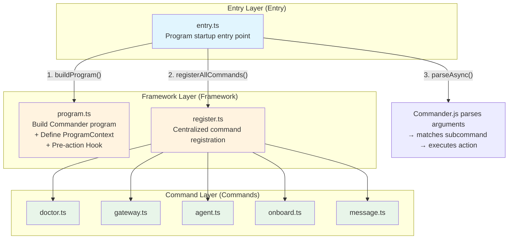
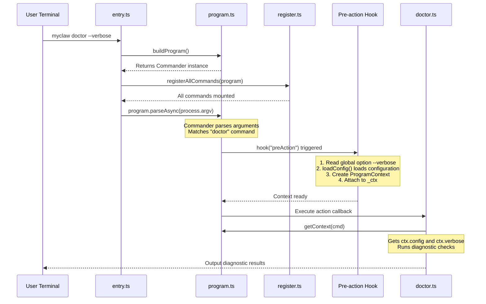
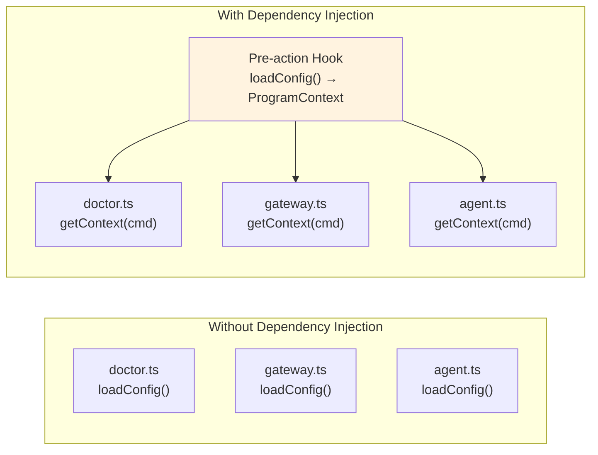

# Chapter 2: CLI Framework

> Corresponding source files: `src/entry.ts`, `src/cli/program.ts`, `src/cli/register.ts`, `src/cli/commands/doctor.ts`

## Chapter Goals

In this chapter, we'll build the CLI (Command Line Interface) skeleton of MyClaw. By the end, you'll have a fully functional command-line framework that can parse arguments, dispatch commands, and share context through dependency injection.

You will learn:

- How to build a professional CLI program with Commander.js
- What Dependency Injection is, and why it's essential for CLI programs
- How the Pre-action Hook pattern simplifies configuration loading
- How to design an extensible command registration system
- How to write your first command: `doctor`

---

## CLI Architecture Overview

Before we start writing code, let's understand the layered structure of the MyClaw CLI from a high level. We divide the entire CLI into three layers:



**Why three layers?** This layered design gives each layer a clear responsibility: the entry layer handles startup and error handling, the framework layer handles program definition and dependency injection, and the command layer handles specific business logic. When you need to add a new command, you only need to add a file in the command layer and write one extra line in the registration layer -- no other parts need to change.

---

## Command Dispatch Flow

When a user types `myclaw doctor --verbose` in the terminal, what happens inside MyClaw? Let's illustrate with a sequence diagram:



The key design insight here is: **commands themselves don't need to care about how configuration is loaded.** The `doctor` command simply calls `getContext(cmd)` to get the configuration object that's already prepared. This is the power of dependency injection.

---

## Step 1: Main Entry `src/entry.ts`

The main entry is the starting point of the entire CLI. Its responsibility is very simple: start the program and handle uncaught errors.

```typescript
// src/entry.ts

import { buildProgram } from "./cli/program.js";
import { registerAllCommands } from "./cli/register.js";

async function main() {
  const program = buildProgram();
  registerAllCommands(program);
  await program.parseAsync(process.argv);
}

main().catch((err) => {
  console.error("Fatal error:", err.message);
  if (process.env.MYCLAW_DEBUG) {
    console.error(err.stack);
  }
  process.exit(1);
});
```

**Line-by-line breakdown:**

| Line | What it does | Why |
|---|---|---|
| `buildProgram()` | Creates a Commander instance, defines name, version, global options, and Pre-action Hook | Centralizes the concern of "what the program looks like" in one place |
| `registerAllCommands(program)` | Mounts all subcommands onto the Commander instance | Centralizes the concern of "what commands exist" in one place |
| `program.parseAsync(process.argv)` | Parses command-line arguments, matches and executes the corresponding subcommand | Standard Commander.js entry point; `parseAsync` supports async actions |
| `.catch(...)` | Catches all unhandled exceptions, prints error messages, and exits | Prevents uncaught exceptions from failing silently |
| `MYCLAW_DEBUG` | Prints the full error stack trace in debug mode | Production shows concise error messages; during development you can see the full stack for debugging |

**Design thought: Why is `main()` async?**

Commander.js's `parseAsync()` returns a Promise. If any of your subcommands involve asynchronous operations (like reading files or making network requests), you need to use `parseAsync` instead of `parse`, otherwise async errors can't be caught. Many MyClaw commands (like gateway, agent) involve async operations, so we use `parseAsync` from the start.

---

## Step 2: Program Builder `src/cli/program.ts`

This is the most critical file in the CLI framework. It does three things:

1. **Defines the `ProgramContext` interface** -- the "contract" for dependency injection
2. **Builds the Commander instance** -- including global options and the Pre-action Hook
3. **Provides the `getContext()` helper function** -- so subcommands can conveniently access the context

### 2.1 ProgramContext: The Dependency Injection Container

```typescript
// src/cli/program.ts

import { Command } from "commander";
import { loadConfig, type OpenClawConfig } from "../config/index.js";

/**
 * Program context - shared state passed to all commands.
 * This is OpenClaw's dependency injection mechanism.
 */
export interface ProgramContext {
  config: OpenClawConfig;
  verbose: boolean;
}
```

**What is dependency injection? Why does a CLI need it?**

Imagine the situation without dependency injection: every subcommand would need to call `loadConfig()` itself to load the configuration. This leads to:

- **Duplicate code**: Every command file has to write configuration loading logic
- **Inconsistency**: Some command might forget to handle the case where configuration doesn't exist
- **Hard to test**: You can't substitute the configuration in tests, you'd have to rely on the real filesystem

`ProgramContext` solves these problems. It's a "dependency injection container" -- before a command executes, the framework layer bundles all dependencies (configuration, options) together, and subcommands simply use them directly.



The diagram above clearly shows the benefit of dependency injection: configuration loading logic appears in only one place (the Pre-action Hook), and all commands access their dependencies through the unified `getContext()`.

### 2.2 buildProgram(): Building the Commander Instance

```typescript
export function buildProgram(): Command {
  const program = new Command();

  program
    .name("myclaw")
    .description("MyClaw - Your personal AI assistant gateway")
    .version("1.0.0")
    .option("-v, --verbose", "Enable verbose logging", false);

  // Pre-action hook: load config and create context before any command runs
  program.hook("preAction", (thisCommand) => {
    const opts = thisCommand.opts();
    const config = loadConfig();
    // Attach context to the command for subcommands to access
    thisCommand.setOptionValue("_ctx", {
      config,
      verbose: opts.verbose ?? false,
    } satisfies ProgramContext);
  });

  return program;
}
```

**Section-by-section breakdown:**

**Program metadata**

```typescript
program
  .name("myclaw")
  .description("MyClaw - Your personal AI assistant gateway")
  .version("1.0.0")
  .option("-v, --verbose", "Enable verbose logging", false);
```

These are basic Commander.js APIs:
- `.name("myclaw")`: Sets the program name, affects what's displayed in `--help` output
- `.version("1.0.0")`: Automatically adds the `-V, --version` option
- `.option("-v, --verbose", ...)`: Defines a global option available to all subcommands

When a user runs `myclaw --help`, Commander.js automatically generates help documentation based on this information.

**Pre-action Hook (the core!)**

```typescript
program.hook("preAction", (thisCommand) => {
  const opts = thisCommand.opts();
  const config = loadConfig();
  thisCommand.setOptionValue("_ctx", {
    config,
    verbose: opts.verbose ?? false,
  } satisfies ProgramContext);
});
```

This is the most elegant part of the entire CLI framework. Commander.js's `hook("preAction", ...)` is called **before any subcommand's action callback executes**. We take advantage of this timing to:

1. **Read global options**: `thisCommand.opts()` retrieves global flags like `--verbose`
2. **Load configuration**: `loadConfig()` reads and validates configuration from `~/.myclaw/config.yaml`
3. **Create context**: Bundle configuration and options into a `ProgramContext` object
4. **Attach to the command**: `setOptionValue("_ctx", ...)` stores the context in an internal option prefixed with `_`

**About the `satisfies` keyword**: This is a feature introduced in TypeScript 4.9. It doesn't change the type of the value, but checks at compile time whether the object conforms to the `ProgramContext` interface. If you miss the `config` or `verbose` field, the TypeScript compiler will immediately raise an error. This is safer than the `as ProgramContext` type assertion, because assertions skip the check.

### 2.3 getContext(): The Bridge for Subcommands to Access Context

```typescript
export function getContext(cmd: Command): ProgramContext {
  const root = cmd.parent ?? cmd;
  return root.opts()._ctx as ProgramContext;
}
```

This helper function does something simple but important: it retrieves the previously attached `_ctx` context from Commander's command tree.

**Why do we need `cmd.parent ?? cmd`?**

In Commander.js, the `cmd` received by a subcommand's `action` callback is the subcommand itself (e.g., `doctor`), but `_ctx` is attached to the root command (`myclaw`). So we need to navigate up to the root command via `cmd.parent`. The `?? cmd` is a defensive design -- if a command happens to be the root command itself, it won't break.

---

## Step 3: Command Registration `src/cli/register.ts`

```typescript
// src/cli/register.ts

import type { Command } from "commander";
import { registerGatewayCommand } from "./commands/gateway.js";
import { registerAgentCommand } from "./commands/agent.js";
import { registerOnboardCommand } from "./commands/onboard.js";
import { registerDoctorCommand } from "./commands/doctor.js";
import { registerMessageCommand } from "./commands/message.js";

export function registerAllCommands(program: Command): void {
  registerGatewayCommand(program);   // myclaw gateway
  registerAgentCommand(program);     // myclaw agent
  registerOnboardCommand(program);   // myclaw onboard
  registerDoctorCommand(program);    // myclaw doctor
  registerMessageCommand(program);   // myclaw message send
}
```

**Design thought: Why centralized registration?**

You might wonder: why not import each command directly in `entry.ts`? The answer is **separation of concerns**.

- `entry.ts` only cares about "how the program starts"
- `register.ts` only cares about "what commands exist"
- Each command file only cares about "what it does"

The benefit of this separation becomes very apparent in practice: when you need to add a new command, you just need to:
1. Create a new file under `commands/`
2. Add one line of registration code in `register.ts`

No need to modify `entry.ts` or `program.ts`.

**Convention for `register*Command` function signatures**

Notice that all command registration functions follow a uniform pattern:

```typescript
function registerXxxCommand(program: Command): void
```

They receive a Commander instance, mount a subcommand on it, and return nothing. This uniform function signature keeps the `registerAllCommands` implementation very concise and makes adding new commands mechanical -- which is exactly what we want.

---

## Step 4: Doctor Command Deep Dive

`doctor` is the most suitable command in MyClaw for a teaching example -- it's simple enough, yet covers all the patterns needed to write a command. Let's analyze it section by section.

### 4.1 File Structure and Imports

```typescript
// src/cli/commands/doctor.ts

import type { Command } from "commander";
import fs from "node:fs";
import chalk from "chalk";
import { getContext } from "../program.js";
import { getConfigPath, getStateDir, resolveSecret } from "../../config/index.js";
```

Each import has a clear purpose:

| Import | Source | Purpose |
|---|---|---|
| `Command` | `commander` | TypeScript type, used for function parameter declarations |
| `fs` | `node:fs` | Check whether files/directories exist |
| `chalk` | `chalk` | Terminal output coloring, making diagnostic results easy to read at a glance |
| `getContext` | `../program.js` | Access the dependency-injected `ProgramContext` |
| `getConfigPath`, `getStateDir` | `../../config/index.js` | Get MyClaw's config path and state directory path |
| `resolveSecret` | `../../config/index.js` | Resolve secrets (supports direct values or environment variable names) |

Note that `Command` is imported with `import type` -- this is a TypeScript best practice, indicating that this import is only used for type checking and won't appear in the compiled JavaScript.

### 4.2 Command Registration

```typescript
export function registerDoctorCommand(program: Command): void {
  program
    .command("doctor")
    .description("Run diagnostics on your MyClaw installation")
    .action(async (_opts, cmd) => {
      // ... command logic
    });
}
```

Commander.js's chainable API:

- `.command("doctor")`: Creates a subcommand named `doctor` under the parent command
- `.description(...)`: Sets the subcommand's description, displayed in `myclaw --help`
- `.action(async (_opts, cmd) => {...})`: Sets the callback to execute when the command runs

**About action callback parameters**: Commander.js's action callback signature is `(options, command)`. Here `_opts` starts with an underscore to indicate we don't use the subcommand's own options (the doctor command doesn't define any extra options), but `cmd` is important -- it's the key to accessing the `ProgramContext`.

### 4.3 Getting the Context

```typescript
const ctx = getContext(cmd);
let allOk = true;

console.log(chalk.bold("\n🩺 MyClaw Doctor\n"));
```

The first step is calling `getContext(cmd)` to get the shared context. At this point, the Pre-action Hook has already run, so `ctx.config` contains the complete configuration object and `ctx.verbose` indicates whether verbose logging is enabled.

The `allOk` variable tracks whether all checks pass, and is used to output a summary at the end.

### 4.4 Diagnostic Check Logic

The Doctor command runs the following checks in sequence:

**Check 1: Node.js Version**

```typescript
const nodeVersion = process.versions.node;
const major = parseInt(nodeVersion.split(".")[0], 10);
if (major >= 20) {
  console.log(chalk.green(`  ✓ Node.js ${nodeVersion}`));
} else {
  console.log(chalk.red(`  ✗ Node.js ${nodeVersion} (need >= 20)`));
  allOk = false;
}
```

MyClaw requires Node.js 20+ (the `engines` field in package.json also declares this). Here we use `process.versions.node` to get the runtime version and parse the major version number for comparison.

**Check 2: State Directory**

```typescript
if (fs.existsSync(getStateDir())) {
  console.log(chalk.green(`  ✓ State dir: ${getStateDir()}`));
} else {
  console.log(chalk.yellow(`  ⚠ State dir missing: ${getStateDir()}`));
  console.log(chalk.dim(`    Run 'myclaw onboard' to create it`));
}
```

The state directory (default `~/.myclaw/`) stores configuration files and runtime data. If it's missing, a yellow warning is shown (not a fatal error) with a prompt to run `myclaw onboard` to create it.

**Check 3: Configuration File**

```typescript
if (fs.existsSync(getConfigPath())) {
  console.log(chalk.green(`  ✓ Config: ${getConfigPath()}`));
} else {
  console.log(chalk.yellow(`  ⚠ Config missing: ${getConfigPath()}`));
  console.log(chalk.dim(`    Run 'myclaw onboard' to create it`));
}
```

Same pattern -- checks whether the configuration file exists.

**Check 4: Providers (LLM Providers)**

```typescript
for (const provider of ctx.config.providers) {
  const key = resolveSecret(provider.apiKey, provider.apiKeyEnv);
  if (key) {
    console.log(
      chalk.green(`  ✓ Provider '${provider.id}': ${provider.type}/${provider.model}`)
    );
  } else {
    console.log(chalk.red(`  ✗ Provider '${provider.id}': No API key found`));
    console.log(chalk.dim(`    Set ${provider.apiKeyEnv ?? "apiKey in config"}`));
    allOk = false;
  }
}
```

This is where dependency injection shines -- `ctx.config.providers` is already a type-safe array, and we can iterate over it directly. The `resolveSecret()` function tries two ways to resolve a secret: reading the `apiKey` field directly from the configuration, or reading from the `apiKeyEnv` environment variable. If neither is available, the Provider configuration is incomplete.

**Check 5: Channels (Message Channels)**

```typescript
for (const channel of ctx.config.channels) {
  if (!channel.enabled) {
    console.log(chalk.dim(`  - Channel '${channel.id}': disabled`));
    continue;
  }
  if (channel.type === "terminal") {
    console.log(chalk.green(`  ✓ Channel '${channel.id}': terminal`));
  } else if (channel.type === "feishu") {
    const appId = resolveSecret(channel.appId, channel.appIdEnv);
    const appSecret = resolveSecret(channel.appSecret, channel.appSecretEnv);
    if (appId && appSecret) {
      console.log(chalk.green(`  ✓ Channel '${channel.id}': feishu`));
    } else {
      const missing = !appId ? "App ID" : "App Secret";
      console.log(chalk.red(`  ✗ Channel '${channel.id}': No ${missing}`));
      allOk = false;
    }
  }
}
```

The Channel check is more involved: it first skips disabled channels, then performs different checks based on channel type. Terminal channels don't require extra credentials, while Feishu channels need an App ID and App Secret.

### 4.5 Output Summary

```typescript
console.log();
if (allOk) {
  console.log(chalk.green.bold("  All checks passed! ✓\n"));
} else {
  console.log(chalk.yellow.bold("  Some checks failed. See above for details.\n"));
}
```

Finally, a summary is output based on the `allOk` flag. Note that chalk supports chaining colors and styles (`chalk.green.bold`).

---

## Teaching Moment: How to Add a New Command

Suppose you want to add a `myclaw status` command to display a summary of the current configuration. Here are the complete steps:

### Step 1: Create the Command File

Create `status.ts` under `src/cli/commands/`:

```typescript
// src/cli/commands/status.ts

import type { Command } from "commander";
import chalk from "chalk";
import { getContext } from "../program.js";

export function registerStatusCommand(program: Command): void {
  program
    .command("status")
    .description("Show current MyClaw configuration summary")
    .action(async (_opts, cmd) => {
      const ctx = getContext(cmd);   // Always the first step!

      console.log(chalk.bold("\nMyClaw Status\n"));
      console.log(`  Providers: ${ctx.config.providers.length}`);
      console.log(`  Channels:  ${ctx.config.channels.length}`);
      console.log(`  Verbose:   ${ctx.verbose}`);
    });
}
```

Key points:
- The exported function follows the `register<Name>Command` naming convention
- The parameter is `program: Command`
- Use `getContext(cmd)` in the action to get the context
- No need to call `loadConfig()` yourself -- dependency injection has already done it for you

### Step 2: Register in the Registration Center

Add the import and registration call in `src/cli/register.ts`:

```typescript
import { registerStatusCommand } from "./commands/status.js";

export function registerAllCommands(program: Command): void {
  registerGatewayCommand(program);
  registerAgentCommand(program);
  registerOnboardCommand(program);
  registerDoctorCommand(program);
  registerMessageCommand(program);
  registerStatusCommand(program);    // ← Add this line
}
```

### Step 3: Test

```bash
npx tsx src/entry.ts --help       # Confirm 'status' appears in the command list
npx tsx src/entry.ts status       # Run your new command
```

That's it! **You don't need to modify `entry.ts` or `program.ts`**. The framework layer's Pre-action Hook will automatically load configuration and inject context for your new command.

---

## Complete Command List

| Command | Function | Chapter |
|------|------|------|
| `myclaw doctor` | Diagnostic check, verifies installation and configuration are correct | This chapter |
| `myclaw onboard` | Guided configuration wizard, interactively generates config file | [Chapter 3](./03-configuration.md) |
| `myclaw gateway` | Start WebSocket gateway server | [Chapter 4](./04-gateway-server.md) |
| `myclaw agent` | Terminal interactive AI chat | [Chapter 5](./05-agent-runtime.md) |
| `myclaw message send` | Send a message to a specified channel | [Chapter 7](./07-message-routing.md) |

---

## Testing the CLI

Run the following commands in the project root directory to verify the CLI framework is working properly:

```bash
# View help info -- confirm program name, version, and subcommand list are correct
npx tsx src/entry.ts --help

# View version number
npx tsx src/entry.ts --version

# Run doctor diagnostics
npx tsx src/entry.ts doctor

# Run with verbose flag (test if global options work)
npx tsx src/entry.ts --verbose doctor

# Use debug mode to see full error stack traces
MYCLAW_DEBUG=1 npx tsx src/entry.ts doctor

# View subcommand help info
npx tsx src/entry.ts doctor --help
npx tsx src/entry.ts gateway --help
```

If the `doctor` command outputs diagnostic results normally (it's fine even if some checks don't pass), it means the entire CLI framework has been set up successfully.

---

## Chapter Summary

In this chapter, we built the CLI skeleton of MyClaw. Let's review the key design patterns:

| Pattern | Where it's used | What problem it solves |
|---|---|---|
| **Three-step startup** | `entry.ts` | Clear startup flow: build -> register -> parse |
| **Dependency Injection** | `ProgramContext` | Avoids each command repeatedly loading configuration |
| **Pre-action Hook** | `program.hook("preAction", ...)` | Uniformly prepares context before command execution |
| **Centralized Registration** | `register.ts` | Only two files need changes when adding a new command |
| **Uniform Function Signature** | `register*Command(program)` | Command registration pattern is mechanical and predictable |

These patterns may seem simple, but together they form an extensible, testable CLI architecture. As we continue adding new commands in subsequent chapters, you'll increasingly appreciate the value of this design.

---

**Next chapter**: [Configuration System](./03-configuration.md) -- YAML configuration files + Zod Schema validation, making configuration both flexible and type-safe.
