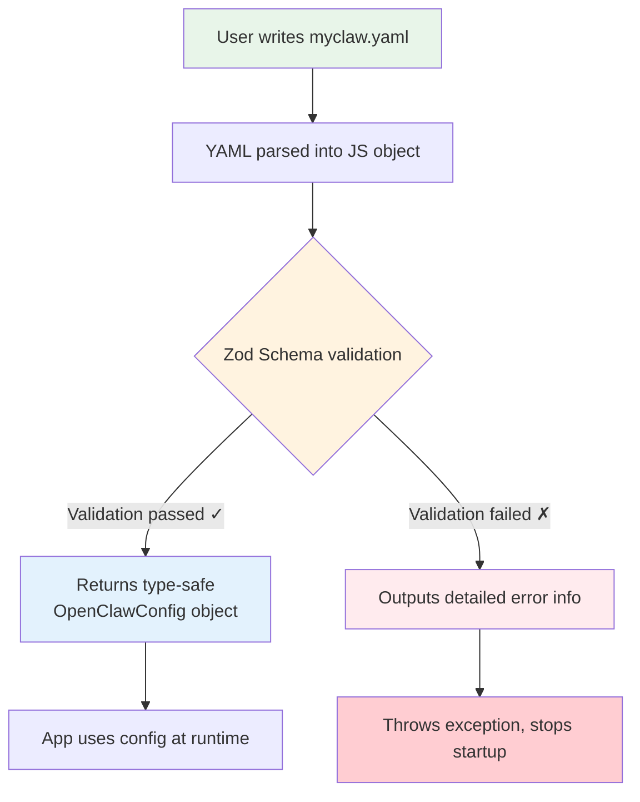
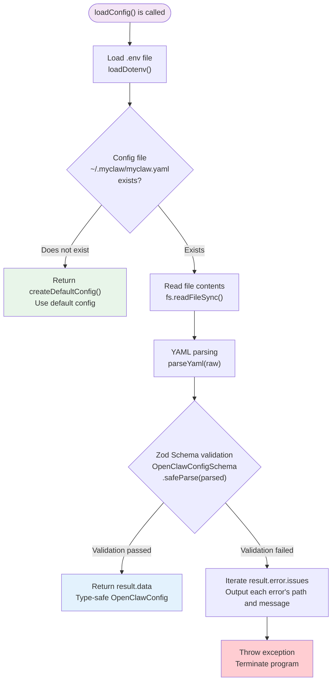

# Chapter 4: Configuration System

> Corresponding source files: `src/config/schema.ts`, `src/config/loader.ts`, `src/config/index.ts`, `src/cli/commands/onboard.ts`

## 4.1 Overview

MyClaw's configuration system is the "central nervous system" of the entire application. It determines:

- Which LLM provider to use (Anthropic / OpenAI / OpenRouter)
- Which channels to enable (Terminal / Feishu / Telegram)
- How messages are routed to different Agents
- Which plugins are enabled

The configuration file is stored at `~/.myclaw/myclaw.yaml` in YAML format — human-readable, supports comments, and is perfect for manual editing.

**Three core design principles of the configuration system:**

1. **YAML format** — More readable and editable for humans than JSON, with comment support
2. **Zod runtime validation** — Ensures configuration is type-safe at runtime, with automatic user-friendly error messages
3. **Secret resolution** — Sensitive information (API keys, tokens) can be provided directly or via environment variable references, avoiding plaintext exposure

## 4.2 Why Use Zod for Runtime Schema Validation?

In traditional TypeScript projects, type checking only works at compile time. But configuration files are loaded at runtime — hand-written YAML can easily contain typos, type errors, missing fields, and other issues. TypeScript's type system is powerless here.

This is where [Zod](https://zod.dev/) comes in. Zod is a TypeScript-first schema validation library that can:

- **Validate data structures at runtime**: Ensure the parsed YAML object matches expectations
- **Automatically generate TypeScript types**: Achieve "define once, use twice" via `z.infer<typeof Schema>`
- **Provide friendly error messages**: Pinpoint exactly which field has what problem
- **Set default values**: Use `.default()` so users only need to configure what they care about

The diagram below shows where Zod validation fits in the configuration system and what role it plays:



**Key insight**: Zod lets us solve both "runtime validation" and "compile-time type inference" with a single piece of code. Traditional approaches require writing things twice — once as an interface, once as a validation function — but Zod unifies them.

## 4.3 Provider Schema: LLM Provider Configuration

`ProviderConfigSchema` defines the configuration structure for LLM providers. MyClaw supports three provider types: Anthropic, OpenAI, and OpenRouter.

```typescript
// src/config/schema.ts

export const ProviderConfigSchema = z.object({
  id: z.string().describe("Unique provider identifier"),
  type: z.enum(["anthropic", "openai", "openrouter"]).describe("LLM provider type"),
  apiKey: z.string().optional().describe("API key (or use env var)"),
  apiKeyEnv: z.string().optional().describe("Environment variable name for API key"),
  baseUrl: z.string().optional().describe("Custom API base URL (for OpenRouter, etc.)"),
  model: z.string().describe("Model name to use"),
  maxTokens: z.number().default(4096).describe("Max tokens per response"),
  temperature: z.number().default(0.7).describe("Sampling temperature"),
  systemPrompt: z.string().optional().describe("System prompt for the agent"),
});

export type ProviderConfig = z.infer<typeof ProviderConfigSchema>;
```

### Field-by-Field Breakdown

| Field | Type | Required | Default | Description |
|-------|------|----------|---------|-------------|
| `id` | `string` | Yes | - | Unique provider identifier, referenced in routing rules. e.g., `"default"`, `"gpt"`, `"openrouter"` |
| `type` | `enum` | Yes | - | One of three: `"anthropic"`, `"openai"`, `"openrouter"`. Determines which SDK to use |
| `apiKey` | `string` | No | - | API key provided directly. **Not recommended** — storing in plaintext poses security risks |
| `apiKeyEnv` | `string` | No | - | Environment variable name, e.g., `"ANTHROPIC_API_KEY"`. **Recommended approach** |
| `baseUrl` | `string` | No | - | Custom API URL. Required for OpenRouter, also useful for proxy servers |
| `model` | `string` | Yes | - | Model name, e.g., `"claude-sonnet-4-6"`, `"gpt-4o"`, `"stepfun/step-3.5-flash:free"` |
| `maxTokens` | `number` | No | `4096` | Maximum tokens per response. Increasing this allows longer replies but costs more |
| `temperature` | `number` | No | `0.7` | Sampling temperature. 0 = deterministic output, 1 = more creative |
| `systemPrompt` | `string` | No | - | Custom system prompt for defining the Agent's behavior and personality |

**Design note**: Both `apiKey` and `apiKeyEnv` are optional, creating a flexible "choose one" pattern. The `resolveSecret()` function prioritizes the direct value, then falls back to the environment variable. This makes it convenient for quick testing during development while meeting security requirements in production.

### YAML Examples for Three Providers

```yaml
providers:
  # Anthropic (Claude series)
  - id: claude
    type: anthropic
    apiKeyEnv: ANTHROPIC_API_KEY
    model: claude-sonnet-4-6
    maxTokens: 4096

  # OpenAI (GPT series)
  - id: gpt
    type: openai
    apiKeyEnv: OPENAI_API_KEY
    model: gpt-4o
    temperature: 0.5

  # OpenRouter (aggregation platform, access to various free/paid models)
  - id: free-model
    type: openrouter
    apiKeyEnv: OPENROUTER_API_KEY
    baseUrl: https://openrouter.ai/api/v1
    model: stepfun/step-3.5-flash:free
```

## 4.4 Channel Schema: Channel Configuration

`ChannelConfigSchema` defines the configuration for messaging channels. Channels are the entry points for users to interact with MyClaw — terminal conversations, Feishu bots, Telegram bots, etc.

```typescript
// src/config/schema.ts

export const ChannelConfigSchema = z.object({
  id: z.string().describe("Unique channel identifier"),
  type: z.enum(["terminal", "feishu", "telegram"]).describe("Channel type"),
  enabled: z.boolean().default(true).describe("Whether the channel is active"),
  // Feishu-specific
  appId: z.string().optional().describe("Feishu App ID"),
  appIdEnv: z.string().optional().describe("Env var for Feishu App ID"),
  appSecret: z.string().optional().describe("Feishu App Secret"),
  appSecretEnv: z.string().optional().describe("Env var for Feishu App Secret"),
  // Telegram-specific
  botToken: z.string().optional().describe("Telegram Bot Token"),
  botTokenEnv: z.string().optional().describe("Env var for Telegram Bot Token"),
  allowedChatIds: z.array(z.number()).optional().describe("Allowed Telegram chat IDs (whitelist)"),
  // Common
  greeting: z.string().optional().describe("Greeting message on connect"),
});

export type ChannelConfig = z.infer<typeof ChannelConfigSchema>;
```

### Field-by-Field Breakdown

| Field | Type | Required | Default | Description |
|-------|------|----------|---------|-------------|
| `id` | `string` | Yes | - | Unique channel identifier, referenced in routing rules. e.g., `"terminal"`, `"feishu"`, `"telegram"` |
| `type` | `enum` | Yes | - | One of three: `"terminal"`, `"feishu"`, or `"telegram"` |
| `enabled` | `boolean` | No | `true` | Whether this channel is active. Set to `false` to temporarily disable without removing the configuration |
| `appId` | `string` | No | - | Feishu App ID (provided directly) |
| `appIdEnv` | `string` | No | - | Environment variable name for the Feishu App ID |
| `appSecret` | `string` | No | - | Feishu App Secret (provided directly) |
| `appSecretEnv` | `string` | No | - | Environment variable name for the Feishu App Secret |
| `botToken` | `string` | No | - | Telegram Bot Token (provided directly) |
| `botTokenEnv` | `string` | No | - | Environment variable name for the Telegram Bot Token |
| `allowedChatIds` | `number[]` | No | - | Whitelist of Telegram chat IDs allowed to interact |
| `greeting` | `string` | No | - | Welcome message displayed when a user connects |

**Design note**: The Feishu channel has 4 dedicated fields (`appId`/`appIdEnv`/`appSecret`/`appSecretEnv`), the Telegram channel has 3 dedicated fields (`botToken`/`botTokenEnv`/`allowedChatIds`), all following the same "direct value vs. environment variable" pattern as Provider. The Terminal channel doesn't need any authentication fields — just `id`, `type`, and an optional `greeting`.

## 4.5 Routing Rules and Plugin Configuration

### RouteRuleSchema: Routing Rules

Routing rules determine which Provider should handle messages from different channels.

```typescript
// src/config/schema.ts

export const RouteRuleSchema = z.object({
  channel: z.string().describe("Channel ID pattern (* for all)"),
  agent: z.string().default("default").describe("Agent/provider ID to route to"),
});

export type RouteRule = z.infer<typeof RouteRuleSchema>;
```

| Field | Type | Required | Default | Description |
|-------|------|----------|---------|-------------|
| `channel` | `string` | Yes | - | Channel ID, or use `"*"` as a wildcard to match all channels |
| `agent` | `string` | No | `"default"` | Target Provider's ID |

Routing rules are matched **from top to bottom**, and the first matching rule takes effect. The wildcard `"*"` is typically placed last as a catch-all:

```yaml
routing:
  - channel: feishu        # Feishu messages → use GPT
    agent: gpt
  - channel: "*"           # All other channels → use default Provider
    agent: default
```

### PluginConfigSchema: Plugin Configuration

```typescript
// src/config/schema.ts

export const PluginConfigSchema = z.object({
  id: z.string().describe("Plugin identifier"),
  enabled: z.boolean().default(true),
  config: z.record(z.unknown()).optional().describe("Plugin-specific config"),
});

export type PluginConfig = z.infer<typeof PluginConfigSchema>;
```

| Field | Type | Required | Default | Description |
|-------|------|----------|---------|-------------|
| `id` | `string` | Yes | - | Plugin identifier |
| `enabled` | `boolean` | No | `true` | Whether enabled |
| `config` | `Record<string, unknown>` | No | - | Plugin-specific configuration, using `z.record(z.unknown())` to support a flexible "arbitrary key-value pairs" structure |

**Design note**: `z.record(z.unknown())` is a very clever choice — it allows each plugin to freely define its own configuration format without having to enumerate every plugin's fields in the core Schema. This is an "open schema" design pattern.

## 4.6 Top-Level OpenClawConfigSchema

All sub-schemas ultimately converge into the top-level configuration schema:

```typescript
// src/config/schema.ts

export const OpenClawConfigSchema = z.object({
  // Gateway settings
  gateway: z
    .object({
      host: z.string().default("127.0.0.1"),
      port: z.number().default(18789),
      token: z.string().optional().describe("Gateway auth token"),
      tokenEnv: z.string().optional().describe("Env var for gateway token"),
    })
    .default({}),

  // LLM providers (at least one)
  providers: z.array(ProviderConfigSchema).min(1).describe("At least one LLM provider"),

  // Default provider ID
  defaultProvider: z.string().describe("ID of the default provider"),

  // Channel list
  channels: z.array(ChannelConfigSchema).default([]).describe("Messaging channels"),

  // Routing rules
  routing: z.array(RouteRuleSchema).default([{ channel: "*", agent: "default" }]),

  // Plugin list
  plugins: z.array(PluginConfigSchema).default([]),

  // Agent settings
  agent: z
    .object({
      name: z.string().default("MyClaw"),
      maxHistoryMessages: z.number().default(50),
      toolApproval: z.boolean().default(true).describe("Require approval for tool execution"),
    })
    .default({}),
});

export type OpenClawConfig = z.infer<typeof OpenClawConfigSchema>;
```

### Schema Structure Overview

Let's use a table to understand each top-level field:

| Field | Type | Required | Default | Description |
|-------|------|----------|---------|-------------|
| `gateway` | `object` | No | `{ host: "127.0.0.1", port: 18789 }` | Gateway server settings |
| `providers` | `array` | Yes | - | LLM provider list, **at least one** (`.min(1)`) |
| `defaultProvider` | `string` | Yes | - | ID of the default Provider |
| `channels` | `array` | No | `[]` | Channel list |
| `routing` | `array` | No | `[{ channel: "*", agent: "default" }]` | Routing rules, defaults to routing all channels to `default` |
| `plugins` | `array` | No | `[]` | Plugin list |
| `agent` | `object` | No | `{ name: "MyClaw", maxHistoryMessages: 50, toolApproval: true }` | Agent behavior settings |

**Significance of the two required fields**: `providers` and `defaultProvider` are the only two required fields. Without an LLM provider, MyClaw simply cannot work — this is the most basic requirement. All other fields have sensible defaults, ensuring that even a minimal configuration can run properly.

## 4.7 Default Configuration: createDefaultConfig()

When no configuration file exists, MyClaw uses a default configuration. The `createDefaultConfig()` function returns a ready-to-use configuration object:

```typescript
// src/config/schema.ts

export function createDefaultConfig(): OpenClawConfig {
  return {
    gateway: {
      host: "127.0.0.1",
      port: 18789,
    },
    providers: [
      {
        id: "default",
        type: "openrouter",
        apiKeyEnv: "OPENROUTER_API_KEY",
        model: "stepfun/step-3.5-flash:free",
        maxTokens: 4096,
        temperature: 0.7,
      },
    ],
    defaultProvider: "default",
    channels: [
      {
        id: "terminal",
        type: "terminal",
        enabled: true,
        greeting: "Hello! I'm MyClaw, your AI assistant. Type /help for commands.",
      },
    ],
    routing: [{ channel: "*", agent: "default" }],
    plugins: [],
    agent: {
      name: "MyClaw",
      maxHistoryMessages: 50,
      toolApproval: true,
    },
  };
}
```

**Design decisions behind the default configuration**:

- **Defaults to OpenRouter**: OpenRouter offers free models (`stepfun/step-3.5-flash:free`), lowering the barrier to entry — users can try it out without a paid API key
- **Only enables the terminal channel**: The simplest channel that requires no additional configuration
- **Wildcard routing**: `channel: "*"` routes all messages to the default Provider
- **Tool approval enabled**: `toolApproval: true`, safety first

## 4.8 Configuration Loader: loader.ts Deep Dive

The configuration loader is the bridge between `schema.ts` and the actual file system. It handles reading the YAML file, invoking Zod validation, writing configuration, and resolving secrets.

### Configuration Loading Flow



### Path Constants and Environment Variable Overrides

```typescript
// src/config/loader.ts

const STATE_DIR =
  process.env.MYCLAW_STATE_DIR || path.join(os.homedir(), ".myclaw");
const CONFIG_PATH =
  process.env.MYCLAW_CONFIG_PATH || path.join(STATE_DIR, "myclaw.yaml");
```

MyClaw supports two environment variables to override default paths:

| Environment Variable | Default | Description |
|---------------------|---------|-------------|
| `MYCLAW_STATE_DIR` | `~/.myclaw/` | State directory for storing config files and other persistent data |
| `MYCLAW_CONFIG_PATH` | `~/.myclaw/myclaw.yaml` | Config file path, can point to any location |

**Use cases**:

```bash
# Scenario 1: Multi-environment configuration
MYCLAW_CONFIG_PATH=~/.myclaw/production.yaml myclaw agent

# Scenario 2: Use a temporary directory for testing
MYCLAW_STATE_DIR=/tmp/myclaw-test myclaw agent

# Scenario 3: Team-shared configuration
MYCLAW_CONFIG_PATH=/shared/team-config.yaml myclaw gateway
```

**Priority logic**: Environment variable > Default value. If `MYCLAW_CONFIG_PATH` is set, that path is used directly, ignoring `MYCLAW_STATE_DIR`.

### loadConfig() Function Deep Dive

```typescript
// src/config/loader.ts

export function loadConfig(): OpenClawConfig {
  // Step 1: Load the .env file
  // If a .env file exists in the project root, inject its variables into process.env
  // This ensures environment variables referenced by apiKeyEnv can be resolved correctly
  loadDotenv();

  // Step 2: Check if the config file exists
  // If not, return the default config — ensures first-run works smoothly
  if (!fs.existsSync(CONFIG_PATH)) {
    return createDefaultConfig();
  }

  // Step 3: Read and parse the YAML
  const raw = fs.readFileSync(CONFIG_PATH, "utf-8");
  const parsed = parseYaml(raw);

  // Step 4: Zod validation
  // safeParse doesn't throw; it returns { success, data, error }
  const result = OpenClawConfigSchema.safeParse(parsed);
  if (!result.success) {
    // Iterate through all validation errors and print each one
    console.error("Configuration validation errors:");
    for (const issue of result.error.issues) {
      // issue.path is an array like ["providers", 0, "model"]
      // After join("."), it becomes "providers.0.model" — very intuitive
      console.error(`  - ${issue.path.join(".")}: ${issue.message}`);
    }
    throw new Error("Invalid configuration. Please fix the errors above.");
  }

  // Step 5: Return the validated config object
  // result.data is typed as OpenClawConfig — fully type-safe
  return result.data;
}
```

**Why use `safeParse` instead of `parse`?** `parse` throws a `ZodError` directly on validation failure, while `safeParse` returns a result object. Using `safeParse` lets us customize the error output format — printing each validation issue one by one, rather than throwing a massive error stack all at once. This is much more user-friendly.

### writeConfig() Function Deep Dive

```typescript
// src/config/loader.ts

export function writeConfig(config: OpenClawConfig): void {
  ensureStateDir();  // Ensure the ~/.myclaw/ directory exists
  const yaml = stringifyYaml(config, { indent: 2 });  // Object → YAML string
  fs.writeFileSync(CONFIG_PATH, yaml, "utf-8");        // Write to disk
}
```

This function is called by the `onboard` command to write the configuration generated through the interactive wizard to disk. `ensureStateDir()` uses `mkdirSync` with the `recursive: true` option, ensuring correct creation even if `~/.myclaw/` doesn't exist.

### resolveSecret() Function Deep Dive

```typescript
// src/config/loader.ts

export function resolveSecret(
  value?: string,    // Direct value: apiKey: "sk-ant-..."
  envVar?: string    // Env variable name: apiKeyEnv: "ANTHROPIC_API_KEY"
): string | undefined {
  if (value) return value;           // Prefer the direct value
  if (envVar) return process.env[envVar];  // Fall back to environment variable
  return undefined;                  // Return undefined if neither is available
}
```

**Usage example**:

```typescript
// Used during Provider initialization
const apiKey = resolveSecret(provider.apiKey, provider.apiKeyEnv);
if (!apiKey) {
  throw new Error(`No API key for provider ${provider.id}`);
}
```

This function is simple, but it's the core of MyClaw's security model — it lets users write API keys directly during development (convenient) or use environment variables in production (secure), while callers don't need to worry about which method is being used.

### loadConfigSnapshot()

```typescript
// src/config/loader.ts

export function loadConfigSnapshot(): Readonly<OpenClawConfig> {
  return Object.freeze(loadConfig());
}
```

`Object.freeze()` freezes the object, making it immutable. This is suitable for "read once, use everywhere" scenarios, preventing accidental runtime modifications to the configuration.

## 4.9 Unified Exports: index.ts

```typescript
// src/config/index.ts

export { OpenClawConfigSchema, createDefaultConfig } from "./schema.js";
export type { OpenClawConfig, ProviderConfig, ChannelConfig } from "./schema.js";
export {
  loadConfig,
  writeConfig,
  getStateDir,
  getConfigPath,
  resolveSecret,
  ensureStateDir,
  loadConfigSnapshot,
} from "./loader.js";
```

This is the common "barrel export" pattern in TypeScript projects — exposing multiple internal files through a single `index.ts`. External code only needs `import { loadConfig } from "../../config/index.js"`.

## 4.10 Onboard Setup Wizard

The `onboard` command provides an interactive setup wizard that guides users step by step to generate a configuration file. This is the recommended entry point for new users running MyClaw for the first time.

### Wizard Flow Deep Dive

```typescript
// src/cli/commands/onboard.ts

export function registerOnboardCommand(program: Command): void {
  program
    .command("onboard")
    .description("Interactive setup wizard for MyClaw")
    .action(async () => {
      // Create a readline interface for interactive Q&A
      const rl = readline.createInterface({
        input: process.stdin,
        output: process.stdout,
      });

      console.log(chalk.bold.cyan("\n🦀 Welcome to MyClaw Setup!\n"));

      // Start from the default config, progressively overriding with user choices
      const config = createDefaultConfig();

      // Step 1: Choose the LLM provider
      // Default is anthropic (even though createDefaultConfig uses openrouter,
      // the wizard offers anthropic/openai as options)
      const providerType = await ask(
        rl,
        `LLM Provider (anthropic/openai) [anthropic]: `
      );
      if (providerType === "openai") {
        config.providers[0].type = "openai";
        config.providers[0].apiKeyEnv = "OPENAI_API_KEY";
        config.providers[0].model = "gpt-4o";
      }

      // Step 2: API Key
      // First check if the environment variable already exists — if so, no need for user input
      const apiKeyEnvName = config.providers[0].apiKeyEnv!;
      const existingKey = process.env[apiKeyEnvName];
      if (existingKey) {
        console.log(chalk.green(`✓ Found ${apiKeyEnvName} in environment`));
      } else {
        // Environment variable not found, ask the user to input the API key directly
        const apiKey = await ask(rl, `Enter your API key: `);
        if (apiKey) {
          config.providers[0].apiKey = apiKey;
          config.providers[0].apiKeyEnv = undefined; // Clear the env var reference
        }
      }

      // Step 3: Model selection (provides a default; press Enter to skip)
      const model = await ask(rl, `Model [${config.providers[0].model}]: `);
      if (model) config.providers[0].model = model;

      // Step 4: Gateway port
      const port = await ask(rl, `Gateway port [18789]: `);
      if (port) config.gateway.port = parseInt(port, 10);

      // Step 5: Bot name
      const name = await ask(rl, `Bot name [MyClaw]: `);
      if (name) config.agent.name = name;

      // Step 6: Feishu channel (optional)
      const useFeishu = await ask(rl, `Enable Feishu channel? (y/N): `);
      if (useFeishu.toLowerCase() === "y") {
        const appId = await ask(rl, `Feishu App ID: `);
        const appSecret = await ask(rl, `Feishu App Secret: `);
        config.channels.push({
          id: "feishu",
          type: "feishu",
          enabled: true,
          appId: appId || undefined,
          appIdEnv: appId ? undefined : "FEISHU_APP_ID",
          appSecret: appSecret || undefined,
          appSecretEnv: appSecret ? undefined : "FEISHU_APP_SECRET",
        });
      }

      // Write the config file
      ensureStateDir();
      writeConfig(config);

      console.log(chalk.green(`\n✓ Configuration saved to ${getConfigPath()}`));
      console.log(`\nNext steps:`);
      console.log(`  myclaw agent    - Start chatting`);
      console.log(`  myclaw gateway  - Start the gateway server`);
      console.log(`  myclaw doctor   - Run diagnostics\n`);

      rl.close();
    });
}
```

### Wizard Run Example

```bash
$ npx tsx src/entry.ts onboard

🦀 Welcome to MyClaw Setup!

Let's configure your personal AI assistant.

LLM Provider (anthropic/openai) [anthropic]: anthropic
✓ Found ANTHROPIC_API_KEY in environment
Model [claude-sonnet-4-6]:
Gateway port [18789]:
Bot name [MyClaw]: MyClaw
Enable Feishu channel? (y/N): y
Feishu App ID: cli_xxxxx
Feishu App Secret: xxxxxxxxxxxxx

✓ Configuration saved to /Users/you/.myclaw/myclaw.yaml

Next steps:
  myclaw agent    - Start chatting
  myclaw gateway  - Start the gateway server
  myclaw doctor   - Run diagnostics
```

**Clever aspects of the wizard design**:

1. **Progressive overriding**: Starts from `createDefaultConfig()` and only overrides fields where the user provides a value. Pressing Enter to skip = use the default
2. **Automatic environment variable detection**: When an environment variable is already present, the input step is skipped, reducing user effort
3. **Smart secret handling**: If the user inputs an API key directly, the `apiKeyEnv` reference is cleared to avoid conflicts
4. **Deferred Feishu channel configuration**: Feishu config is only added when the user explicitly selects `y`, maintaining the minimal configuration principle

## 4.11 Complete myclaw.yaml Example (with Comments)

```yaml
# ~/.myclaw/myclaw.yaml
# MyClaw complete configuration example

# ============================================================
# Gateway Settings
# The Gateway is MyClaw's WebSocket control plane; channels connect to the Agent through it
# ============================================================
gateway:
  host: 127.0.0.1           # Listen address, defaults to local connections only
  port: 18789               # Listen port
  # token: "your-secret"    # Optional: Gateway auth token (direct value)
  # tokenEnv: MYCLAW_TOKEN  # Optional: Provide token via environment variable

# ============================================================
# LLM Provider List
# At least one provider is required; multiple can be configured for different scenarios
# ============================================================
providers:
  # Primary model: Anthropic Claude
  - id: default              # Unique identifier, referenced by routing rules
    type: anthropic           # Provider type
    apiKeyEnv: ANTHROPIC_API_KEY  # Provide API key via environment variable (recommended)
    model: claude-sonnet-4-6   # Model name
    maxTokens: 4096           # Maximum tokens per response
    temperature: 0.7          # Sampling temperature (0=deterministic, 1=creative)
    systemPrompt: "You are a helpful AI assistant." # Optional: Custom system prompt

  # Alternative model: OpenAI GPT
  - id: gpt
    type: openai
    apiKeyEnv: OPENAI_API_KEY
    model: gpt-4o
    temperature: 0.5

  # Free model: OpenRouter
  - id: free
    type: openrouter
    apiKeyEnv: OPENROUTER_API_KEY
    baseUrl: https://openrouter.ai/api/v1  # OpenRouter requires a custom baseUrl
    model: stepfun/step-3.5-flash:free

# ============================================================
# Default Provider
# Used when no routing rule matches a specific Provider
# ============================================================
defaultProvider: default      # Corresponds to one of the provider IDs above

# ============================================================
# Channel List
# Channels are the entry points for users to interact with MyClaw
# ============================================================
channels:
  # Terminal channel: The most basic interaction method
  - id: terminal
    type: terminal
    enabled: true
    greeting: "Hello! I'm MyClaw, your AI assistant. Type /help to see commands."

  # Feishu channel: Enterprise collaboration scenarios
  - id: feishu
    type: feishu
    enabled: true
    appIdEnv: FEISHU_APP_ID          # Feishu App ID
    appSecretEnv: FEISHU_APP_SECRET  # Feishu App Secret

# ============================================================
# Routing Rules
# Matched from top to bottom; the first matching rule takes effect
# ============================================================
routing:
  - channel: feishu          # Feishu messages → GPT model
    agent: gpt
  - channel: "*"             # All other channels → Default Provider (Claude)
    agent: default

# ============================================================
# Plugin List
# ============================================================
plugins:
  - id: memory               # Memory plugin
    enabled: true
    config:
      maxEntries: 1000       # Plugin-specific configuration
  - id: web-search           # Web search plugin
    enabled: false            # Temporarily disabled

# ============================================================
# Agent Behavior Settings
# ============================================================
agent:
  name: MyClaw               # Bot display name
  maxHistoryMessages: 50     # Maximum messages retained in the context window
  toolApproval: true         # Whether user confirmation is required before executing tools
```

## 4.12 How to Customize Configuration

### Minimal Configuration

If you just want to get started quickly, only the required fields are needed:

```yaml
# Minimal working configuration
providers:
  - id: default
    type: openrouter
    apiKeyEnv: OPENROUTER_API_KEY
    model: stepfun/step-3.5-flash:free

defaultProvider: default
```

All other fields will be automatically populated with the default values defined in the Zod Schema.

### Multiple Providers + Smart Routing

```yaml
providers:
  - id: claude
    type: anthropic
    apiKeyEnv: ANTHROPIC_API_KEY
    model: claude-sonnet-4-6

  - id: gpt
    type: openai
    apiKeyEnv: OPENAI_API_KEY
    model: gpt-4o

defaultProvider: claude

routing:
  - channel: feishu     # Feishu uses GPT (faster)
    agent: gpt
  - channel: "*"        # Terminal uses Claude (more capable)
    agent: claude
```

### Switching Configurations with Environment Variables

```bash
# Development: Use free model
MYCLAW_CONFIG_PATH=~/.myclaw/dev.yaml myclaw agent

# Production: Use paid model
MYCLAW_CONFIG_PATH=~/.myclaw/prod.yaml myclaw gateway

# Testing: Temporary state directory
MYCLAW_STATE_DIR=/tmp/myclaw-test myclaw agent
```

### Security Best Practices

1. **Never write API keys in plaintext in YAML** — use `apiKeyEnv` to reference environment variables
2. **Add `.env` to `.gitignore`** — prevent accidental commits
3. **Config file permissions** — `chmod 600 ~/.myclaw/myclaw.yaml` to restrict read access to the current user only
4. **Use `tokenEnv` to protect the gateway** — set a gateway auth token to prevent unauthorized access

---

**Next chapter**: [Gateway Server](./04-gateway-server.md) — The WebSocket Control Plane
