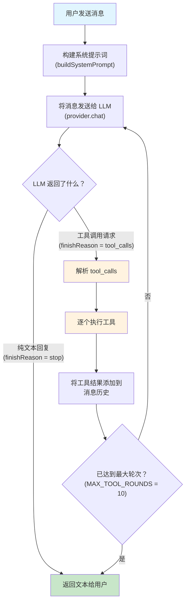
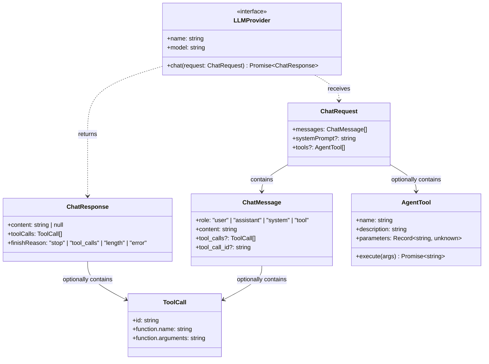
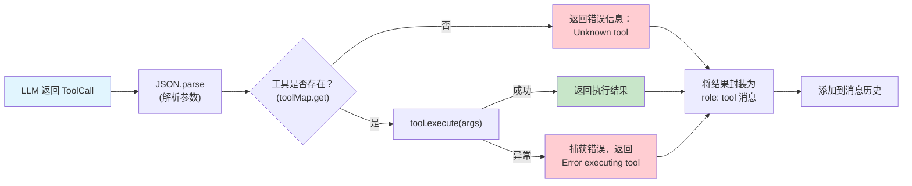
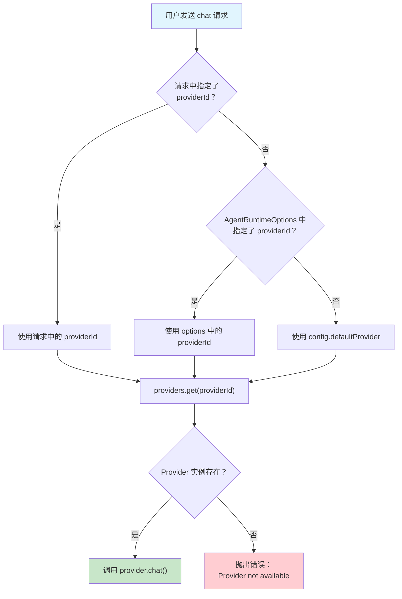

# Chapter 5: Agent Runtime -- The "Brain" of MyClaw

> Corresponding source files: `src/agent/runtime.ts`, `src/agent/providers/types.ts`, `src/agent/providers/anthropic.ts`, `src/agent/providers/openai.ts`, `src/agent/tools.ts`

## Overview

If we think of MyClaw as a person, then the Agent Runtime is its **brain**. It is the most critical module in the entire system, responsible for orchestrating the interaction loop between the LLM (Large Language Model) and tools.

The core workflow of an AI coding assistant can be simplified as: **receive user message -> call LLM -> execute tools -> return results**. But the real implementation is far more complex -- the LLM may need to call tools multiple times in succession to complete a task, different LLM providers have different API formats, tool execution needs to consider security... All of this is managed by the Agent Runtime.

In this chapter, we will dive deep into MyClaw's runtime architecture and understand the following core mechanisms:

1. **Agent Loop**: The iterative interaction between the LLM and tools
2. **Provider Abstraction Layer**: Unifying the interface differences across LLM providers
3. **Tool System**: Enabling the AI to read/write files, execute commands, and search code
4. **System Prompt Construction**: Telling the LLM "who you are and what you can do"

---

## 5.1 Agent Loop: The Heartbeat of MyClaw

The Agent Loop is MyClaw's core operating mechanism. Unlike a simple "ask once, answer once" model, MyClaw uses a **loop-based interaction** -- the LLM can call tools multiple times within a single conversation until it has gathered enough information to provide a final answer.

### Overall Flow Diagram



### Why Is This Loop Important?

Imagine a user says: "Help me rename the `foo` function to `bar` in `src/index.ts`." MyClaw needs to:

1. **Round 1**: The LLM decides to read the file first -> calls the `read` tool -> gets the file contents
2. **Round 2**: The LLM sees the file contents and decides to make an edit -> calls the `edit` tool -> completes the replacement
3. **Round 3**: The LLM generates a text reply: "I've renamed the `foo` function to `bar`"

Without the Agent Loop, the LLM can only "think" but cannot "act." The Agent Loop gives the LLM the **ability to take action**.

### Code Implementation

Let's walk through the core logic of the Agent Loop in `src/agent/runtime.ts` line by line:

```typescript
const MAX_TOOL_ROUNDS = 10; // Safety valve to prevent infinite loops

// The chat method is the entry point of the Agent Loop
async chat(request): Promise<string> {
  // 1. Determine which Provider to use
  const providerId = request.providerId ?? options?.providerId ?? config.defaultProvider;
  const provider = providers.get(providerId);
  if (!provider) {
    throw new Error(
      `Provider '${providerId}' not available. ` +
      `Check your API key and config. Available: ${Array.from(providers.keys()).join(", ")}`
    );
  }

  // 2. Build the system prompt
  const systemPrompt = buildSystemPrompt(config);

  // 3. Initialize message history (make a copy to avoid mutating the original data)
  const messages: ChatMessage[] = [...request.messages];
  let textParts: string[] = [];

  // 4. The Agent Loop begins! Loop up to MAX_TOOL_ROUNDS times
  for (let round = 0; round < MAX_TOOL_ROUNDS; round++) {
    // Send the request to the LLM
    const response = await provider.chat({
      messages,
      systemPrompt,
      tools: tools.length > 0 ? tools : undefined,
    });

    // Collect text content
    if (response.content) {
      textParts.push(response.content);
    }

    // No tool calls → loop ends, return the text
    if (response.toolCalls.length === 0 || response.finishReason !== "tool_calls") {
      break;
    }

    // Tool calls detected! Add the assistant's reply (with tool_calls) to the history
    messages.push({
      role: "assistant",
      content: response.content ?? "",
      tool_calls: response.toolCalls,
    });

    // Reset the text collector (the LLM will provide a new reply after tool execution)
    textParts = [];

    // Execute tool calls one by one (using the executeToolCall helper)
    for (const tc of response.toolCalls) {
      const result = await executeToolCall(tc, toolMap);
      messages.push({ role: "tool", content: result, tool_call_id: tc.id });
    }
  }

  return textParts.join("\n") || "(No response)";
}
```

**Key Design Points:**

- **`MAX_TOOL_ROUNDS = 10`**: This is a safety valve. If the LLM gets stuck in a tool-calling loop (e.g., repeatedly reading the same file), it will be forced to stop after 10 rounds.
- **Building the message history**: After each tool call, the assistant's reply and tool results are appended to the `messages` array so the LLM can see the full context in the next round.
- **Resetting `textParts`**: When the LLM returns tool calls, the previous text is discarded because the LLM will provide a new reply based on the tool results in the next round.

---

## 5.2 Provider Abstraction Layer

MyClaw needs to support multiple LLM providers (Anthropic, OpenAI, OpenRouter, etc.), but each one has a different API format. The role of the Provider abstraction layer is to **hide the differences and provide a unified interface**.

### Type Definition Overview



### Core Interface Details

Here is the complete type system defined in `src/agent/providers/types.ts`:

```typescript
// Chat message — note that role includes not only user/assistant/system, but also "tool"
export interface ChatMessage {
  role: "user" | "assistant" | "system" | "tool";
  content: string;
  tool_calls?: ToolCall[];   // Assistant messages can carry tool calls
  tool_call_id?: string;     // Tool messages need to be linked to a specific call
}
```

The `role: "tool"` in `ChatMessage` is key to the Agent Loop. When the LLM requests a tool call, the tool's execution result is fed back to the LLM as a `tool` role message, linked to the corresponding call request via `tool_call_id`.

```typescript
// Tool call description
export interface ToolCall {
  id: string;               // Unique identifier for linking requests and results
  function: {
    name: string;           // Tool name, e.g., "read", "exec"
    arguments: string;      // Parameters in JSON string format
  };
}
```

```typescript
// Structured response from the LLM
export interface ChatResponse {
  content: string | null;           // Text reply (may be null)
  toolCalls: ToolCall[];            // List of tool calls (may be empty)
  finishReason: "stop" | "tool_calls" | "length" | "error";
}
```

The design of `ChatResponse` is quite elegant -- it contains both text and tool calls. The LLM can return a text explanation alongside tool calls (e.g., "Let me read this file first"), or it can return purely text or purely tool calls.

```typescript
// Interface that all Providers must implement
export interface LLMProvider {
  chat(request: ChatRequest): Promise<ChatResponse>;
  readonly name: string;   // "anthropic" | "openai" | "openrouter"
  readonly model: string;  // e.g., "claude-sonnet-4-20250514", "gpt-4o"
}
```

```typescript
// Tool definition
export interface AgentTool {
  name: string;
  description: string;
  parameters: Record<string, unknown>;  // Parameter definition in JSON Schema format
  execute: (args: Record<string, unknown>) => Promise<string>;
}
```

`AgentTool` encapsulates both the **description** (for the LLM to read) and the **implementation** (the actual execution logic) together. `parameters` uses the JSON Schema format so the LLM knows what arguments to pass.

---

## 5.3 Anthropic Provider Implementation (Claude)

Anthropic is the provider of the Claude model family. Its API has some unique characteristics. Let's look at the implementation in `src/agent/providers/anthropic.ts`.

```typescript
import Anthropic from "@anthropic-ai/sdk";

export function createAnthropicProvider(
  apiKey: string,
  model: string,
  maxTokens: number,
  temperature: number
): LLMProvider {
  const client = new Anthropic({ apiKey });

  return {
    name: "anthropic",
    model,

    async chat(request: ChatRequest): Promise<ChatResponse> {
      // Anthropic API does not accept system role messages, so filter them out
      const messages = request.messages
        .filter((m) => m.role !== "system")
        .map((m) => ({
          role: m.role as "user" | "assistant",
          content: m.content,
        }));

      // Anthropic requires the conversation to start with a user message
      if (messages.length === 0 || messages[0].role !== "user") {
        throw new Error("Conversation must start with a user message");
      }

      // Convert AgentTool to Anthropic's tool format
      const tools: Anthropic.Tool[] = (request.tools ?? []).map(t => ({
        name: t.name,
        description: t.description,
        input_schema: (Object.keys(t.parameters).length > 0
          ? t.parameters
          : { type: "object", properties: {} }) as Anthropic.Tool.InputSchema,
      }));

      // Send the request — note that system is a separate parameter, not a message
      const response = await client.messages.create({
        model,
        max_tokens: maxTokens,
        temperature,
        system: request.systemPrompt,   // ★ Anthropic-specific: system is a top-level parameter
        messages,
        ...(tools.length > 0 ? { tools } : {}),
      });

      // Parse the response — Anthropic returns a content blocks array
      const textBlocks = response.content.filter((b) => b.type === "text");
      const toolBlocks = response.content.filter((b) => b.type === "tool_use");

      // Convert Anthropic's tool_use blocks to the unified ToolCall format
      const toolCalls: ToolCall[] = toolBlocks.map((b) => ({
        id: (b as { id: string }).id,
        function: {
          name: (b as { name: string }).name,
          arguments: JSON.stringify((b as { input: unknown }).input),
        },
      }));

      return {
        content: textBlocks.map((b) => (b as { text: string }).text).join("\n") || null,
        toolCalls,
        finishReason: toolCalls.length > 0 ? "tool_calls"
          : response.stop_reason === "max_tokens" ? "length"
          : "stop",
      };
    },
  };
}
```

### Three Unique Aspects of the Anthropic API

1. **System prompt is a separate parameter**: `client.messages.create({ system: "..." })` rather than placing it in the messages array. This is the most notable difference between the Anthropic API and the OpenAI API.

2. **Response is a Content Blocks array**: Anthropic doesn't return a string directly but instead returns a `content` array where each element can be a `text` type or a `tool_use` type. This design allows the LLM to mix text and tool calls in a single response.

3. **Tool parameters use `input_schema`**: This corresponds to OpenAI's `parameters` field. The format is the same JSON Schema, but the field name is different.

---

## 5.4 OpenAI Provider Implementation

The OpenAI Provider code (`src/agent/providers/openai.ts`) is a bit more complex because it handles both **standard OpenAI** and **OpenRouter** scenarios.

### Standard OpenAI Mode

```typescript
export function createOpenAIProvider(
  apiKey: string,
  model: string,
  maxTokens: number,
  temperature: number,
  baseURL?: string        // Optional custom API endpoint
): LLMProvider {
  const isOpenRouter = baseURL?.includes("openrouter");

  // Standard OpenAI path: use the official SDK
  if (!isOpenRouter) {
    const client = new OpenAI({
      apiKey, baseURL, timeout: 60_000, maxRetries: 2,
    });

    return {
      name: "openai",
      model,
      async chat(request: ChatRequest): Promise<ChatResponse> {
        const messages = toMessages(request);
        const tools = toOpenAITools(request.tools);
        const response = await client.chat.completions.create({
          model, max_tokens: maxTokens, temperature,
          messages: messages as OpenAI.ChatCompletionMessageParam[],
          ...(tools.length > 0 ? { tools } : {}),
        });
        return parseOpenAIResponse(response);
      },
    };
  }
  // ... OpenRouter path described below
}
```

### Message Format Conversion

OpenAI and Anthropic handle system prompts differently:

```typescript
function toMessages(request: ChatRequest): unknown[] {
  const messages: unknown[] = [];

  // ★ OpenAI-specific: system prompt as a role: "system" message
  if (request.systemPrompt) {
    messages.push({ role: "system", content: request.systemPrompt });
  }

  for (const msg of request.messages) {
    if (msg.role === "system") continue;  // Avoid duplicates
    if (msg.role === "tool" && msg.tool_call_id) {
      // Tool result message
      messages.push({ role: "tool", content: msg.content, tool_call_id: msg.tool_call_id });
    } else if (msg.role === "assistant" && msg.tool_calls?.length) {
      // Assistant message containing tool calls
      messages.push({
        role: "assistant",
        content: msg.content || null,
        tool_calls: msg.tool_calls.map(tc => ({
          id: tc.id,
          type: "function" as const,
          function: { name: tc.function.name, arguments: tc.function.arguments },
        })),
      });
    } else {
      messages.push({ role: msg.role as "user" | "assistant", content: msg.content });
    }
  }
  return messages;
}
```

### Tool Format Conversion

```typescript
function toOpenAITools(tools?: AgentTool[]): OpenAI.ChatCompletionTool[] {
  if (!tools || tools.length === 0) return [];
  return tools.map(tool => ({
    type: "function" as const,     // OpenAI's tool type is always "function"
    function: {
      name: tool.name,
      description: tool.description,
      parameters: Object.keys(tool.parameters).length > 0
        ? tool.parameters
        : { type: "object", properties: {} },  // Provide a default schema for empty parameters
    },
  }));
}
```

### Anthropic vs OpenAI: Key Differences Comparison

| Feature | Anthropic (Claude) | OpenAI (GPT) |
|---------|-------------------|---------------|
| System prompt | Separate `system` parameter | `role: "system"` message |
| Response format | Content Blocks array | `choices[0].message` |
| Tool call format | `type: "tool_use"` block | `tool_calls` array |
| Tool parameter field name | `input_schema` | `parameters` |
| Tool argument passing | Direct object (`input`) | JSON string (`arguments`) |
| Conversation start requirement | Must begin with a user message | No such restriction |

The value of the Provider abstraction layer is exactly this: the upper-level code (Agent Loop) doesn't need to care about any of these differences at all -- it just uses the unified `ChatRequest` and `ChatResponse`.

---

## 5.5 OpenRouter Support

OpenRouter is an LLM aggregation platform that provides access to hundreds of models through a single API endpoint. MyClaw supports OpenRouter through the OpenAI Provider since OpenRouter's API format is compatible with OpenAI.

### Why Not Just Use the OpenAI SDK?

Although OpenRouter is compatible with the OpenAI format, there are some differences in the details (e.g., the response may include a `reasoning` field), and some validations in the OpenAI SDK may be incompatible with OpenRouter's responses. Therefore, MyClaw uses **native fetch** for OpenRouter:

```typescript
// Provider creation logic in runtime.ts
case "openai":
case "openrouter":
  return createOpenAIProvider(
    apiKey, model, config.maxTokens, config.temperature,
    config.baseUrl ?? (config.type === "openrouter" ? "https://openrouter.ai/api/v1" : undefined)
  );
```

```typescript
// OpenRouter path in openai.ts
return {
  name: "openrouter",
  model,
  async chat(request: ChatRequest): Promise<ChatResponse> {
    const messages = toMessages(request);
    const tools = toOpenAITools(request.tools);
    const url = `${baseURL}/chat/completions`;

    // Built-in retry mechanism: up to 3 attempts
    for (let attempt = 0; attempt < 3; attempt++) {
      try {
        const response = await fetch(url, {
          method: "POST",
          headers: {
            "Content-Type": "application/json",
            "Authorization": `Bearer ${apiKey}`,
          },
          body: JSON.stringify({ model, max_tokens: maxTokens, temperature, messages, ...}),
          signal: AbortSignal.timeout(60_000),  // 60-second timeout
        });

        if (!response.ok) {
          const text = await response.text();
          throw new Error(`HTTP ${response.status}: ${text}`);
        }

        const data = await response.json();
        return parseOpenRouterResponse(data);
      } catch (err) {
        if (attempt < 2) {
          await new Promise(r => setTimeout(r, (attempt + 1) * 1000));
          continue;  // Exponential backoff retry
        }
      }
    }
    throw new Error(`LLM API error: ...`);
  },
};
```

### OpenRouter Response Parsing

The OpenRouter response may include a `reasoning` field (some models like DeepSeek return their reasoning process). MyClaw handles this with a compatibility fallback:

```typescript
function parseOpenRouterResponse(data: OpenRouterResponse): ChatResponse {
  const choice = data.choices?.[0];
  const msg = choice?.message;
  const toolCalls = (msg?.tool_calls ?? []).map(tc => ({
    id: tc.id,
    function: { name: tc.function.name, arguments: tc.function.arguments },
  }));

  // ★ Compatibility with reasoning field: if content is empty, fall back to reasoning
  const content = msg?.content ?? msg?.reasoning ?? null;

  return { content, toolCalls, finishReason: ... };
}
```

---

## 5.6 System Prompt Construction

The system prompt tells the LLM "who you are and what you can do." MyClaw's system prompt is dynamically built in the `buildSystemPrompt` function:

```typescript
function buildSystemPrompt(config: OpenClawConfig): string {
  const parts = [
    `You are a personal assistant running inside MyClaw.`,
    ``,
    `## Tooling`,
    `Tool names are case-sensitive. Call tools exactly as listed.`,
    `- read: Read file contents (supports offset/limit for partial reads)`,
    `- write: Create or overwrite files (parent directories are created automatically)`,
    `- edit: Make precise edits to files (old_string → new_string, must be unique match)`,
    `- exec: Execute shell commands`,
    `- grep: Search file contents with regex patterns`,
    `- find: Find files by glob pattern`,
    `- ls: List directory contents`,
    ``,
    `## Guidelines`,
    `- Read files before editing them`,
    `- Prefer editing over writing when modifying existing files`,
    `- Always respond in the user's language`,
  ];

  // Append user-defined Provider-level prompt
  const defaultProvider = config.providers.find((p) => p.id === config.defaultProvider);
  if (defaultProvider?.systemPrompt) {
    parts.push("", defaultProvider.systemPrompt);
  }

  return parts.join("\n");
}
```

### Structure of the System Prompt

The system prompt consists of three parts:

1. **Identity declaration**: `"You are a personal assistant running inside MyClaw."` -- This lets the LLM know its role.

2. **Tool documentation**: Lists all available tools with brief descriptions. Note the explicit emphasis on `Tool names are case-sensitive`, because LLMs sometimes mix up the casing of tool names.

3. **Behavioral guidelines**: Things like "read before editing," "prefer edit over write," and "reply in the user's language." These guidelines help the LLM use tools more safely and effectively.

> **Teaching Note**: The quality of the system prompt directly affects the quality of the Agent's behavior. In real projects, system prompts are often refined through extensive experimentation and iteration. Although MyClaw's prompt is concise, every line has a reason for being there.

---

## 5.7 Built-in Tools Overview

MyClaw includes 7 built-in tools that cover the core capabilities of an AI coding assistant. These tools are defined in `src/agent/tools.ts`.

### Tool Inventory

| Tool Name | Description | Key Parameters | Use Case |
|-----------|-------------|----------------|----------|
| `read` | Read file contents, supports paginated reading | `file_path` (required), `offset`, `limit` | Viewing code, config files |
| `write` | Create or overwrite files, auto-creates directories | `file_path`, `content` (both required) | Creating new files |
| `edit` | Precise string replacement editing | `file_path`, `old_string`, `new_string` (all required) | Modifying existing code |
| `exec` | Execute shell commands | `command` (required), `cwd`, `timeout` | Running builds, tests, Git, etc. |
| `grep` | Search file contents with regex | `pattern` (required), `path`, `include` | Searching code patterns |
| `find` | Find files by glob pattern | `pattern` (required), `path` | Locating files |
| `ls` | List directory contents (with file sizes) | `path` | Browsing project structure |

### Tool Execution Lifecycle



### Key Tool Deep Dives

#### `read` Tool -- File Reading

```typescript
{
  name: "read",
  description: "Read file contents. Returns lines with line numbers. ...",
  parameters: {
    type: "object",
    properties: {
      file_path: { type: "string", description: "Absolute or relative path ..." },
      offset: { type: "number", description: "Line number to start reading from (1-based)" },
      limit: { type: "number", description: "Maximum number of lines to read" },
    },
    required: ["file_path"],
  },
  execute: async (args) => {
    // 1. Verify the file exists and is not a directory
    if (!fs.existsSync(filePath)) return `Error: File '${filePath}' not found`;
    if (stat.isDirectory()) return `Error: '${filePath}' is a directory, not a file`;

    // 2. Read and slice
    const lines = content.split("\n");
    const sliced = lines.slice(startIdx, endIdx);

    // 3. Add line numbers (helps the LLM pinpoint code locations precisely)
    const numbered = sliced.map(
      (line, i) => `${String(startIdx + i + 1).padStart(6)}\t${line}`
    );
    return numbered.join("\n");
  },
}
```

The `read` tool's output includes line numbers -- this is not an arbitrary choice. Line numbers enable the LLM to reference code positions accurately, providing precise targeting for subsequent `edit` operations.

#### `edit` Tool -- Precise Editing

```typescript
execute: async (args) => {
  const content = fs.readFileSync(filePath, "utf-8");

  // Key: old_string must appear exactly once in the file
  const count = content.split(oldStr).length - 1;
  if (count === 0) return `Error: old_string not found in '${filePath}'`;
  if (count > 1) return `Error: old_string found ${count} times. Must be unique.`;

  // Unique match, safe to replace
  const updated = content.replace(oldStr, newStr);
  fs.writeFileSync(filePath, updated, "utf-8");
  return `File edited: ${filePath}`;
},
```

Why require a **unique match**? Because if `old_string` appears multiple times, the LLM might accidentally modify the wrong location. This is a **safety design** -- it's better to throw an error and have the LLM provide more precise context than to risk making an ambiguous replacement.

#### `exec` Tool -- Shell Command Execution

```typescript
execute: async (args) => {
  const command = args.command as string;
  const timeout = (args.timeout as number) || 30_000;  // Default 30-second timeout
  try {
    const output = execSync(command, {
      cwd,
      encoding: "utf-8",
      timeout,
      maxBuffer: 1024 * 1024,  // Maximum 1MB output
      stdio: ["pipe", "pipe", "pipe"],
    });
    return output.trim() || "(command completed with no output)";
  } catch (err) {
    return `Exit code ${error.status ?? 1}\n${stderr || error.message}`;
  }
},
```

---

## 5.8 Security Considerations for Tool Execution

Giving shell command execution capabilities to an LLM is a decision that requires careful consideration. MyClaw employs the following safety measures:

### Current Safety Mechanisms

1. **Timeout limits**: The `exec` tool defaults to a 30-second timeout to prevent commands from running indefinitely.
2. **Output size limits**: `maxBuffer: 1024 * 1024` (1MB) to prevent memory overflow.
3. **Agent Loop round cap**: `MAX_TOOL_ROUNDS = 10` to prevent infinite tool-calling loops.
4. **`edit` uniqueness constraint**: Prevents unintended modifications from ambiguous replacements.
5. **`grep`/`find` result truncation**: Search results are truncated beyond 200 entries to avoid context window overflow.
6. **`ls` skips hidden files**: Files where `item.name.startsWith(".")` are not displayed, avoiding exposure of sensitive configurations.

### Enhancements to Consider for Production

In a real-world AI coding tool, you would also need to consider:

- **Command allowlists/blocklists**: Prohibit destructive commands like `rm -rf /`
- **File path sandboxing**: Restrict tools to only access files within the project directory
- **User confirmation mechanism**: Require user approval for high-risk operations (e.g., deleting files, executing shell commands)
- **Sensitive information filtering**: Prevent API keys, passwords, and other sensitive data from being passed to the LLM

> **Teaching Note**: As an educational project, MyClaw has relatively simple security mechanisms. Full-featured tools like Claude Code have much more comprehensive permission systems and sandboxing mechanisms. When building your own Agent, security should be your top priority.

---

## 5.9 How to Add a New Tool

Thanks to the unified `AgentTool` interface design, adding a new tool is very straightforward. Here are the complete steps:

### Step 1: Define the Tool in `tools.ts`

Add a new tool object to the array returned by `getBuiltinTools()`:

```typescript
{
  name: "word_count",
  description: "Count words, lines, and characters in a file",
  parameters: {
    type: "object",
    properties: {
      file_path: {
        type: "string",
        description: "Path to the file to analyze",
      },
    },
    required: ["file_path"],
  },
  execute: async (args) => {
    const filePath = args.file_path as string;
    if (!fs.existsSync(filePath)) {
      return `Error: File '${filePath}' not found`;
    }
    const content = fs.readFileSync(filePath, "utf-8");
    const lines = content.split("\n").length;
    const words = content.split(/\s+/).filter(Boolean).length;
    const chars = content.length;
    return JSON.stringify({ lines, words, characters: chars }, null, 2);
  },
},
```

### Step 2: Update the System Prompt

Add the new tool's description to the tool list in `buildSystemPrompt`:

```typescript
`- word_count: Count words, lines, and characters in a file`,
```

### Step 3: That's It!

No need to modify the Agent Loop, Provider, or any other code. The new tool will automatically be:
- Returned by `getBuiltinTools()` and registered in the `toolMap`
- Passed to the LLM API via the `tools` parameter
- Recognized and executed within the Agent Loop

### Dynamic Tool Registration

In addition to built-in tools, MyClaw also supports runtime dynamic registration:

```typescript
const runtime = createAgentRuntime(config);

// Add a custom tool at runtime
runtime.registerTool({
  name: "custom_tool",
  description: "A custom tool added at runtime",
  parameters: { type: "object", properties: {} },
  execute: async () => "custom result",
});
```

The `registerTool` method adds the tool to the `tools` array and rebuilds the `toolMap` index.

---

## 5.10 Provider Resolution Flow

When a user sends a message, MyClaw needs to decide which LLM Provider to use. Here is the complete resolution flow:



### Provider Initialization Flow

During `createAgentRuntime` initialization, all Providers in the configuration are iterated over and instantiation is attempted:

```typescript
function createProvider(config: ProviderConfig, modelOverride?: string): LLMProvider | null {
  // 1. Resolve the API Key (supports direct values or environment variables)
  const apiKey = resolveSecret(config.apiKey, config.apiKeyEnv);
  if (!apiKey) {
    console.warn(`[agent] No API key for provider '${config.id}', skipping`);
    return null;  // No key, just skip — don't throw an error
  }

  const model = modelOverride ?? config.model;

  // 2. Create the corresponding Provider based on type
  switch (config.type) {
    case "anthropic":
      return createAnthropicProvider(apiKey, model, config.maxTokens, config.temperature);
    case "openai":
    case "openrouter":
      // OpenRouter reuses the OpenAI Provider, just with a different baseURL
      return createOpenAIProvider(
        apiKey, model, config.maxTokens, config.temperature,
        config.baseUrl ?? (config.type === "openrouter" ? "https://openrouter.ai/api/v1" : undefined)
      );
    default:
      console.warn(`[agent] Unknown provider type: ${config.type}`);
      return null;
  }
}
```

**Key Design Decisions:**
- **Graceful degradation**: Providers without an API Key are silently skipped (`return null`) rather than crashing the entire program. This way, users only need to configure the Providers they actually use.
- **Model override**: The `modelOverride` parameter allows temporarily switching models from the command line without modifying the configuration file.
- **OpenRouter reuse**: OpenRouter is essentially an OpenAI-compatible API, so it reuses `createOpenAIProvider` and just passes a different `baseURL`.

---

## Summary

In this chapter, we took a deep dive into MyClaw's Agent Runtime, the core engine of the entire system:

- **Agent Loop** implements the iterative interaction between the LLM and tools, enabling the AI to not only "think" but also "act"
- **Provider Abstraction Layer** hides the API differences between Anthropic, OpenAI, and OpenRouter through a unified `LLMProvider` interface
- **Tool System** provides 7 built-in tools (read, write, edit, exec, grep, find, ls) covering the core capabilities of an AI coding assistant
- **System Prompt** carefully defines the LLM's role and behavioral guidelines
- **Safety Mechanisms** protect the user's system through timeouts, size limits, uniqueness constraints, and more

Once you understand the Agent Runtime, you understand the core principles behind AI coding assistants. In the next chapter, we'll see how to connect MyClaw to different messaging platforms.

---

**Next Chapter**: [Channel Abstraction](./06-channels.md) -- Connecting MyClaw to Any Messaging Platform
