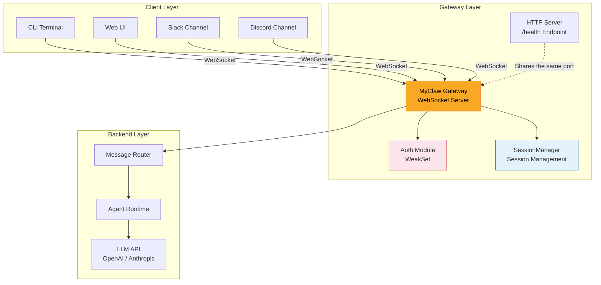
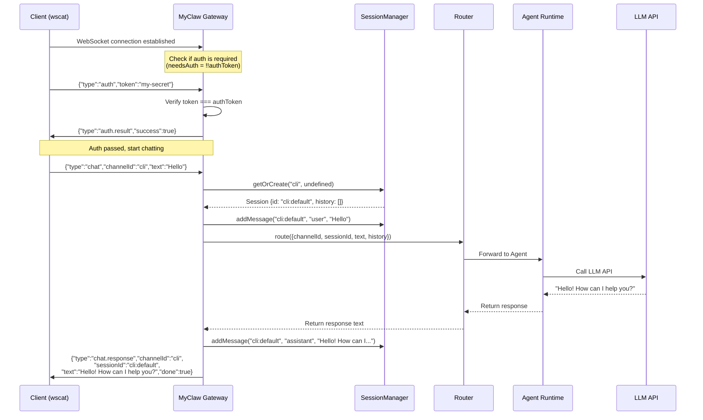
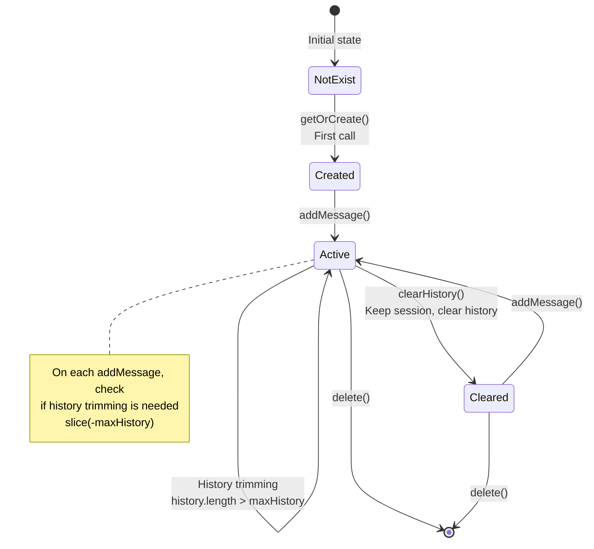
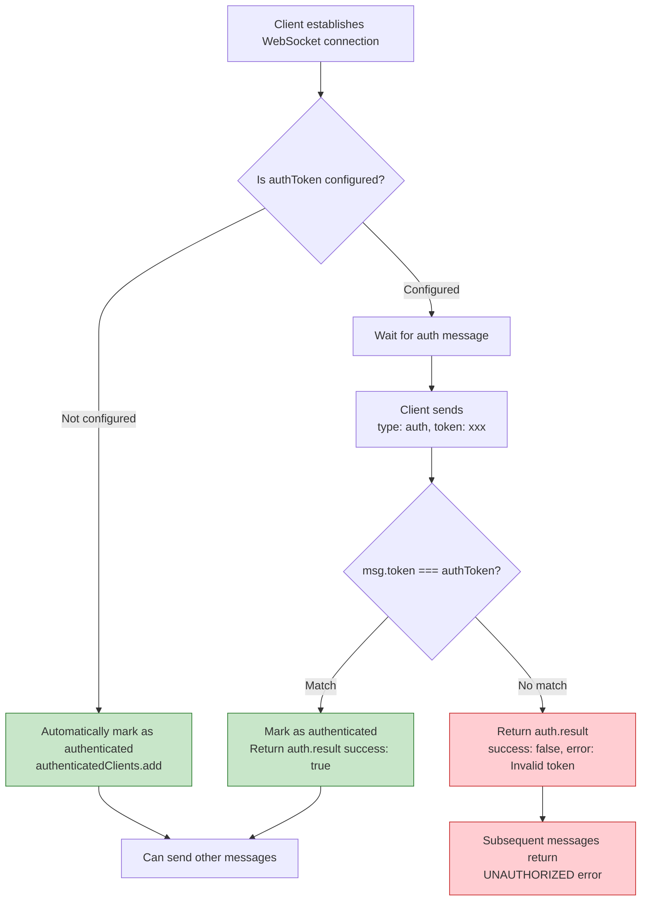

# Chapter 5: Gateway Server

> Corresponding source files: `src/gateway/server.ts`, `src/gateway/protocol.ts`, `src/gateway/session.ts`

## What Is the Gateway? Why WebSocket?

The gateway is MyClaw's **Control Plane**. It serves as the central traffic hub of the entire system -- all channels (Slack, Discord, CLI, etc.) never call the LLM API directly. Instead, they go through the gateway for unified message routing, session management, and authentication control.

Why choose WebSocket over plain HTTP REST? Three reasons:

1. **Bidirectional communication**: LLM responses may need to be streamed (`chat.stream`), and HTTP cannot push data from the server proactively
2. **Persistent connections**: Once a channel connects, it stays online -- no need to re-establish a TCP connection for every request
3. **Low latency**: Eliminates the overhead of repeated HTTP headers; the message body is just JSON

The architecture diagram below shows where the gateway fits in the overall system:



**Key design philosophy**: The gateway completely decouples "how to connect to the outside world" (channel layer) from "how to think and respond" (Agent layer). You can add new channel types at any time without modifying any Agent code.

---

## Message Protocol in Detail

All communication in MyClaw is based on JSON messages, distinguished by the `type` field. The protocol is defined in `src/gateway/protocol.ts`.

### Inbound Messages (Client -> Gateway)

| Type | `type` Value | Key Fields | Purpose |
|------|-------------|------------|---------|
| Auth | `"auth"` | `token: string` | Client authentication |
| Chat | `"chat"` | `channelId`, `text`, `sessionId?`, `metadata?` | Send user message to Agent |
| Channel Send | `"channel.send"` | `channelId`, `text` | Send a message to a specific channel via the gateway |
| Heartbeat | `"ping"` | (none) | Check if the connection is alive |
| Status Query | `"status"` | (none) | Get gateway runtime status |
| Tool Result | `"tool.result"` | `toolCallId`, `result`, `approved` | Return the execution result of a tool call |

### Outbound Messages (Gateway -> Client)

| Type | `type` Value | Key Fields | Purpose |
|------|-------------|------------|---------|
| Auth Result | `"auth.result"` | `success`, `error?` | Inform whether authentication passed |
| Chat Response | `"chat.response"` | `channelId`, `sessionId`, `text`, `done` | Complete Agent response |
| Stream Response | `"chat.stream"` | `channelId`, `sessionId`, `delta` | Partial response via streaming |
| Heartbeat Response | `"pong"` | (none) | Response to ping |
| Status Response | `"status.response"` | `channels[]`, `sessions`, `uptime` | Gateway runtime status details |
| Error | `"error"` | `code`, `message` | Error information |
| Tool Call | `"tool.call"` | `toolCallId`, `name`, `args`, `requiresApproval` | Agent requests a tool call |

Let's look at the specific interface definitions -- read each field carefully:

```typescript
// src/gateway/protocol.ts

// --- Inbound Messages ---

export interface AuthMessage {
  type: "auth";
  token: string;              // Gateway authentication token
}

export interface ChatMessage {
  type: "chat";
  channelId: string;           // Unique identifier of the source channel
  sessionId?: string;          // Optional session ID; uses default session if not provided
  text: string;                // User input text
  metadata?: Record<string, unknown>;  // Extensible metadata
}

export interface ChannelSendMessage {
  type: "channel.send";
  channelId: string;           // Target channel
  text: string;                // Text to send
}

export interface PingMessage {
  type: "ping";                // Heartbeat detection, no additional fields needed
}

export interface StatusRequest {
  type: "status";              // Request gateway status
}

export interface ToolResultMessage {
  type: "tool.result";
  toolCallId: string;          // ID corresponding to the tool.call
  result: string;              // Tool execution result
  approved: boolean;           // Whether the user approved the execution
}

// --- Outbound Messages ---

export interface AuthResultMessage {
  type: "auth.result";
  success: boolean;            // Whether authentication succeeded
  error?: string;              // Error message on failure
}

export interface ChatResponseMessage {
  type: "chat.response";
  channelId: string;
  sessionId: string;           // Session ID used (including auto-generated ones)
  text: string;                // Agent's complete response
  done: boolean;               // Whether this is the final response
}

export interface ChatStreamMessage {
  type: "chat.stream";
  channelId: string;
  sessionId: string;
  delta: string;               // Incremental text fragment
}

export interface ErrorMessage {
  type: "error";
  code: string;                // Error code, e.g., "PARSE_ERROR", "UNAUTHORIZED"
  message: string;             // Human-readable error description
}

// --- Union Types ---

export type GatewayMessage =
  | AuthMessage | ChatMessage | ChannelSendMessage
  | PingMessage | StatusRequest | ToolResultMessage;

export type GatewayResponse =
  | AuthResultMessage | ChatResponseMessage | ChatStreamMessage
  | PongMessage | StatusResponse | ErrorMessage | ToolCallMessage;
```

**Why use union types?** TypeScript's Union Types combined with a `type` discriminant field allow the compiler to automatically infer the specific type within a `switch` statement. This is known as a "Discriminated Union" and is the best practice for handling multiple message types in TypeScript.

### Typical Interaction: Complete Auth + Chat Flow

The sequence diagram below shows the complete process from a client connecting to receiving an AI response:



---

## Session Management: The SessionManager Class

`SessionManager` is the gateway's memory center. It manages the conversation history for each session within each channel, enabling the Agent to "remember" previous conversations.

### Session Data Structure

Let's first look at the `Session` interface (defined in `protocol.ts`):

```typescript
export interface Session {
  id: string;                  // Unique identifier, format: "channelId:sessionId" or "channelId:default"
  channelId: string;           // Owning channel
  createdAt: number;           // Creation timestamp
  lastActiveAt: number;        // Last active timestamp
  history: Array<{             // Conversation history
    role: "user" | "assistant";
    content: string;
  }>;
}
```

### Full SessionManager Implementation

```typescript
// src/gateway/session.ts

export class SessionManager {
  private sessions = new Map<string, Session>();  // Storage for all sessions
  private maxHistory: number;                     // Maximum history message count

  constructor(maxHistory: number = 50) {
    this.maxHistory = maxHistory;
  }
```

**Why use `Map` instead of a plain object for `sessions`?** `Map` performs better in scenarios with frequent key-value insertions and deletions, and its `.size` property is O(1) -- no need for `Object.keys().length`.

#### Get or Create a Session: getOrCreate

```typescript
  getOrCreate(channelId: string, sessionId?: string): Session {
    const id = sessionId ?? `${channelId}:default`;
    //        ^^^^^^^^^^^^^^^^^^^^^^^^^^^^^^^^
    //        If the client doesn't pass a sessionId, use "channelId:default" as the default
    //        This means messages from the same channel share a single session by default

    let session = this.sessions.get(id);
    if (!session) {
      session = {
        id,
        channelId,
        createdAt: Date.now(),
        lastActiveAt: Date.now(),
        history: [],
      };
      this.sessions.set(id, session);
    }

    session.lastActiveAt = Date.now();  // Update active time on every access
    return session;
  }
```

There's an important design detail here: `sessionId` is an optional parameter. If the client doesn't provide it, the system automatically creates a default session with the ID `channelId:default`. This means:

- Simple CLI clients don't need to worry about session IDs -- all messages from the same channel automatically belong to the same conversation
- Advanced clients (like a Web UI with multiple tabs) can maintain multiple independent conversations by passing different `sessionId` values

#### Add Messages and Trim History: addMessage

```typescript
  addMessage(sessionId: string, role: "user" | "assistant", content: string): void {
    const session = this.sessions.get(sessionId);
    if (!session) return;       // Defensive programming: silently return if session doesn't exist

    session.history.push({ role, content });

    // Key: history trimming
    if (session.history.length > this.maxHistory) {
      session.history = session.history.slice(-this.maxHistory);
      //                                     ^^^^^^^^^^^^^^^^
      //  slice(-N) keeps the last N messages, discarding the oldest ones
      //  This prevents history from growing indefinitely, which could cause
      //  token limit overflows or memory exhaustion
    }
  }
```

**Why trim history?** LLM APIs have context length limits (e.g., 128k tokens), and longer histories mean higher API costs. `maxHistory` is typically set to 50 messages (via `agent.maxHistoryMessages` in the config), retaining enough context without over-consuming resources.

#### Other Utility Methods

```typescript
  getAll(): Session[] {
    return Array.from(this.sessions.values());  // Return all active sessions
  }

  get size(): number {
    return this.sessions.size;                  // Getter syntax, accessed via sessions.size
  }

  clearHistory(sessionId: string): void {
    const session = this.sessions.get(sessionId);
    if (session) {
      session.history = [];                     // Clear history but keep the session itself
    }
  }

  delete(sessionId: string): void {
    this.sessions.delete(sessionId);            // Completely delete the session
  }
}
```

### Session Lifecycle Diagram



---

## Gateway Server Startup Flow

`startGatewayServer` is the entry function for the entire gateway, defined in `src/gateway/server.ts`. It initializes each subsystem in a strict order. Let's break it down step by step:

### Step 1: Receive Configuration Parameters

```typescript
export interface GatewayOptions {
  config: OpenClawConfig;    // Complete MyClaw configuration object
  host: string;              // Listen address, e.g., "127.0.0.1"
  port: number;              // Listen port, e.g., 18789
  verbose: boolean;          // Whether to output debug logs
}

export async function startGatewayServer(opts: GatewayOptions): Promise<void> {
  const { config, host, port, verbose } = opts;
  const startTime = Date.now();   // Record start time for uptime calculation
```

### Step 2: Initialize the Three Core Subsystems

```typescript
  // 1. Session Manager -- manages conversation history
  const sessions = new SessionManager(config.agent.maxHistoryMessages);

  // 2. Agent Runtime -- responsible for calling the LLM API
  const agent = createAgentRuntime(config);

  // 3. Message Router -- decides how messages are processed based on config rules
  const router = createRouter(config, agent);
```

The relationship between these three objects is: when a message comes in, `sessions` manages the context, then it's handed to `router`, which internally calls `agent` to generate a response.

### Step 3: Create the HTTP Server (Health Check)

```typescript
  const httpServer = http.createServer((req, res) => {
    if (req.url === "/health") {
      res.writeHead(200, { "Content-Type": "application/json" });
      res.end(JSON.stringify({ status: "ok", uptime: Date.now() - startTime }));
      return;
    }
    res.writeHead(404);
    res.end();
  });
```

This HTTP server is very simple, with only one endpoint: `/health`. It exists so that operations tools (like Kubernetes, load balancers) can detect whether the gateway is running normally. For all other HTTP requests, it returns 404.

### Step 4: Create the WebSocket Server

```typescript
  const wss = new WebSocketServer({ server: httpServer });
```

Notice the key trick here: the WebSocket server **reuses** the HTTP server's port. The `{ server: httpServer }` parameter tells the `ws` library to take over the connection when the HTTP server receives a WebSocket upgrade request. This way, a single port serves both HTTP and WebSocket protocols.

### Step 5: Configure Authentication

```typescript
  const authToken = resolveSecret(config.gateway.token, config.gateway.tokenEnv);
  const authenticatedClients = new WeakSet<WebSocket>();
```

The `resolveSecret` function resolves the authentication token from either a plaintext config value or an environment variable. If neither is set, `authToken` is `undefined`, and the gateway doesn't require authentication.

**Why use `WeakSet` instead of `Set`?** `WeakSet` holds weak references to its elements. When a WebSocket connection disconnects and gets garbage collected, it automatically disappears from the `WeakSet` -- no manual cleanup needed. This is a clever design to prevent memory leaks.

### Step 6: Handle WebSocket Connections

```typescript
  const clients = new Set<WebSocket>();   // Used to track connection count

  wss.on("connection", (ws) => {
    clients.add(ws);
    const needsAuth = !!authToken;

    if (!needsAuth) {
      authenticatedClients.add(ws);       // When auth is not required, automatically mark as authenticated
    }

    // ... message handling logic (detailed in the next section)

    ws.on("close", () => {
      clients.delete(ws);
    });

    ws.on("error", (err) => {
      console.error(chalk.red(`[gateway] WebSocket error: ${err.message}`));
    });
  });
```

### Step 7: Start the Channel Manager

```typescript
  const channelManager = createChannelManager(config);
  await channelManager.startAll(router);
```

The channel manager starts all enabled channels (Slack, Discord, etc.) based on the configuration and connects them to the router.

### Step 8: Begin Listening

```typescript
  return new Promise((resolve) => {
    httpServer.listen(port, host, () => {
      console.log(chalk.bold.cyan(`\n🦀 MyClaw Gateway`));
      console.log(chalk.dim(`   WebSocket: ws://${host}:${port}`));
      console.log(chalk.dim(`   Health:    http://${host}:${port}/health`));
      console.log(chalk.dim(`   Auth:      ${authToken ? "enabled" : "disabled"}`));
      console.log(chalk.dim(`   Channels:  ${config.channels.filter((c) => c.enabled).length} active`));
      console.log(chalk.dim(`   Provider:  ${config.defaultProvider}\n`));
    });
  });
```

Once startup is complete, you'll see the "MyClaw Gateway" banner and all configuration info in the terminal. The function returns a Promise that never resolves, keeping the process running.

---

## Authentication Mechanism

The MyClaw gateway uses **simple token-based authentication**. The complete authentication flow is as follows:



Core code:

```typescript
// Authentication handling
if (msg.type === "auth") {
  if (msg.token === authToken) {
    authenticatedClients.add(ws);
    send(ws, { type: "auth.result", success: true });
  } else {
    send(ws, { type: "auth.result", success: false, error: "Invalid token" });
  }
  return;   // Auth message processing complete, skip the subsequent switch
}

// All non-auth messages must pass authentication first
if (needsAuth && !authenticatedClients.has(ws)) {
  send(ws, { type: "error", code: "UNAUTHORIZED", message: "Authenticate first" });
  return;
}
```

Notice the placement of the `return` statements -- the `auth` message returns immediately after processing, without entering the subsequent `switch`. The authentication check sits before the `switch`, forming a "gatekeeper": unauthenticated clients cannot perform any operations.

---

## Message Routing

Messages that pass authentication enter a `switch` statement for routing. Each message type has its own handling logic:

### ping: Heartbeat Detection

```typescript
case "ping":
  send(ws, { type: "pong" });
  break;
```

The simplest message type. The client periodically sends `ping`, and the gateway replies with `pong`. Used to detect whether the connection is alive.

### status: Status Query

```typescript
case "status": {
  const channelManager = createChannelManager(config);
  send(ws, {
    type: "status.response",
    channels: channelManager.getStatus(),   // Connection status of each channel
    sessions: sessions.size,                // Current number of active sessions
    uptime: Date.now() - startTime,         // Uptime in milliseconds
  });
  break;
}
```

Returns the gateway's runtime status, including whether each channel is connected, the number of sessions, and uptime. This is very useful for monitoring and debugging.

### chat: Core Chat Flow

This is the gateway's most critical processing logic, worth analyzing line by line:

```typescript
case "chat": {
  // 1. Get or create a session
  const session = sessions.getOrCreate(msg.channelId, msg.sessionId);

  // 2. Add the user message to the session history
  sessions.addMessage(session.id, "user", msg.text);

  try {
    // 3. Route the message to the Agent
    const response = await router.route({
      channelId: msg.channelId,
      sessionId: session.id,
      text: msg.text,
      history: session.history.slice(0, -1),
      //       ^^^^^^^^^^^^^^^^^^^^^^^^^
      //       Why slice(0, -1)? Because we just pushed the user message into history,
      //       but the history passed to router should be the "previous" conversation records.
      //       The current message is passed separately via the text field.
    });

    // 4. Add the Agent's response to the session history
    sessions.addMessage(session.id, "assistant", response);

    // 5. Reply to the client
    send(ws, {
      type: "chat.response",
      channelId: msg.channelId,
      sessionId: session.id,
      text: response,
      done: true,
    });
  } catch (err) {
    // 6. Error handling
    const error = err as Error;
    send(ws, {
      type: "error",
      code: "AGENT_ERROR",
      message: error.message,
    });
  }
  break;
}
```

The `slice(0, -1)` detail often confuses beginners. Here's a visual explanation:

```
History before addMessage:  [msg1, msg2, msg3]
After addMessage("user", "Hello"):  [msg1, msg2, msg3, "Hello"]
History passed to router:    [msg1, msg2, msg3]  <- slice(0, -1) removes the last item
Text passed to router:       "Hello"              <- passed separately
```

### channel.send: Channel Forwarding

```typescript
case "channel.send": {
  if (verbose) {
    console.log(chalk.dim(`[gateway] Send to channel '${msg.channelId}': ${msg.text}`));
  }
  break;
}
```

Used to send messages to a specific channel through the gateway. The current tutorial version only logs the action; the full version would call the channel manager's send interface.

### default: Unknown Message Type

```typescript
default:
  send(ws, {
    type: "error",
    code: "UNKNOWN_TYPE",
    message: `Unknown message type: ${(msg as { type: string }).type}`,
  });
```

For message types not defined in the protocol, a clear error message is returned. Note the `as { type: string }` type assertion here -- TypeScript's exhaustiveness check considers `msg` in the `default` branch to be of type `never`.

---

## Health Check Endpoint

The gateway provides a simple HTTP GET endpoint at `/health`:

```bash
$ curl http://127.0.0.1:18789/health
{"status":"ok","uptime":123456}
```

Response fields:
- `status`: Always `"ok"`, indicating the gateway process is running normally
- `uptime`: Milliseconds the gateway has been running

Use cases for this endpoint:
- **Container orchestration**: Kubernetes `livenessProbe` can periodically access this endpoint
- **Load balancing**: Nginx/HAProxy can use this endpoint to determine backend availability
- **Operations monitoring**: Tools like Prometheus can collect uptime data

It's HTTP rather than WebSocket because all monitoring infrastructure natively supports HTTP health checks.

---

## The Send Utility Function

The gateway sends messages through a concise `send` function:

```typescript
function send(ws: WebSocket, msg: GatewayResponse): void {
  if (ws.readyState === WebSocket.OPEN) {
    ws.send(JSON.stringify(msg));
  }
}
```

**Why check `readyState`?** A WebSocket connection might disconnect during an asynchronous operation (such as waiting for an LLM response). If you call `ws.send()` without checking, it will throw an exception. `readyState === WebSocket.OPEN` ensures data is only sent while the connection is active -- this is a standard defensive pattern in WebSocket programming.

---

## Error Handling Patterns

The MyClaw gateway catches and handles errors at multiple levels:

### 1. JSON Parse Errors

```typescript
try {
  msg = JSON.parse(data.toString());
} catch {
  send(ws, { type: "error", code: "PARSE_ERROR", message: "Invalid JSON" });
  return;
}
```

If a client sends invalid JSON (e.g., typos or binary data), the gateway returns `PARSE_ERROR` instead of crashing.

### 2. Authentication Errors

```typescript
// Token mismatch
send(ws, { type: "auth.result", success: false, error: "Invalid token" });

// Sending messages without authenticating first
send(ws, { type: "error", code: "UNAUTHORIZED", message: "Authenticate first" });
```

### 3. Agent Call Errors

```typescript
try {
  const response = await router.route({ ... });
  // ...
} catch (err) {
  const error = err as Error;
  send(ws, { type: "error", code: "AGENT_ERROR", message: error.message });
}
```

The LLM API might fail due to network issues, invalid API keys, exhausted quotas, etc. The gateway forwards the error message to the client rather than letting the entire process crash.

### 4. WebSocket Connection Errors

```typescript
ws.on("error", (err) => {
  console.error(chalk.red(`[gateway] WebSocket error: ${err.message}`));
});
```

Connection-level errors (network disconnection, protocol violations, etc.) are logged to the server log.

### 5. Unknown Message Types

```typescript
default:
  send(ws, { type: "error", code: "UNKNOWN_TYPE", message: `Unknown message type: ...` });
```

### Error Code Summary

| Error Code | Meaning | Trigger Scenario |
|-----------|---------|-----------------|
| `PARSE_ERROR` | JSON parse failure | Client sent invalid JSON |
| `UNAUTHORIZED` | Not authenticated | Attempted an operation without sending an auth message or after a token mismatch |
| `AGENT_ERROR` | Agent call failure | LLM API error, network timeout, etc. |
| `UNKNOWN_TYPE` | Unknown message type | Client sent a type not defined in the protocol |

---

## Hands-On: Testing the Gateway with wscat

`wscat` is a command-line WebSocket client, perfect for manually testing the gateway.

### Install wscat

```bash
npm install -g wscat
```

### Start the Gateway

```bash
npx tsx src/entry.ts gateway --verbose
```

You should see output similar to this:

```
🦀 MyClaw Gateway
   WebSocket: ws://127.0.0.1:18789
   Health:    http://127.0.0.1:18789/health
   Auth:      enabled
   Channels:  2 active
   Provider:  openai

[gateway] Waiting for connections...
```

### Test the Health Check

In another terminal window:

```bash
$ curl http://127.0.0.1:18789/health
{"status":"ok","uptime":5432}
```

### Connect via WebSocket and Test

```bash
$ wscat -c ws://127.0.0.1:18789
Connected (press CTRL+C to quit)
```

#### Test 1: Heartbeat Detection

```
> {"type":"ping"}
< {"type":"pong"}
```

#### Test 2: Chat Without Authentication (Should Be Rejected)

```
> {"type":"chat","channelId":"test","text":"hello"}
< {"type":"error","code":"UNAUTHORIZED","message":"Authenticate first"}
```

#### Test 3: Authentication

```
> {"type":"auth","token":"your-token-here"}
< {"type":"auth.result","success":true}
```

If the token is wrong:

```
> {"type":"auth","token":"wrong-token"}
< {"type":"auth.result","success":false,"error":"Invalid token"}
```

#### Test 4: Send a Chat Message

```
> {"type":"chat","channelId":"test","text":"Hello, tell me about yourself"}
< {"type":"chat.response","channelId":"test","sessionId":"test:default","text":"Hello! I'm an AI assistant...","done":true}
```

#### Test 5: Multi-Turn Conversation (Session Persistence)

```
> {"type":"chat","channelId":"test","text":"My name is Alice"}
< {"type":"chat.response","channelId":"test","sessionId":"test:default","text":"Hello Alice! Nice to meet you...","done":true}

> {"type":"chat","channelId":"test","text":"Do you still remember my name?"}
< {"type":"chat.response","channelId":"test","sessionId":"test:default","text":"Of course, your name is Alice!...","done":true}
```

Because both requests use the same `channelId` and don't specify a `sessionId`, they share the `test:default` session, allowing the Agent to "remember" the previous conversation.

#### Test 6: Query Gateway Status

```
> {"type":"status"}
< {"type":"status.response","channels":[{"id":"cli","type":"cli","connected":true}],"sessions":1,"uptime":30000}
```

#### Test 7: Send Invalid JSON

```
> not json at all
< {"type":"error","code":"PARSE_ERROR","message":"Invalid JSON"}
```

#### Test 8: Send an Unknown Message Type

```
> {"type":"unknown_command"}
< {"type":"error","code":"UNKNOWN_TYPE","message":"Unknown message type: unknown_command"}
```

---

## Summary

In this chapter, we took a deep dive into the three core modules of the MyClaw gateway server:

| Module | File | Responsibility |
|--------|------|---------------|
| Message Protocol | `src/gateway/protocol.ts` | Defines TypeScript interfaces for all message types |
| Session Management | `src/gateway/session.ts` | Manages conversation history with automatic trimming of long records |
| Gateway Server | `src/gateway/server.ts` | Starts the HTTP/WebSocket server, handles authentication and message routing |

Key takeaways:

- **WebSocket vs HTTP**: WebSocket provides bidirectional persistent connections, ideal for real-time communication scenarios
- **Discriminated Unions**: Using a `type` field to distinguish message types lets the TypeScript compiler perform type checking for you
- **WeakSet for Leak Prevention**: Using `WeakSet` to track authenticated clients ensures automatic cleanup when connections close
- **History Trimming**: `slice(-maxHistory)` retains the most recent N messages, controlling context length and cost
- **Port Reuse**: HTTP and WebSocket share the same port, simplifying deployment configuration
- **Defensive Sending**: Checking `readyState` before sending avoids writing data to disconnected connections

---

**Next chapter**: [Agent Runtime](./05-agent-runtime.md) -- The Brain of MyClaw
