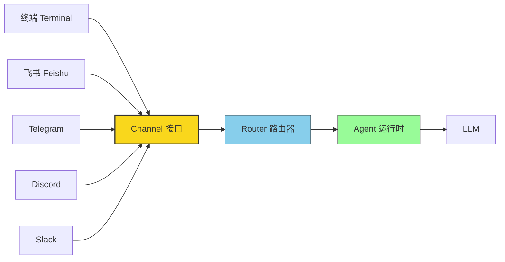
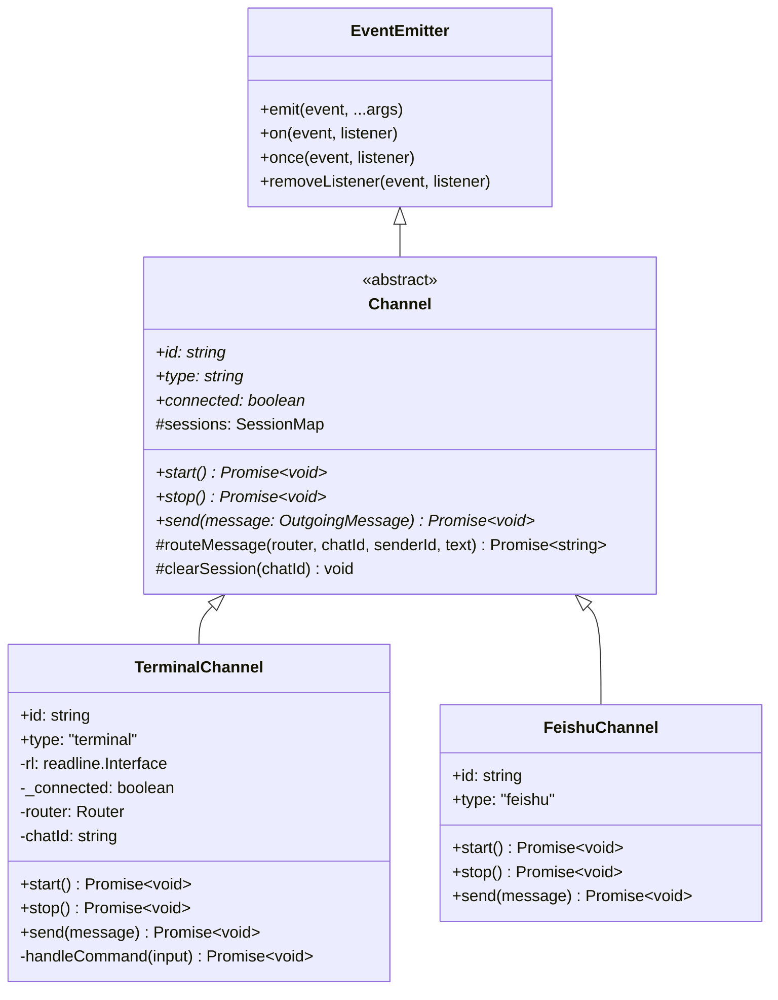
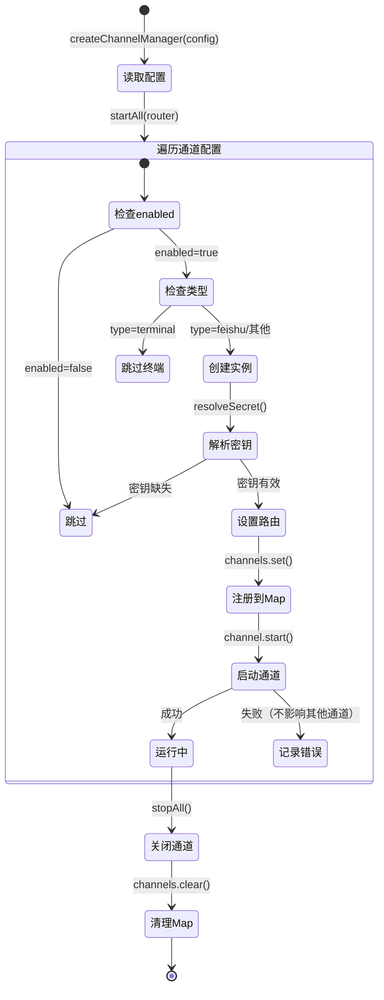

# Chapter 6: Channel Abstraction

In the previous chapters, we built the CLI framework, configuration system, gateway server, and Agent runtime. Now we face a critical architectural question: **How do we let a single AI Agent serve completely different messaging platforms like the terminal, Feishu, Telegram, Discord, and Slack simultaneously?**

If we write separate message-handling logic for each platform, the code will quickly turn into a tangled mess. We need an elegant way to make the Agent completely agnostic about where messages come from — and that's exactly the problem **channel abstraction** solves.

## Why Do We Need Channel Abstraction?

Imagine a world without channel abstraction: your Agent code is full of branching logic like `if (platform === 'telegram') { ... } else if (platform === 'feishu') { ... }`. Every time you add a new platform, all the related code needs to be modified. This clearly violates the Open-Closed Principle.

The core idea of channel abstraction is: **Insert a standardized middle layer between the diverse messaging platforms and the unified Agent.**



No matter whether a user types into the terminal, sends a message on Feishu, or chats through a Telegram Bot, it's all the same thing to the Agent — receive an `IncomingMessage`, return an `OutgoingMessage`. Platform differences (protocols, authentication, message formats) are all encapsulated within each Channel implementation.

## Key Files

| File | Purpose |
| --- | --- |
| `src/channels/transport.ts` | Defines the Channel abstract class and message interfaces — the "contract" of the entire channel system |
| `src/channels/terminal.ts` | Terminal channel implementation — interactive chat based on readline |
| `src/channels/manager.ts` | Channel manager — orchestrates the lifecycle of multiple channels |

Let's dive into each one.

---

## Message Interfaces: IncomingMessage and OutgoingMessage

The first step in channel abstraction is defining a unified message format. Regardless of which platform a message comes from, once it enters the system it gets "translated" into the same data structure.

```typescript
// src/channels/transport.ts

/**
 * Incoming message — a user message received from a channel
 */
export interface IncomingMessage {
  channelId: string;                     // Channel identifier, e.g., "terminal", "feishu"
  sessionId: string;                     // Session ID, used to maintain conversation context
  senderId: string;                      // Sender identifier
  text: string;                          // Message text
  timestamp: number;                     // Timestamp
  metadata?: Record<string, unknown>;    // Extensible metadata
}

/**
 * Outgoing message — a reply to be sent back to the channel
 */
export interface OutgoingMessage {
  channelId: string;
  sessionId: string;
  text: string;
  metadata?: Record<string, unknown>;
}
```

Take a close look at the differences between these two interfaces:

- **`IncomingMessage`** has additional `senderId` and `timestamp` fields — because the system needs to know "who sent this message and when."
- **`OutgoingMessage`** is more concise — the system only needs to know "what content to send to which session in which channel."

The `metadata` field is typed as `Record<string, unknown>`, which is an important design decision. Different platforms have their own unique information (such as Telegram's chat_id or Feishu's open_id). Through `metadata`, you can carry this platform-specific data without modifying the core interfaces. This is a textbook example of **extensible design**.

---

## The Channel Abstract Class

With a unified message format in place, the next step is abstracting the channel itself. `Channel` is an abstract class that extends Node.js's `EventEmitter`:

```typescript
// src/channels/transport.ts

/**
 * Channel event definitions
 */
export interface ChannelEvents {
  message: (msg: IncomingMessage) => void;    // Received a user message
  connected: () => void;                       // Channel connected successfully
  disconnected: (reason?: string) => void;     // Channel disconnected
  error: (error: Error) => void;               // An error occurred
}

/**
 * Channel abstract class — every messaging platform must implement it
 */
export type HistoryEntry = { role: "user" | "assistant"; content: string };
export type SessionMap = Map<string, HistoryEntry[]>;

export abstract class Channel extends EventEmitter {
  abstract readonly id: string;           // Unique channel identifier
  abstract readonly type: string;         // Channel type (terminal / feishu / ...)
  abstract readonly connected: boolean;   // Whether the channel is connected

  protected sessions: SessionMap = new Map();  // Shared session storage

  /** Start the channel (connect, authenticate, etc.) */
  abstract start(): Promise<void>;

  /** Stop the channel */
  abstract stop(): Promise<void>;

  /** Send a message to the channel */
  abstract send(message: OutgoingMessage): Promise<void>;

  /** Common message routing: manages history, routes to agent, emits event. */
  protected async routeMessage(
    router: Router,
    chatId: string,
    senderId: string,
    text: string
  ): Promise<string> {
    const sessionId = `${this.id}:${chatId}`;

    if (!this.sessions.has(chatId)) {
      this.sessions.set(chatId, []);
    }
    const history = this.sessions.get(chatId)!;

    const request: RouteRequest = {
      channelId: this.id,
      sessionId,
      text,
      history: [...history],
    };

    history.push({ role: "user", content: text });
    const response = await router.route(request);
    history.push({ role: "assistant", content: response });

    this.emit("message", {
      channelId: this.id,
      sessionId,
      senderId,
      text,
      timestamp: Date.now(),
    });

    return response;
  }

  /** Clear a session's conversation history. */
  protected clearSession(chatId: string): void {
    this.sessions.delete(chatId);
  }
}
```

Let's use a Mermaid class diagram to visually illustrate this inheritance hierarchy:



### Why Extend EventEmitter?

This is a design choice worth understanding deeply. A channel is fundamentally an **asynchronous, event-driven component** — users can send messages at any time, and connections can drop at any moment. Using the event model (rather than callbacks or polling) allows channels to:

1. **Decouple notification from handling**: The channel is only responsible for `emit`ting events. Who handles them and how — the channel doesn't care.
2. **Support multiple listeners**: Multiple modules can listen to the same event simultaneously (for example, both the logging module and the routing module can listen to the `message` event).
3. **Naturally express state changes**: Events like `connected`, `disconnected`, and `error` are naturally suited to be expressed through EventEmitter.

### The ChannelEvents Interface

The `ChannelEvents` interface defines the four types of events a channel can emit:

| Event | When It Fires | Callback Parameter |
| --- | --- | --- |
| `message` | When a user message is received | `IncomingMessage` object |
| `connected` | When the channel starts/connects successfully | None |
| `disconnected` | When the channel disconnects | Optional reason string |
| `error` | When an error occurs | `Error` object |

Although TypeScript's `EventEmitter` doesn't enforce type checking on event names and parameters by default, defining the `ChannelEvents` interface serves the purpose of **documentation** and **convention** — all Channel implementations should emit these events, and listeners know what parameters to expect.

### Three Core Methods + Shared Helpers

The Channel abstract class requires only three methods to be implemented — simplicity at its finest:

- **`start()`**: Start the channel. For the terminal, this means starting to listen on stdin input; for Feishu, it means starting a Webhook server and completing OAuth authentication. It returns `Promise<void>` because the startup process is typically asynchronous.
- **`stop()`**: Gracefully shut down the channel, releasing all resources (closing connections, cleaning up timers, etc.).
- **`send(message)`**: Send a message to the channel. For the terminal, this is `console.log`; for Feishu, it's calling the send message API.

In addition, the base class provides shared state and helpers that all channels inherit:

- **`sessions: SessionMap`**: A `Map` that stores conversation history keyed by `chatId`. This is defined once in the base class so that every channel automatically gets multi-session support.
- **`routeMessage(router, chatId, senderId, text)`**: A protected method that encapsulates the common routing logic — looking up or creating a session, building a `RouteRequest`, calling `router.route()`, recording history, and emitting the `message` event. Subclasses call this instead of duplicating the same steps.
- **`clearSession(chatId)`**: A protected helper that deletes a session from the `sessions` Map. Used by `/clear` command handlers across all channels.

Two new type exports support this: `HistoryEntry` (a single `{ role, content }` entry) and `SessionMap` (the `Map<string, HistoryEntry[]>` type).

This "minimal interface + shared helpers" design philosophy is very important — the smaller the required interface, the lower the barrier to implementing a new channel, while the shared helpers eliminate boilerplate.

---

## Terminal Channel: A Complete Implementation Walkthrough

`TerminalChannel` is the simplest and most intuitive channel implementation in MyClaw. It's based on Node.js's `readline` module, providing an interactive chat experience in the terminal. Let's analyze its complete code section by section.

### Class Definition and Constructor

```typescript
// src/channels/terminal.ts

export class TerminalChannel extends Channel {
  readonly id: string;
  readonly type = "terminal";
  private rl: readline.Interface | null = null;
  private _connected = false;
  private router: Router;
  private config: ChannelConfig;
  private agentName: string;
  private chatId: string;

  constructor(config: ChannelConfig, router: Router, agentName: string) {
    super();
    this.id = config.id;
    this.config = config;
    this.router = router;
    this.agentName = agentName;
    this.chatId = "terminal";
  }

  get connected(): boolean {
    return this._connected;
  }
```

A few key points:

1. **`type = "terminal"` is a literal type** — this isn't an ordinary string; it's a TypeScript literal type, ensuring that type can only be `"terminal"`.
2. **`rl` is initialized to `null`** — the readline interface is created only during `start()`, following the "lazy initialization" principle.
3. **`_connected` uses a private prefix** — the read-only `connected` property is exposed via a getter, so external code can only query but not modify it.
4. **The `chatId` field** — a fixed string `"terminal"` used as the key into the inherited `sessions` Map. In a terminal scenario with only one user, the session is fixed.
5. **Session storage is inherited** — the `sessions` Map from the `Channel` base class stores conversation history, so there is no need for a separate `history` array.

### The Startup Flow: start() Method

`start()` is the heart of the entire terminal channel — it establishes a complete interaction loop:

```typescript
async start(): Promise<void> {
    // Step 1: Create the readline interface
    this.rl = readline.createInterface({
      input: process.stdin,
      output: process.stdout,
    });

    // Step 2: Mark connection status and emit event
    this._connected = true;
    this.emit("connected");

    // Step 3: Print the greeting message
    if (this.config.greeting) {
      console.log(chalk.cyan(`\n${this.agentName}: ${this.config.greeting}\n`));
    }

    // Step 4: Main input loop (detailed below)
    const prompt = () => {
      this.rl?.question(chalk.green("You: "), async (input) => {
        // ... handle user input
        prompt(); // Recursive call to form the loop
      });
    };

    prompt();

    // Step 5: Gracefully handle Ctrl+C
    this.rl.on("close", () => {
      console.log(chalk.dim("\nGoodbye! 👋\n"));
      this._connected = false;
      this.emit("disconnected", "user closed");
      process.exit(0);
    });
  }
```

There's a clever pattern worth learning here — the **recursive input loop**. The `prompt()` function calls itself again after processing each input, forming a never-ending conversation loop. This is more suitable for Node.js's asynchronous model than `while(true)`, because `readline.question()` is inherently asynchronous.

### Message Processing Flow

When a user enters a regular message (not a command), the processing flow is as follows:

```typescript
// Route to agent
try {
  process.stdout.write(chalk.cyan(`\n${this.agentName}: `));
  const response = await this.routeMessage(this.router, this.chatId, "terminal", text);
  console.log(response + "\n");
} catch (err) {
  console.error(chalk.red(`\nError: ${(err as Error).message}\n`));
}
```

The terminal channel delegates all routing logic to the base class's `routeMessage()` method. Under the hood, `routeMessage` does the following:

1. Constructs a `sessionId` from `this.id` and `chatId` (e.g., `"terminal:terminal"`).
2. Looks up or creates the session history in `this.sessions`.
3. Builds a `RouteRequest` with a shallow copy of the current history (`[...history]`).
4. Records the user message to history.
5. Calls `router.route(request)` and waits for the reply.
6. Records the assistant reply to history.
7. Emits a `message` event with the incoming message details.

This eliminates the boilerplate that would otherwise be duplicated across every channel implementation. The spread operator `[...history]` in step 3 is an important defensive programming technique — even if the routing process is asynchronous, subsequent modifications to history won't affect the request that's already been sent.

### The stop() and send() Methods

```typescript
async stop(): Promise<void> {
    this.rl?.close();
    this._connected = false;
    this.emit("disconnected", "stopped");
  }

  async send(message: OutgoingMessage): Promise<void> {
    console.log(chalk.cyan(`${this.agentName}: ${message.text}`));
  }
```

`stop()` closes the readline interface, updates the state, and emits the disconnected event — the classic three-step resource cleanup.

`send()` is very simple for the terminal — just print to the console. But for other channels (like Feishu), this could be an HTTP API call.

---

## Built-in Command System

The terminal channel comes with five built-in slash commands, providing useful debugging and control capabilities:

```typescript
private async handleCommand(input: string): Promise<void> {
    const [cmd, ...args] = input.split(" ");

    switch (cmd) {
      case "/help":
        console.log(chalk.dim("\nAvailable commands:"));
        console.log(chalk.dim("  /help    - Show this help"));
        console.log(chalk.dim("  /clear   - Clear conversation history"));
        console.log(chalk.dim("  /history - Show conversation history"));
        console.log(chalk.dim("  /status  - Show status"));
        console.log(chalk.dim("  /quit    - Exit\n"));
        break;

      case "/clear":
        this.clearSession(this.chatId);
        console.log(chalk.dim("\nConversation history cleared.\n"));
        break;

      case "/history": {
        const history = this.sessions.get(this.chatId) ?? [];
        if (history.length === 0) {
          console.log(chalk.dim("\nNo history yet.\n"));
        } else {
          console.log(chalk.dim("\nConversation history:"));
          for (const msg of history) {
            const prefix = msg.role === "user" ? "You" : this.agentName;
            const color = msg.role === "user" ? chalk.green : chalk.cyan;
            const truncated =
              msg.content.length > 100
                ? msg.content.slice(0, 100) + "..."
                : msg.content;
            console.log(color(`  ${prefix}: ${truncated}`));
          }
          console.log();
        }
        break;
      }

      case "/status":
        console.log(chalk.dim(`\n  Channel: ${this.id} (${this.type})`));
        console.log(chalk.dim(`  Session: ${this.id}:${this.chatId}`));
        console.log(chalk.dim(`  History: ${(this.sessions.get(this.chatId) ?? []).length} messages\n`));
        break;

      case "/quit":
      case "/exit":
        await this.stop();
        process.exit(0);
        break;

      default:
        console.log(chalk.yellow(`\nUnknown command: ${cmd}. Type /help for available commands.\n`));
    }
  }
```

| Command | Function | Technical Details |
| --- | --- | --- |
| `/help` | Show all available commands | Plain text output, using `chalk.dim` to reduce visual weight |
| `/clear` | Clear conversation history | Calls `this.clearSession(this.chatId)` to remove the session from the inherited `sessions` Map |
| `/history` | View conversation history | Reads from `this.sessions.get(this.chatId)`; each message is truncated to 100 characters, with colors distinguishing user/assistant |
| `/status` | Show channel status | Outputs channel ID, type, session ID (`this.id:this.chatId`), and number of history messages from `this.sessions` |
| `/quit` / `/exit` | Exit the program | Calls `stop()` to clean up resources first, then `process.exit(0)` |

The command parsing implementation is also worth studying: `const [cmd, ...args] = input.split(" ")` uses destructuring assignment with rest parameters, separating the command name and arguments in a single line of code. Although the current built-in commands don't require arguments, the presence of `args` leaves room for future extensions.

### Factory Function

The terminal channel also provides a factory function to simplify the creation process:

```typescript
export function createTerminalChannel(
  config: OpenClawConfig,
  router: Router
): TerminalChannel {
  const channelConfig = config.channels.find(
    (c) => c.type === "terminal" && c.enabled
  ) ?? {
    id: "terminal",
    type: "terminal" as const,
    enabled: true,
    greeting: `Hello! I'm ${config.agent.name}. How can I help you?`,
  };

  return new TerminalChannel(channelConfig, router, config.agent.name);
}
```

Here, `??` (nullish coalescing operator) provides a default configuration — even if the user hasn't defined a terminal channel in the config file, the system will still work correctly. The `as const` assertion ensures the `type` is the literal type `"terminal"` rather than the broader `string`.

---

## Channel Manager (ChannelManager)

At runtime, the system may have multiple channels enabled simultaneously (for example, terminal + Feishu). The `ChannelManager` is responsible for uniformly managing the lifecycle of these channels.

### Interface Definition

```typescript
// src/channels/manager.ts

export interface ChannelManager {
  startAll(router: Router): Promise<void>;
  stopAll(): Promise<void>;
  getChannel(id: string): Channel | undefined;
  getStatus(): Array<{ id: string; type: string; connected: boolean }>;
}
```

Four methods with clear responsibilities:

- `startAll()`: Start all configured channels
- `stopAll()`: Shut down all channels
- `getChannel()`: Look up a specific channel by ID
- `getStatus()`: Get the running status of all channels

### Lifecycle

Let's use a Mermaid diagram to show the complete lifecycle managed by ChannelManager:



### Implementation Details

```typescript
export function createChannelManager(config: OpenClawConfig): ChannelManager {
  const channels = new Map<string, Channel>();

  return {
    async startAll(router: Router): Promise<void> {
      for (const channelConfig of config.channels) {
        // Skip disabled channels
        if (!channelConfig.enabled) continue;
        // Terminal channel is handled separately by the agent command, not managed here
        if (channelConfig.type === "terminal") continue;

        try {
          switch (channelConfig.type) {
            case "feishu": {
              // Resolve Feishu app credentials
              const appId = resolveSecret(
                channelConfig.appId,
                channelConfig.appIdEnv
              );
              const appSecret = resolveSecret(
                channelConfig.appSecret,
                channelConfig.appSecretEnv
              );
              if (!appId || !appSecret) {
                console.warn(
                  chalk.yellow(
                    `[channels] Skipping '${channelConfig.id}': missing App ID or App Secret`
                  )
                );
                continue;
              }
              // Create Feishu channel instance
              const feishu = new FeishuChannel(channelConfig, appId, appSecret);
              feishu.setRouter(router);
              channels.set(channelConfig.id, feishu);
              await feishu.start();
              break;
            }
            default:
              console.warn(
                chalk.yellow(
                  `[channels] Unknown channel type: ${channelConfig.type}`
                )
              );
          }
        } catch (err) {
          // Key point: a single channel failing to start doesn't affect other channels
          console.error(
            chalk.red(
              `[channels] Failed to start '${channelConfig.id}': ${(err as Error).message}`
            )
          );
        }
      }
    },

    async stopAll(): Promise<void> {
      for (const [id, channel] of channels) {
        try {
          await channel.stop();
        } catch (err) {
          // Likewise: a single channel failing to stop doesn't affect other channels
          console.error(
            chalk.red(
              `[channels] Error stopping '${id}': ${(err as Error).message}`
            )
          );
        }
      }
      channels.clear();
    },

    getChannel(id: string): Channel | undefined {
      return channels.get(id);
    },

    getStatus(): Array<{ id: string; type: string; connected: boolean }> {
      return Array.from(channels.values()).map((ch) => ({
        id: ch.id,
        type: ch.type,
        connected: ch.connected,
      }));
    },
  };
}
```

There are several noteworthy design details in this code:

**1. Closure Pattern Instead of a Class**

`createChannelManager` returns an object literal, with the `channels` Map privatized through closure. This is more concise than using a class with private fields, and it's a common module pattern in JavaScript/TypeScript.

**2. Special Handling of the Terminal Channel**

Notice the line `if (channelConfig.type === "terminal") continue;` — the terminal channel is not managed by the ChannelManager; instead, it's created directly by the `agent` CLI command. This is because the terminal channel needs exclusive access to stdin/stdout, and its lifecycle is tied to the CLI process.

**3. The Security Design of resolveSecret**

Channel credentials (such as Feishu's appId and appSecret) are resolved through `resolveSecret()`. This function supports both direct values and environment variables, avoiding hardcoding sensitive information in configuration files.

**4. Fault-Tolerant try/catch**

Each channel's startup and shutdown is wrapped in its own try/catch block — if the Feishu channel fails to start, it won't affect other channels. This "fault isolation" design is crucial in multi-component systems.

---

## Design Principles Summary

MyClaw's channel abstraction embodies several important software design principles:

### 1. Program to Interfaces

The router and Agent only depend on the `Channel` abstract class and the `IncomingMessage` / `OutgoingMessage` interfaces, completely unaware of which platform a message comes from. Adding a new platform only requires adding a new Channel implementation, with no need to modify any existing code.

### 2. Event-Driven Architecture

Extending `EventEmitter` allows channels to asynchronously notify the system of various state changes (connection, disconnection, errors, messages). The event model is naturally suited for handling I/O-intensive messaging scenarios, and it keeps components loosely coupled.

### 3. Fault-Tolerant Design

The ChannelManager implementation embodies the "let it crash" philosophy — failures in individual channels are completely isolated and don't propagate to other channels. Each channel's `start()` and `stop()` has independent error handling.

### 4. Minimal Interface + Shared Helpers

The Channel abstract class has only 3 properties and 3 abstract methods, plus shared `sessions` storage and two protected helpers (`routeMessage` and `clearSession`). This is intentional. The abstract interface is kept small so that adding a new channel is easy, while the shared helpers eliminate the need to re-implement routing and session management in every subclass. If a platform needs additional capabilities (such as sending images), they can be implemented through the `metadata` field or subclass extensions.

---

## Hands-On Exercise: How to Implement a New Channel

Suppose we want to add a Discord channel to MyClaw. Here are the specific steps:

### Step 1: Create the Channel File

Create `discord.ts` in the `src/channels/` directory.

### Step 2: Extend the Channel Abstract Class

```typescript
// src/channels/discord.ts
import { Channel, type OutgoingMessage } from "./transport.js";

export class DiscordChannel extends Channel {
  readonly id: string;
  readonly type = "discord";
  private _connected = false;

  constructor(id: string, private token: string) {
    super();
    this.id = id;
  }

  get connected(): boolean {
    return this._connected;
  }

  async start(): Promise<void> {
    // 1. Connect to Discord Gateway using the token
    // 2. Listen for message events
    // 3. When a message is received, construct an IncomingMessage and emit("message", msg)
    this._connected = true;
    this.emit("connected");
  }

  async stop(): Promise<void> {
    // Disconnect from Discord and clean up resources
    this._connected = false;
    this.emit("disconnected", "stopped");
  }

  async send(message: OutgoingMessage): Promise<void> {
    // Call the Discord API to send a message
    // Get Discord-specific info (such as channel_id) from message.metadata
  }
}
```

### Step 3: Register in the ChannelManager

Add a `"discord"` case to the switch statement in the `startAll()` method of `manager.ts`:

```typescript
case "discord": {
  const token = resolveSecret(channelConfig.botToken, channelConfig.botTokenEnv);
  if (!token) {
    console.warn(`[channels] Skipping '${channelConfig.id}': no bot token`);
    continue;
  }
  const discord = new DiscordChannel(channelConfig.id, token);
  discord.setRouter(router);
  channels.set(channelConfig.id, discord);
  await discord.start();
  break;
}
```

### Step 4: Enable in the Configuration File

```yaml
channels:
  - id: my-discord
    type: discord
    enabled: true
    botTokenEnv: DISCORD_BOT_TOKEN
```

That's all there is to it. Because the Channel interface is minimal enough, the core implementation of a new channel typically requires only a few dozen lines of code — the rest is just calling the platform SDK. The router, Agent, message handling, and all other upstream modules require absolutely no modification.

---

## What's Next

Now that we have a unified channel abstraction, messages can enter the system from any platform. But once a message comes in, how do we decide which Agent/Provider should handle it? In the next chapter, we'll learn about **message routing** — MyClaw's dispatch center.

[Next Chapter: Message Routing >>](07-message-routing.md)
