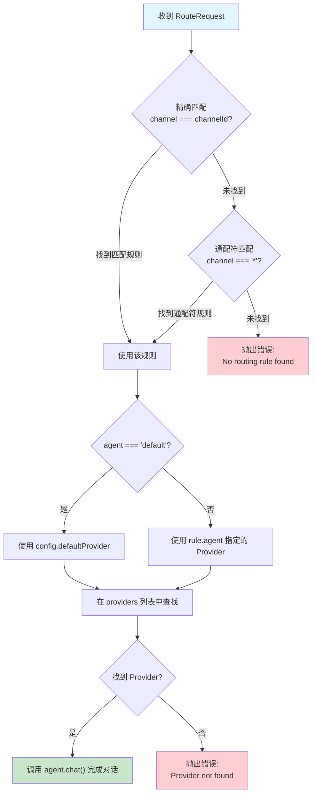
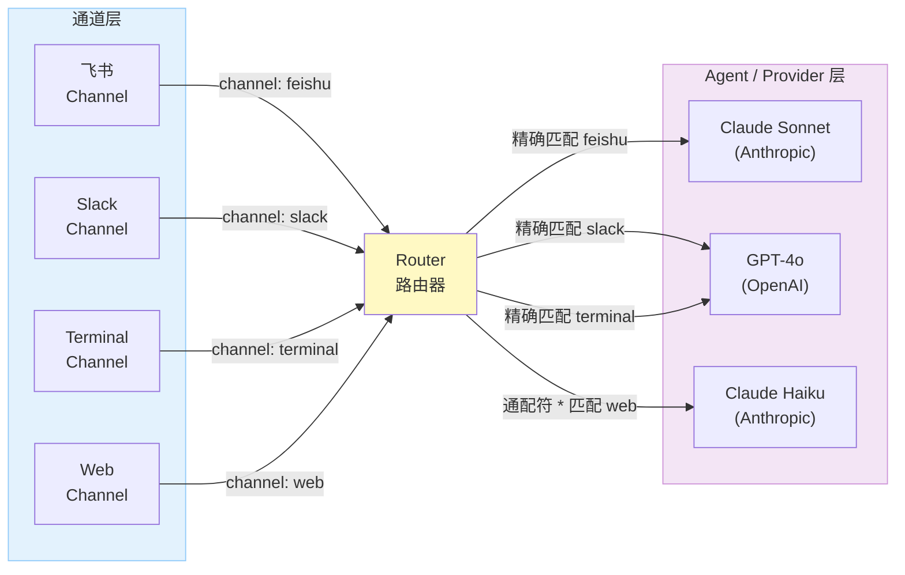
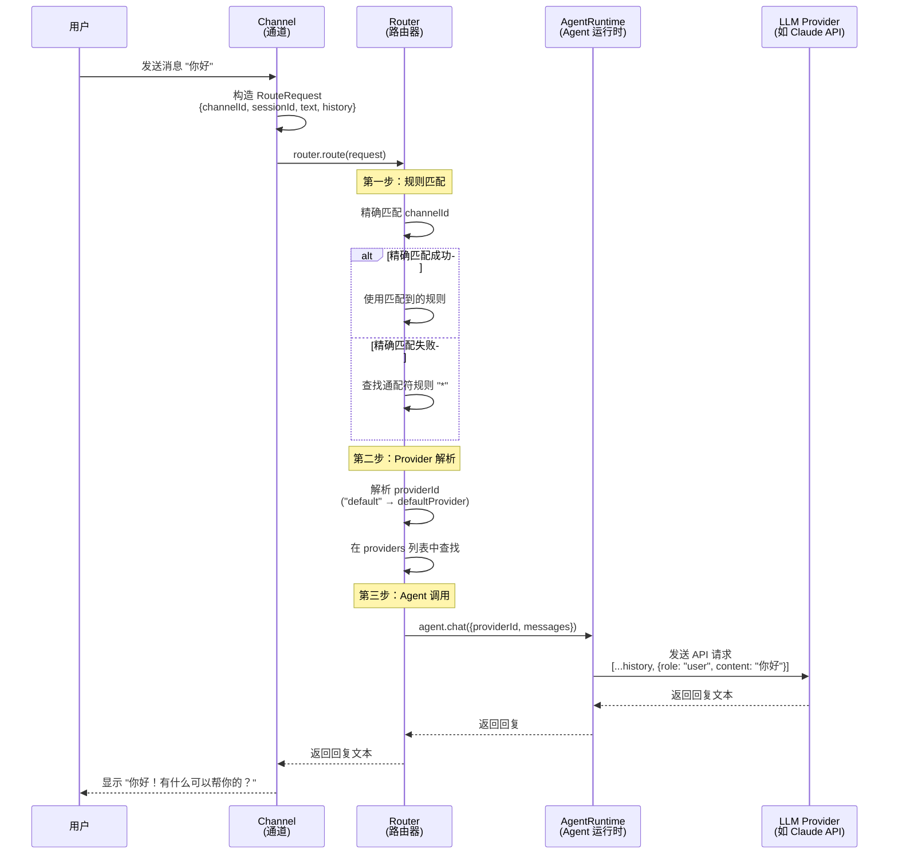

# Chapter 7: Message Routing

In the previous chapter, we built the channel abstraction so that different messaging platforms can connect to the system in a unified way. But once a message comes in, how does the system know which AI Provider should handle it? That's exactly the problem **Message Routing** is here to solve.

You can think of the router as a "traffic controller" -- it stands between all channels and all Agents, deciding where each message should go based on predefined rules.

## Routing Decision Flow

Before diving into the code, let's look at the decision process when the router receives a message:



This flowchart illustrates the core logic of MyClaw's routing -- a **Hierarchical Matching** strategy. It tries three levels in order of priority:

| Priority | Match Type | Description |
| --- | --- | --- |
| 1 | Exact Match | A one-to-one match like `channel === "feishu"` |
| 2 | Wildcard Match | `channel === "*"` serves as a fallback rule |
| 3 | Error | Neither matched, indicating a gap in the configuration |

This design gives you flexible configuration: for example, Feishu uses Claude, Terminal uses GPT-4, and all other channels use the default Provider.

## Key Files

| File | Purpose |
| --- | --- |
| `src/routing/router.ts` | Router implementation, including the route request interface, router interface, and matching logic |

## The RouteRequest Interface: Input for Routing

Every message that needs routing is wrapped in a `RouteRequest`, which carries all the information needed for the routing decision:

```typescript
// src/routing/router.ts

export interface RouteRequest {
  channelId: string;    // Which channel the message came from
  sessionId: string;    // Session ID
  text: string;         // The text sent by the user
  history: Array<{ role: "user" | "assistant"; content: string }>;  // Conversation history
}
```

Why do we need these four fields? Let's understand each one:

- **`channelId`** -- This is the **core basis** for the routing decision. The router uses it to look up the matching routing rule. For example, `"feishu"` or `"terminal"`.
- **`sessionId`** -- Used to distinguish between different conversation sessions. Multiple users might be chatting on the same channel simultaneously, and `sessionId` ensures they don't get mixed up.
- **`text`** -- The user's current input, which will ultimately be appended to the end of the message list and sent to the LLM.
- **`history`** -- Previous conversation records. The LLM needs this to understand context and provide coherent responses.

> **Design Insight**: Why doesn't `RouteRequest` carry Provider information directly? Because "deciding which Provider to use" is precisely the router's responsibility. The caller only needs to say "this message came from feishu," and the router will look up the table to decide where to route it. This is an example of **separation of concerns**.

## The Router Interface: The Router's Contract

```typescript
// src/routing/router.ts

export interface Router {
  route(request: RouteRequest): Promise<string>;
}
```

The `Router` interface is extremely concise -- it has only one `route()` method. It takes a `RouteRequest` and returns a `Promise<string>` (the AI's reply text).

This simplicity is intentional:

- **For the caller**: You just need to call `router.route(request)`, without worrying about which Provider is used internally, how the rules are matched, or how the LLM is called.
- **For the implementer**: As long as you satisfy this signature, you're free to implement any routing strategy -- based on channel, content, load, or even random routing.

## Router Implementation in Detail

`createRouter()` is a factory function that takes a configuration and an Agent Runtime, and returns a `Router` instance. Let's read the full implementation and then break it down step by step:

```typescript
// src/routing/router.ts

export function createRouter(
  config: OpenClawConfig,
  agent: AgentRuntime
): Router {
  // Read routing rules from the configuration
  const rules = config.routing;

  return {
    async route(request: RouteRequest): Promise<string> {
      // Hierarchical matching: try exact match first, then wildcard match
      const rule =
        rules.find((r) => r.channel === request.channelId) ??
        rules.find((r) => r.channel === "*");

      if (!rule) {
        throw new Error(
          `No routing rule found for channel '${request.channelId}'`
        );
      }

      // Determine the Provider
      const providerId = rule.agent === "default"
        ? config.defaultProvider
        : rule.agent;

      const provider = config.providers.find((p) => p.id === providerId);
      if (!provider) {
        throw new Error(`Provider '${providerId}' not found in config`);
      }

      // Call the Agent to conduct the conversation
      return agent.chat({
        providerId: provider.id,
        messages: [
          ...request.history,
          { role: "user", content: request.text },
        ],
      });
    },
  };
}
```

This code isn't long, but every part has a clear responsibility. Let's break it down following the "three-step routing" process.

## Three-Step Routing: From Rule Matching to LLM Invocation

The entire routing process can be clearly divided into three steps: **Rule Matching -> Provider Resolution -> Agent Invocation**.

### Step 1: Rule Matching

```typescript
const rule =
  rules.find((r) => r.channel === request.channelId) ??   // Exact match
  rules.find((r) => r.channel === "*");                    // Wildcard match
```

Here we use JavaScript's `??` (nullish coalescing operator) to implement a two-tier lookup:

1. **First `find()`**: Iterates through the `rules` array, looking for a rule whose `channel` field exactly equals `request.channelId`. If found, it's used directly.
2. **Second `find()`**: Only executes when the first round returns `undefined`. This time it looks for a wildcard rule with `channel === "*"` as a fallback.
3. **Neither found**: `rule` is `undefined`, and the subsequent `if (!rule)` will throw a descriptive error.

> **Teaching Note**: The difference between `??` and `||` is that `??` only takes the right-hand value when the left side is `null` or `undefined`. Using `??` here is more precise than `||` because `find()` returns `undefined` (not `false` or an empty string).

### Step 2: Provider Resolution

```typescript
const providerId = rule.agent === "default"
  ? config.defaultProvider    // "default" maps to the defaultProvider in config
  : rule.agent;               // Otherwise, use the specified provider ID directly

const provider = config.providers.find((p) => p.id === providerId);
if (!provider) {
  throw new Error(`Provider '${providerId}' not found in config`);
}
```

The `agent` field in a routing rule supports two forms:

| Form | Meaning | Example |
| --- | --- | --- |
| `"default"` | Use the Provider specified by `defaultProvider` in the config file | Convenient for unified management |
| Specific ID | Directly specify a Provider | `"anthropic"`, `"openai"` |

After resolving the `providerId`, we still need to find the corresponding Provider configuration in the `config.providers` list. If it's not found, it means there's an error in the configuration file, and we throw an error immediately. This "fail fast" strategy helps you catch configuration issues early.

### Step 3: Agent Invocation

```typescript
return agent.chat({
  providerId: provider.id,
  messages: [
    ...request.history,                      // Conversation history
    { role: "user", content: request.text }, // Current user input
  ],
});
```

This step concatenates the conversation history and the current message into a complete message list, and sends it to the specified LLM Provider through the Agent Runtime.

Notice how the message list is constructed: `...request.history` spreads the previous conversation records, then appends the current user input. This way, the LLM can see the full conversation context and provide a coherent response.

## Routing Rule Configuration

Routing rules are defined in the configuration file `myclaw.yaml`. Let's look at several common patterns to demonstrate the configuration approach.

### Pattern 1: All Channels Use the Same Agent

The simplest configuration -- a single wildcard rule handles everything:

```yaml
# myclaw.yaml
defaultProvider: "default"

providers:
  - id: "default"
    type: "anthropic"
    apiKeyEnv: "ANTHROPIC_API_KEY"
    model: "claude-sonnet-4-6"

routing:
  - channel: "*"
    agent: "default"
```

All channel messages are routed to the same Anthropic Provider. This is perfect for when you're just starting to build the system and only have one LLM.

### Pattern 2: Different Channels Use Different Agents

Assign different LLM Providers to different channels:

```yaml
# myclaw.yaml
providers:
  - id: "claude"
    type: "anthropic"
    apiKeyEnv: "ANTHROPIC_API_KEY"
    model: "claude-sonnet-4-6"
  - id: "gpt"
    type: "openai"
    apiKeyEnv: "OPENAI_API_KEY"
    model: "gpt-4o"

defaultProvider: "claude"

routing:
  - channel: "feishu"
    agent: "claude"       # Feishu uses Claude
  - channel: "terminal"
    agent: "gpt"          # Terminal uses GPT-4o
  - channel: "*"
    agent: "default"      # Everything else uses the default (Claude)
```

Matching order illustrated:

| Message Source | Matched Rule | Provider Used |
| --- | --- | --- |
| Feishu | `channel: "feishu"` (exact match) | Claude |
| Terminal | `channel: "terminal"` (exact match) | GPT-4o |
| Other channels | `channel: "*"` (wildcard match) | Claude (default) |

### Pattern 3: A/B Testing

You can leverage routing rules for A/B testing to compare the performance of different models:

```yaml
# myclaw.yaml
providers:
  - id: "claude-sonnet"
    type: "anthropic"
    apiKeyEnv: "ANTHROPIC_API_KEY"
    model: "claude-sonnet-4-6"
  - id: "claude-haiku"
    type: "anthropic"
    apiKeyEnv: "ANTHROPIC_API_KEY"
    model: "claude-haiku-4"

routing:
  - channel: "test-channel-a"
    agent: "claude-sonnet"
  - channel: "test-channel-b"
    agent: "claude-haiku"
```

By assigning test users to different channels, you can compare how Sonnet and Haiku perform on the same tasks.

## Multi-Agent Routing Pattern

As the system scales up, you might have multiple channels and multiple Providers running simultaneously. The diagram below shows a typical multi-Agent routing topology:



The corresponding configuration is as follows:

```yaml
# myclaw.yaml
providers:
  - id: "claude-sonnet"
    type: "anthropic"
    apiKeyEnv: "ANTHROPIC_API_KEY"
    model: "claude-sonnet-4-6"
  - id: "gpt-4o"
    type: "openai"
    apiKeyEnv: "OPENAI_API_KEY"
    model: "gpt-4o"
  - id: "claude-haiku"
    type: "anthropic"
    apiKeyEnv: "ANTHROPIC_API_KEY"
    model: "claude-haiku-4"

defaultProvider: "claude-haiku"

routing:
  - channel: "feishu"
    agent: "claude-sonnet"   # Important conversations use the strongest model
  - channel: "slack"
    agent: "gpt-4o"          # Slack uses GPT-4o
  - channel: "terminal"
    agent: "gpt-4o"          # Terminal also uses GPT-4o
  - channel: "*"
    agent: "default"         # Everything else uses Haiku (fast, low cost)
```

This pattern demonstrates the true power of the router: **the same system can flexibly choose different LLMs based on the scenario**. Important customer channels use the strongest model, internal testing uses fast and cheap models -- all driven by configuration, no code changes needed.

## Complete Message Flow

Putting the router back into the overall architecture, here's the complete journey of a message from user input to final response:



Let's walk through this flow with a concrete example:

1. **User types in the terminal** `"Hello"`
2. **TerminalChannel receives the input** and constructs a `RouteRequest`:
   ```typescript
   {
     channelId: "terminal",
     sessionId: "terminal:terminal",
     text: "Hello",
     history: []  // First conversation, history is empty
   }
   ```
3. **Router begins matching**:
   - Exact match `channel === "terminal"` -- suppose it finds the rule `{ channel: "terminal", agent: "gpt" }`
   - If no exact match is found, it falls back to looking for a wildcard rule with `channel === "*"`
4. **Resolve Provider**:
   - `rule.agent` is `"gpt"` (not `"default"`), so it's used directly
   - Finds the Provider configuration with `id === "gpt"` in `config.providers`
5. **Call the Agent**:
   - Concatenates `history` (empty array) with `{ role: "user", content: "Hello" }`
   - Sends it to OpenAI GPT-4o via `agent.chat()`
6. **Return the response**: The LLM's reply travels back along the same path and is eventually displayed in the terminal

## How to Extend Routing

The current routing implementation is a streamlined but complete version based on hierarchical matching by channel ID. In a real production system, you might need more advanced routing strategies. Here are a few extension directions to think about.

### Content-Based Routing

Route based on message content. For example, messages containing code are routed to a model that excels at programming:

```typescript
// Conceptual example (not the current implementation)
async route(request: RouteRequest): Promise<string> {
  // Detect message content
  const hasCode = /```[\s\S]*```/.test(request.text)
    || request.text.includes("function ")
    || request.text.includes("def ");

  // Choose different Provider based on content
  const providerId = hasCode ? "coding-model" : "general-model";

  return agent.chat({
    providerId,
    messages: [...request.history, { role: "user", content: request.text }],
  });
}
```

### Load Balancing

When you have multiple instances of the same type of Provider, distribute requests among them:

```typescript
// Conceptual example (not the current implementation)
const providers = ["claude-1", "claude-2", "claude-3"];
let index = 0;

async route(request: RouteRequest): Promise<string> {
  // Simple Round-Robin strategy
  const providerId = providers[index % providers.length];
  index++;

  return agent.chat({
    providerId,
    messages: [...request.history, { role: "user", content: request.text }],
  });
}
```

### Failover

Automatically switch to a backup Provider when one becomes unavailable:

```typescript
// Conceptual example (not the current implementation)
const primaryProvider = "claude-sonnet";
const fallbackProvider = "gpt-4o";

async route(request: RouteRequest): Promise<string> {
  const messages = [
    ...request.history,
    { role: "user", content: request.text },
  ];

  try {
    // Try the primary Provider first
    return await agent.chat({ providerId: primaryProvider, messages });
  } catch (error) {
    console.warn(`Primary provider failed, falling back: ${error}`);
    // Primary Provider failed, switch to backup
    return agent.chat({ providerId: fallbackProvider, messages });
  }
}
```

All of these extensions **don't require modifying the `Router` interface** -- they're just changes to the internal logic of the `route()` method. This is the value of good interface design: **consumer code doesn't need to change because of implementation changes**.

## Chapter Summary

Message routing is the bridge connecting "channels" and "Agents." In this chapter, we learned:

- **RouteRequest** encapsulates all information needed for routing decisions (channelId, sessionId, text, history)
- **The Router interface** exposes only one `route()` method, keeping things simple
- The **Hierarchical Matching** strategy (exact -> wildcard -> error) is both flexible and predictable
- The **three-step routing** process: Rule Matching -> Provider Resolution -> Agent Invocation
- Routing can be flexibly controlled through the `myclaw.yaml` configuration file, with no code changes needed
- Extending routing strategies (content-based routing, load balancing, failover) only requires modifying the internal logic of `route()`

## Next Step

With the router in place, we can now correctly deliver messages from channels to Agents. In the next chapter, we'll implement a real external messaging channel -- the **Feishu Channel**, allowing our AI Agent to chat with users through a Feishu bot.

[Next Chapter: Feishu Channel >>](08-feishu.md)
