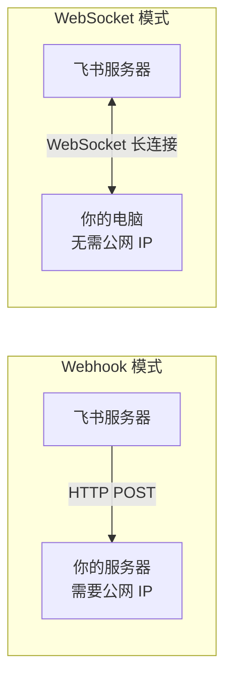
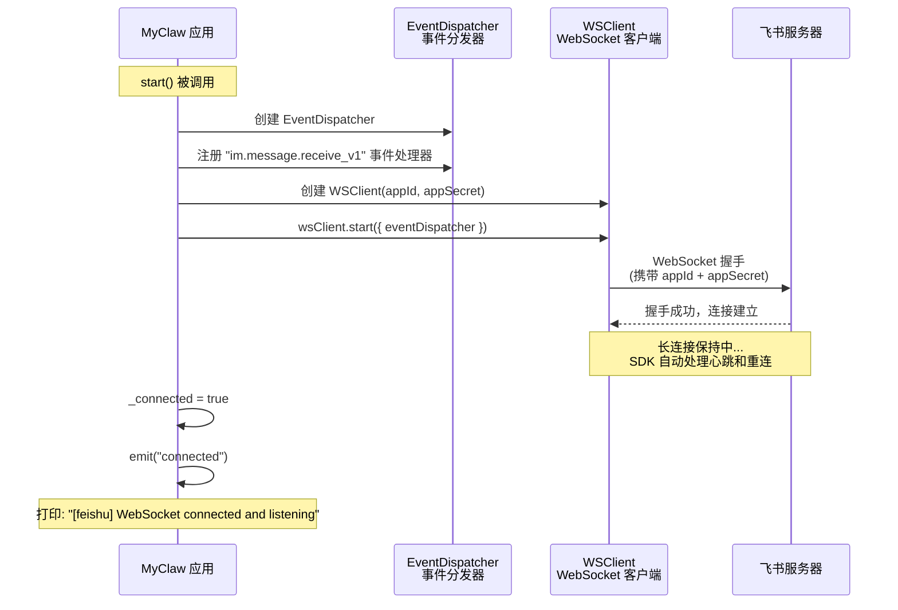
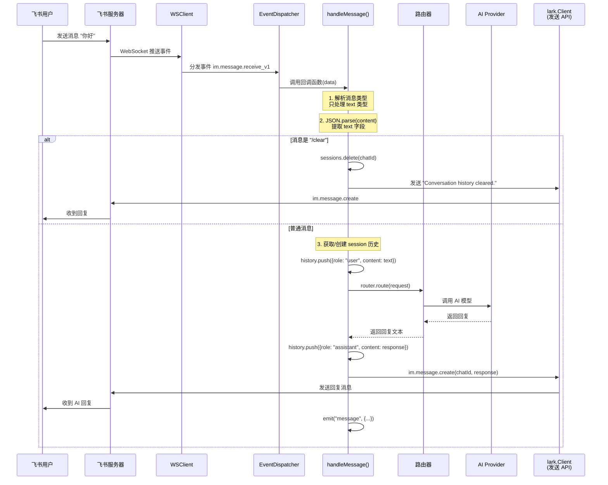

# Chapter 8: Feishu Channel

In the previous chapters, we implemented the terminal channel -- a purely local interaction method where you type in the command line and the AI replies directly. While convenient for debugging, in practice we'd prefer the AI to be available inside team collaboration tools.

In this chapter, we'll implement the **Feishu channel** -- turning MyClaw into a Feishu bot that team members can chat with directly in Feishu.

## Feishu Channel Overview

### WebSocket vs Webhook: Two Ways to Receive Messages

When integrating with Feishu (or any instant messaging platform), there are typically two ways to receive messages:



| Comparison | Webhook Mode | WebSocket Mode |
| --- | --- | --- |
| Direction | Feishu actively POSTs to your server | Your program actively connects to Feishu |
| Public network requirement | Requires a public IP or domain | Not required; can run locally |
| Configuration complexity | Requires HTTPS, domain, firewall setup | Only needs App ID + App Secret |
| Use cases | Production, large-scale deployments | Development/debugging, small-scale deployments |
| NAT/Firewall | Requires port mapping or tunneling | Auto-traversal, no network configuration needed |

**MyClaw uses WebSocket mode** because:

1. **Zero network configuration** -- No need to buy a domain, set up HTTPS, or open ports. It runs right on your laptop.
2. **Developer-friendly** -- Just a few lines of code to establish a connection.
3. **Great SDK support** -- Feishu's official `@larksuiteoapi/node-sdk` has excellent WebSocket support built in.

> **Learning tip**: WebSocket is a full-duplex communication protocol. Unlike HTTP's "request-response" model, once a WebSocket connection is established, both sides can send messages at any time. Feishu uses WebSocket to "push" new messages to your program, just like real-time chat.

## FeishuChannel Class Design

The Feishu channel, like the terminal channel, inherits from the `Channel` abstract class. Here's its class structure:

```mermaid
classDiagram
    class Channel {
        <<abstract>>
        +id: string
        +type: string
        +connected: boolean
        +setRouter(router: Router): void
        +start(): Promise~void~
        +stop(): Promise~void~
        +send(message: OutgoingMessage): Promise~void~
        +emit(event, data)
    }

    class FeishuChannel {
        +id: string
        +type: "feishu"
        -client: lark.Client
        -wsClient: lark.WSClient | null
        -_connected: boolean
        -router: Router | null
        -config: ChannelConfig
        -appId: string
        -appSecret: string
        +constructor(config, appId, appSecret)
        +get connected(): boolean
        +setRouter(router: Router): void
        +start(): Promise~void~
        +stop(): Promise~void~
        +send(message: OutgoingMessage): Promise~void~
        -handleMessage(data, router): Promise~void~
    }

    Channel <|-- FeishuChannel

    class "lark.Client" as LarkClient {
        +im.message.create()
        主动调用飞书 API
    }

    class "lark.WSClient" as WSClient {
        +start(options)
        WebSocket 长连接
    }

    FeishuChannel --> LarkClient : 发送消息
    FeishuChannel --> WSClient : 接收消息
```

**The two lark clients each have their own responsibility:**

| Client | Responsibility | When it's used |
| --- | --- | --- |
| `lark.Client` | Actively calls Feishu APIs (e.g., sending messages) | Replying to users, sending /clear confirmation |
| `lark.WSClient` | Establishes WebSocket connection, receives event pushes | Listening for new messages from users |

Let's break down this class implementation step by step.

### Constructor: Initializing Connection Credentials

```typescript
// src/channels/feishu.ts

export class FeishuChannel extends Channel {
  readonly id: string;
  readonly type = "feishu";
  private client: lark.Client;
  private wsClient: lark.WSClient | null = null;
  private _connected = false;
  private router: Router | null = null;
  private config: ChannelConfig;
  private appId: string;
  private appSecret: string;

  constructor(config: ChannelConfig, appId: string, appSecret: string) {
    super();
    this.id = config.id;
    this.config = config;
    this.appId = appId;
    this.appSecret = appSecret;
    this.client = new lark.Client({
      appId,
      appSecret,
      appType: lark.AppType.SelfBuild,  // Self-built enterprise app
    });
  }
}
```

The constructor does two things:

1. **Saves configuration** -- `id`, `config`, and credential information
2. **Creates `lark.Client`** -- This is the client for actively calling Feishu APIs (e.g., sending messages to users)

Session storage is inherited from the `Channel` base class -- the `sessions` Map is already initialized in the parent. Each `chat_id` gets its own conversation history entry in this shared Map.

> **Note**: `lark.WSClient` is not created in the constructor -- it's created in `start()`. This is a good design pattern: separating "configuration initialization" from "connection establishment."

## WSClient + EventDispatcher Architecture

The Feishu SDK uses a **WSClient + EventDispatcher** architecture to receive and dispatch messages. Here's the complete connection flow:



Here's the corresponding code:

```typescript
async start(): Promise<void> {
  if (!this.router) {
    throw new Error("Router must be set before starting Feishu channel");
  }

  const router = this.router;

  // Step 1: Create event dispatcher and register message handler
  const eventDispatcher = new lark.EventDispatcher({}).register({
    "im.message.receive_v1": async (data: any) => {
      try {
        await this.handleMessage(data, router);
      } catch (err) {
        console.error(
          chalk.red(
            `[feishu] Error processing message: ${(err as Error).message}`
          )
        );
      }
    },
  });

  console.log(chalk.dim(`[feishu] Starting WebSocket client...`));

  // Step 2: Create WebSocket client
  this.wsClient = new lark.WSClient({
    appId: this.appId,
    appSecret: this.appSecret,
    loggerLevel: lark.LoggerLevel.warn,
  });

  // Step 3: Start connection, passing in the event dispatcher
  await this.wsClient.start({ eventDispatcher });

  this._connected = true;
  this.emit("connected");
  console.log(chalk.green(`[feishu] WebSocket connected and listening`));
}
```

**What each of the three key steps does:**

| Step | Object | Purpose |
| --- | --- | --- |
| 1 | `EventDispatcher` | Defines "what to do when a message is received" -- registers a callback for the `im.message.receive_v1` event |
| 2 | `WSClient` | Defines "how to connect to Feishu" -- authenticates using appId/appSecret |
| 3 | `wsClient.start()` | Wires them together: when WebSocket receives an event, it hands it to EventDispatcher for dispatch |

> **Learning tip**: `im.message.receive_v1` is a Feishu event type name. `im` stands for the instant messaging module, `message.receive` means the message-received event, and `v1` is the version number. Feishu has other event types as well (such as `im.message.read_v1` for message-read events), but MyClaw currently only needs to listen for new messages.

## Message Processing Flow

When a user sends a message in Feishu, here's the complete processing flow:



### handleMessage Method in Detail

```typescript
private async handleMessage(data: any, router: Router): Promise<void> {
  const message = data.message;
  if (!message) return;

  // ---- Step 1: Filter out non-text messages ----
  const msgType = message.message_type;
  if (msgType !== "text") return;

  const chatId = message.chat_id as string;
  const senderId = (data.sender?.sender_id?.open_id as string) ?? "unknown";

  // ---- Step 2: Parse message content ----
  // Feishu's message.content is a JSON string, formatted like: '{"text":"Hello"}'
  let text: string;
  try {
    const content = JSON.parse(message.content);
    text = content.text;
  } catch {
    return;  // JSON parsing failed, ignore this message
  }

  if (!text) return;

  // ---- Step 3: Handle /clear command ----
  if (text.trim() === "/clear") {
    this.clearSession(chatId);
    await this.client.im.message.create({
      params: { receive_id_type: "chat_id" },
      data: {
        receive_id: chatId,
        msg_type: "text",
        content: JSON.stringify({ text: "Conversation history cleared." }),
      },
    });
    return;
  }

  // ---- Step 4: Route message and send reply ----
  try {
    const response = await this.routeMessage(router, chatId, senderId, text);

    await this.client.im.message.create({
      params: { receive_id_type: "chat_id" },
      data: {
        receive_id: chatId,
        msg_type: "text",
        content: JSON.stringify({ text: response }),
      },
    });
  } catch (err) {
    // Send a friendly error message to the user
    console.error(
      chalk.red(
        `[feishu] Error processing message: ${(err as Error).message}`
      )
    );
    await this.client.im.message.create({
      params: { receive_id_type: "chat_id" },
      data: {
        receive_id: chatId,
        msg_type: "text",
        content: JSON.stringify({
          text: "Sorry, I encountered an error. Please try again.",
        }),
      },
    });
  }
}
```

Notice how the code has been simplified compared to an approach where each channel manages its own sessions. The `/clear` command uses the inherited `this.clearSession(chatId)` helper, and regular messages delegate to `this.routeMessage(router, chatId, senderId, text)` which handles session lookup, history management, routing, and event emission -- all in the base class.

### Key Details About Feishu's Message Format

Feishu's message format isn't quite what you might intuitively expect. `message.content` is not a plain string -- it's a **JSON string**:

```
User sends: "Hello"

Value of message.content: '{"text":"Hello"}'   <- Note: this is a string, not an object
```

So we need `JSON.parse(message.content).text` to get the actual text. Similarly, when replying, we must use `JSON.stringify({ text: response })`.

## /clear Command Implementation

The Feishu channel supports the `/clear` command to clear the conversation history for the current chat:

```typescript
if (text.trim() === "/clear") {
  this.clearSession(chatId);
  await this.client.im.message.create({
    params: { receive_id_type: "chat_id" },
    data: {
      receive_id: chatId,
      msg_type: "text",
      content: JSON.stringify({ text: "Conversation history cleared." }),
    },
  });
  return;  // Return immediately without entering the AI processing flow
}
```

The implementation uses the inherited `clearSession()` helper to delete the current `chatId`'s record from the `sessions` Map, then sends a confirmation message. The next time someone sends a message in this chat, `routeMessage()` will automatically create a new empty history.

> **Why do we need /clear?** AI has a limited context window. When a conversation gets long, earlier content may be truncated or affect response quality. `/clear` lets users "start fresh" with a new conversation.

## Session Management Based on chat_id

A key feature of the Feishu channel is its support for **concurrent multi-user sessions**. Each Feishu chat (direct message or group chat) has a unique `chat_id`, which MyClaw uses to isolate conversation histories across different chats.

Session storage is inherited from the `Channel` base class:

```typescript
// Defined in Channel base class (src/channels/transport.ts)
export type HistoryEntry = { role: "user" | "assistant"; content: string };
export type SessionMap = Map<string, HistoryEntry[]>;

export abstract class Channel extends EventEmitter {
  protected sessions: SessionMap = new Map();
  // ...
}
```

The Feishu channel uses `chat_id` as the key into this inherited `sessions` Map:

```
Chat A (chat_id: oc_aaa)              Chat B (chat_id: oc_bbb)
┌─────────────────────┐              ┌─────────────────────┐
│ user: "What is TypeScript?"│       │ user: "How's the weather?" │
│ assistant: "TypeScript     │       │ assistant: "I can't fetch  │
│   is a..."                 │       │   real-time weather..."    │
│ user: "How is it different │       │                            │
│   from JS?"                │       │                            │
│ assistant: "The main       │       │                            │
│   differences are..."      │       │                            │
└─────────────────────┘              └─────────────────────┘
             ↑                                    ↑
    sessions.get("oc_aaa")             sessions.get("oc_bbb")
```

Each chat's conversation history is completely independent and won't interfere with each other. This means:

- User A's conversation with the bot won't affect User B
- Group chats also have their own independent context
- `/clear` only clears the history of the current chat, without affecting other chats

### sessionId Construction

```typescript
const sessionId = `${this.id}:${chatId}`;
// e.g., "my-feishu:oc_5ad11d72b830411d"
```

The `sessionId` is composed of the channel ID and `chat_id`. This ensures that even if multiple Feishu channel instances are running simultaneously, sessions won't conflict.

## Sending Messages (send Method)

```typescript
async send(message: OutgoingMessage): Promise<void> {
  // Extract chat_id from sessionId
  // sessionId format: "channelId:chatId"
  const chatId = message.sessionId.split(":")[1];
  if (!chatId) {
    console.error(`[feishu] Invalid session ID: ${message.sessionId}`);
    return;
  }

  await this.client.im.message.create({
    params: { receive_id_type: "chat_id" },
    data: {
      receive_id: chatId,
      msg_type: "text",
      content: JSON.stringify({ text: message.text }),
    },
  });
}
```

The `send` method is an interface required by the `Channel` abstract class. It parses the `chat_id` from the `sessionId`, then calls the Feishu API to send the message.

## Channel Manager Integration

In `src/channels/manager.ts`, the `createChannelManager` function is responsible for creating and starting all channels based on configuration. Here's how the Feishu channel is created:

```typescript
// src/channels/manager.ts (excerpt)

switch (channelConfig.type) {
  case "feishu": {
    // 1. Resolve credentials (supports direct config or environment variables)
    const appId = resolveSecret(
      channelConfig.appId,
      channelConfig.appIdEnv
    );
    const appSecret = resolveSecret(
      channelConfig.appSecret,
      channelConfig.appSecretEnv
    );

    // 2. Check if credentials exist
    if (!appId || !appSecret) {
      console.warn(
        chalk.yellow(
          `[channels] Skipping '${channelConfig.id}': missing App ID or App Secret`
        )
      );
      continue;
    }

    // 3. Create channel instance -> set router -> start
    const feishu = new FeishuChannel(channelConfig, appId, appSecret);
    feishu.setRouter(router);
    channels.set(channelConfig.id, feishu);
    await feishu.start();
    break;
  }
  // ...
}
```

**The cleverness of `resolveSecret`:** It supports two ways to provide credentials:

- **Direct value**: `appId: "cli_xxx"` -- Simple but not secure
- **Environment variable**: `appIdEnv: "FEISHU_APP_ID"` -- Recommended approach; credentials don't appear in the config file

**Note a detail:** The terminal channel (`terminal`) is skipped in the Channel Manager:

```typescript
if (channelConfig.type === "terminal") continue; // Terminal is handled separately
```

This is because the terminal channel needs exclusive access to stdin/stdout, and its lifecycle management differs from the Gateway, so it's handled separately.

## Complete Feishu Bot Configuration Guide

Below are the detailed steps to create a Feishu bot from scratch and connect it to MyClaw.

### Step 1: Create a Feishu App

1. Open your browser and visit the [Feishu Open Platform](https://open.feishu.cn/app)
2. If you're not logged in, sign in with your Feishu account first
3. You'll see the "My Apps" page. Click the **"Create Custom App"** button in the top right corner
4. In the dialog that appears, fill in:
   - **App Name**: Choose a meaningful name, such as `MyClaw AI Assistant`
   - **App Description**: A brief description, such as `An AI chatbot built on the MyClaw framework`
   - **App Icon**: You can upload an icon or skip this for now
5. Click **"Confirm"**
6. After creation, you'll be taken to the app's admin console

> **Tip**: You need Feishu enterprise admin permissions, or you can work within a development/testing Feishu team. Personal Feishu accounts can also create apps.

### Step 2: Get the App ID and App Secret

1. In the app admin console, click **"Credentials & Basic Info"** in the left menu
2. On the page you'll see:
   - **App ID**: A string starting with `cli_`, e.g., `cli_a1b2c3d4e5f6g7h8`
   - **App Secret**: A longer string; click "View" to reveal it
3. **Record these two values** -- you'll need them when configuring MyClaw

> **Security tip**: The App Secret is sensitive information. Don't commit it to a git repository or share it with others. We'll use environment variables to manage it later.

### Step 3: Add App Capability -- Bot

1. In the left menu, click **"Add App Capability"**
2. In the capability list, find the **"Bot"** card
3. Click **"Add"**
4. Once added, you'll see bot-related options in the left menu

> **Why do we need to add bot capability?** Feishu apps can have multiple capabilities (web apps, mini programs, bots, etc.). We need the "Bot" capability so the app can send and receive messages in chats.

### Step 4: Enable WebSocket Mode (Long Connection)

1. In the left menu, click **"Event Configuration"** under **"Development Settings"**
2. Find the **"Event Configuration Method"** section on the page
3. Click the **"Edit"** button
4. Select **"Use long connection to receive events"** (not "Send events to developer server")
5. Click **"Save"**

> **This step is crucial!** If you choose the wrong configuration method, the WebSocket connection won't be established. "Long connection" is the WebSocket mode. Once selected, Feishu will push events to your program via WebSocket, with no public IP required.

### Step 5: Add Event Subscriptions

1. Stay on the **"Event Configuration"** page
2. Find the **"Event Subscriptions"** section and click **"Add Event"**
3. Search for and add the following event:
   - **Receive Message `im.message.receive_v1`** -- Triggered when someone sends a message to the bot

> **Tip**: After adding events, you may need to add the corresponding permissions as well. The page will show prompts -- just follow them.

### Step 6: Add Permissions

1. In the left menu, click **"Permission Management"**
2. Search for and enable the following permissions:
   - **`im:message`** -- Read and send messages in direct and group chats
   - **`im:message:send_as_bot`** -- Send messages as the app (you may need this if the previous permission isn't sufficient)
3. Check the corresponding permissions and click **"Batch Enable"**

> **Permission note**: `im:message` is the core permission that allows the bot to read received messages and send replies. Without it, the bot can receive events but won't be able to reply.

### Step 7: Create a Version and Publish

1. In the left menu, click **"Version Management & Release"**
2. Click **"Create Version"**
3. Fill in a version number (e.g., `1.0.0`) and release notes
4. Click **"Save"**, then click **"Submit for Release"**
5. If you're the enterprise admin, you can approve it directly
6. If not, you'll need to wait for admin approval

> **Important**: The app must be published before the bot can be found and used in Feishu. During development, you can enable "Debug Mode" in "Version Management" for testing.

### Step 8: Set Environment Variables

Set the Feishu credentials in your terminal:

```bash
# macOS / Linux
export FEISHU_APP_ID="cli_xxxxxxxxxxxxxxxxx"
export FEISHU_APP_SECRET="xxxxxxxxxxxxxxxxxxxxxxxxxxxxxxxxx"

# Verify the environment variables are set
echo $FEISHU_APP_ID
echo $FEISHU_APP_SECRET
```

To make the environment variables persistent, add them to your shell configuration file:

```bash
# Add to ~/.zshrc or ~/.bashrc
echo 'export FEISHU_APP_ID="cli_xxxxxxxxxxxxxxxxx"' >> ~/.zshrc
echo 'export FEISHU_APP_SECRET="xxxxxxxxxxxxxxxxxxxxxxxxxxxxxxxxx"' >> ~/.zshrc
source ~/.zshrc
```

> **A safer approach**: Use a `.env` file + the `dotenv` library to load environment variables. Add `.env` to `.gitignore` to prevent accidental exposure.

### Step 9: Configure myclaw.yaml

Add the Feishu channel to your project's `myclaw.yaml` configuration file:

```yaml
channels:
  # Terminal channel (for development/debugging)
  - id: "terminal"
    type: "terminal"
    enabled: true
    greeting: "MyClaw AI assistant"

  # Feishu channel
  - id: "my-feishu"
    type: "feishu"
    enabled: true
    appIdEnv: "FEISHU_APP_ID"         # Read App ID from environment variable
    appSecretEnv: "FEISHU_APP_SECRET"  # Read App Secret from environment variable
    greeting: "MyClaw AI assistant"
```

Configuration reference:

| Field | Description | Required |
| --- | --- | --- |
| `id` | Unique identifier for the channel; you can customize it | Yes |
| `type` | Must be `"feishu"` | Yes |
| `enabled` | Whether to enable this channel | No (defaults to true) |
| `appIdEnv` | Name of the environment variable holding the App ID | Yes (or use `appId`) |
| `appSecretEnv` | Name of the environment variable holding the App Secret | Yes (or use `appSecret`) |
| `greeting` | Greeting message (not currently used by the Feishu channel; reserved field) | No |

> **Two ways to configure credentials**:
> - `appIdEnv` / `appSecretEnv`: Specify environment variable names; values are read at runtime (recommended)
> - `appId` / `appSecret`: Write them directly in the config file (not recommended due to exposure risk)

### Step 10: Start the Gateway and Test

```bash
npx tsx src/entry.ts gateway
```

After a successful start, you should see output similar to:

```
[feishu] Starting WebSocket client...
[feishu] WebSocket connected and listening
```

**How to test:**

1. Open the Feishu client (desktop or mobile)
2. Search for your bot's name in the search bar (e.g., `MyClaw AI Assistant`)
3. Click to enter the conversation
4. Send a message, such as `Hello`
5. If everything is working, you should quickly receive an AI reply
6. Try sending `/clear` -- you should receive the confirmation `Conversation history cleared.`

## Comparison with the Terminal Channel

| Feature | Terminal Channel | Feishu Channel |
| --- | --- | --- |
| **User interface** | Command-line readline | Feishu App (desktop/mobile) |
| **Multi-user support** | Single user | Multi-user (isolated by chat_id) |
| **Connection method** | Local stdin/stdout | WebSocket long connection to Feishu server |
| **Network requirement** | None | Must be able to reach Feishu servers |
| **Authentication** | No authentication needed | App ID + App Secret |
| **Supported commands** | /help, /clear, /history, /status | /clear |
| **Message format** | Plain text | JSON-wrapped text |
| **Deployment** | Local only | Local is fine (WebSocket needs no public IP) |
| **Use case** | Development/debugging | Team collaboration, production |
| **Channel Manager handling** | Skipped; handled separately | Managed uniformly by Channel Manager |
| **Session storage** | Inherited `sessions` Map (single `chatId` key) | Inherited `sessions` Map (keyed by `chat_id`) |
| **Error handling** | Print to console | Print to console + send error message to user |

## Troubleshooting Common Issues

### Issue 1: "missing App ID or App Secret" on startup

```
[channels] Skipping 'my-feishu': missing App ID or App Secret
```

**Cause**: Environment variables are not set correctly.

**Solution**:
1. Confirm that the environment variable names match `appIdEnv` / `appSecretEnv` in `myclaw.yaml`
2. Run `echo $FEISHU_APP_ID` to verify the variable has a value
3. If you opened a new terminal window, remember to re-`export` or `source` your config file

### Issue 2: WebSocket connection failure

```
[feishu] Error processing message: ...
```

**Possible causes and solutions**:
- **Incorrect App ID or App Secret**: Double-check the credentials; make sure you didn't copy extra spaces
- **App not published**: Go back to the Feishu Open Platform and confirm the app has been published or debug mode is enabled
- **Long connection mode not enabled**: Check whether "Use long connection to receive events" is selected under "Event Configuration"
- **Network issue**: Make sure your computer can access `open.feishu.cn`

### Issue 3: Bot doesn't receive messages

**Possible causes and solutions**:
- **`im.message.receive_v1` event subscription not added**: Add it under "Event Configuration"
- **`im:message` permission not enabled**: Enable it under "Permission Management"
- **App version not published**: Permissions only take effect after creating a version and publishing
- **Bot not added to chat**: Make sure you're chatting directly with the bot (direct message), or that the bot has been added as a member in the group chat

### Issue 4: Bot receives messages but doesn't reply

**Possible causes and solutions**:
- **Missing send message permission**: Confirm that `im:message` or `im:message:send_as_bot` permission is enabled
- **Routing configuration error**: Check the routing rules in `myclaw.yaml` to ensure the Feishu channel can match an agent
- **AI Provider error**: Check the terminal output for error logs -- the API key may have expired or the quota may be exhausted

### Issue 5: JSON parsing error

If you see JSON-related errors, it's usually because a non-text message was received (such as an image, file, or emoji). MyClaw currently only handles text messages; other types are automatically ignored:

```typescript
if (msgType !== "text") return;  // Skip non-text messages
```

This isn't a bug -- it's intentional design. If you need to handle other message types, you can add more branches in `handleMessage`.

### Issue 6: "Router must be set before starting Feishu channel"

**Cause**: The code called `start()` before calling `setRouter()`.

**Solution**: This is typically an internal logic issue. Check whether `feishu.setRouter(router)` is called before `feishu.start()` in `manager.ts`. Under normal circumstances, the Channel Manager handles this ordering automatically.

## Next Steps

We now have two channels: terminal and Feishu. In the next chapter, we'll implement another popular platform -- the **Telegram channel**.

[Next Chapter: Telegram Channel >>](08b-telegram.md)
