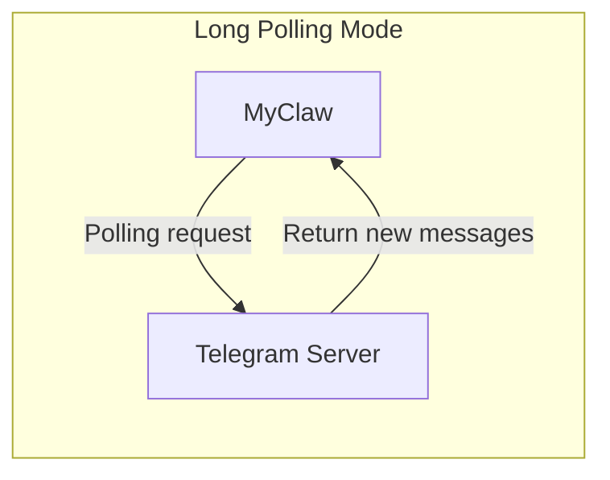

# Chapter 8b: Telegram Channel

In the previous chapter, we implemented the Feishu channel, allowing MyClaw to chat with users in Feishu. In this chapter, we'll implement integration with another popular platform -- the **Telegram Channel**, using the [grammY](https://grammy.dev/) library to turn MyClaw into a Telegram Bot.

## Telegram Bot Overview

### grammY: A Modern Telegram Bot Framework

[grammY](https://grammy.dev/) is a modern TypeScript Telegram Bot framework. Compared to the official `node-telegram-bot-api`, it provides better type support and a cleaner API.



grammY uses **Long Polling** mode by default -- your program actively polls the Telegram server for new messages. Similar to Feishu's WebSocket mode, Long Polling doesn't require a public IP and can run locally.

| Comparison | Webhook Mode | Long Polling Mode |
| --- | --- | --- |
| Direction | Telegram actively POSTs to your server | Your program actively polls Telegram |
| Public network requirement | Requires an HTTPS public address | Not required, can run locally |
| Latency | Lower (real-time push) | Slightly higher (polling interval) |
| Use case | Production, large-scale deployments | Development/debugging, small-scale deployments |

**MyClaw uses Long Polling mode** because it works with zero configuration, making it ideal for learning and personal use.

## TelegramChannel Class Design

The Telegram channel inherits from the `Channel` abstract class, maintaining the same structure as the Feishu channel:

```mermaid
classDiagram
    class Channel {
        <<abstract>>
        +id: string
        +type: string
        +connected: boolean
        +setRouter(router: Router): void
        +start(): Promise~void~
        +stop(): Promise~void~
        +send(message: OutgoingMessage): Promise~void~
        +emit(event, data)
    }

    class TelegramChannel {
        +id: string
        +type: "telegram"
        -bot: Bot
        -_connected: boolean
        -router: Router | null
        -config: ChannelConfig
        -allowedChatIds: Set~number~ | null
        +constructor(config, botToken)
        +get connected(): boolean
        +setRouter(router: Router): void
        +start(): Promise~void~
        +stop(): Promise~void~
        +send(message: OutgoingMessage): Promise~void~
        -isChatAllowed(chatId): boolean
        -handleMessage(...): Promise~void~
    }

    Channel <|-- TelegramChannel

    class "grammy.Bot" as Bot {
        +command(cmd, handler)
        +on(filter, handler)
        +start(options)
        +stop()
        +api.sendMessage()
    }

    TelegramChannel --> Bot : Send/receive messages
```

Comparison with the Feishu channel:

| Feature | Feishu Channel | Telegram Channel |
| --- | --- | --- |
| Library | `@larksuiteoapi/node-sdk` | `grammy` |
| Connection method | WebSocket persistent connection | Long Polling |
| Credentials | App ID + App Secret | Bot Token |
| Access control | None (Feishu apps have their own permission management) | `allowedChatIds` whitelist |
| Message chunking | None (Feishu has a larger message length limit) | Automatic chunking at 4096 characters |

## Full Implementation

### Constructor

```typescript
// src/channels/telegram.ts

export class TelegramChannel extends Channel {
  readonly id: string;
  readonly type = "telegram";
  private bot: Bot;
  private _connected = false;
  private router: Router | null = null;
  private config: ChannelConfig;
  private allowedChatIds: Set<number> | null;

  constructor(config: ChannelConfig, botToken: string) {
    super();
    this.id = config.id;
    this.config = config;
    this.allowedChatIds = config.allowedChatIds
      ? new Set(config.allowedChatIds)
      : null;
    this.bot = new Bot(botToken);
  }
}
```

Compared to the Feishu channel, the Telegram channel's constructor has two differences:

1. **Only a single `botToken` is needed** -- Telegram Bot authentication is simpler than Feishu, requiring only one Token
2. **`allowedChatIds` whitelist** -- An optional security measure to restrict which chats can interact with the Bot

Session storage is inherited from the `Channel` base class -- no need to declare a private `sessions` field.

### start() Method

```typescript
async start(): Promise<void> {
  if (!this.router) {
    throw new Error("Router must be set before starting Telegram channel");
  }

  const router = this.router;

  // /start command -- the standard welcome command for Telegram Bots
  this.bot.command("start", async (ctx) => {
    const chatId = ctx.chat.id;
    if (!this.isChatAllowed(chatId)) return;
    const greeting =
      this.config.greeting ?? "Hello! I'm MyClaw, your AI assistant.";
    await ctx.reply(greeting);
  });

  // /clear command -- clear conversation history
  this.bot.command("clear", async (ctx) => {
    const chatId = ctx.chat.id;
    if (!this.isChatAllowed(chatId)) return;
    this.clearSession(String(chatId));
    await ctx.reply("Conversation history cleared.");
  });

  // Handle text messages
  this.bot.on("message:text", async (ctx) => {
    const chatId = ctx.chat.id;
    if (!this.isChatAllowed(chatId)) return;
    if (ctx.message.text.startsWith("/")) return; // Skip commands

    try {
      await this.handleMessage(
        String(chatId),
        ctx.from?.id ? String(ctx.from.id) : "unknown",
        ctx.message.text,
        router,
        async (text: string) => { await ctx.reply(text); }
      );
    } catch (err) {
      console.error(
        chalk.red(
          `[telegram] Error processing message: ${(err as Error).message}`
        )
      );
      await ctx.reply("Sorry, I encountered an error. Please try again.");
    }
  });

  console.log(chalk.dim(`[telegram] Starting bot...`));

  // Start Long Polling (non-blocking)
  this.bot.start({
    onStart: () => {
      this._connected = true;
      this.emit("connected");
      console.log(chalk.green(`[telegram] Bot started and listening`));
    },
  });
}
```

grammY's API is more intuitive than the Feishu SDK:

| grammY API | Purpose | Feishu SDK Equivalent |
| --- | --- | --- |
| `bot.command("start", handler)` | Register `/start` command | Manual check in `handleMessage` |
| `bot.on("message:text", handler)` | Listen for text messages | `EventDispatcher.register("im.message.receive_v1")` |
| `ctx.reply(text)` | Reply to a message | `client.im.message.create(...)` |
| `bot.start()` | Start polling | `wsClient.start({ eventDispatcher })` |

> **Teaching tip**: `bot.start()` is non-blocking -- it starts the Long Polling loop in the background without blocking the Node.js event loop. The `onStart` callback fires after the first successful poll.

### allowedChatIds Whitelist

```typescript
private isChatAllowed(chatId: number): boolean {
  if (!this.allowedChatIds) return true;  // No whitelist configured = allow all
  return this.allowedChatIds.has(chatId);
}
```

Telegram Bots are public by default -- anyone can find and chat with them. `allowedChatIds` provides a simple layer of access control:

- **Not configured** (default): All chats can interact
- **Configured**: Only `chatId`s in the list can interact; other messages are silently ignored

> **How to get a chatId?** First, run the Bot without a whitelist configured. Send the Bot a message, then check the chatId in the MyClaw logs. Alternatively, use Telegram's [@userinfobot](https://t.me/userinfobot) to get your user ID.

### Message Handling

```typescript
private async handleMessage(
  chatId: string,
  senderId: string,
  text: string,
  router: Router,
  reply: (text: string) => Promise<void>
): Promise<void> {
  const response = await this.routeMessage(router, chatId, senderId, text);

  // Send in chunks (Telegram has a 4096 character limit per message)
  const chunks = splitMessage(response, MAX_MESSAGE_LENGTH);
  for (const chunk of chunks) {
    await reply(chunk);
  }
}
```

The handling logic has been significantly simplified by delegating to the base class's `routeMessage()` method. Session management, history tracking, route request construction, and event emission are all handled by `routeMessage()`. The only Telegram-specific logic remaining is **message chunking**.

### Message Chunking (4096 Character Limit)

Telegram limits each message to a maximum of 4096 characters. When the AI reply is long, we need to split it automatically:

```typescript
const MAX_MESSAGE_LENGTH = 4096;

function splitMessage(text: string, maxLength: number): string[] {
  if (text.length <= maxLength) return [text];
  const chunks: string[] = [];
  let remaining = text;
  while (remaining.length > 0) {
    chunks.push(remaining.slice(0, maxLength));
    remaining = remaining.slice(maxLength);
  }
  return chunks;
}
```

```
AI Reply (8000 characters)
┌──────────────────────┐
│  First 4096 chars     │ → First message
├──────────────────────┤
│  Remaining 3904 chars │ → Second message
└──────────────────────┘
```

### send() and stop() Methods

```typescript
async send(message: OutgoingMessage): Promise<void> {
  const chatId = message.sessionId.split(":")[1];
  if (!chatId) {
    console.error(`[telegram] Invalid session ID: ${message.sessionId}`);
    return;
  }

  const chunks = splitMessage(message.text, MAX_MESSAGE_LENGTH);
  for (const chunk of chunks) {
    await this.bot.api.sendMessage(Number(chatId), chunk);
  }
}

async stop(): Promise<void> {
  this.bot.stop();
  this._connected = false;
  this.emit("disconnected", "stopped");
}
```

The `send()` method also uses chunking logic, ensuring that messages sent via external calls can properly handle long text.

## Channel Manager Integration

In `src/channels/manager.ts`, the Telegram channel is registered the same way as Feishu:

```typescript
case "telegram": {
  const botToken = resolveSecret(
    channelConfig.botToken,
    channelConfig.botTokenEnv
  );
  if (!botToken) {
    console.warn(
      chalk.yellow(
        `[channels] Skipping '${channelConfig.id}': missing Bot Token`
      )
    );
    continue;
  }
  const telegram = new TelegramChannel(channelConfig, botToken);
  telegram.setRouter(router);
  channels.set(channelConfig.id, telegram);
  await telegram.start();
  break;
}
```

Only a single `botToken` is needed, which is simpler than Feishu's two credentials.

## Complete Telegram Bot Configuration Guide

### Step 1: Create a Telegram Bot

1. Search for **@BotFather** in Telegram (Telegram's official Bot management tool)
2. Send the `/newbot` command
3. Follow the prompts to enter the Bot's **display name** (e.g., `MyClaw AI Assistant`)
4. Enter the Bot's **username** (must end with `bot`, e.g., `myclaw_ai_bot`)
5. BotFather will return a **Bot Token** in a format like:
   ```
   123456789:ABCdefGHIjklMNOpqrsTUVwxyz
   ```
6. **Save this Token** -- you'll need it when configuring MyClaw

> **Security tip**: The Bot Token is like a password. Anyone with the Token can fully control your Bot. Don't leak it or commit it to a git repository.

### Step 2: Set Environment Variables

```bash
# macOS / Linux
export TELEGRAM_BOT_TOKEN="123456789:ABCdefGHIjklMNOpqrsTUVwxyz"

# Verify
echo $TELEGRAM_BOT_TOKEN
```

If you want to persist the environment variable:

```bash
echo 'export TELEGRAM_BOT_TOKEN="your_token_here"' >> ~/.zshrc
source ~/.zshrc
```

### Step 3: Configure myclaw.yaml

```yaml
channels:
  # Terminal channel
  - id: "terminal"
    type: "terminal"
    enabled: true
    greeting: "MyClaw AI assistant"

  # Telegram channel
  - id: "my-telegram"
    type: "telegram"
    enabled: true
    botTokenEnv: "TELEGRAM_BOT_TOKEN"
    greeting: "Hello! I'm MyClaw, your AI assistant."
    # allowedChatIds: [123456789]  # Optional: restrict to specific chats
```

Configuration details:

| Field | Description | Required |
| --- | --- | --- |
| `id` | Unique channel identifier | Yes |
| `type` | Must be `"telegram"` | Yes |
| `enabled` | Whether to enable | No (default true) |
| `botTokenEnv` | Name of the environment variable holding the Bot Token | Yes (or use `botToken`) |
| `greeting` | Welcome message for the `/start` command | No |
| `allowedChatIds` | List of chatIds allowed to interact | No (default allows all) |

> **Two ways to configure credentials**:
> - `botTokenEnv`: Specify the environment variable name (recommended)
> - `botToken`: Write directly in the config file (not recommended)

### Step 4: Start the Gateway and Test

```bash
npx tsx src/entry.ts gateway
```

After a successful start, you should see:

```
[telegram] Starting bot...
[telegram] Bot started and listening
```

**How to test:**

1. Search for your Bot's username in Telegram
2. Click the **Start** button (or send `/start`) -- you should receive a welcome message
3. Send a message (e.g., `Hello`) and wait for the AI reply
4. Send `/clear` -- you should receive the confirmation `Conversation history cleared.`

## Comparison with the Feishu Channel

| Feature | Feishu Channel | Telegram Channel |
| --- | --- | --- |
| **SDK** | `@larksuiteoapi/node-sdk` | `grammy` |
| **Connection method** | WebSocket persistent connection | Long Polling |
| **Credentials** | App ID + App Secret (2) | Bot Token (1) |
| **Creation process** | Feishu Open Platform (multi-step) | @BotFather (conversational, done in 1 minute) |
| **Message format** | JSON wrapping (requires parse/stringify) | Plain text (grammY handles automatically) |
| **Access control** | Feishu app permission management | `allowedChatIds` whitelist |
| **Message length limit** | Larger | 4096 characters (automatic chunking) |
| **Supported commands** | `/clear` | `/start`, `/clear` |
| **Use case** | Enterprise team collaboration | Personal use, public Bots |

## Common Troubleshooting

### Issue 1: "missing Bot Token" on startup

```
[channels] Skipping 'my-telegram': missing Bot Token
```

**Cause**: The environment variable is not set correctly.

**Solution**:
1. Verify that the environment variable name matches the `botTokenEnv` in `myclaw.yaml`
2. Run `echo $TELEGRAM_BOT_TOKEN` to confirm the variable has a value
3. If using a new terminal window, remember to `export` again or `source` your config file

### Issue 2: Bot doesn't respond to messages

**Possible causes**:
- **Invalid Token**: Go back to @BotFather to verify the Token is correct
- **Another program is using the same Token**: Telegram only allows one client to use the same Bot Token for Long Polling. Stop any other programs using that Token
- **`allowedChatIds` is configured but doesn't include your chatId**: Temporarily remove the whitelist configuration to test

### Issue 3: Messages are truncated

**Cause**: The AI reply exceeds 4096 characters.

**Solution**: MyClaw automatically splits long messages into chunks. If you see messages being truncated rather than chunked, make sure you're using the latest code.

### Issue 4: Network connection issues

**Cause**: Your network cannot access the Telegram API server (`api.telegram.org`).

**Solution**:
- Verify that your network can access Telegram
- If you're in mainland China, you may need to configure a proxy
- Check your firewall settings

### Issue 5: "Router must be set before starting Telegram channel"

**Cause**: The code did not call `setRouter()` before calling `start()`.

**Solution**: This is usually an internal logic issue. Under normal circumstances, the Channel Manager handles this ordering automatically.

## Next Steps

MyClaw now supports three channels: Terminal, Feishu, and Telegram. Next, we'll learn about MyClaw's **plugin system** -- how to extend the Agent's capabilities through plugins.

[Next Chapter: Plugin System >>](09-plugins.md)
