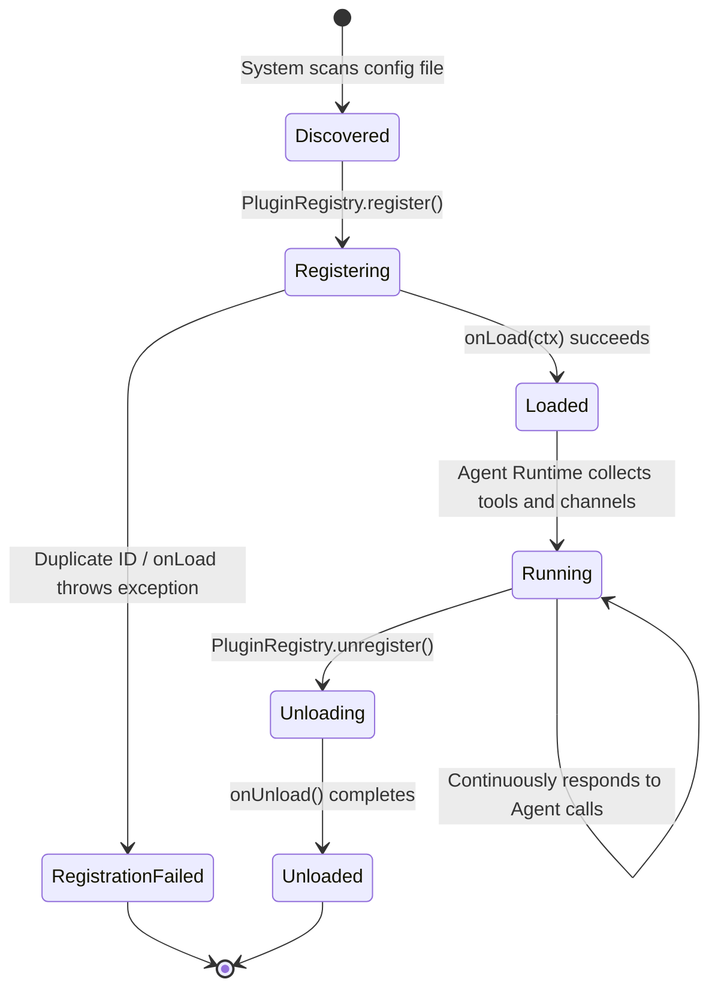
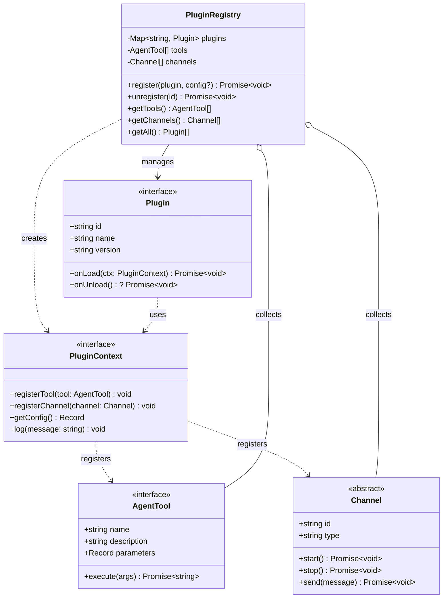
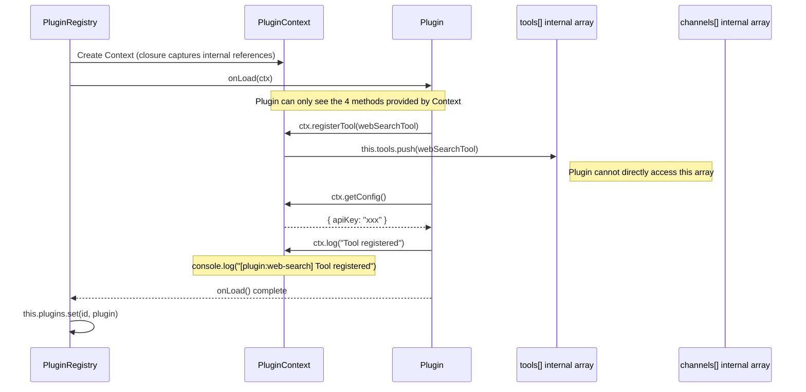
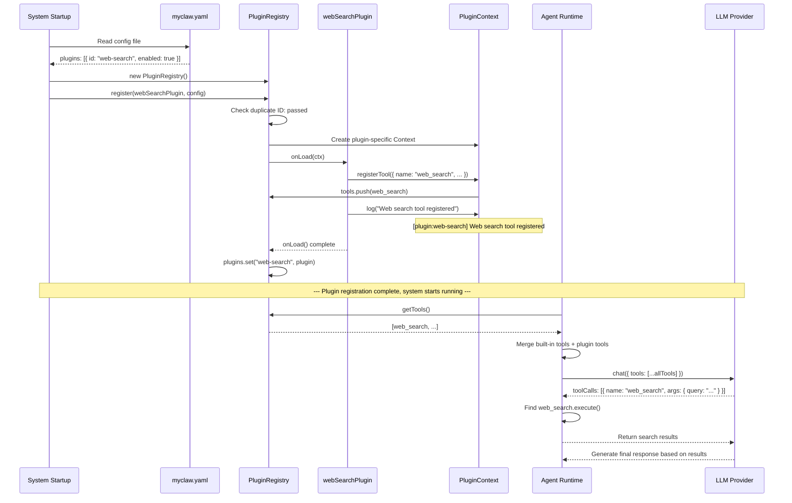

# Chapter 9: Plugin System

So far, our MyClaw Agent has had fixed capabilities -- only built-in tools and channels. But a truly powerful AI system needs **extensibility**. If we had to modify core code every time we wanted to add a feature, the system would quickly become a tangled mess. In this chapter, we'll implement MyClaw's plugin system, allowing developers to **extend the system's capabilities without modifying core code**.

This is a classic design problem in software engineering and an excellent case study for understanding the "Open-Closed Principle" -- **open for extension, closed for modification**.

## Why Do We Need a Plugin System?

Imagine a world without a plugin system:

```
Want to add weather lookup?     → Modify the Agent Runtime code
Want to integrate a Slack channel? → Modify the channel management code
Want to add database queries?   → Modify the core code again...
```

Having to modify core code for every extension brings several problems:

1. **High coupling**: All feature code is mixed together; one change can affect everything
2. **Collaboration difficulties**: Multiple developers modifying core code simultaneously leads to constant conflicts
3. **High testing costs**: Changing core code means all features need to be retested
4. **Uncontrollable bloat**: Core modules keep growing until they become unmaintainable

With a plugin system, everything becomes elegant:

```
Want to add weather lookup?     → Write a weather plugin, register it with the system
Want to integrate a Slack channel? → Write a Slack plugin, register it with the system
Want to add database queries?   → Write a DB plugin, register it with the system
```

No changes to core code needed. New features exist as independent plugins that can be developed, tested, enabled, or disabled separately.

## Plugin Lifecycle Overview

Before diving into the code, let's take a high-level view of the complete lifecycle of a plugin -- from "discovery" to "working" to "unloading":



Key lifecycle stages:

| Stage | Triggered By | What the Plugin Does |
| --- | --- | --- |
| **Discovered** | System reads `myclaw.yaml` | Plugin is just a config entry |
| **Registering** | `PluginRegistry.register()` | System creates PluginContext and calls `onLoad()` |
| **Loaded** | `onLoad()` returns | Plugin has registered its tools/channels |
| **Running** | Agent Runtime | Plugin's registered tools are called by the LLM |
| **Unloading** | `PluginRegistry.unregister()` | System calls `onUnload()`, plugin releases resources |

## Key Files

| File | Purpose |
| --- | --- |
| `src/plugins/registry.ts` | Plugin interface definitions (`Plugin`, `PluginContext`), registry implementation (`PluginRegistry`), and example plugins |
| `src/channels/transport.ts` | `Channel` abstract class -- the data structure used when plugins register channels |

**Note**: MyClaw now uses pi-coding-agent's tool system. Plugins that need to register custom tools should use pi-coding-agent's `customTools` parameter instead of the old `AgentTool` interface.

## Plugin Interface Design

MyClaw's plugin system is composed of three core abstractions: `Plugin` (the plugin itself), `PluginContext` (the capability interface the system provides to plugins), and `PluginRegistry` (the registry that manages all plugins). Their relationships are as follows:



This class diagram reveals an important design decision: **there is no direct reference between Plugin and PluginRegistry**. The plugin has no awareness of the Registry's existence -- it only knows about PluginContext. This is the essence of Inversion of Control.

## Plugin Interface

Every plugin must implement the `Plugin` interface:

```typescript
// src/plugins/registry.ts

export interface Plugin {
  /** Unique identifier */
  id: string;
  /** Human-readable name */
  name: string;
  /** Version number */
  version: string;
  /** Called when the plugin is loaded */
  onLoad(ctx: PluginContext): Promise<void>;
  /** Called when the plugin is unloaded (optional) */
  onUnload?(): Promise<void>;
}
```

Let's go through each field:

- **`id`** -- A globally unique identifier, such as `"web-search"` or `"weather"`. The Registry uses it to prevent duplicate registrations and to identify the plugin in logs.
- **`name`** -- A human-readable name, such as `"Web Search"`. Used for log display and debugging.
- **`version`** -- A semantic version number, such as `"1.0.0"`. Helpful for troubleshooting ("Is the plugin version too old?").
- **`onLoad(ctx)`** -- **The core method**. Called by the system when loading the plugin. The plugin registers its tools, channels, and other capabilities through `ctx`. This is an async method because plugins may need to do initialization work (establishing connections, loading resources, etc.).
- **`onUnload()`** -- An optional cleanup method. Used to release resources, close connections, etc. during unloading. Marked as optional (`?`) because not all plugins need cleanup.

## PluginContext: Inversion of Control in Action

`PluginContext` is the most elegant design in the entire plugin system. Let's look at the interface definition first:

```typescript
export interface PluginContext {
  /** Register a tool for the Agent to use */
  registerTool(tool: AgentTool): void;
  /** Register a new message channel */
  registerChannel(channel: Channel): void;
  /** Get plugin-specific configuration */
  getConfig(): Record<string, unknown>;
  /** Log output with plugin prefix */
  log(message: string): void;
}
```

### What is Inversion of Control?

The traditional way of thinking is:

> The plugin proactively finds the system and pushes its capabilities in.

```typescript
// Anti-pattern: without Inversion of Control
class MyPlugin {
  install(registry: PluginRegistry) {
    registry.tools.push(myTool);        // Directly manipulating internal arrays!
    registry.channels.push(myChannel);  // Directly manipulating internal arrays!
  }
}
```

The problem here is severe -- the plugin directly manipulates the Registry's internal data structures and can freely add, delete, or modify anything without constraints.

The Inversion of Control approach is the exact opposite:

> The system proactively provides a set of controlled methods to the plugin, and the plugin can only extend the system through these methods.

```typescript
// Good pattern: Inversion of Control
const myPlugin: Plugin = {
  async onLoad(ctx: PluginContext) {
    ctx.registerTool(myTool);     // Can only use methods provided by ctx
    ctx.registerChannel(myChannel); // The system controls the registration process
  },
};
```

The difference lies in **who owns the control**. The plugin no longer "controls" the registration process -- the system is the controller. The system can do anything it wants during registration: validate tool names for conflicts, log audit trails, limit the number of registrations, and so on.

The following interaction diagram shows how PluginContext establishes a controlled boundary between the system and plugins:



Notice there is no direct arrow between Plugin and the `tools[]` array -- all interactions must go through the PluginContext "middleman". This is a visual representation of Inversion of Control.

### Why Implement Context with Closures?

In `PluginRegistry.register()`, the Context is not a standalone class but a literal object whose methods capture the Registry's internal state through closures:

```typescript
const ctx: PluginContext = {
  registerTool: (tool) => {
    this.tools.push(tool);  // Closure captures this.tools
  },
  registerChannel: (channel) => {
    this.channels.push(channel);  // Closure captures this.channels
  },
  getConfig: () => config ?? {},  // Closure captures config parameter
  log: (message) => {
    console.log(`[plugin:${plugin.id}] ${message}`);  // Closure captures plugin.id
  },
};
```

This closure-based design brings several benefits:

1. **Each plugin's Context is independent**: Plugin A's `log()` outputs `[plugin:a]`, Plugin B's `log()` outputs `[plugin:b]`
2. **Plugins cannot get a reference to the Registry**: They only have four functions, with no way to access the `this.plugins` Map or other plugins' data
3. **The system can add control logic at any time**: For example, adding name deduplication checks in `registerTool` requires zero changes to plugin code

## PluginRegistry Implementation Deep Dive

`PluginRegistry` is the management center for plugins. Let's analyze its complete implementation section by section:

```typescript
export class PluginRegistry {
  private plugins = new Map<string, Plugin>();
  private tools: AgentTool[] = [];
  private channels: Channel[] = [];
```

Three private fields:
- `plugins` -- Uses a Map to store registered plugins, with plugin ID as the key, supporting O(1) deduplication and lookup
- `tools` -- An aggregated list of all tools registered by all plugins
- `channels` -- An aggregated list of all channels registered by all plugins

### register() Method

```typescript
async register(plugin: Plugin, config?: Record<string, unknown>): Promise<void> {
    // Step 1: Prevent duplicate registration
    if (this.plugins.has(plugin.id)) {
      throw new Error(`Plugin '${plugin.id}' is already registered`);
    }

    // Step 2: Build a plugin-specific context
    const ctx: PluginContext = {
      registerTool: (tool) => {
        this.tools.push(tool);
      },
      registerChannel: (channel) => {
        this.channels.push(channel);
      },
      getConfig: () => config ?? {},
      log: (message) => {
        console.log(`[plugin:${plugin.id}] ${message}`);
      },
    };

    // Step 3: Call the plugin's onLoad, letting it register its capabilities
    await plugin.onLoad(ctx);

    // Step 4: Record in the registered list
    this.plugins.set(plugin.id, plugin);
  }
```

The execution flow has four steps:

**Step 1: Deduplication check.** Uses `Map.has()` to check if a plugin with the same ID already exists. If so, an error is thrown immediately. This prevents a plugin from being accidentally loaded twice -- if duplicate registration were allowed, the same tool would appear twice and the LLM would be confused.

**Step 2: Create the Context.** A `PluginContext` is custom-built for this plugin. Note that all four methods are arrow functions that capture `this` (the Registry instance) and `plugin` (the current plugin) through closures.

**Step 3: Call onLoad.** This is `await`ed -- plugin initialization may be asynchronous (e.g., establishing a database connection). During `onLoad`, the plugin calls methods like `ctx.registerTool()`, and tools and channels get pushed into the Registry's arrays.

**Step 4: Record the plugin.** The plugin is only recorded in the `plugins` Map after `onLoad` completes successfully. If `onLoad` throws an exception, the plugin won't be recorded -- but note that tools may have already been pushed into the arrays. In production code, we should implement rollback handling. This is a simplified educational implementation.

### unregister() Method

```typescript
async unregister(id: string): Promise<void> {
    const plugin = this.plugins.get(id);
    if (plugin?.onUnload) {
      await plugin.onUnload();
    }
    this.plugins.delete(id);
  }
```

The unload logic is clean and straightforward:
1. Find the plugin by ID
2. If the plugin implements `onUnload` (remember it's optional), call it
3. Delete it from the Map

> **Exercise**: The current `unregister()` doesn't remove the tools and channels that the plugin registered from `tools[]` and `channels[]`. In a production-grade implementation, how would you handle this? (Hint: you could track which plugin each tool belongs to when `registerTool` is called.)

### Query Methods

```typescript
getTools(): AgentTool[] {
    return this.tools;
  }

  getChannels(): Channel[] {
    return this.channels;
  }

  getAll(): Plugin[] {
    return Array.from(this.plugins.values());
  }
```

Three getters for different purposes:
- `getTools()` -- Used by Agent Runtime to collect all available tools
- `getChannels()` -- Used by the system to collect all available channels
- `getAll()` -- Used for debugging or management interfaces to list all registered plugins

## Plugin Registration Flow

The following sequence diagram shows the complete flow from system startup to a plugin beginning its work:



This flow clearly shows the two phases of the plugin system:

1. **Registration phase** (at system startup): Plugins register their capabilities through the Context
2. **Runtime phase** (during user interaction): Agent Runtime collects all tools, and the LLM can call any registered tool

## Example Plugin Deep Dive: Web Search

The project includes a complete example plugin -- a simulated web search feature. Let's analyze it line by line:

```typescript
export const webSearchPlugin: Plugin = {
  id: "web-search",
  name: "Web Search",
  version: "1.0.0",
```

The plugin's metadata section. `id: "web-search"` is the unique identifier used during registration.

```typescript
  async onLoad(ctx: PluginContext): Promise<void> {
    ctx.registerTool({
      name: "web_search",
      description: "Search the web for information (demo - returns mock results)",
      parameters: {
        type: "object",
        properties: {
          query: { type: "string", description: "Search query" },
        },
        required: ["query"],
      },
```

`onLoad` is the plugin's entry point. It calls `ctx.registerTool()` to register a tool named `web_search`.

The tool definition follows the JSON Schema format:
- `name` -- The tool name visible to the LLM; the LLM uses this name to "call" the tool
- `description` -- The LLM uses this description to determine when to use the tool
- `parameters` -- Parameter description in JSON Schema format, telling the LLM what arguments to pass

```typescript
      execute: async (args) => {
        const query = args.query as string;
        // In a real implementation, this would call an actual search API
        return JSON.stringify({
          query,
          results: [
            {
              title: `Search result for: ${query}`,
              snippet: "This is a demo search result. In a full MyClaw setup, this would use a real search API.",
              url: "https://example.com",
            },
          ],
        });
      },
    });
```

`execute` is the tool's actual execution logic. When the LLM decides to call `web_search`, the Agent Runtime invokes this function:

1. Extract the `query` parameter from `args`
2. Execute the search logic (mock data in this case)
3. Return the result as a JSON string

> **Note**: `execute` returns a string, not an object. This is because the LLM receives tool results in text format.

```typescript
    ctx.log("Web search tool registered");
  },
};
```

Finally, `ctx.log()` outputs a log message, which gets formatted as `[plugin:web-search] Web search tool registered`.

## How to Write Your Own Plugin

Now that you understand the design and the example, let's write a brand new plugin step by step. We'll use a "weather query plugin" as our example -- a common real-world requirement.

### Step 1: Define the Plugin Skeleton

```typescript
import type { Plugin } from "../plugins/registry.js";

export const weatherPlugin: Plugin = {
  id: "weather",
  name: "Weather Plugin",
  version: "1.0.0",

  async onLoad(ctx) {
    // We'll register tools here
  },
};
```

Start with the skeleton. `id` must be globally unique, and `onLoad` is where we register our capabilities.

### Step 2: Read Configuration

Weather queries require an API Key. Get it through `ctx.getConfig()`:

```typescript
async onLoad(ctx) {
    const config = ctx.getConfig();
    const apiKey = config.apiKey as string;

    if (!apiKey) {
      ctx.log("WARNING: No API key configured, weather tool will not work");
      return;  // Don't register the tool without an API Key
    }

    ctx.log(`Initializing with API key: ${apiKey.slice(0, 4)}****`);
```

> **Teaching point**: Notice we only display the first four characters of the API Key in the log. Never output complete secrets in logs!

### Step 3: Register the Tool

```typescript
    ctx.registerTool({
      name: "get_weather",
      description: "Get current weather for a city. Returns temperature, conditions, and humidity.",
      parameters: {
        type: "object",
        properties: {
          city: {
            type: "string",
            description: "City name, e.g. 'Beijing', 'Tokyo', 'New York'",
          },
        },
        required: ["city"],
      },
      execute: async (args) => {
        const city = args.city as string;

        try {
          const response = await fetch(
            `https://api.weather.example.com/v1/current?q=${encodeURIComponent(city)}&key=${apiKey}`
          );

          if (!response.ok) {
            return JSON.stringify({ error: `Weather API returned ${response.status}` });
          }

          const data = await response.json();
          return JSON.stringify({
            city,
            temperature: data.temp,
            conditions: data.conditions,
            humidity: data.humidity,
          });
        } catch (error) {
          return JSON.stringify({ error: `Failed to fetch weather: ${error}` });
        }
      },
    });

    ctx.log("Weather tool registered");
  },
```

A few implementation details worth noting:

1. **Write specific `description`s** -- The LLM uses the description to decide when to use this tool. "Get weather" is too vague; "Get current weather for a city. Returns temperature, conditions, and humidity." is much better
2. **Parameter `description`s matter too** -- Provide specific examples to help the LLM understand what format of values to pass
3. **Return JSON for errors, don't throw exceptions** -- A tool's `execute` should always return a string result. Even on errors, return a JSON with an `error` field so the LLM knows what happened
4. **URL encoding** -- Use `encodeURIComponent()` to encode the city name, preventing special characters from causing request failures

### Step 4: (Optional) Implement onUnload

If the plugin holds resources that need to be released (database connections, WebSocket connections, etc.), implement `onUnload`:

```typescript
export const weatherPlugin: Plugin = {
  id: "weather",
  name: "Weather Plugin",
  version: "1.0.0",

  async onLoad(ctx) {
    // ... code from above
  },

  async onUnload() {
    // Clean up resources (if any)
    console.log("Weather plugin unloaded");
  },
};
```

### Complete Weather Plugin Code

Putting all the steps together:

```typescript
import type { Plugin } from "../plugins/registry.js";

export const weatherPlugin: Plugin = {
  id: "weather",
  name: "Weather Plugin",
  version: "1.0.0",

  async onLoad(ctx) {
    const config = ctx.getConfig();
    const apiKey = config.apiKey as string;

    if (!apiKey) {
      ctx.log("WARNING: No API key configured, weather tool will not work");
      return;
    }

    ctx.log(`Initializing with API key: ${apiKey.slice(0, 4)}****`);

    ctx.registerTool({
      name: "get_weather",
      description: "Get current weather for a city. Returns temperature, conditions, and humidity.",
      parameters: {
        type: "object",
        properties: {
          city: {
            type: "string",
            description: "City name, e.g. 'Beijing', 'Tokyo', 'New York'",
          },
        },
        required: ["city"],
      },
      execute: async (args) => {
        const city = args.city as string;
        try {
          const response = await fetch(
            `https://api.weather.example.com/v1/current?q=${encodeURIComponent(city)}&key=${apiKey}`
          );
          if (!response.ok) {
            return JSON.stringify({ error: `Weather API returned ${response.status}` });
          }
          const data = await response.json();
          return JSON.stringify({
            city,
            temperature: data.temp,
            conditions: data.conditions,
            humidity: data.humidity,
          });
        } catch (error) {
          return JSON.stringify({ error: `Failed to fetch weather: ${error}` });
        }
      },
    });

    ctx.log("Weather tool registered");
  },

  async onUnload() {
    console.log("Weather plugin unloaded");
  },
};
```

## Integration with Agent Runtime

Tools registered by plugins don't run on their own -- they need to be collected by Agent Runtime and passed to the LLM. The integration process works like this:

```typescript
// Pseudocode for Agent Runtime startup
const registry = new PluginRegistry();

// 1. Load all plugins enabled in the config
for (const pluginConfig of config.plugins) {
  if (pluginConfig.enabled) {
    await registry.register(pluginMap[pluginConfig.id], pluginConfig.config);
  }
}

// 2. Merge built-in tools and plugin tools
const allTools = [
  ...getBuiltinTools(),     // Built-in tools (e.g., execute_code)
  ...registry.getTools(),   // Plugin-registered tools (e.g., web_search, get_weather)
];

// 3. Merge built-in channels and plugin channels
const allChannels = [
  ...getBuiltinChannels(),    // Built-in channels (e.g., Terminal)
  ...registry.getChannels(),  // Plugin-registered channels (e.g., Slack, Discord)
];

// 4. Pass to the LLM Provider
const response = await llmProvider.chat({
  messages: conversationHistory,
  tools: allTools,
});
```

From the LLM's perspective, it has no idea whether a tool is built-in or comes from a plugin -- they all share the same `AgentTool` interface. This is the power of abstraction.

## Configuring Plugins in myclaw.yaml

Plugins are enabled and configured through a configuration file:

```yaml
# myclaw.yaml

plugins:
  # Web search plugin (built-in example)
  - id: "web-search"
    enabled: true

  # Weather query plugin
  - id: "weather"
    enabled: true
    config:
      apiKey: "your-weather-api-key-here"

  # Plugins can be easily disabled
  - id: "some-experimental-plugin"
    enabled: false
    config:
      debug: true
```

The configuration structure is intuitive:

| Field | Description |
| --- | --- |
| `id` | Corresponds to `Plugin.id`, used to match the plugin instance |
| `enabled` | Whether to enable the plugin. Set to `false` to keep the config but not load the plugin |
| `config` | Key-value pairs passed to `ctx.getConfig()`. Each plugin has different config options |

This design allows operations teams to control plugin behavior without changing code -- enabling a new plugin or adjusting parameters is just a config file change.

## Comparison with the Full OpenClaw Plugin Ecosystem

Our MyClaw implements the core framework of the plugin system. The full OpenClaw builds a vast plugin ecosystem on top of this foundation:

| Category | Full Version Scale | Examples |
| --- | --- | --- |
| Skills | 50+ | Code generation, translation, summarization, math |
| Extensions | 40+ | Search engines, database queries, API calls |
| Channel Plugins | 10+ | Discord, Slack, WhatsApp, Line |
| Storage Plugins | 5+ | SQLite, PostgreSQL, Redis |

Here's a feature comparison between MyClaw and the full OpenClaw:

| Feature | MyClaw (Educational) | OpenClaw (Full) |
| --- | --- | --- |
| Plugin register/unregister | Supported | Supported |
| Tool registration | Supported | Supported |
| Channel registration | Supported | Supported |
| Plugin configuration | Basic key-value | Typed configuration with Schema validation |
| Hot loading/unloading | Not supported | Supported (dynamic add and remove at runtime) |
| Dependency management | Not supported | Supported (plugins declare dependencies on each other) |
| Lifecycle hooks | `onLoad` / `onUnload` | `onInit` / `onLoad` / `onBeforeMessage` / `onAfterMessage` / `onUnload` / `onError` |
| Sandbox isolation | Not supported | Supported (plugins run in a restricted environment) |
| Permission system | Not supported | Supported (controls which system capabilities plugins can access) |
| Plugin marketplace | Not supported | Supported (browse and install plugins online) |

While our version is simplified significantly, the core design patterns are the same. By understanding MyClaw's plugin system, you've grasped the essence of OpenClaw's plugin architecture.

## Design Patterns Summary

This chapter covered two important design patterns that deserve their own summary.

### Pattern 1: Inversion of Control (IoC)

**Traditional approach**: The caller (plugin) controls everything and directly manipulates the callee's (Registry's) internal state.

**Inversion of Control**: The callee (Registry) provides a controlled interface (Context), and the caller (plugin) can only interact through this interface.

```
Traditional:          Plugin ---directly manipulates---> Registry internal data
Inversion of Control: Plugin ---controlled request---> PluginContext ---internal operation---> Registry internal data
```

How it manifests in MyClaw:
- `PluginRegistry` creates `PluginContext` and decides which capabilities to expose
- `Plugin` registers tools/channels through `PluginContext` and cannot directly access Registry internals
- The Registry can add arbitrary control logic in Context methods (validation, logging, rate limiting, etc.)

The value of this pattern lies in **clear boundaries**. Plugin developers only need to understand the four methods of `PluginContext`, without needing to understand the system's internal implementation. System maintainers can freely refactor internals -- as long as the Context interface remains unchanged, all plugins are unaffected.

### Pattern 2: Registry Pattern

`PluginRegistry` is a classic implementation of the Registry Pattern:

- **Centralized management**: All plugins, tools, and channels are managed in one place
- **Uniqueness guarantee**: Prevents duplicate registration via IDs
- **Unified querying**: Provides methods like `getTools()`, `getChannels()`, `getAll()` for other modules to query
- **Lifecycle management**: `register()` and `unregister()` manage plugin creation and destruction

A key advantage of the Registry Pattern is **decoupling**. Agent Runtime doesn't need to know where tools come from (whether they're built-in or plugin-registered) -- it just calls `registry.getTools()` to get all available tools. Likewise, plugins don't need to know who will ultimately use the tools they register.

```
Plugin A --registers--> PluginRegistry <--queries-- Agent Runtime
Plugin B --registers-->                <--queries-- Management UI
Plugin C --registers-->                <--queries-- Debug Tools
```

Producers (plugins) and consumers (Runtime/UI/debug tools) are fully decoupled, interacting only through the Registry as an intermediary.

## Next Steps

We've completed the implementation of all core modules. In the next chapter -- the final one -- we'll bring all the components together, run the complete system, and discuss future extension directions.

[Next Chapter: Integration and Running >>](10-final.md)
