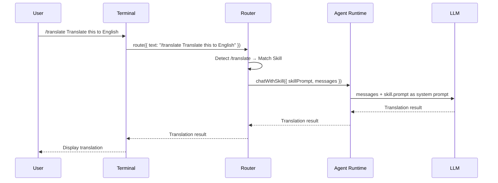

# Chapter 9b: Skills System

In the previous chapters, we implemented a plugin system to extend the Agent's capabilities. But the plugin system is primarily aimed at **developers** -- you need to write TypeScript code to create plugins. Is there a lighter-weight way for **regular users** to customize the Agent's behavior?

The answer is **Skills** -- a prompt management system based on Markdown files. Users just need to write a `SKILL.md` file to define a new "skill", then invoke it anytime via a `/skill-name` slash command.

## Skills vs Plugins

| | Skills | Plugins |
|--|--------|---------|
| Definition | Markdown file (YAML + prompt) | TypeScript code |
| Barrier to entry | Low, just write a prompt | High, requires programming |
| Capability scope | Replace system prompt | Register tools, channels, etc. |
| Invocation | `/skill-name` slash command | Automatically integrated into runtime |
| Use cases | Translation, summarization, code review | Weather API, database queries, etc. |

In short: **Skills are for users, plugins are for developers**.

## SKILL.md Format

Each Skill is a directory containing a `SKILL.md` file. The file consists of two parts:

1. **YAML frontmatter** -- metadata (name, description, whether user-invocable)
2. **Markdown body** -- the Skill's prompt content

```markdown
---
name: translate
description: Translate text to a target language
emoji: 🌐
user-invocable: true
---

You are a professional translator. Your task is to translate
the user's text accurately and naturally.

## Rules

- If the user specifies a target language, use that language.
- If no target language is specified, translate to English
  if the input is non-English, or to Chinese if English.
- Preserve the original tone, style, and formatting.

Respond with only the translated text.
```

Key fields:

- `name` -- Skill name, also the slash command name (`/translate`)
- `description` -- Short description, shown in the `/skills` list
- `emoji` (optional) -- Display icon
- `user-invocable` -- Whether users can invoke it via `/name`

## Skill Loading Directories

Skills are loaded from two directories, in priority order (highest first):

1. **`<workspace>/skills/`** -- Project-level, travels with the project
2. **`~/.myclaw/skills/`** -- User-level, globally available

If both directories have a Skill with the same name, the project-level one takes precedence.

```
my-project/
├── skills/
│   └── translate/
│       └── SKILL.md     ← Project-level Skill
└── ...

~/.myclaw/
├── skills/
│   └── summarize/
│       └── SKILL.md     ← User-level Skill
└── myclaw.yaml
```

## Implementation Walkthrough

### Skill Interface and Loader

First, we define the `Skill` interface and the SKILL.md parser:

```typescript
// src/skills/loader.ts

export interface Skill {
  name: string;
  description: string;
  emoji?: string;
  userInvocable: boolean;
  prompt: string;
}
```

The `parseSkillFile` function parses the YAML frontmatter and body from SKILL.md:

```typescript
export function parseSkillFile(content: string): Skill {
  // Match frontmatter delimited by ---
  const match = content.match(/^---\r?\n([\s\S]*?)\r?\n---\r?\n([\s\S]*)$/);
  if (!match) {
    throw new Error("Invalid SKILL.md: missing YAML frontmatter");
  }

  const [, frontmatterRaw, body] = match;
  const frontmatter = parseYaml(frontmatterRaw);

  return {
    name: frontmatter.name,
    description: frontmatter.description,
    emoji: typeof frontmatter.emoji === "string" ? frontmatter.emoji : undefined,
    userInvocable: frontmatter["user-invocable"] === true,
    prompt: body.trim(),
  };
}
```

The `loadSkills` function loads Skills from multiple directories, with earlier directories taking priority:

```typescript
export function loadSkills(dirs: string[]): Skill[] {
  const seen = new Set<string>();
  const result: Skill[] = [];

  for (const dir of dirs) {
    const skills = loadSkillsFromDir(dir);
    for (const skill of skills) {
      if (!seen.has(skill.name)) {
        seen.add(skill.name);
        result.push(skill);
      }
    }
  }

  return result;
}
```

### Skill Registry

`SkillRegistry` manages all loaded Skills and provides lookup and system prompt generation:

```typescript
// src/skills/registry.ts

export class SkillRegistry {
  private skills = new Map<string, Skill>();

  register(skill: Skill): void {
    this.skills.set(skill.name, skill);
  }

  get(name: string): Skill | undefined {
    return this.skills.get(name);
  }

  listUserInvocable(): Skill[] {
    return this.getAll().filter((s) => s.userInvocable);
  }

  // Generate the Skills section for the system prompt
  buildSystemPromptSection(): string {
    const invocable = this.listUserInvocable();
    if (invocable.length === 0) return "";

    const lines = [
      "",
      "## Available Skills",
      "Users can invoke skills with slash commands:",
    ];
    for (const skill of invocable) {
      const prefix = skill.emoji ? `${skill.emoji} ` : "";
      lines.push(`- /${skill.name}: ${prefix}${skill.description}`);
    }
    return lines.join("\n");
  }
}
```

### Agent Runtime Changes

`AgentRuntime` gets a new `chatWithSkill` method that uses the Skill's prompt instead of the default system prompt:

```typescript
// src/agent/runtime.ts additions

export interface AgentRuntime {
  chat(request: { providerId?: string; messages: ChatMessage[] }): Promise<string>;
  chatWithSkill(request: {
    providerId?: string;
    messages: ChatMessage[];
    skillPrompt: string;
  }): Promise<string>;
  registerTool(tool: AgentTool): void;
}
```

The key insight: `chatWithSkill` and `chat` share the same agent loop (tool call cycle). The only difference is the source of the system prompt.

### Router Intercepting /skill Commands

The Router detects messages starting with `/`, matches them to Skills, and calls `chatWithSkill`:

```typescript
// src/routing/router.ts

async route(request: RouteRequest): Promise<string> {
  // Check for /skill-name commands
  if (skillRegistry && request.text.startsWith("/")) {
    const match = request.text.match(/^\/(\S+)\s*([\s\S]*)$/);
    if (match) {
      const [, skillName, rest] = match;
      const skill = skillRegistry.get(skillName);
      if (skill && skill.userInvocable) {
        return agent.chatWithSkill({
          providerId,
          skillPrompt: skill.prompt,
          messages: [...request.history, { role: "user", content: rest.trim() || request.text }],
        });
      }
    }
  }

  // No match → original routing flow
  // ...
}
```

### Terminal's /skills Command

The Terminal channel adds a `/skills` built-in command to list all available Skills:

```typescript
case "/skills": {
  const skills = this.skillRegistry.listUserInvocable();
  if (skills.length === 0) {
    console.log(chalk.dim("\nNo user-invocable skills available.\n"));
  } else {
    console.log(chalk.dim("\nAvailable skills:"));
    for (const skill of skills) {
      const prefix = skill.emoji ? `${skill.emoji} ` : "";
      console.log(chalk.dim(`  /${skill.name} - ${prefix}${skill.description}`));
    }
    console.log();
  }
  return true;
}
```

## Data Flow

When a user types `/translate Hello world`, the data flows like this:



The key difference: regular messages go through `agent.chat()` (using the default system prompt), while Skill invocations go through `agent.chatWithSkill()` (using the Skill's prompt).

## Loading at Startup

In the `agent` and `gateway` commands, Skills directories are automatically scanned at startup:

```typescript
// src/cli/commands/agent.ts

const skillDirs = [
  path.join(process.cwd(), "skills"),          // Project-level
  path.join(os.homedir(), ".myclaw", "skills"), // User-level
];
const skills = loadSkills(skillDirs);
const skillRegistry = createSkillRegistry(skills);

// Pass to runtime and router
const agent = createAgentRuntime(ctx.config, { skillRegistry });
const router = createRouter(ctx.config, agent, { skillRegistry });
const terminal = createTerminalChannel(ctx.config, router, skillRegistry);
```

## Verification

```bash
# Start the agent
npx myclaw agent

# List available Skills
/skills
# Output:
# Available skills:
#   /translate - 🌐 Translate text to a target language
#   /summarize - 📝 Summarize text concisely

# Invoke the translate Skill
/translate Hello, how are you today?
```

## Creating Custom Skills

Want to create your own Skill? Just three steps:

1. Create a new directory under `skills/`
2. Create a `SKILL.md` file inside it
3. Restart the agent

For example, creating a code review Skill:

```bash
mkdir -p skills/code-review
```

```markdown
<!-- skills/code-review/SKILL.md -->
---
name: code-review
description: Review code and suggest improvements
emoji: 🔍
user-invocable: true
---

You are an experienced code reviewer. Analyze the provided code and give
constructive feedback focusing on:

1. **Bugs and potential issues**
2. **Performance concerns**
3. **Code readability and maintainability**
4. **Best practices and design patterns**

Be specific, reference line numbers when possible, and suggest concrete improvements.
```

After restarting, you can use the `/code-review` command.

## Summary

This chapter implemented MyClaw's Skills system. Key design points:

1. **SKILL.md format** -- YAML frontmatter + Markdown body, simple and intuitive
2. **Multi-level loading** -- Project-level takes precedence over user-level, supports overriding
3. **SkillRegistry** -- Unified management with lookup and system prompt injection
4. **Router interception** -- `/skill-name` commands automatically routed to Skill handlers
5. **Shared agent loop** -- Skill invocations and regular chats share the tool call cycle

Skills bridge the gap between "developer capabilities" and "user needs" -- users don't need to write code, they just write prompts to customize the Agent's behavior.
